# 6 个实用的 GitHub 提示和技巧

> 原文：<https://betterprogramming.pub/6-practical-github-tips-and-tricks-7294ec3fe98c>

## 一组被低估但功能强大的 GitHub 特性


照片由 [Praveen Thirumurugan](https://unsplash.com/@praveentcom?utm_source=medium&utm_medium=referral) 在 [Unsplash](https://unsplash.com?utm_source=medium&utm_medium=referral) 上拍摄

GitHub 无疑是最受欢迎的代码托管和协作平台之一。

大多数开发人员使用标准特性，例如存储库创建、代码审查等。但是有各种被低估的特性可以用来释放 GitHub 的全部潜力。

例如，使用存储库模板功能，查看存储库指标并了解便捷的快捷方式。

在本教程中，我将介绍一些鲜为人知但功能强大的 GitHub 特性。希望这些提示和技巧能让你的工作更有效率。

我们开始吧！

# 1.创建模板存储库

你是否曾经多次复制粘贴同一个项目，只是为了开始一个类似的项目？

如果是，您可以考虑使用模板存储库功能，该功能允许您将存储库转换为模板。

它会生成一个新项目，其目录结构和文件与原始项目相同。

## 使用

导航到要标记为模板的存储库。

单击设置选项卡，并勾选模板存储库选项。

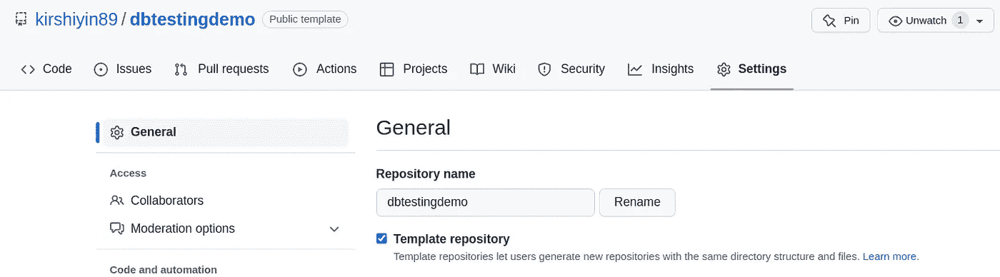

将回购掩蔽为模板

下一次，只需点击使用此模板按钮。

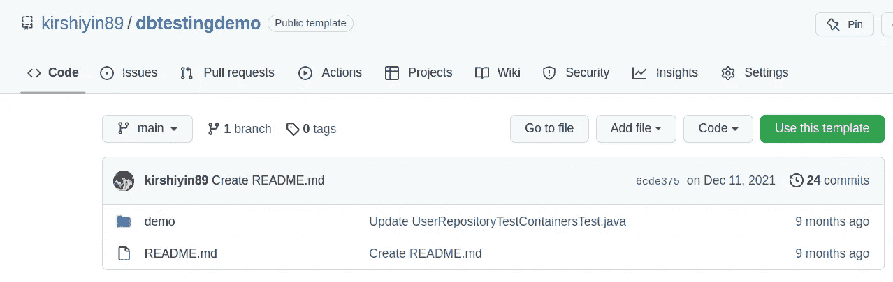

使用回购作为模板

GitHub 将在新项目中生成相同的文件结构。

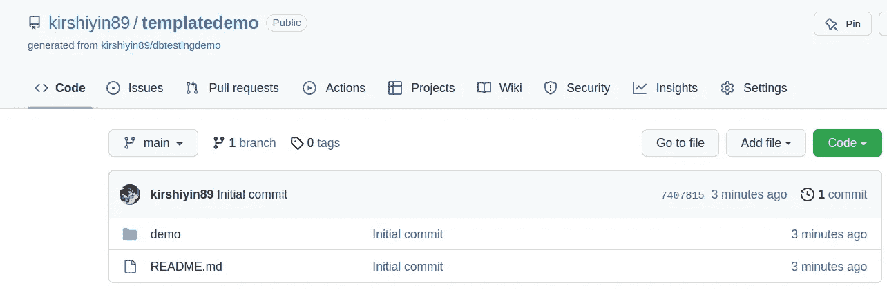

根据模板生成的新回购协议

# 2.使用媒体卡和屏蔽来增强项目

为了使项目看起来更有吸引力，您可以添加视觉元素。例如，使用媒体卡发布社交媒体帖子。

## 社交媒体卡

以下是自定义和一般回购链接之间的比较:

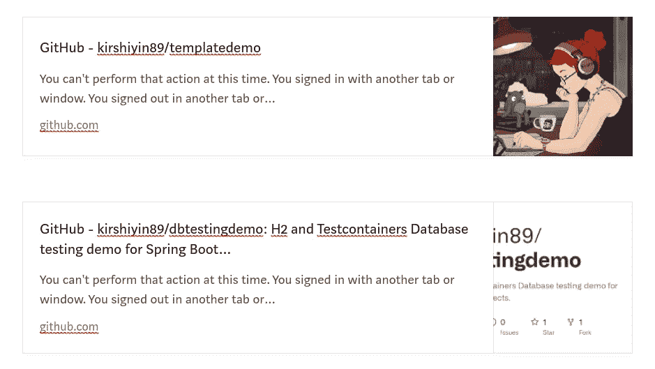

回购的增强和一般外观

毫无疑问，第一个更朗朗上口。

## 使用

要修改默认卡片，请点击“设置”并将照片添加到社交预览中

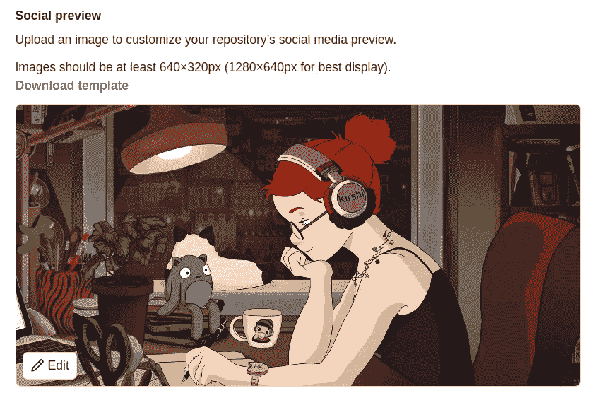

将自定义照片添加到社交预览

# 盾

现在我们来谈谈护盾。

它们显示有关项目的附加信息。

例如，发布版本、依赖性等。

你可以通过访问 https://shields.io/的[找到大量的盾牌。](https://shields.io/)

您应该会看到许多这样的徽章:

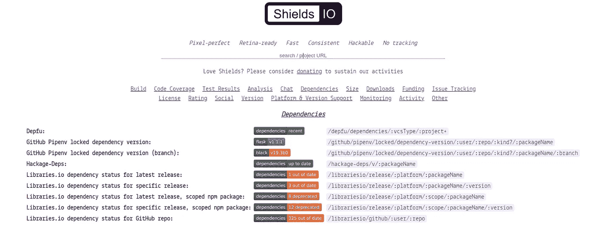

shields.com 徽章

## 使用

例如，选择 Twitter 关注。


社交媒体盾

复制徽章 URL 或降价代码。你可以把它放在任何网页上。

我会将它添加到我的 GitHub 的 README.md 文件中，它看起来会是这样的:

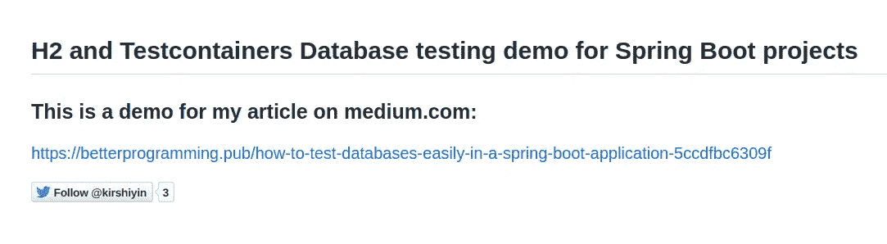

您甚至可以创建自己的带有颜色、标签和文本的徽章:


定制徽章

这导致:


自定义文本

# 3.创建预定义模板

有时，用户可能希望为您的回购做出贡献或提出问题。在这种情况下，最好有一个他们可以使用的模板。这将有助于他们包括所有必要的信息。

## 使用

点击创建一个新文件，然后用一个`ISSUE_TEMPLATE`文件创建一个`.github`文件夹，如下所示:

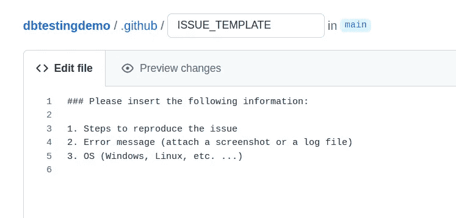

问题模板示例

注意，所有的模板都应该保存在 `.github` 文件夹中！

让我们看看当用户点击“问题”->“新问题”时，他们将如何看到模板。这里有一张图片。

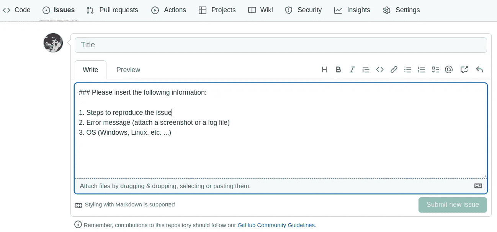

从模板提交问题

相当方便！GitHub 识别了模板并为我们预填了文本。

# 4.创建永久链接以保存文件内容

当您复制指向文件的链接时，它会显示当前分支标题处的版本。当有人提交对文件的更改时，文件的内容将会改变。

永久链接指向特定文件的版本。内容永远不会改变，因为对原始文件的提交不会影响它。当您引用文件并希望其他人看到相同的状态时，这很有用。

## 使用

打开想要保存的文件，点击键盘上的`Y`键。请注意，浏览器中的 URL 将会改变。您应该会看到一个生成的哈希键:

```
[https://github.com/user/repo/blob/70812d586129738f729cbc9a350fb5128/s](https://github.com/kirshiyin89/templatedemo/blob/70812d586129738f729cbc9a350fb5128b7d15b6/README.md)omefile
```

尝试提交对文件的更改。文件的内容将像往常一样在存储库中改变。

现在刷新永久链接。它将显示您保存它时的状态。此内容不受您所做提交的影响。

您也可以为几行代码创建一个永久链接。例如，从拉取请求或分支。

在 GitHub 上打开一个文件。单击要复制的一行或多行。你会看到一个有三个点的菜单。选择复制永久链接选项。

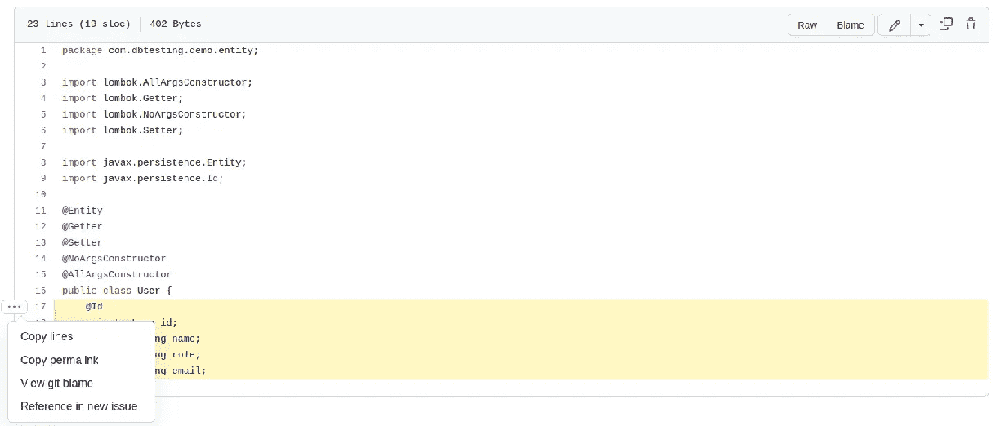

代码行的永久链接

这是一种指向不会改变的文件状态的简便方法。

# 5.在浏览器中轻松比较分支

你可以很容易地比较分支。假设您想要比较主分支和测试分支。

将`compare`命令添加到您的 repo 的 URL 中，并将分支作为参数:

```
[https://github.com/user/repo/compare/test..master](https://github.com/kirshiyin89/japanese-pronunciation-checker/compare/test..master)
```

语法非常简单。你只需要包括你想要比较的分支的名字，用点分开。

GitHub 会在浏览器中显示结果。例如:

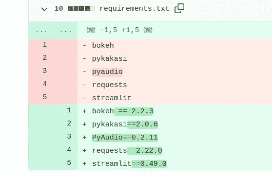

差异示例

# 6.有用的键盘快捷键

您知道吗，只要按下键盘上的`?`键，就可以访问 GitHub 中的所有快捷方式。

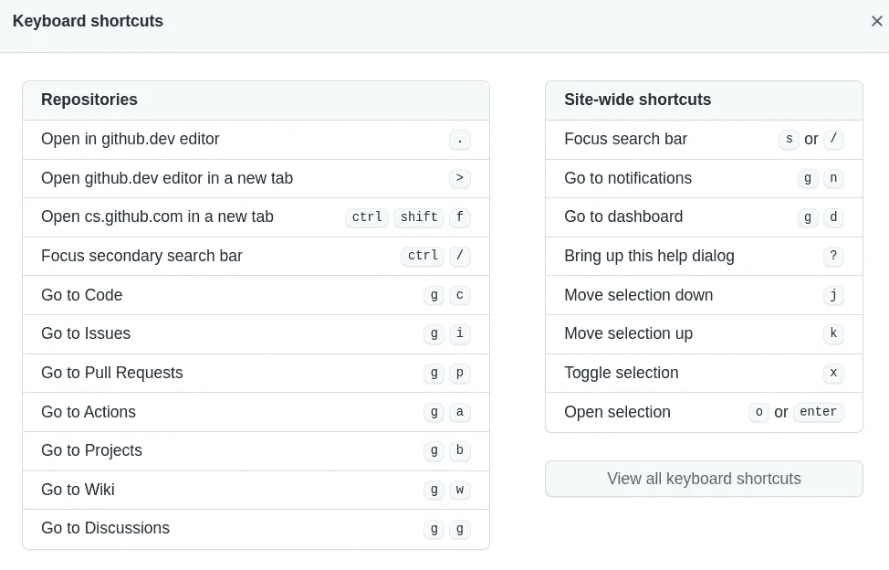

GitHub 快捷方式

我给你看看我最喜欢的。

# 浏览器中的 Web IDE

按下`.`键，您将在浏览器中激活一个 Web IDE:

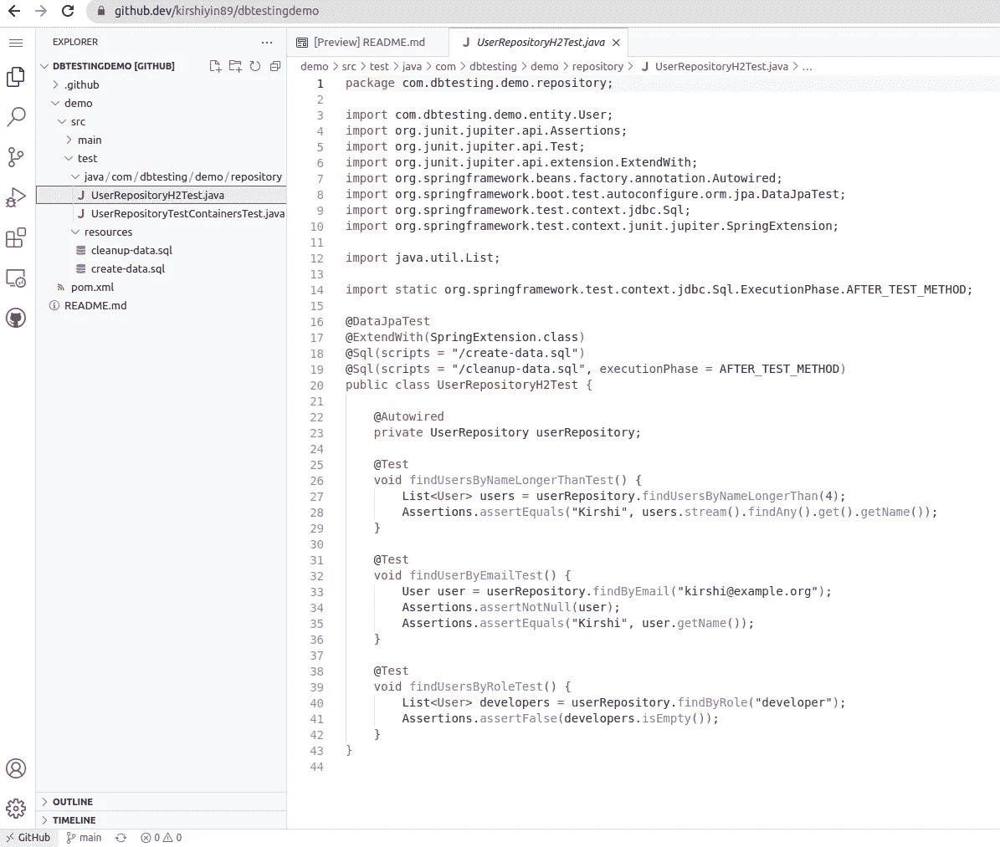

Git 开发中的 WebIDE

它将打开 github.dev，在这里你可以像在 IDE 中一样快速编辑你的文件。

# 查找文件

按下`T`键开始搜索:

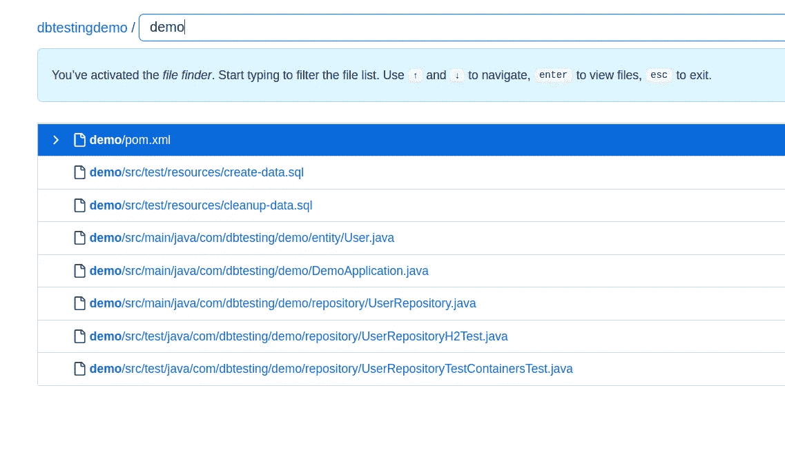

搜索文件

GitHub 会打开一个搜索控制台，在那里你可以通过输入名字找到文件。该功能支持自动完成。

请随意探索这些组合键，找到最适合你的。

# 7.用洞察力分析你的项目

当您分析关于您的回购的不同指标时,“Insights”选项卡非常有用。例如，你有多少访问者，你多久修改一次，你有多少分叉，等等。

## 使用

单击您的回购中的 Insights 选项卡。

下面是一个流量的例子:

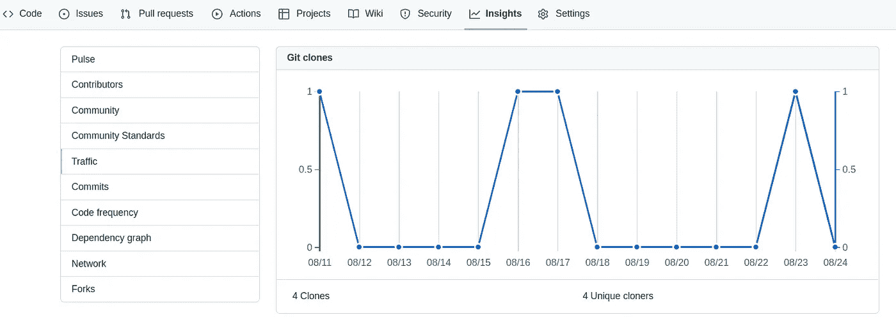

流量指标

正如您在左侧看到的，您可以试验许多指标。

# 结论

在本文中，我向您展示了一些方便的 GitHub 特性，以提高工作效率。

其中一些提示和技巧将会节省您的时间，其他的将有助于使您的知识库更加丰富和有吸引力。

我希望你今天学到了一些新东西。如果您对 Git 主题感兴趣，您可能会喜欢我的相关文章:

[](/automate-manual-commit-tasks-with-git-hooks-7642ecf05ffa) [## 使用 Git 挂钩自动化手动提交任务

### 一个有用的 Git 预提交钩子集合

better 编程. pub](/automate-manual-commit-tasks-with-git-hooks-7642ecf05ffa) [](/10-handy-git-stash-commands-to-manage-your-code-efficiently-39ddc3d6f324) [## 10 个方便的 Git-Stash 命令来有效地管理您的代码

### 从基础到高级 git-stash 用例

better 编程. pub](/10-handy-git-stash-commands-to-manage-your-code-efficiently-39ddc3d6f324) 

*感谢您的阅读，下次再见！*