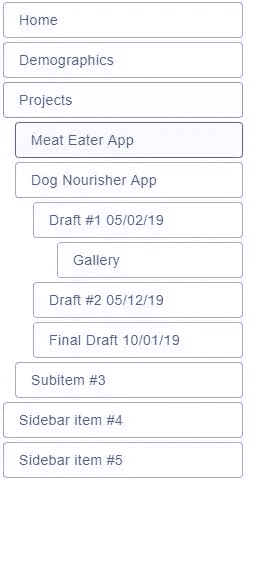

# React 中你可能会发现有效的 6 种做法

> 原文：<https://betterprogramming.pub/6-practices-in-react-you-might-find-effective-e0aed050a7b0>

## 因为我们总是希望提高我们的技能

*约翰·施诺布里奇在 Unsplash 上拍摄的照片*

React 是一个由脸书工程师创建的库，它使得创建复杂的用户界面成为可能。如果你和我一样，在用 React 开发时你永远不会感到无聊，也许是因为它的声明性。

当你看着自己随着时间的推移而改进时，事情会变得有趣得多，因为随着你的改进，你的组件也会改进(就它们的代码而言)。然后你自我感觉良好——这是我喜欢的感觉。

# 1.递归侧边栏

侧边栏是网页最重要的部分之一，因为它帮助用户导航。它还通常用于其他重要目的，如显示来自第三方附属机构的广告、您最近的文章等。

幸运的是，在 react 中有许多开发健壮侧栏的好方法。

这个例子采用了一种使用[递归](https://en.wikipedia.org/wiki/Recursion_(computer_science))的方法，令人惊讶的是它的实现只使用了 35 行代码。

它是这样做的:

它在这里，完美地工作:

这种方法允许你制作动态的、流畅的侧边栏，因为它唯一需要的依赖项是`props.items`，而其内部项目的定位已经由`Sidebar`处理。如果数组中的任何项目发生变化，侧边栏将相应地更新。当只需要`props.items`时，那么就由你来决定如何实现 CSS。

这意味着您可以为多个页面重用侧边栏组件，并且由于该组件是动态的，每个页面都可以根据您作为条目传递的内容，轻松地显示带有完全不同数据的侧边栏。

实际上，递归在很多地方都很有用。

例如，在具有嵌套菜单的下拉菜单中:

# 2.组合多个提供商

如果您需要一个非常大的 React 组件(甚至是一个应用程序),并且需要包装在多个提供者中，那么您可以采用常规方式:

这很好，但是*请记住—* 您可以使用常规的 JavaScript 概念将它们组合在一起:

您节省了代码行，看起来不那么臃肿:

# 3.将带有 HTML 标记名的组件声明为字符串

如果您还不知道这一点，那么您可以用表示 HTML 元素标记的简单字符串创建一个常规的 react DOM 组件。更准确地说，是表示 HTML DOM 元素的标记名的字符串。

例如，您可以通过将字符串`'div'`赋给变量来创建 react 组件，如下所示:

React 将调用`React.createElement`并使用该字符串在内部创建元素——这不是很好吗？

在 [Material-UI](/material-ui.com) 这样的组件库中常用，可以声明一个`component` prop，调用者可以决定组件的根节点成为`props.component`的值，像这样:

你可以这样使用它:

您还可以传入将用作根节点的自定义组件:

这很有用，因为当你想让 react 组件可重用并且*高度可定制*时，你想让它*尽可能的准系统*。

当你默认一个`div`时，你就把它简化成了开发者最基本的形式。否则，您必须将它默认为具有一些实现细节的其他组件(您的计算机的用户可能不需要这些细节，因为他们想要实现自己的细节)。

# 4.通过导出映射组件

有时，当您有一个接受输入并从中返回特定组件的开关用例时，每次都将它们输入到开关用例中会变得非常多余。

如今，我们在 React 中看到这样的事情并不少见:

如果你确定传入组件的道具每次都有相同的形状，那么这样写可能是多余的。相反，您可以通过将它们声明为文件的导出来消除冗余，这将有助于避免使用 switch cases 或 if/else 条件:

一旦设置好了，只需导入它们并简单地使用它们，同时保持代码的功能不变:

# 5.允许在别处控制组件

当你开发一个普通的组件时，比如一个水平的标签列表，让组件在用户点击它的时候高亮显示一个特定的项目，这是非常有用的，只是为了控制它们。一种常见但有用的方法是为选定的项目添加一种独特的颜色。

在开发该组件的实现细节时，您可能已经决定将该功能放入组件中。但是，如果您认为这个组件在将来可以与另一个组件一起使用时可能有用，那么如果您的组件的用户需要，允许它将控件切换到其父组件可能是一个好主意。

例如，下面的代码表示一个简单的导航栏，当用户选择某个项目时，它会显示为紫色:

这很有用，因为有两个关键原因:

*   它现在有能力被重用。
*   现在，它可以与其他组件组合来创建模块，因为它们可以将控制传递到其他地方。

在实践中，这个概念如此强大，以至于它被用于许多 React 库中，比如[降档](https://github.com/downshift-js/downshift)。

如果我们回到我们的侧边栏片段，实现具有扩展/折叠功能的嵌套项目*并且*支持在其他地方控制，它将变得更加强大，因为现在您可以让其他组件扩展/折叠任何嵌套项目，反之亦然。可能性是无限的！

# 结论

这就是这篇文章的结尾。

我希望你发现这是有价值的，并期待在未来更多。

感谢阅读！