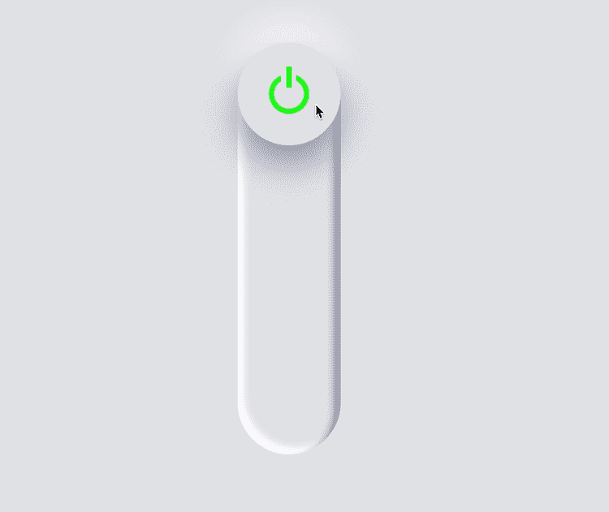
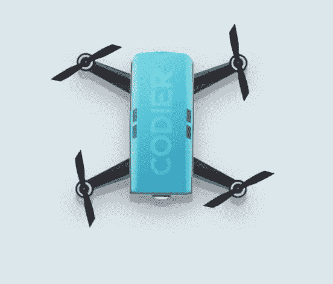
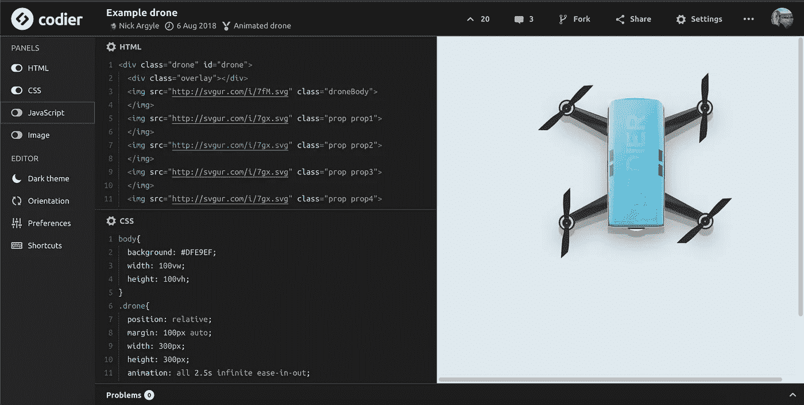
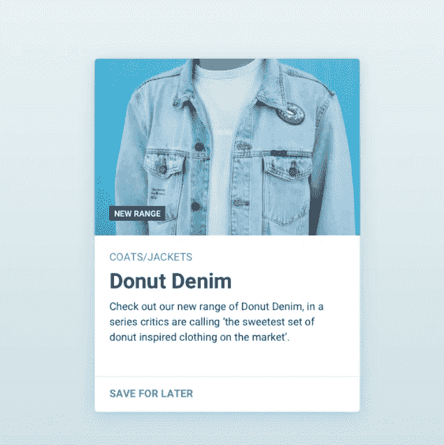
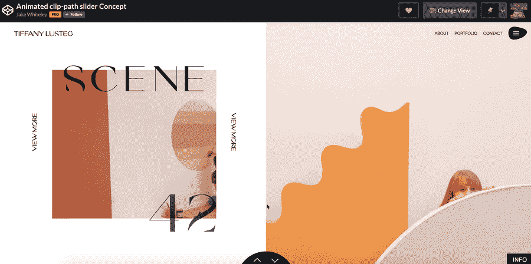

# 今天你可以构建 6 个项目来提升你的前端编码技能

> 原文：<https://betterprogramming.pub/6-projects-you-can-build-today-to-level-up-your-front-end-coding-skills-5fef6406426b>

## 为你的下一个项目列出一些启发性的想法来拓展你的技能

[“神经灯开关](https://codepen.io/jkantner/pen/mdEPpxq)”——作者[乔恩·坎特纳](https://codepen.io/jkantner)

提高 at 编码的最好方法之一——如果不是最好的方法——就是尽可能多花时间编码。你在编码领域有越多的项目和经验，你就会变得越好。

为什么不花几个晚上做一个兼职项目，付出额外的努力，变得格外擅长编码。

事不宜迟，这里列出了提高前端开发技能的编码思路。用这篇文章作为你下一个项目的灵感来源。

# **3D 旋转三角(专家级)**

通过重新创建和编码这个复杂的 3D 旋转三角形来开始你的早晨、午餐或下午。

默认情况下，旋转三角形只使用 CSS 来制作动画，但是也非常欢迎您使用 JavaScript。

[CSS 3D 三角旋转](https://codepen.io/cdmoro/pen/GRqZVEE?editors=1111)——作者[卡洛斯](https://codepen.io/cdmoro)

## 以下是您将通过构建旋转的 3D 三角形学到的内容

*   主 CSS 过渡、关键帧和动画。
*   精通理解 3D 建模和 3D 物理。

# 神经灯开关(中级)

滑动开关时，屏幕和开关变暗。很酷的概念，漂亮的设计，总的来说很棒的想法。

[“神经灯开关](https://codepen.io/jkantner/pen/mdEPpxq)”—作者[乔恩·坎特纳](https://codepen.io/jkantner)

滑块越深，屏幕越暗。当它处于底部位置时，它基本上就像一个“关闭”开关，当它处于顶部位置时，它就像一个“打开”开关。

注意:还有第三种状态，会导致开关变成黄色。

## 这是你将通过构建神经形态光开关学到的东西

*   根据开关的位置处理不同的状态。在本演示中有三种状态——“开”、“中立”和“关”。
*   如何使用 CSS 或 JavaScript 制作对象动画？
*   如何处理用户输入，例如在这种情况下滑动开关。

# **CSS 文件夹+悬停交互(初级)**

当您将鼠标悬停在文件夹上时，它会打开。整洁、干净、时尚的设计。

[“CSS 文件夹悬停微交互](https://codepen.io/shunyadezain/pen/GRqoWdG)”——作者[小井俊雅](https://codepen.io/shunyadezain)

## 下面是您将通过构建带有悬停交互的 CSS 文件夹学到的东西

*   如何使用 HTML 和 CSS 来创建外观简洁的设计？
*   处理鼠标悬停和不同状态之间的切换。当用户悬停在文件夹上时，显示打开的文件夹，否则显示常规的关闭版本文件夹。
*   打开和关闭文件夹时平滑的 CSS 过渡。

# 动画无人机(中级)

使用 HTML、JavaScript 和 CSS 创建一个动画无人机。您可以只使用 CSS，也可以使用 SVG 来绘制全部内容——这取决于您的选择。

*加分:*让无人机可以通过键盘、鼠标或者两者兼而有之来控制和访问。

用 CSS 和 HTML 构建的动画无人机——来源: [Codier.io](https://codier.io/creation/rJic9VBS7)

## 这是你通过制作动画无人机将学到的东西

*   高级 HTML 和 CSS 概念，如 CSS 动画、定位和结构化语义 HTML。
*   如何用 CSS 过渡、变换和关键帧制作对象动画。

*注:请务必查看 Nick Argyle 的动画无人机解决方案。*

动画无人机—来源: [Codier.io](https://codier.io/creation/rJic9VBS7)

# 材料设计卡(初级)

重新创建材料设计卡。通过引入过渡、悬停效果和点击事件使它更有趣。让它互动。

杰克·布鲁尔的《卡》——来源: [Codier.io](https://codier.io/creation/ry5QybKf7)

## 通过构建简单的卡组件，您将学到以下内容

*   如何使用 HTML、CSS 和 Javascript 创建专业外观的设计。
*   如何用 JavaScript 处理点击、鼠标和键盘事件。
*   如何使用 CSS 使你的页面在移动设备上具有响应性？

# 动画剪辑路径滑块概念(中级)

重新创建这个概念，但令人印象深刻的时尚滑块。滑块有漂亮的淡入淡出和其他很酷的动画。

[“动画剪辑路径滑块概念](https://codepen.io/jakewhiteleydev/pen/VwaXZZV)”—作者[杰克·怀特利](https://codepen.io/jakewhiteleydev)

这种巧妙的滑块设计给了这个设计一股清新的气息。

## 下面是您将通过构建动画剪辑路径滑块学到的东西

*   如何使用 CSS 定位，动画和剪辑路径。
*   如何用 JavaScript 处理用户事件？这些事件包括用鼠标悬停在元素上或单击滑块箭头。

# 结论

感谢阅读。我希望你为你的下一个项目获得一些灵感！编码快乐！

寻找更多的编码想法？永远不要耗尽编码的想法，永远不要。 [**被我弄到这里来挑战一堆前端。**](https://gumroad.com/l/IuqKc)

了解我最新内容的最好方式是通过我的[简讯](https://wholesomedev.substack.com/welcome)。成为第一个得到通知的人。

我的[简讯](https://wholesomedev.substack.com/welcome)。成为第一个得到通知的人。