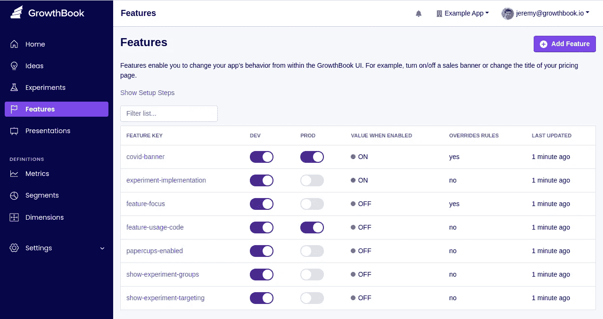
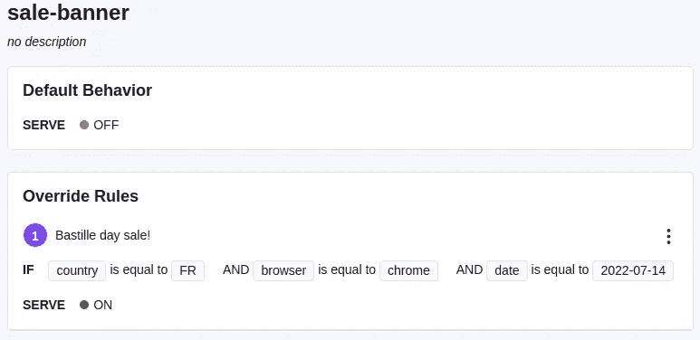
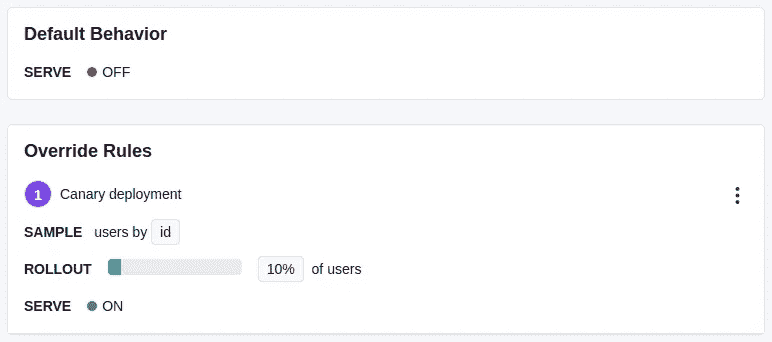
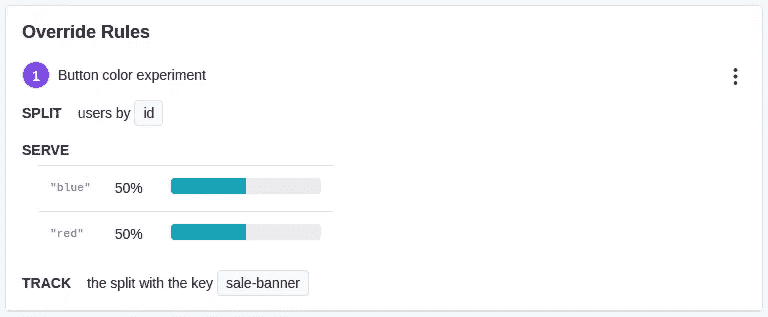
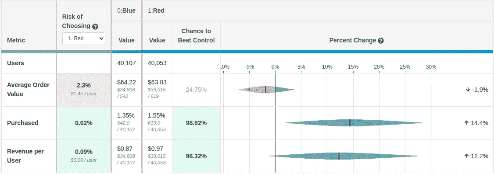

# 在代码库中使用特性标志的 6 个理由

> 原文：<https://betterprogramming.pub/6-reasons-to-use-feature-flags-e375ef0914c8>

## 特性标志使部署压力更小，给您更多的控制，减少生产中的错误，并让您做出数据驱动的决策


尼科·斯密特在 [Unsplash](https://unsplash.com?utm_source=medium&utm_medium=referral) 上拍摄的照片

多年来，特色旗帜一直是 FAANG 公司的秘密武器。它们让开发团队行动更快，减轻了开发运维和质量保证的负担，并使产品团队能够做出更好的数据驱动决策。

然而，直到最近，由于构建和维护定制功能管理平台的复杂性，小型公司完全采用这种做法是不可行的。如今，各种规模的团队都有几个不错的选择。



本文通篇使用了 [GrowthBook](https://github.com/growthbook/growthbook) ，一个开源特性标志平台，作为示例，但是这里的技术同样适用于商业工具，如[Launch darky](https://launchdarkly.com/)和其他开源平台，如 [Unleash](https://github.com/Unleash/unleash) 。

现在，不再拖延，这里是你应该使用特性标志的 6 个理由。

# 1.现在部署，以后发布

在市场营销、客户服务和产品部门准备正式“发布”某个特性的时候，工程部门准备将该特性部署到产品中的情况很少见。这往往会导致两种情况。要么开发团队将完成的代码保存在一个分支中(因为它会变得陈旧并累积合并冲突)，要么在组织的其余部分准备好支持它之前就将其部署。

第二个选择，尽早部署，看起来没那么糟糕，但是在很多情况下，它最终会导致非常糟糕的用户体验。例如，客户服务团队可能还没有接受新功能的培训，最终可能会给用户提供不正确的信息。或者类似地，FAQ、文档或副本可能没有更新，这让客户感到沮丧。

有了特性标志，您可以两全其美。例如，使用 GrowthBook，您可以将新代码包装在一个条件中:

```
if (growthbook.feature("my-feature").on) { ... }
```

默认情况下，特性是关闭的，所以您可以安全地将这些代码部署到生产环境中，没有人会看到它。然后，当您准备好实际发布它时，您可以从 GrowthBook UI 中打开该功能，而不需要部署新的代码。

# 2.生产用断路开关

每个工程师都有一个在生产过程中错误日志被填满的故事，而每个人都在努力找出问题所在。没有什么比在整个网站瘫痪时尝试调试和批判性思考更好的了。然后，一旦发现有问题的代码并推出修复程序，可能需要 10 多分钟来构建并推广到您的所有服务器。

有了特征标志，你就有了生产的终止开关。一旦你发现应用程序的哪个部分出了问题，你可以立即关闭它，而不需要通过正常的构建和部署过程。这仍然是一个令人害怕和紧张的情况，但已经不那么可怕了。特性标志为您赢得了进一步调试和进行适当修复的时间。与此同时，大多数用户甚至不会注意到在幕后发生了可怕的错误。

# 3.特征门控

在许多情况下，您希望让某些用户可以使用某种体验，而其他用户则不能。例如，为付费用户提供高级功能。或者只有美国游客才能看到的 7 月 4 日特价。或者在上面的“终止开关”例子中，为您的开发团队保留一个调查 bug 的特性，但是为其他人关闭它。

传统上，这是通过使用 if/else 分支和硬编码所有目标条件来实现的。这导致来自项目经理和营销团队的请求不断积压，您最终会得到这样的代码:

```
if (date < '2022-02-15' && url.query.utm_source != 'email' && ...)
```

特性标志使得这个过程更加简单。开发人员只是在他们的代码中使用一个通用条件:

```
if (growthbook.feature("my-feature").on) { ... }
```

然后从 GrowthBook 用户界面远程控制特征的状态。要素有一个默认状态，外加一个或多个基于目标条件更改状态的覆盖规则。



这些目标条件在 GrowthBook SDK 中进行本地评估，因此速度非常快，并且不会通过网络发送任何用户信息。这让项目经理和非技术人员可以自由活动，而不会打扰工程团队、污染代码或导致性能问题。

# 4.远程配置

能够打开或关闭某些东西是很好的，但它不够灵活，无法处理所有情况。例如，当有 4 个不同的模块版本时，您希望能够在它们之间切换，而不仅仅是开/关状态。这就是为什么 GrowthBook 和大多数其他功能标记系统都支持远程配置，即功能可以采用许多可能值中的一个。

对于开发人员来说，使用远程配置功能的代码非常相似。不是检查特性是否打开，而是获取特性的值，根据您的使用情况，该值可能是字符串、数字或更复杂的数据类型。

`moduleVersion = growthbook.feature("my-module").value`

许多团队广泛使用远程配置，并对他们应用程序的每个方面进行参数化，从显示的搜索结果的数量，到他们主页上使用的图像，到他们注册按钮的颜色。这使他们能够在 GrowthBook 用户界面中修改应用配置，而无需进行新的部署。

# 5.金丝雀部署

向 100%的用户一次性发布是很可怕的。做多少 QA 都没关系，有办法破，用户会找到的。对于 canary 部署，您首先让一小部分用户可以使用该特性，同时密切关注错误日志和指标。如果一切看起来都很好，你就逐渐把它展开到 100%。

如果没有功能标志，您通常会将应用程序的多个实例部署到生产环境中，并使用复杂的负载平衡器或 DNS 规则来控制流量。如果您有一个大型的专门的 devops 团队来构建和管理管道，这种方法很好，但是对于其他人来说，这种复杂性是不值得的。

有了特性标志，您无需额外工作就可以免费获得金丝雀部署！在 GrowthBook UI 中，你可以向一定比例的用户“展示”, SDK 将使用随机抽样来决定谁将被包括在内，而不是强迫用户都获得相同的值。



# 6.A/B 测试

A/B 测试在实践中非常类似于 canary 部署，但是目标略有不同。对于金丝雀部署，主要关注的是确保您不会破坏任何东西。A/B 测试的目标是让事情变得更好。证明某样东西更好需要更多的统计精确性和纪律性:

*   在变量之间平均分配流量(例如 50/50 ),并在整个实验中保持一致
*   确保同一个用户总是看到相同的变化
*   跟踪每个用户在您的分析系统中看到了哪些变化
*   在整个应用程序中跟踪目标和转换事件
*   使用统计数据来确定获胜者

幸运的是，与 canary 部署类似，A/B 测试免费提供特性标记。就像金丝雀部署一样，A/B 测试是通过 GrowthBook 中的覆盖规则来控制的:



一旦你开始收集数据，你可以使用 GrowthBook 的高级统计引擎来查看你的实验结果:



# 结论

希望现在你能明白为什么特性标志是顶级开发团队的秘密武器。这一简单的技术支持如此多的高级用例，并消除了巨大的压力来源。现在就开始使用以下任何工具的功能标志。

# 资源

*开源:*

*   [成长书](https://github.com/growthbook/growthbook)
*   [释放](https://github.com/Unleash/unleash)
*   [铁匠](https://github.com/Flagsmith/flagsmith)

*商业:*

*   [发射黑暗](https://launchdarkly.com/)
*   [Split.io](https://www.split.io/)