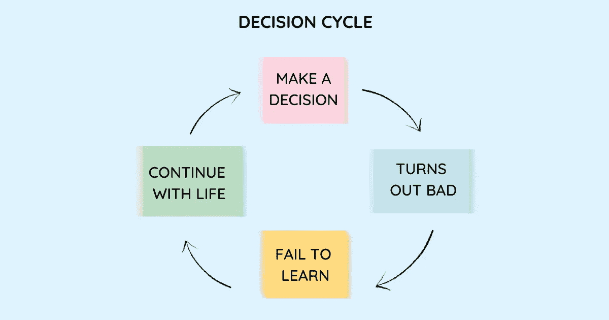

# 我们做出错误职业选择的 6 个原因以及如何避免它们

> 原文：<https://betterprogramming.pub/6-reasons-we-make-wrong-career-choices-and-how-to-avoid-them-212dd0fe7d79>

## 反击错误的决定

图片来源:作者

我们无时无刻不在做不理智的事情，做出让自己事后后悔的愚蠢选择。这并不像我们有意识地决定像一个傻瓜。相反，在我们做决定的时候，我们似乎对自己的选择很满意，也很合理。只是后来我们才意识到我们对现实的感觉是多么扭曲。

但是我们不会就此止步。我们没有从那些错误中吸取教训。我们经历了一个糟糕的决定，责怪自己或他人没有正确思考，结果只是重复同样的错误。

我们大多数人都听过这样的说法:

"我做了一个糟糕的职业选择——只是在当时这似乎是一个完全理性的决定。"

“虽然我应该得到提升，但没有得到提升让我非常沮丧。我通过说我经理的坏话来处理我的沮丧。我现在意识到，我本可以更好地处理这种情况。”

“我知道我的团队做了一个糟糕的选择，但我听从了大众的意见。它花了我公司很多钱。要是我当时有勇气说话就好了。”

“我一直在一个注定要失败的项目上投入更多的时间和精力。我应该早点退出。”

我们的生活只不过是我们所做决定的总和。它们决定了我们为获得的利益而增加的成本。它们通过将我们的注意力和能量引向一个特定的方向，同时将它从其他事情上转移开，从而影响我们的体验。它们控制着我们如何支配时间，以及我们在做对自己重要的事情时的效率，最终它们会影响我们的成就。从健康到人际关系，再到职业和个人成长，我们的决定构成了我们整体福祉不可或缺的一部分。

作家兼博客作者马克·曼森写道:

> “你在生活中所做的一切都是一种交换。你说的、做的或追求的任何事情都有成本和收益。这些成本和收益可能并不总是立竿见影——有时成本和收益在时间上是错位的，收益是眼前的，而成本是遥远的未来。有时，成本或收益是微妙的和心理的。但尽管如此，总会有取舍。”

他补充道:

> “我们愿意相信，我们可以找到一种只有快乐而没有痛苦，只有成功而没有失败，只有接受而没有拒绝的生活。但这是不可能的。得失是同时发生的。对于你说的或做的每一件事，为了说或做它们，你必须放弃无数种选择。”

我们的不完美加上未来未知的事实会导致我们做出非常糟糕的决定。但是我们可以投资于我们的决策能力，而不是感到无助。我们可以学会做出更好的决定，对自己的生活和同事产生积极的影响。

理解你为什么会做出糟糕的决定，将会阻止你做出让你后悔的决定，从而极大地提高你未来决策的成功率。

# 我们做出错误决定的 6 个原因以及如何避免它们

## **1。我们寻求社会认可**

我们做了很多糟糕的决定，因为我们的信念，因为我们无知，因为我们拒绝付出努力，或者我们忽视了就在我们面前的迹象。但是当我们知道什么更好的时候，我们也会做出错误的决定。不管我们的信仰或知识如何，在特定的社会背景下，我们可能会选择容易的而不是正确的。

我们知道什么是完美的选择，但是我们屈服于做出决定的社会背景。当你周围的每个人都在说些什么，而你有完全不同的话要说时，你可能很难为自己做出正确的决定。

*   想象一个在权威人士面前做出的决定，比如你的老板。你是表示不同意还是点头同意最受欢迎的决定？
*   当参加小组讨论时，你是否发现你的想法倾向于集体意见？

斯坦福大学社会学家马克·格兰诺维特将这种集体行为的[阈值模型](https://sociology.stanford.edu/sites/g/files/sbiybj9501/f/publications/threshold_models_ajs_1978.pdf)，该模型指出，一个人的行为取决于已经参与该行为的其他人的数量。门槛是在你决定接受他们的意见之前，必须做出一个决定的其他人的数量或比例。不同的人有不同的阈值，这些阈值可能受到社会经济地位、教育、年龄、性格等因素的影响。

不屈服于社会环境的人不需要别人的认可来告诉他们什么是好的决定。即使这意味着反对和反抗其他人，他们也不害怕。他们不会屈服于同伴压力和群体思维。他们不怕脱颖而出。比起被人喜欢，他们更强调正确。他们不会根据社会认可来做决定。

为了抓住你自己，问这些问题:

*   你相信这是正确的决定吗，还是其他人相信？
*   你是想取悦别人还是担心如果你不同意他们的观点会让他们不高兴？
*   你担心你需要为你的决定辩护吗？
*   如果你是做这个决定的主要负责人，而其他人指望你做正确的事情，会有什么不同？

遵循这个简单的规则:当在一个社会环境中做决定时，试着把自己放在远离社会环境的地方，然后评估如果你独立做这个决定你会如何做。

## **2。我们依靠证实证据**

行为经济学告诉我们，一旦我们做出了决定，即使是不合逻辑的决定，我们也会坚持下去。我们相信某种思路是正确的，并过滤掉不同的信息，同时寻找证实我们最初观点的信息。心理学家称之为确认偏差。

这种偏见在我们的无意识思维中根深蒂固，甚至我们不合逻辑的推理在我们看来也是完全合理的。我们带着一种有偏见的、经过过滤的世界观运作，这种世界观缺失了关键的信息，并打上了“基于逻辑的推理”的印记。

另一个来源是仅仅依靠我们的本能。以研究判断和决策心理学而闻名的心理学家和经济学家丹尼尔·卡内曼在他的经典著作《思考，快与慢》中强调，当我们将熟悉的经验模式应用于不相关的环境或情况时，我们的本能会让我们失望。我们根据过去的经验快速做出决定，这是噪音和偏见的主要来源。他要求我们抵制过早的直觉，并说，“直觉不应该被禁止，但它应该被告知、约束和延迟。”

为了抓住你自己，问这些问题:

*   你是否仅仅依靠你的直觉来做这个决定？有哪些数据支持你的想法？
*   你怎么确定这个数据没有偏差？
*   你还考虑过哪些不同的信息？
*   其他人对这个决定有什么看法？

遵循这个简单的规则:将你的直觉推理与科学知识和数据结合起来。向他人寻求不确定的观点和证据，让你看到争论的双方，而不仅仅是吸引你的那一方。

## **3。我们认为只有一个层次深**

我们以短期痛苦为代价为长期收益进行优化的频率有多高？基本不会。我们倾向于优化目前看起来最好的东西，而不考虑它对未来的影响。

我们很容易屈服于好的结果，这些好的结果有小的优点，我们很容易看到，却没有考虑到这些决定在未来潜在的大的缺点。我们的经验和信仰也限制了我们超越自然，通过提出困难的问题，探索未知的领域和怀疑看似显而易见的选择来寻求真理的能力。

通过忽略眼前的事情并评估其未来的后果，可以避免许多意外和不可预见的结果。[二阶思维](https://www.techtello.com/second-order-thinking/)是一种通过应用发散信息，形成新的联想和联系，超越我们已知和尚未思考的事物进行思考的必要性。

> “未能考虑二阶和三阶后果是许多令人痛苦的糟糕决定的原因，当第一个次等选择证实了你自己的偏见时，这尤其致命。在你提出问题和探索之前，永远不要抓住第一个可行的选择，不管它看起来有多好。”—雷伊·达里奥，[原则](https://www.principles.com/)

为了抓住你自己，问这些问题:

*   我做的决策对未来有积极的影响吗？
*   这个决定吸引人仅仅是因为它的直接效果(一阶后果)是积极的吗？
*   这个决定的潜在负面影响是什么，以及它以后的影响是什么？
*   我能看多远才能确定每一个随后的决定是如何创造了一个充满可能性的世界，还是限制了我能达到的结果？

遵循这个简单的规则:走出你的舒适区，分析你的决定对未来的潜在影响。

## **4。我们拒绝反思我们的错误决定**

> “当我们致力于一个计划，而它并不像我们希望的那样发展时，我们的第一反应通常不是重新考虑它。相反，我们倾向于双倍下注，在计划中投入更多的资源。心理学家称这种模式为承诺升级。—亚当·格兰特，[再想想](https://www.adamgrant.net/book/think-again/)

他补充说，“沉没成本是一个因素，但最重要的原因似乎是心理上的，而不是经济上的。承诺的升级是因为我们是合理化的生物，不断为我们之前的信念寻找自我辩护，以此来安抚我们的自我，保护我们的形象，并验证我们过去的决定。”

我们的自我被这个决定困住了，因为我们没能把我们的身份和我们之前做的决定分开。我们需要后退一步，重新思考我们的选择，而不是坚韧不拔，坚持走那条不可避免会导致失败的道路。

亚当认为“英雄般的坚持和愚蠢的固执之间只有一线之隔。有时候，最好的勇气就是咬紧牙关，转过身去。”

为了抓住你自己，问这些问题:

*   就我需要承担的成本而言，我是否从追求这一选择中获得了很多好处？
*   为了继续走这条路，我愿意放弃什么？
*   如果我放弃这个还有什么值得追求的？

遵循这个简单的规则:当你发现很难放下某件事时，问问自己:是勇气、盲目还是我自己的自我妨碍了你？

## **5。我们无法将我们的决定与我们的结果分开**

安妮·杜克(Annie Duke)在《Bets 中的思考》(Thinking In Bets)中提出了这个问题:“花点时间想象一下你在去年做出的最好的决定。现在花点时间想象一下你最糟糕的决定。”

完成了吗？

她写道:

> “我敢打赌，你最好的决定是在好结果之前做出的，最坏的决定是在坏结果之前做出的。我还没有遇到过这样的人，他不知道自己最好和最差的结果，而是知道自己最好和最差的决定。我似乎从来没有遇到过任何人认为一个糟糕的决定带来了好运，或者一个理由充分的决定没有成功。我们将结果与决策联系起来，尽管很容易指出决策与结果之间关系不那么完美的无可争议的例子。”

换句话说，我们将决策的质量等同于其结果的质量。

她解释了为什么会这样:

> “当我们从结果中回溯找出为什么会发生这些事情时，我们容易陷入各种认知陷阱，比如在只有相关性时假设因果关系，或者挑选数据来证实我们更喜欢的叙述。我们会把许多方钉子敲进圆孔，以维持我们的结果和决策之间紧密联系的假象。”

我们不仅不善于将运气和技能分开，而且我们也拒绝接受有些结果是我们无法控制的。

在我们的结果和之前决定的质量之间建立一个强有力的联系会让我们每天都有做出错误决定的风险。我们无法从过去的决定中吸取教训，就像我们无法区分好的和坏的决定一样。

我们能做什么？

她建议:

> “一个决定之所以伟大，不在于它有一个伟大的结果。一个伟大的决策是一个好的过程的结果，而这个过程必须包括一个准确描述我们自身知识状态的尝试。那种知识状态，反过来，是我不确定的某种变体。”

为了抓住你自己，问这些问题:

*   我认为这个决定是好是坏纯粹基于它的结果？
*   我是否遵循了正确的流程来做出这个决定？
*   我是否错过了可能导致不同决策的关键信息？

遵循这个简单的规则:不要试图在你 100%确定的情况下做决定，而是拥抱不确定性。根据特定结果发生的概率评估不同的选项。你的经验和对周围人的了解将决定你评估的准确性。

## **6。我们拒绝睡在上面**

当我们累了、饿了，或者在[决策疲劳](https://www.techtello.com/decision-fatigue/)的影响下，我们往往会做出一些非常糟糕的决定:匆忙辞职，批准一个过分的提议，拒绝一个潜在的好主意，对同事大喊大叫。我们最终会说或做一些我们本来不会说或做的事情。

我们的判断不仅受到我们最后一次进食的时间、外面的天气或一天中的时间的强烈影响。我们的情绪状态在我们的决策中也起着至关重要的作用。丹尼尔·卡内曼称这种偶然性为判断的可变性*噪音*。当处理高峰情绪时，我们的情绪劫持了我们的现实感，阻止我们清晰地思考。我们都犯过给同事发愤怒邮件的错误，这只会让问题变得更糟，因为我们说的话不合适。

为了抓住你自己，问这些问题:

*   现在是做这个决定的最佳时机吗？
*   做这个决定时，你觉得自己处于最佳状态吗？
*   你周围的一切感觉比平常更强烈吗？
*   你是在冲动行事，而不是花时间仔细考虑你的决定的后果吗？
*   你是否倾向于现状，并抵制改变的想法，因为它让人不舒服，似乎需要很多努力和精力？

遵循这个简单的规则:当你感觉情绪高涨或疲惫时，抵制回应他人或做决定的诱惑。考虑一下，或者给自己一个机会，让你的思维功能恢复。当你能够冷静清晰地思考的时候，练习离开这个决定，然后再回来。

## **总结**

1.  学会抓住错误的决策是提高我们未来决策质量的唯一途径，也是避免做出让我们后悔的决策的唯一途径。
2.  即使知道一个非常好的决定，我们也可能在某些社会背景下倾向于集体意见。
3.  我们坚持自己的观点，拒绝不可信的证据，收集符合我们观点的信息。
4.  我们为了眼前的小收益而优化，却没有评估未来需要付出的代价。
5.  我们的自我意识用我们之前做的错误决定困住了我们，我们没有改变路线，而是继续投资于它。
6.  我们根据结果来确定决策的质量，而不是关注导致改进的过程。
7.  当疲倦、饥饿或情绪激动时，我们往往会做出非常糟糕的决定。

*原载于 2021 年 6 月 24 日 https://www.techtello.com***。**