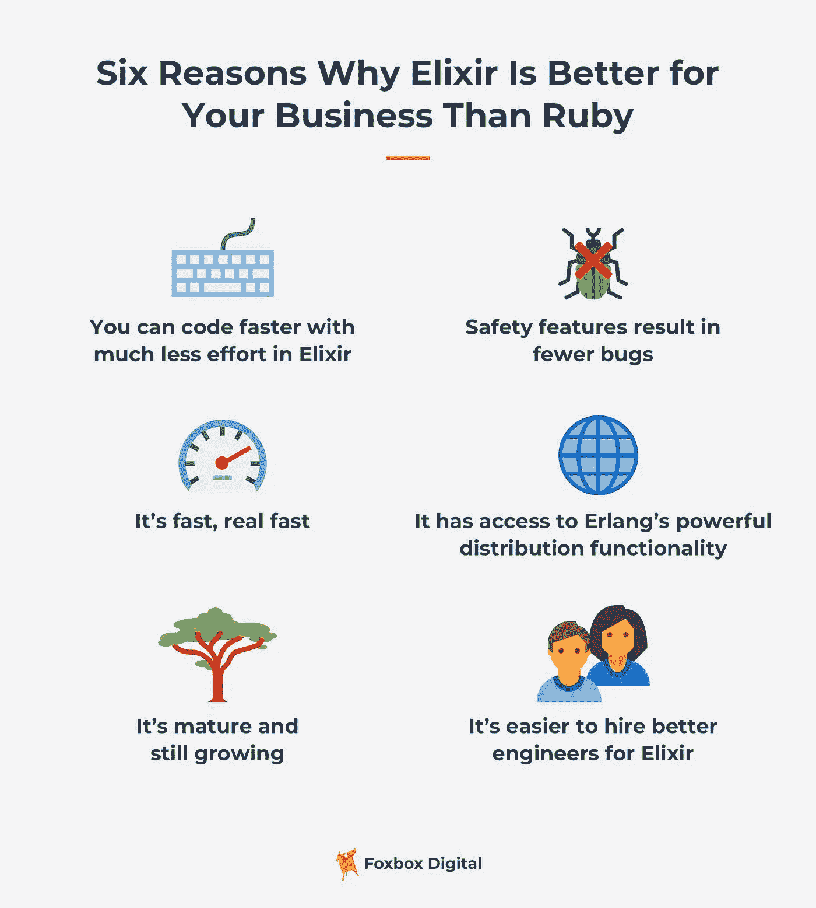
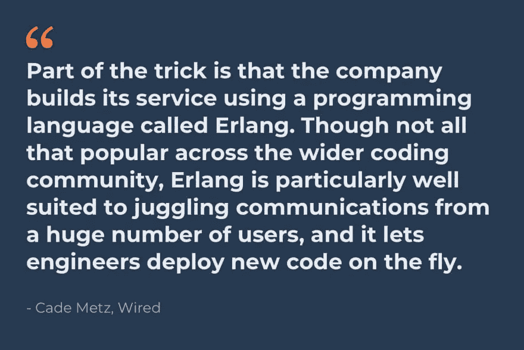

# 仙丹优于红宝石的 6 个理由

> 原文：<https://betterprogramming.pub/6-reasons-why-elixir-is-better-than-ruby-8f5ef8edc40e>

## 如何以及为什么长生不老药是为程序员的快乐而设计的

马克斯·尼尔森在 [Unsplash](https://unsplash.com?utm_source=medium&utm_medium=referral) 上拍摄的照片

我们的团队在过去的 24 个月里一直在使用 Elixir，我认为写下我对 Elixir 和 Ruby 的看法，以及为什么我们的工程团队决定完全停止使用 Ruby 编程，并把我们所有的精力放在 Elixir 上是一个好主意。

[我会在这里详细介绍我们的 Elixir vs. Ruby 体验](https://foxbox.com/blog/elixir-vs-ruby/)，但对于这篇文章，我想重点介绍以下内容:

1.  发展速度
2.  安全性和正确性
3.  表演
4.  简易并发编程
5.  成熟
6.  招聘质量

# 1.发展速度

老实说，我们对 Elixir 轻松处理并发感到兴奋，但这不是我们坚持使用它的主要原因。灵药是一种高产的语言。以下是这种说法的一些理由:

**简化的开发设置**——利用 BEAM 虚拟机，人们可以在几乎任何机器上获得一致的开发体验——甚至是 Windows。虽然对于 Ruby 来说也是如此，但是随着项目的进展，Ruby 中典型的 web 应用程序会积累更多的依赖项，使得它的启动和运行变得越来越困难，而 Elixir web 应用程序的安装仍然相对容易。

**可预测的代码库** — Elixir 实施真正的词法范围并鼓励显式代码。这在代码级别意味着，Elixir 使数据转换、代码组织和应用程序接口更加可预测，也更容易推理——从而节省了大量开发时间。

**轻量级和快速测试**——这可能是使用长生不老药最少被提及却又最强大的好处。Elixir 为开发人员提供了对硬件性能影响相对最小的超快速并发测试。另一方面，Ruby 测试可能非常慢，而且是硬件密集型的——对于那些性能不佳的机器来说，它可能会使整个系统陷入瘫痪。酏剂通过加快测试速度完全消除了头痛。

**有用的内置特性** —我们已经使用 Elixir 构建了一个快速的 MVP 项目来构建大型项目。在这两种场景中，Elixir 都提供了强大的内置特性来满足典型的现代 web 应用程序的需求，比如缓存、后台处理和进程监控。在 Ruby on Rails 这样的平台上，这些解决方案通常与 Redis、Resque 和 Foreman 等服务紧密相关。

我承认，起初，我对长生不老药非常失望。

我与模式匹配作斗争，它被吹捧为这个革命性的新概念。不过，在习惯了它和 Elixir 的所有其他优点之后，我发现自己用更少的努力和挫折来编码，以获得与 Ruby 完全相同的输出。这有两个原因。

## 这是一种函数式语言

与 Ruby 等面向对象的语言不同，函数式语言非常漂亮，并且简化了编程。我非常喜欢函数式语言，原因有几个:

*   它们导致编码更快和更可预测
*   没有要跟踪的州。国家使得追踪问题变得极其困难。没有引用错误。一切都是纯函数，很奇妙。

## 它有模式匹配

Elixir 最大的优势和与众不同之处之一是模式匹配。模式匹配来源于 Erlang，并且是您希望其他语言也能采用的东西之一。

我们的一位非常有才华的工程师[使用一个简单的排名例子，在 Elixir 和 Ruby 之间做了一个代码样本比较](https://gist.github.com/fschuindt/d1174ac8f490bfdef8abf9629fa8ecaf)。

在这个例子中，模式匹配使代码更优雅、更有表现力、更易读。这似乎是一件小事，但我发现自己一有机会就会使用模式匹配。

# 2.安全特性导致更少的错误

编程是乐趣和挫折的混合体。我发现长生不老药比红宝石更有趣，更少让人沮丧。Elixir 是一种动态类型语言，它内置了类型安全和保护功能，以及模式匹配，这大大减少了错误。

这导致更少的编译器错误。对于确实存在的错误，由于编译器的原因，它们更容易被发现。编译代码是一个巨大的安全特性。在 Ruby 中，bug 可以保持隐藏状态，直到有人击中它们；在 Elixir 中，编译器会找到其中的大部分。

总结:
安全→更少的 bug→更容易追踪 bug→更好玩→更快乐的团队→更快乐的我

# 3.它很快——真的很快

Elixir 编译成 BEAM 字节码，因此它继承了 Erlang 的所有性能优势，而代价几乎为零。另一方面，Ruby 需要一个解释器，在运行时逐行读取它的代码。虽然为您的应用程序选择合适的生产就绪的 Ruby 解释器本身已经是一项艰巨的任务，但是从 Ruby 中挤出更多的性能通常需要严格遵守 Ruby 的注意事项。想要连接字符串吗？当然可以。想让它跑得更快？请改用字符串插值。

Elixir 将程序员从为了让他们的代码运行得更快一点而不得不根据无止境的最佳实践列表精心编写代码中解放出来，并更加专注于生成满足您的业务需求的代码。

公平地说，Elixir 可能也有类似的一长串性能最佳实践，但它们是在开发的后期阶段出现的。此外，由于 Elixir 是一种编译语言，大多数性能问题都可以被编译器自动捕获，从而减少了编写高效、高性能代码所需的时间和精力。

# 4.简易并发编程

记得我说过长生不老药很有趣吗？

好吧，Elixir 中处理并发的方式是我不使用其他语言编程的原因之一(除非我绝对需要)。

如果你曾经不得不处理[并发](https://web.mit.edu/6.005/www/fa14/classes/17-concurrency/)，你就会明白这是多么令人沮丧。如果处理不当，相同的程序会产生不同的结果。您必须处理锁定、竞争条件和难以解决的错误。

Elixir 的美妙之处在于语言内置了并发库。你不需要依赖第三方来实现可伸缩的、安全的、并发的编程。

这两个原因是仙丹的一个巨大卖点。

## 易于大规模处理的数据

建立在 Elixir 基础上的 WhatsApp[拥有超过 10 亿活跃用户，每天处理超过 650 亿条消息](https://www.cnet.com/news/whatsapp-65-billion-messages-sent-each-day-and-more-than-2-billion-minutes-of-calls/)。

## 运行成本更低:用更少的硬件实现更多

Ruby 应用程序在服务器上占用大量内存，因为你必须运行该应用程序的许多实例来处理多个请求。为什么？Ruby 实际上是单线程的，因为它有一个叫做[的全局解释器锁](https://realpython.com/python-gil/)，一次只能运行一个线程。

Elixir 应用程序每个实例可以处理多得多的请求，因为它是并发的和编译的(执行时间快得多)。您可以在服务器上运行一个 Elixir 应用程序的单个实例来处理大量的请求。这大大降低了你的内存利用率。

当谈到数据处理时，与 C、Rust 和 Go 等语言相比，Elixir 和 Ruby 都被认为是在内存方面昂贵的解决方案。但是在并发数据处理领域，Elixir 和 Erlang 有一个健壮的预建基础设施。

对于较小的门(红宝石)，你将不得不等待更长的时间让你前面的人进来。在更宽的门上(长生不老药)，可以同时有更多的人进去。

Elixir 以一种非常有效的方式处理并发性，允许在相同的硬件上有更多的并发连接。

# 5.很成熟

Elixir 建立在 Erlang 之上，这是一种历经 40 年考验的语言。Erlang 运行高度并发的应用程序，如 WhatsApp。

这个标题和引用自 *Wired* 是一个很好的 Erlang 案例研究:

[“为什么 WhatsApp 的 9 亿用户只需要 50 名工程师](https://www.wired.com/2015/09/whatsapp-serves-900-million-users-50-engineers/)”

此外，Elixir 拥有 Phoenix，这是一个基于 Rails 的现代 web 应用程序的世界级 web 框架，我们都知道并喜欢它。

Elixir 有一个[大型软件包生态系统](https://hex.pm/packages)，您可以在构建应用程序时利用它。并不是所有的东西都可以在一个 Elixir 包中获得，对于这些情况，您可以从您的 Elixir 应用程序中本地运行任何 Erlang 包。

[它也在成长](https://www.hntrends.com/2019/oct-no-sign-of-react-falling-back.html?compare=Ruby&compare=Elixir&compare=&compare=)。就黑客新闻上的职位而言，它还没有赶上 Ruby，但它呈上升趋势，而 Ruby 呈下降趋势。

# 6.招聘质量

从我的经验来看，由于 Ruby 已经存在了很长时间，而且更容易学习，所以有很多优秀的 Ruby 程序员，而且还有很多东西需要学习。这使得雇佣 Ruby 工程师有点困难，因为你会有更多的候选人需要筛选。