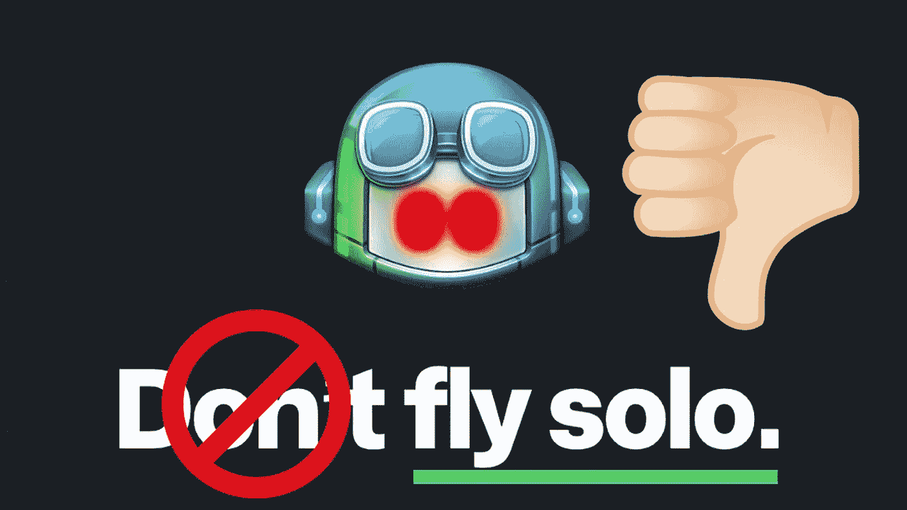
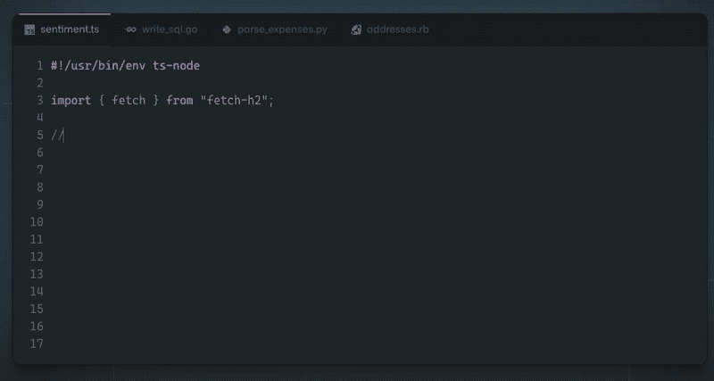
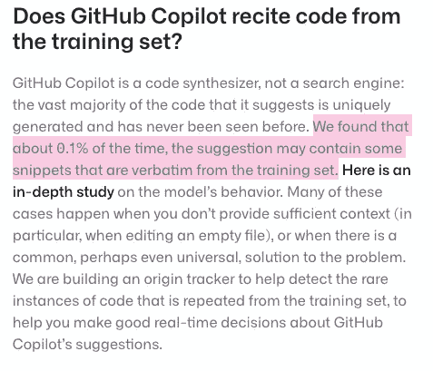
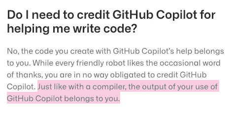
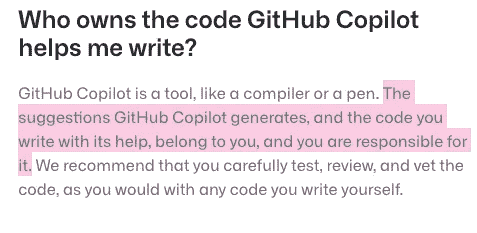
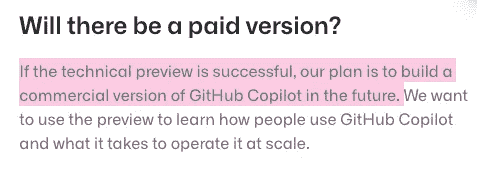
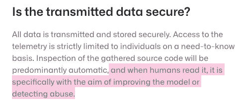
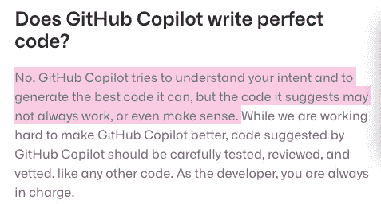
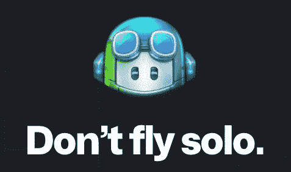

# 你应该避免 GitHub Copilot 而代之以“单飞”的 6 个理由

> 原文：<https://betterprogramming.pub/6-reasons-why-you-should-avoid-github-copilot-and-fly-solo-instead-8a948665433f>

## 我不建议使用它

图片来自 [GitHub 副驾驶](https://copilot.github.com/#faq-what-is-github-copilot)—[作者](http://www.arnoldcode.com)的改动。

“你的 AI 对程序员。”获得关于您可以编写什么代码的建议，甚至整个函数体都是根据您作为函数头输入的内容生成的。

起初，你的观点可能是“哇，太棒了！下一级编码终于来了。”

而且我不得不承认:一开始，我也是被这个工具惊艳到了。

但是观察幕后的情况类似于展开一个阴谋论。我深入研究了它的工作方式，阅读了 [FAQ](https://copilot.github.com/#faq-what-is-github-copilot) ，发现越来越多的迹象表明这不是一个好工具。

# 它是如何工作的

如果您已经熟悉 GitHub Copilot，请跳过这一步。

所以 GitHub Copilot 会得到关于代码行或整个功能的建议。这是直接在编辑器中完成的。

来自 [GitHub 副驾驶](https://copilot.github.com/)的动画序列

它是如何工作的？建议从何而来？

> “GitHub Copilot 经过数十亿行公共代码的训练，让您所需的知识触手可及，节省您的时间并帮助您保持专注。”— [GitHub 副驾驶](https://copilot.github.com/)

这就是麻烦的开始…

# 1.开源许可不受尊重

由于代码来自经过训练的 AI，训练集来自推送到 GitHub 的代码，所以它要么是你的私有代码，要么来自开源项目。

代码从哪里来？来源: [GHCP 常见问题解答](https://copilot.github.com/#faq-does-github-copilot-recite-code-from-the-training-set)

如果是后者，这就更合理了，因为开源代码应该比你的私有项目表现得更好，导致选择它们作为可能的解决方案的比率更高。

如果 GHCP 现在使用这些作品，这种使用肯定会违反源代码许可。

# 2.可能会让你承担责任

你可能会争辩说，“这只是直接复制代码的 0.1%。”

另外 99.9%的从其他来源直接复制的代码复合到一段新代码中又如何呢？如果我用受版权保护的图片合成了一张图片，这是否合法？

不，不是的。我会用偷来的版权材料拍一张照片。

猜猜谁会因此被起诉？GitHub？只有在你的梦里。这是你的准则。它属于你。

谁拥有代码(第 1 部分)？来源: [GHCP 常见问题解答](https://copilot.github.com/#faq-do-i-need-to-credit-github-copilot-for-helping-me-write-code)

你不能拥有被盗作品的构图。如果我从商店扒手那里偷了一块士力架巧克力，我就不是这块士力架的合法所有者。

验证不使用五指折扣是你的责任。

谁拥有代码(第 2 部分)？来源: [GHCP 常见问题](https://copilot.github.com/#faq-who-owns-the-code-github-copilot-helps-me-write)

# 3.你依赖的另一个工具

我想澄清一下，工具是伟大的。我们每天都在使用它们。大多数时候，没有他们我们无法生存。但是要评估一个工具的价值，你必须考虑它提供的价值。

我现在做一个粗略的对比:GitHub Copilot 只是一个堆栈溢出复制粘贴 bot。

如果使用得当，堆栈溢出是很棒的。寻找答案和复制粘贴代码将堆栈溢出降级为您使用的工具。用不尊重的语气说，就是拐杖。

堆栈溢出比 GHCP 更好的地方在于，你必须付出努力才能得到你的代码片段。你必须搜索它，而它很少是你正在搜索的东西。

GHCP 从训练集中搜索可能的最佳答案，为您提供堆栈溢出无法提供的便利。这就是为什么我觉得 GHCP 只是一个堆栈溢出复制粘贴机器人。

# 4.现在是免费的，但是以后你必须付费

我们可以免费使用 GitHub，它有望永远保持这种状态。因此，我认为 GitHub Copilot 也是免费的。

没有。

在浏览了 FAQ 之后，我发现将会有一个付费版本。

会有付费版本。来源: [GHCP 常见问题](https://copilot.github.com/#faq-will-there-be-a-paid-version)

会有免费版本吗？没人知道。这是不依赖其他工具的另一个原因。未来并不明朗，除非你要为此付出代价。

最好的情况是有限制的免费版本。但这只是一个预测。我找不到任何证据。

# 5.您的私有和开放源代码被暴露出来供分析——NDA 危机

你可能会争辩说你不关心 GitHub 对你的代码做了什么。你正在使用一个天才的工具，这就是代价。

这似乎是对的，因为你是一个私人开发者，为了乐趣而开发程序。但是你有没有想过 GitHub 正试图通过所有这些伟大的开源项目来建立一个收入流？从道德角度来说这样可以吗？

您提交的代码肯定会被存储和分析。除此之外，其他人也有权利看你的代码。

你的代码是安全的，但也对其他人开放。来源: [GHCP 常见问题解答](https://copilot.github.com/#faq-is-the-transmitted-data-secure)

这可能会打断你的脖子，也可能根本不会打扰你，这取决于你是在做机密/敏感的事情，还是只是在做你的私有/开源项目。

最后，在不知道代码已经暴露的情况下，参与客户项目并签署[保密协议](https://www.investopedia.com/terms/n/nda.asp)可能是一个大问题。

# 6.产生不良和不安全代码的可能性很高

最后一个不是猜测。它实际上是在他们自己的 FAQ 中描述的。

会写没有意义的代码。来源: [GHCP 常见问题](https://copilot.github.com/#faq-does-github-copilot-write-perfect-code)

这意味着您可能需要经常检查这个工具在做什么。除非你已经检查过了，否则你不能假设它能写出好的或功能性的代码。

这又引出了 GitHub Copilot 的价值。相比之下，在电子邮件客户端，我每次发送邮件后都必须检查*发件箱*文件夹，以确保邮件确实发出去了。

这会让这个工具贬值，我会换另一个电子邮件工具。

# 外卖食品

*   开源许可不受尊重。
*   GitHub Copilot 提供的代码可能会使您承担责任。
*   你依赖的工具是拐杖。GitHub 副驾驶是拐杖。
*   这个工具现在是免费的，但它不会一直免费。
*   你的代码被暴露给其他人并被存储。如果你有 NDA，你就完了。
*   您必须不断地检查这个工具交付给您的代码。对于一个工具来说不是一个很好的服务。

图片来自 [GitHub](https://copilot.github.com/) 。

“不要单飞”是一个善意的建议，但 Copilot 不能与现实生活中的结对编程相提并论。

# 进一步相关有趣的文章

[ML 代码生成与手工编码——我们认为编程将会是什么样子](https://wasp-lang.dev/blog/2022/06/24/ML-code-gen-vs-coding-by-hand-future)

# 参考

*   [GitHub 副驾驶](https://copilot.github.com/)
*   [GitHub 副驾驶常见问题解答](https://copilot.github.com/#faq-what-is-github-copilot)