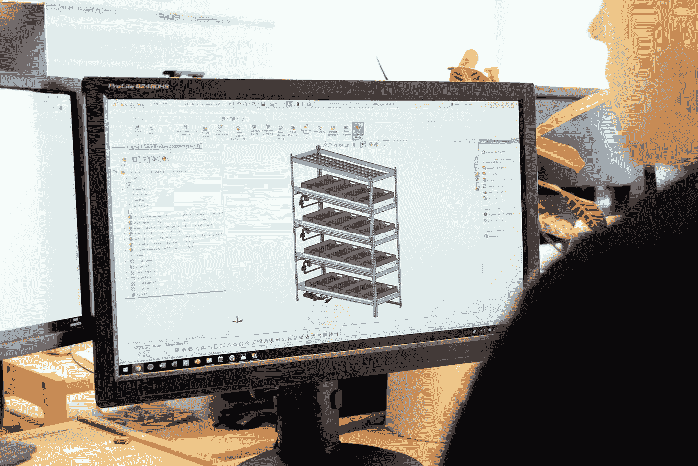

# 给一年级工科学生的 6 个提醒

> 原文：<https://betterprogramming.pub/6-reminders-for-the-first-year-engineering-student-c5886dbadf9>

## 你已经决定学工程了还是只是在考虑？以下是一些值得注意的想法

在 [Unsplash](https://unsplash.com?utm_source=medium&utm_medium=referral) 上拍摄的 [ThisisEngineering RAEng](https://unsplash.com/@thisisengineering?utm_source=medium&utm_medium=referral)

无论你一直梦想成为一名工程师，还是这只是你的一个职业选择，你在最初几堂课上的心态是你成功轨迹的一个重要因素。我会第一个承认，我对自己将要面临的问题没有一个明确的认识。然而，不知何故，我最近以优异的成绩毕业，并找到了一份工作(哇！)，而且你也能做到！如果你已经选择走这条路(或者正在考虑)，以下是我希望在我的教育生涯早期遇到的一些提醒。

## 如果你感到恐惧或恐吓，要知道你并不孤单。

沿着这些思路，**不要低估自己**。即使你并不总是最好的学生，大学也给了你重新开始的机会！当我考虑主修工程学时，有很多次我会盯着必修课清单，怀疑自己是否能做到……科学和数学的要求清单是焦虑思想的一个处方。所以，如果你发现自己处于这种情况，你是正常的。

为了帮助缓解这些情绪，专注于*做*。做好研究，为考试和作业做好准备。过分强调未来和消极的可能性会导致恐惧。导师和同学也可以帮助你在当下保持脚踏实地。

## 记得优先考虑学校。

不要让攀比影响到你，尤其是如果你周围的人不是学工程的。在我的第一个学期，我周围都是其他专业的朋友，有更多的时间用于社交生活，这让我陷入了一个循环，每个周日都要完成一周的微积分作业。大学时光应该是你一生中最美好的时光，对吗？每隔几天在图书馆里感到压力会让这种情况变得令人沮丧。

我在这里的建议是记住**牺牲是暂时的**。工程学位会有回报的。当然，你可能看不了那么多《网飞》,因为空闲时间没那么多，但是健康的平衡是可能的...嗯，不容易，但也不是不可能。

## 让失败激励你。

因为如果有一件事我可以保证，那就是你会失败。而且我的意思不一定是你一节课就不及格，而是会犯错误。失败是学习过程的一部分，这也是许多雇主想要雇佣工程师的一个原因，即使是在工程以外的领域，比如商业。该课程旨在让你成为一名问题解决者，这可以应用于工程之外的任何地方。

不是每个人都可以在无数次尝试和失败后，一次又一次地重新尝试同样的数学问题。在需要这种准备的学科中，产生了一种特殊的弹性。**你可能会发现，在你*做*的极少数情况下，第一次尝试就找到解决方案，你会觉得自己战无不胜！多半是因为你习惯了失败。太棒了。**

## 为了钱而投入其中的学生将会下降(或失败)。

这又回到了*你的燃料是什么*的问题？许多学生进入工程领域寻求一份舒适的薪水或一份可靠的工作，这并不坏。但是如果这是唯一的动力，那些学生很快就会放弃。工程不是一个容易的专业，所以当你需要熬夜或做出一些社会生活牺牲时，如果有其他事情推动你，它会有所帮助。许多工程师实际上是书呆子，即使他们试图在外表上表现得很酷。

那些只为钱而从事 it 工作的学生往往是那些试图付钱让别人为他们工作的人。你不想成为这样的人，尤其是当很多工程工作都有生命危险的时候。请学习材料。求你了。

## 你的项目中男性可能比女性多，你会习惯的。

考虑到我是女的(惊喜！)，这实际上是我的一个担忧，因为我认为我会感到格格不入，而且会更难交到朋友。虽然这最初可能是真的，但它确实让我更专注于我的学习，所以凡事都有好的一面！幸运的是，我的学校有一个女工程师协会分会，所以我能够在那里遇到志同道合的女性。

有许多举措旨在增加 STEM(科学、技术、工程和数学)领域的女性人数。虽然这已经产生了一些影响，但在工程领域，男性仍然远远多于女性；确切的数字往往会有所不同，尤其是在学校和不同行业之间。事实是，几个星期后，我很快就习惯了这些比率，这成了我的常态。我并没有认真考虑过这个问题，直到我路过校园里的护理大楼，这才提醒我，事实上，我是学工程的。

## 看看你周围。你可能会看到不同的世界！

谁设计了你的手机？一名工程师。你的车呢？空调呢(你可能都没有意识到它在运转，直到它坏了)？一名工程师。

我们的现代世界是由工程师设计的！获得这一领域的学位为做出贡献和留下你的印记打开了大门。更别说毕业后还有无数的行业可供从事。汽车，桥梁，是的，甚至化妆品。因此，如果你的兴趣在这些年里发生了变化，那么很有可能会有一种选择适合你。

等到毕业的时候，也许你会明白:

*大一工科学生进来时什么都知道。高年级学生离开时什么都不知道。*

获得工程学学位是谦逊的一课。