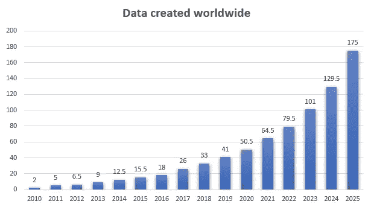
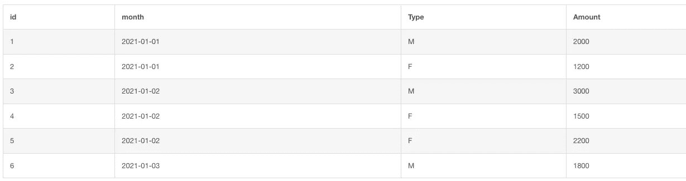
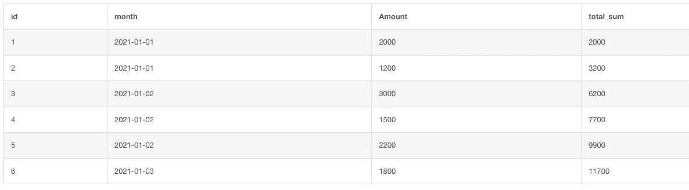
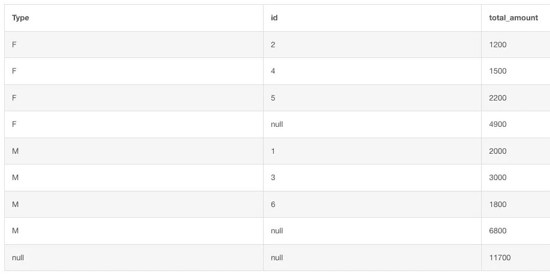

# 每个数据工程师都应该知道的 6 个 SQL 查询

> 原文：<https://betterprogramming.pub/6-sql-queries-every-data-engineer-should-be-aware-of-2d0a2cc5986e>

## 它可能已经有超过 45 年的历史了，但是 SQL 仍然完成了它的工作


照片由[马库斯·斯皮斯克](https://unsplash.com/@markusspiske?utm_source=unsplash&utm_medium=referral&utm_content=creditCopyText)在 [Unsplash](https://unsplash.com/s/photos/software-engineer?utm_source=unsplash&utm_medium=referral&utm_content=creditCopyText) 拍摄

无论您是开始工程生涯的初学者，还是经验丰富的数据工程师或数据分析师，高级 SQL 语法知识都是必须的。

随着数据呈指数级增长，超快速地分析这些数据变得越来越重要。



来源: [*Statista*](https://www.statista.com/statistics/871513/worldwide-data-created/)

这个图中的单位是 zettabytes。

```
1 zettabyte = 1 trillion gigabytes
```

人们可能会说 SQL 已经死了，但现实是目前没有任何系统可以取代它。有许多非常有能力的 NoSQL 商店做得非常好，以低成本支持大规模扩展。然而，它们不会取代高质量的基于 SQL 的存储——而是对它们的补充。SQL 的 ACID 属性使其成为相对自然地建模数据的高度可靠的方法。

作为一名数据工程师，我使用 SQL 已经有一段时间了，我知道更快地编写复杂查询的重要性。因此，这里有一些高级 SQL 语法，肯定会派上用场。

对于下面的例子，我使用了下表的内容。这个表叫做*账单*。



作者图片

# 累计总数

您经常会遇到必须从表中计算累计的情况。这是为了了解每一个值是什么，与运行总数进行比较。

累计是指特定列中下一个单元格之前的列中所有单元格的值的总和。

这里有一个查询可以做到这一点。

累计总数。由作者添加

这是输出的样子:



作者图片

# 常用表表达式

通用表表达式(简称 CTE)用于简化复杂连接和子查询的可读性。

它基本上是一个临时命名的结果集，您可以在一个`SELECT`、`INSERT`、`UPDATE`或`DELETE`语句中引用它。

考虑这个简单的查询，

cte 的 git。由作者添加

现在想象一下，如果我们在随后的查询中多次使用这个子查询。如果我们能把那用作临时桌子，不是更容易吗？CTE 解决了这个问题。

cte 的 git。由作者添加

这是一个小例子，但是对于更大更复杂的子查询来说，这通常非常有用。

# 对数据进行排序

数据工程师和分析师会同意，根据一些参数(如工资或费用等)对值进行排序是非常常见的。对数据进行排序的知识唾手可得，可以为您节省大量查找精确查询的时间。

排名的一个片段。由作者添加

在下面的查询中，我根据 amount 列对数据集进行了排名。

您也可以使用类似于`RANK()`的`DENSE_RANK()`，除了如果两行具有相同的值，它不会跳过后续的等级。

# 添加小计

对于数据工程师和分析师来说，这又是一个超级重要的查询。在我作为业务/数据分析师的 10 年职业生涯中，我使用这个查询进行了大量的分析。小计有助于您从总体的角度来看待数据。

它是一个`GROUP BY`子句的扩展，能够向数据添加小计和总计。

rollup 的一个片段。由作者添加



作者图片

*注意:*以上查询是在 MySQL 中。其他人的汇总语法可能会有所不同。

在上面的查询中，type 和 id 都为 null 的行就是总计的行。无论 id 列是什么，都有小计。这由第 4 行和倒数第二行表示。

# 临时功能

临时函数允许您轻松地修改数据，而无需编写大量的 case 语句。

在下面的例子中，一个临时函数用于将类型转换为性别。这可以通过在查询中使用 case 语句来实现，但是读起来会很混乱

临时函数的一个片段。由作者添加

# 方差和标准差

对于数据科学家和分析师来说，获得方差和标准差的能力至关重要。幸运的是，有函数可以获取这些值。

`VARIANCE`、`VAR_POP`和`VAR_SAMP`是集合函数，即对数据进行分组。这些用来分别确定数据集合的方差、组方差和样本方差。

方差和标准差的片段。由作者添加

`VAR_POP`:这是总体方差
`VAR_SAMP`:这是样本方差
`STDDEV_SAMP`:这是样本标准差
`STDDEV_POP`:这是总体标准差

这些是我在数据工程职业生涯中经常使用的一些顶级 SQL 命令。这些对解决许多商业问题非常有用。 [Stats](https://thenewstack.io/sql-is-dead-right/) 表示，SQL 工具生态系统包括从 Excel 和 Tableau 到 SparkSQL 的任何东西，被超过 60% 的组织使用[。令人印象深刻的壮举，尤其是考虑到它的年龄。](https://scalegrid.io/blog/2019-database-trends-sql-vs-nosql-top-databases-single-vs-multiple-database-use/)

因此，如果您是一名数据工程师，我相信您会发现这些命令非常有用。如果我错过了什么，请在评论区告诉我。