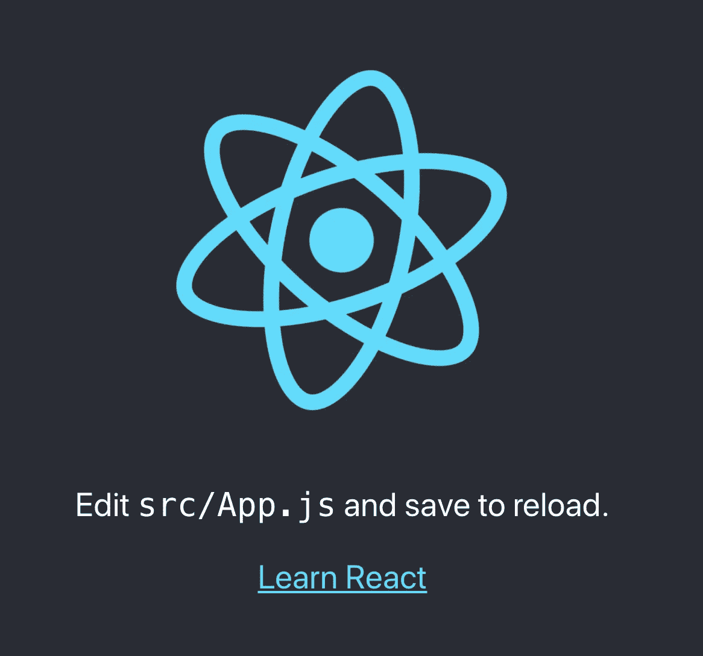
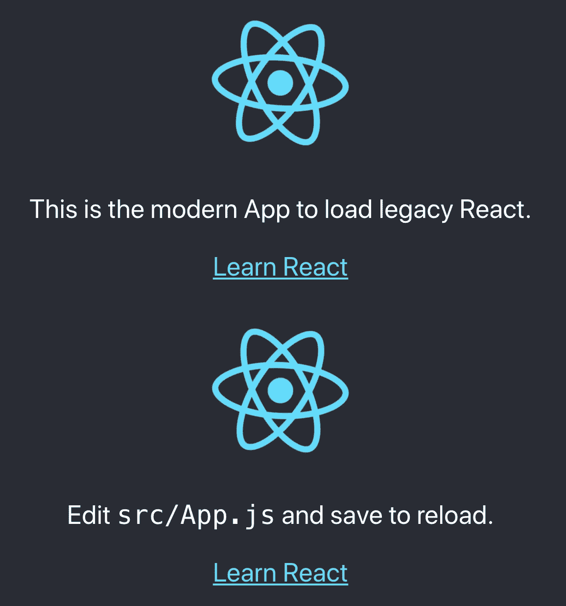
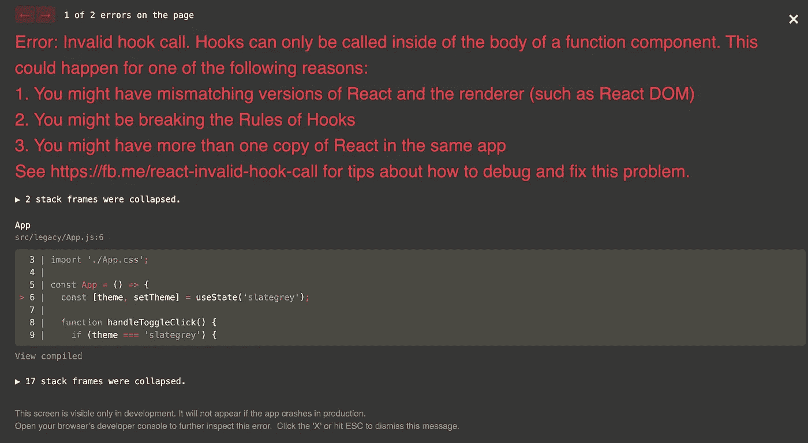
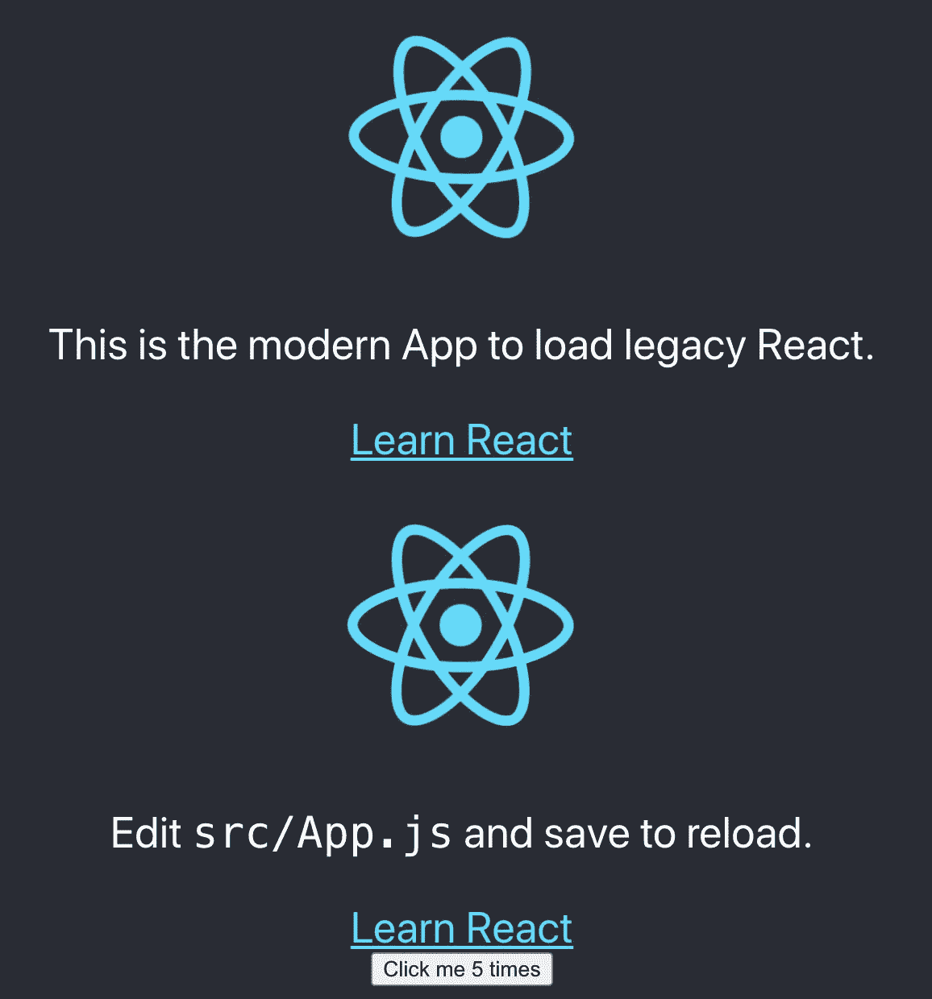
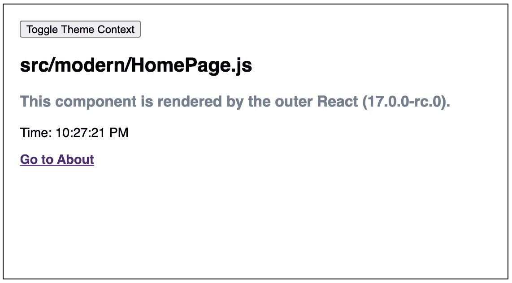
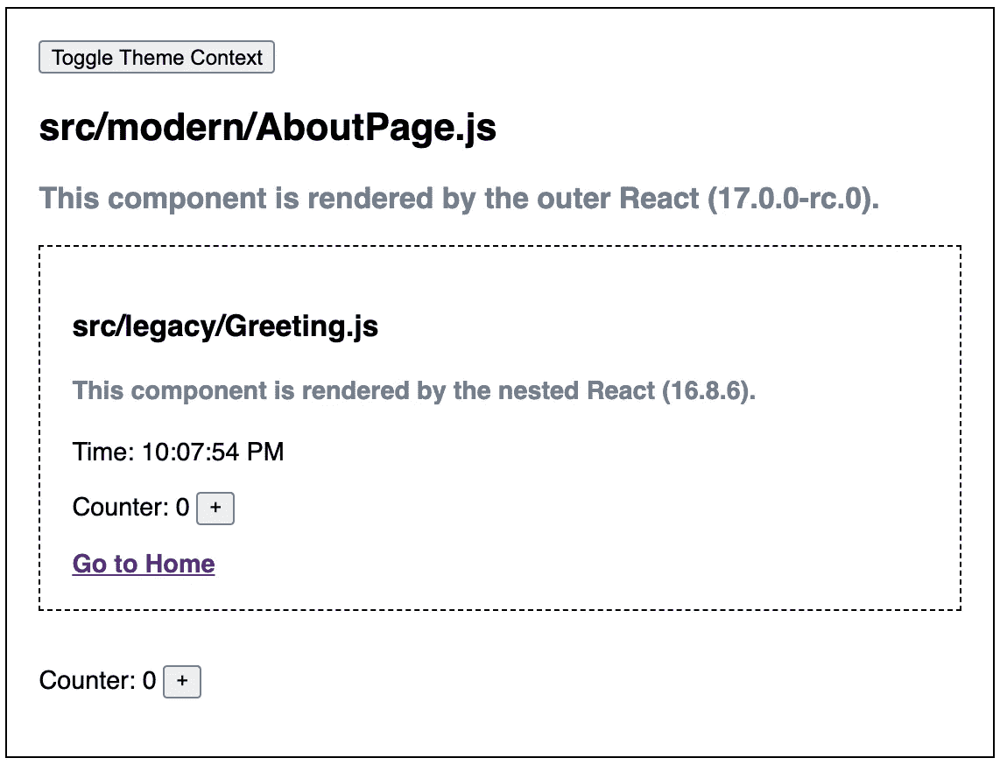

# 创建多版本 React 应用程序的 6 个步骤

> 原文：<https://betterprogramming.pub/6-steps-to-create-a-multi-version-react-application-1c3e5b5df7e9>

## React 17 具有延迟加载和深度集成 React 多个版本的能力


图片来源:作者

React 团队表示，React 17 中没有新功能，但`react@17.0.1`自带了延迟加载和深度集成 React 多个版本的功能。这个*无功能*比任何功能都大，这是一个允许现代新应用与现有遗留应用共存的范例的垫脚石。

这种混合方法是一个逃生出口，而不是标准。使用 React 的单个版本是最佳实践，它消除了许多复杂性，并使您免于下载多个包。然而，在有遗留代码的环境中，这仍然是一个强大的替代方案。

在[将随机 React 应用转变为微前端的 5 个步骤](https://medium.com/better-programming/5-steps-to-turn-a-random-react-application-into-a-micro-frontend-946718c147e7)中，我们绘制了上面的架构图，该图启动了多个 React 应用，旧的和新的，它们作为一个应用一起工作。这听起来像是类似问题的不同选择吗？

我们的例子是受`[Demo of Gradual React Upgrades](https://github.com/reactjs/react-gradual-upgrade-demo/)`的启发。我们将称之为`The Demo`。

根据我们的试验，创建多版本 React 应用程序有六个步骤。

# 步骤 1:将新代码移动到 Src/Modern 目录

和往常一样，我们从 [Create React App](https://medium.com/better-programming/10-fun-facts-about-create-react-app-eb7124aa3785) 开始。

```
npx create-react-app my-app
cd my-app
npm start
```

因为我们要将多个 React 应用程序放入同一个存储库中，所以我们需要设置名称空间。这是目录结构。

```
src
 ├─ modern // new code: React 17
 ├─ legacy // legacy code: React 16.3.1 - could be lower version
 └─ shared // shared code - common source
```

我们把`src`的所有东西都搬到了`src/modern`。

```
$ ls
App.css          index.css        App.js           
index.js         serviceWorker.js. App.test.js      
logo.svg         setupTests.js
```

另外，将`package.json`复制到`src/modern`，并做一些修改:

在第 2 行，将其更改为一个合适的名称。保留所有的[依赖关系](https://medium.com/better-programming/package-jsons-dependencies-in-depth-a1f0637a3129)，并删除剩余的部分。

在 9 号线和 10 号线，React 版本已经升级到`17.0.1`。

`react-scripts`包从依赖列表中删除。

# 步骤 2:将遗留代码移动到 src/遗留目录

遗留代码放在`src/legacy`下。

```
$ ls
App.css          index.css        App.js           
index.js         serviceWorker.js. App.test.js      
logo.svg         setupTests.js
```

在第 2 行，将其更改为一个合适的名称。保留所有依赖项并删除其余部分。

在第 9 行和第 10 行，React 版本已保持为`16.13.1`。

从依赖列表中删除了`react-scripts`包。

# 步骤 3:更改根 package.json

下面这个词根`package.json`是从`The Demo`复制改编而来的。之前移除的部分被放回这里，还有更多东西。

在第 2 行，将其更改为一个合适的名称。

第 5 - 7 行是依赖项，包括构建依赖项(`react-scripts`)和可能的反应不可知库(`The Demo`中的`redux`)。

第 38 - 41 行是复制文件(`cpx`)和并行/顺序运行工具(`npm-run-all`)的一些帮助实用程序。

这些实用程序在`scripts`(第 8 - 22 行)中使用，它将`shared`文件复制到`modern`和`legacy`目录中，并安装、构建和监视它们。如果您想创建一个不同的目录结构，这些脚本需要进行调整。

第 23 - 25 行用于`eslintConfig`。

第 26 - 37 行用于`browserslist`。

运行`install i`。它产生`src/modern/node_modules`和`src/modern/node_modules`。

# 步骤 4:设置环境文件

由于 [VSCode](https://medium.com/better-programming/10-useful-plugins-for-visual-studio-code-6ab62c0b14ee) 开始显示 5K 变化，eslint 显示`node_modules`错误，我们需要设置几个环境文件。

配置`.env`启用 eslint 进行静态代码分析:

```
EXTEND_ESLINT=true
```

配置`.eslintignore`忽略这些目录的 eslint 错误:

```
node_modules
build
src/*/shared
```

配置`.gitignore`以排除这些目录/文件进行源代码控制:

```
node_modules
build
.DS_Store
src/*/shared
```

现在它显示了 32 个文件的变化。情况良好。

# 步骤 5:设置 src/index.js

我们调用`npm start`，得到如下错误:

```
Could not find a required file.
  Name: index.js
  Searched in: /Users/fuje/app/react-app4/src
```

好的，我们需要设置`src/index.js`，它指向`src/modern/index.js`。

```
import './modern/index';
```

用`npm start`再试一次。我们看到这个熟悉的 Create React 应用程序:



# 步骤 6:在旧应用和新应用之间搭建一座桥梁

我们有一个版本的 React running。因为目标是混合旧应用和新应用，所以旧应用需要加载到新应用中。

在第 5 行，遗留应用程序是延迟加载的，它在第 22 - 24 行使用。

第 13 行的文本被修改，以显示它来自 modern 应用程序。

运行`npm start`，我们看到现代应用与传统应用一起运行。



到目前为止，一切顺利。

我们在`src/legacy/App.js`中加入`useState`钩子:

第 22-24 行创建了一个被点击的按钮。

然后我们会遇到以下错误:



哦，发生什么事了？

需要在传统应用程序和新应用程序之间架起一座桥梁。

6 号线不调用`React.lazy`，而是调用`src/modern/lazyLegacyRoot.js`内部定义的`lazyLegacyRoot`:

这是桥的一端。在第 17-19 行，它从遗留代码中动态导入`createLegacyRoot`。然后调用两个`useLayoutEffect`(第 25-33 行用于创建，第 36-40 行用于更新)用新版本 React 重新呈现代码。

`useLayoutEffect`的签名与`useEffect`相同，但在所有 DOM 突变后同步触发。在浏览器有机会绘制之前，安排在`useLayoutEffect`中的更新将被同步刷新。

让我们看看桥的另一端:

第 8-10 行定义了一种呈现方法。

第 11-13 行定义了卸载的方法。

通过桥梁的两端，我们使多版本 React 应用程序正常工作:



# 演示

`The demo`可以下载并运行:

```
git clone https://github.com/reactjs/react-gradual-upgrade-demo.git
cd react-gradual-upgrade-demo
npm i
npm start
```

它包括两条路线:

*   回家的路线:它只显示新的应用程序。可见组件由 React 17 渲染。



*   关于路线:它显示了一个混合了新旧应用程序的用户界面。虚线外的组件由 React 17 渲染，虚线内的组件由 React 16.8.6 渲染。



`The demo`比我们这里描述的例子更高级。它展示了如何共享一个主题作为一个全局上下文，以及如何在应用程序之间共享一个 Redux store(用于 counter)。它还共享`useTime`挂钩和时钟显示。值得下载`The demo`深入了解一下。

尝试我们总结的六个步骤来创建您自己的多版本 React 应用程序。React 17 提供了延迟加载和 React 多个版本深度集成的能力。

# 结论

反应 17 号来了。它改变[合成反应事件](https://medium.com/better-programming/whats-the-difference-between-synthetic-react-events-and-javascript-events-ba7dbc742294)，以及其他一些特性。阅读[这篇](https://reactjs.org/blog/2020/08/10/react-v17-rc.html)了解更多信息。

React 17 是一个主要版本。我们需要做出反应 17，以获得在未来不那么快行动的能力。酷吗？

感谢阅读。我希望这有所帮助。你可以在这里看到我的其他媒体出版物。