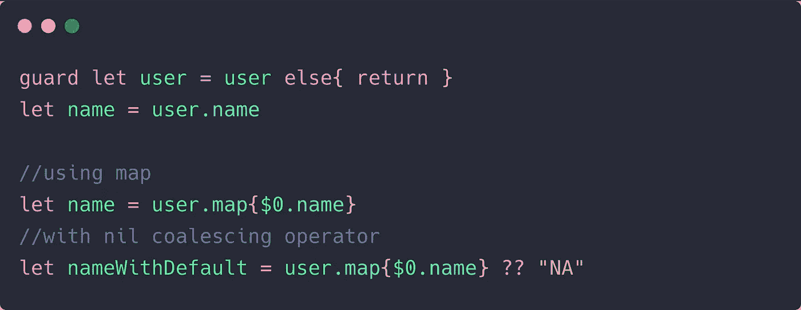
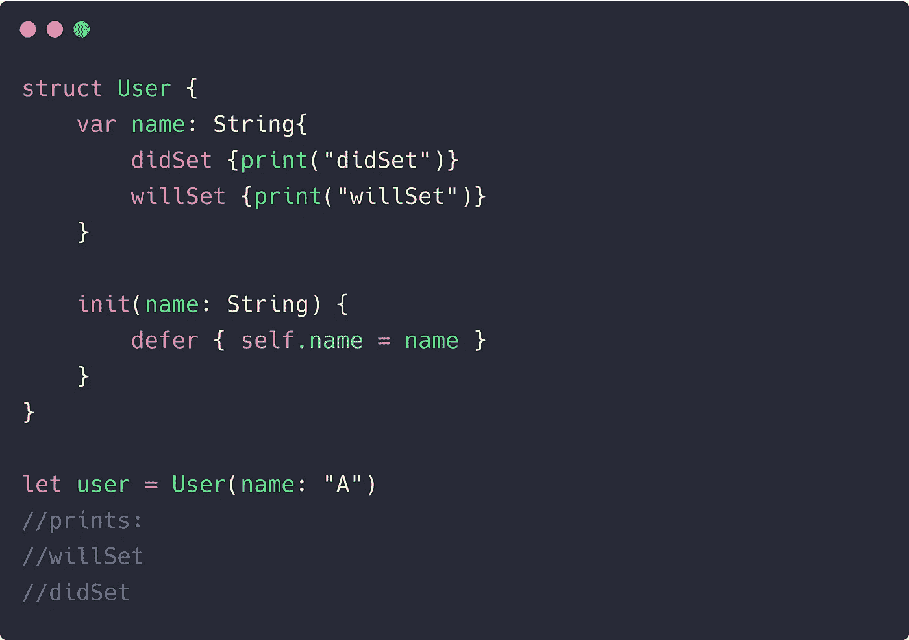
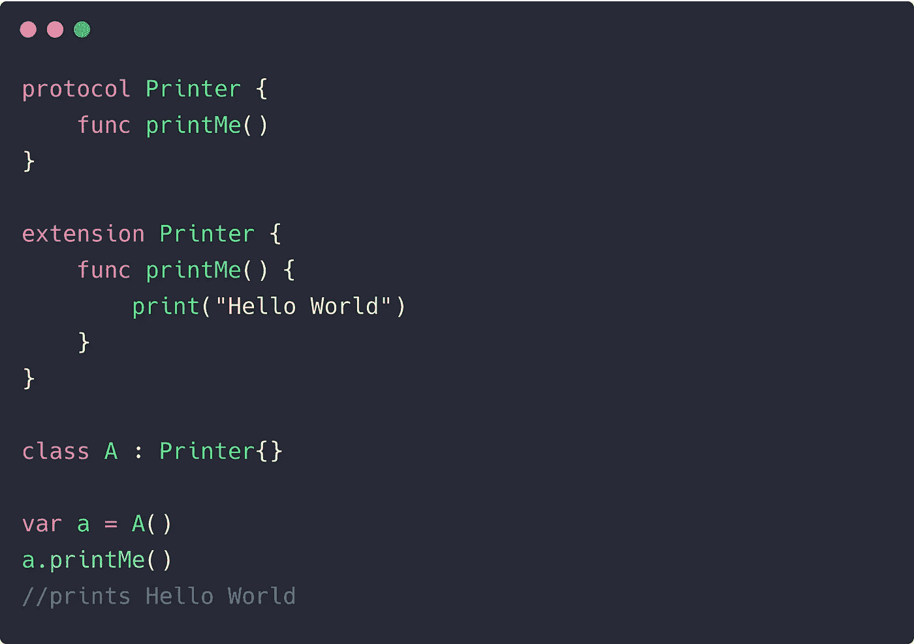
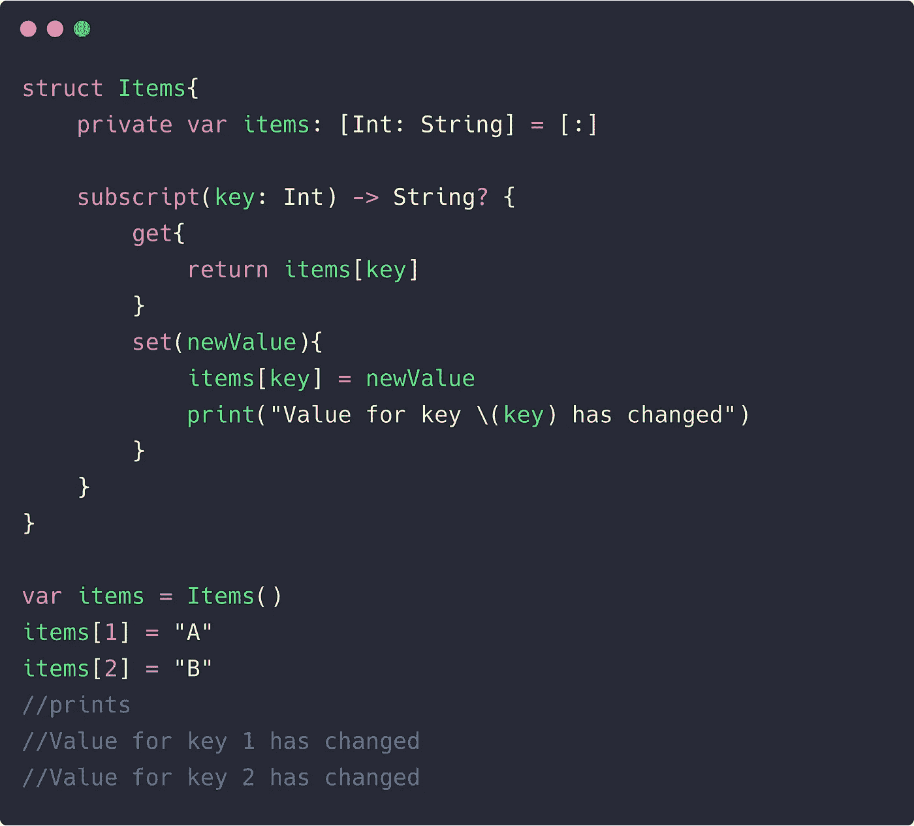
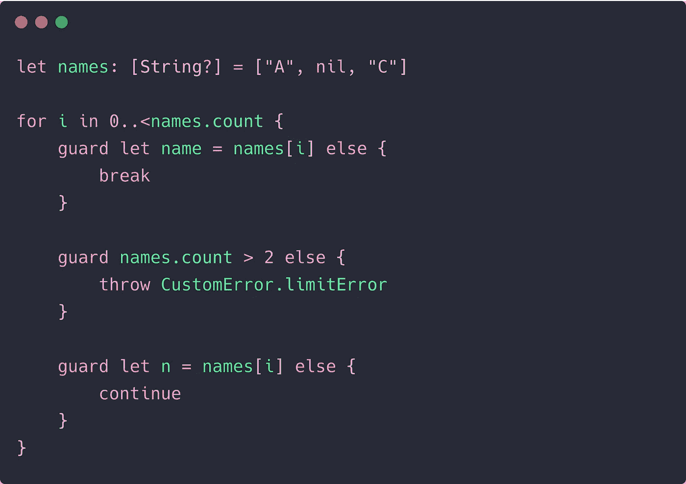

# 6 种快速编写代码的方法

> 原文：<https://betterprogramming.pub/6-swifty-ways-of-writing-code-f260286a0dbb>

## 一些鲜为人知的技巧和窍门来提升你的 iOS 开发技能


照片由[你好我是尼克🎞](https://unsplash.com/@helloimnik?utm_source=medium&utm_medium=referral)开[退溅](https://unsplash.com?utm_source=medium&utm_medium=referral)。

多年来，Swift 经历了显著的发展。它提供了类型安全，并且比许多语言更简洁。随着功能数量的不断增加，了解并跟踪一些很酷的技巧正成为一种挑战。

在接下来的几节中，我将带您了解一些快速编写代码的方法。我希望它能帮助你构建更好的 iOS 应用程序。

# 使用地图安全地打开选装件

通常，我们使用`if let`或`guard let`语法在 Swift 中安全地打开选项。虽然这一切都很好，但有时您希望有一种没有这些括号的方法——尤其是当您打开一个子属性时。幸运的是，我们可以使用 map 操作符打开选项。

在`map`闭包内传递的可选值只有在包含某个值时才会被计算，从而确保它不是`nil`。



在可选元组中使用映射展开也很方便。这里有一个快捷的方法:

```
func sampleTuple() -> (String, String)?{
    return nil
}let (a, b) = sampleTuple().map { ($0, $1) } ?? ("NA", "NA")
```

# 初始化时调用 willSet 和 didSet

简而言之，当属性首次初始化时，`willSet`和`didSet`属性观察器不会被调用。但是您可以通过将初始化包装在一个`defer`语句中来解决这个问题。

尽管这种方法有点儿不太好*因为你必须以某种方式设置一个默认值(在声明中或者在 defer 之外),但是知道这一点还是有好处的:*



# 为默认实现使用协议扩展

Swift 协议很强大，但是它们不允许您指定默认实现。当您希望避免覆盖函数时，这可能会很方便。

此外，您可以在扩展中使用`where`子句来指定某些约束的协议实现。但是要确保不要在代码库中过度扩展协议。



# 轻松跟踪字典中的更改

可能会有这样一种情况，您想知道 Swift 字典中发生了什么变化(可能是为了调试)。单调乏味的方法是改变内容。但是也有一种快速的方法。只需在保存字典对象上定义一个下标，如下所示:



# 在不同范围内使用保护字母

`guard let`语句使用安全的故障优先方法，其中`nil`值确保您立即返回。但有时，使用`return`并不符合我们的最佳利益。例如，你可能在一个 For 循环中，并且只希望`continue`或`break`。很高兴，你可以这样做:



# 使用重新抛出进行强大的错误处理

我们都知道并使用`throws`关键字，但很少在 Swift 中利用`rethrows`的力量。用`rethrows`关键字声明的函数表明，只有当它的一个函数参数`throws`出现错误时，它才会抛出错误。

这意味着如果闭包参数不抛出错误，我们在调用它时就不需要使用不同风格的`try`。Swift 让我们使用这种优雅的方式来显著减少样板代码。正如您在下面的代码中所看到的，我们不需要在`do-catch`块中放置相同的非抛出版本的函数。


# 结论

这一次到此为止。感谢阅读，我希望你喜欢这篇文章。