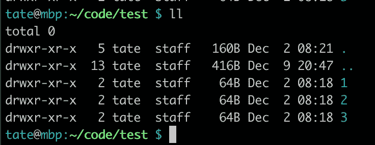

# 你应该知道的 6 个终端命令

> 原文：<https://betterprogramming.pub/6-terminal-commands-you-should-know-8e9767bdfec>

## 从切换您的私人密钥到带有隐藏文件的目录列表


作为一名开发人员，对于一个高效的设置来说，有两件事是至关重要的:*速度和效率。*

完成简单任务(如搜索文件或显示文件内容)花费的时间越多，关键开发时间就越少。在命令行上工作时，别名和自定义函数之类的东西可以加快速度，让您更快地重新开始开发。

如果每次你需要执行基本任务时，你都不得不去一趟堆栈溢出或做一些谷歌搜索，那你可以把时间用在更重要的事情上——比如写代码！

下面是我为完成重复(有时很烦人)的任务而整理的有用命令列表:

# 1.SSH 代理和私钥

```
alias addkey='eval $(ssh-agent) && ssh-add'
```

你有没有在完成一个特性的工作后，试图将你的 Git 修改上传到 GitHub，或者通过 SSH 访问一个远程服务器，却得到一个错误或者密码提示？最有可能的原因是您在某个时候重启了计算机，并且丢失了 SSH 代理(以及任何添加的密钥)。

解决这个问题的一个简单方法是重新启动代理并重新添加 SSH 密钥。您可以将这个别名添加到您的 bash 概要文件中——然后您所要做的就是键入:`addkey`来恢复运行。请随意将“addkey”更改为更适合您风格的名称。

请记住，`ssh-add`命令希望您的密钥放在`~/.ssh/id_rsa`中，以便自动添加。如果您已经重命名了您的密钥或想要添加多个密钥，您可以使用路径作为参数来指定名称，如下所示:

```
ssh-add ~/.ssh/my_special_key
```

您甚至可以将它添加到 bash 配置文件中，以便在每次打开新的终端窗口时执行它！这里有一篇由 Adam Towers 撰写的关于定制你的个人资料的文章。

现在，您再也不会忘记添加您的钥匙了！

# 2.使用 Ping6 进行网络发现

```
ping6 -I en0 ff02::1
```

你听说过 ping，但是它的设计用于 pinging IPv6 地址的(*s*cary*)*brother`ping6`呢？

你可以做同样显而易见的事情，如 pinging IPv6 地址和查看回复，但有更多有用的功能隐藏在引擎盖下——如果你知道去哪里找。

当你将这个特殊的地址(这是一个前缀)传递给`ping6`并指定从哪个接口发送(用你自己的替换`en0`)时，你可以看到谁响应并查看他们的地址。

这对于网络发现很有用，甚至对于访问您放错了地址的系统也很有用。我经常与许多使用 IPv6 地址的设备进行交互，我很难记住它们。能够在本地网络上发送快速命令并“查看周围情况”是非常有用的。

如果你正在努力理解 IPv6 的核心概念(像我一样)，这里有一篇关于 IPv6 和 IPv4 的惊人文章[来自](https://medium.com/coding-in-simple-english/a-beginners-guide-to-ipv4-and-ipv6-anatomy-fcc9444b0d4d) [Joe Cardillo](https://medium.com/u/cb08a5227dd4?source=post_page-----8e9767bdfec--------------------------------) 。

# 3.详细目录列表

```
alias ll='ls -lah'
```

这是一个列出目录内容的常用别名，但是以列表形式显示隐藏文件的速度更快，增加了细节，并且以人类可读的格式显示。因此，不是简单的、无用的输出——像这样:


用简单的“ls”列出目录

您会得到更详细的输出，如下所示:



用详细的“ls”列出目录

您将立即知道哪些项目是目录、它们的用户/组权限、它们有多大以及它们是何时创建/修改的。我一直用它来查看数据何时被写入文件，或者检查谁有权访问特定的目录。整洁！

# 4.当前目录大小

```
du -sch ./*
```

这是一个简单的命令，将列出当前工作目录中每个项目的大小。如果您尝试清理大型文件或目录，这将非常有用。

输出如下所示:

```
148K ./dir1
136K ./dir2
722M ./dir3
 45M ./dir4
8.0K ./dir5
 43M ./dir6
4.0K ./dir7
121M ./dir8
257M ./dir9
  0B ./dir10
1.2G total
```

# 5.查找嵌套文件

```
find . -name <filename>
```

你忘了文件在哪个目录了吗？`find`来救援了！如果你将`<filename>`替换为你正在搜索的文件的名称，那么`find`将在所有目录中(从你所在的目录开始)搜索你的文件。

找到文件后，您将得到类似这样的输出，显示文件所在的位置，以便您可以获取它并继续工作:

```
./dir1/dir2/file.ext
```

有许多方法可以搜索文件。您甚至可以安装其他具有更多功能的专用工具。但是`find`很容易在多个发行版中获得，并且简单易用。

# 6.看

如果你没有用过`watch`，那你就错过了！这个想法很简单，你给*一些要做的事情*和*多久做一次*，它*就会做*。让我们来看一个例子:

```
watch -n 1 'cat test.txt'
```

这告诉`watch`我们想要每秒执行一次`cat`命令。一旦你运行这个命令，屏幕将被重写以显示文件的内容，就像你使用`less`显示它一样。在角落里会有一个计时器，显示每次重新显示的内容。

```
Every 1.0s: cat test.txt                                                                                                          hostname.local: Fri Jan  3 08:57:29 2020line1
line2
line3
```

如果您已经将输出管道化到一个文件中，并希望看到发生的变化，这将非常有用。你也可以`tail -f`这个文件，但是使用`watch`要干净得多，因为屏幕每次都会被重写，watch 会为你轻松处理循环间隔。

默认情况下，这并不是每个发行版都提供的，但是可以通过`apt-get`、`yum`或`brew`轻松安装。

我希望你已经喜欢了这个有用而有趣的终端命令列表！也许你甚至会将其中的一些应用到你自己的工作流程中，以加快速度，提高工作效率。你最喜欢的命令是什么？