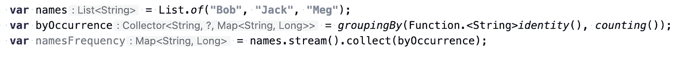

# 我不知道的 6 个 Java 17 特性

> 原文：<https://betterprogramming.pub/6-things-i-didnt-know-about-java-17-dccd36abaa06>

## 文本块、记录类等等


克里斯托夫·高尔在 [Unsplash](https://unsplash.com?utm_source=medium&utm_medium=referral) 拍摄的照片

我清楚的记得 2014 年 Java 8 发布的时候。这是一个巨大的进步，是使 Java 成为函数式编程语言的一个进步，方法引用、函数接口、默认方法、流、空安全选项等等。

但是 Java 已经落后于任何其他现代语言，所以添加这些特性只是追赶，而不是创造一个突破性的特性…

然而，我喜欢新的语言特性，我的同事也是如此！而且，说实话，从那以后我就没有太关注后续版本的新特性了。

不仅公司不愿意升级到 JDK 9 或 10，而且在下一个 LTS(长期支持)发布之前(2018 年 9 月)，我更专注于使用 Scala 和数据处理。

但是在将近 8 年之后，我决定是时候确保我跟上新的语言特性了！在浏览所有更新的过程中，有几个引起了我的注意，它们将像 Java 8 一样改变我的编程方式。

我不会涵盖所有的功能，它们实在是太多了。如题，我选了 6 个我觉得最有趣的，我不知道的！还有一个我还在等待，我们将会看到多久…

这个列表决不是按照任何特定的顺序创建的，但是，每个特性都提到了它所发布的 JDK 版本！

# 局部变量类型推理又名 var

作为 Java 开发人员，我们习惯于显式地指定我们创建的所有变量类型。

我们这些知道如何使用 IDE 来简化过程的人节省了大量的时间，但是我们所有人产生的代码仍然是相当笨重的，并且由于这些不必要的类型而不可读。

一个简单的例子是:

```
List<String> names = List.of(“Bob”, “Jack”, “Meg”);
```

我真的需要左边的类型声明吗？就像我没有想到一个字符串列表会创建`List<String>`一样，对吗？当类型变得更复杂时，就更令人讨厌了

```
List<String> names = List.of(“Bob”, “Jack”, “Meg”);Map<String, Long> namesFrequency = names.stream().collect(Collectors.groupingBy(Function.identity(), Collectors.counting()));
```

随着行越来越长，我们可能想要为`groupingBy`引入一个变量。通过这样做，我们创造了一个怪物:

```
List<String> names = List.of(“Bob”, “Jack”, “Meg”);Collector<String, ?, Map<String, Long>> byOccurrence = Collectors.groupingBy(Function.identity(), Collectors.counting()Map<String, Long> namesFrequency = names.stream().collect(byOccurrence);
```

所以现在我们处于进退两难的境地。这个简单的例子当然可以通过断线来解决，但是事情并不总是那么简单。

借助于 *var* 和静态导入我们可以大大简化上面的例子:

```
var names = List.of(“Bob”, “Jack”, “Meg”);var byOccurrence = groupingBy(identity(), counting());var namesFrequency = names.stream().collect(byOccurrence);
```

我可能应该在这里结束，但我不得不提到类型转换到`var`的一个非常重要的后果。

我们*【失去】*类型。

你知道`names`**`byOccurrence`或者`namesFrequency`是什么类型吗？人们可能会猜测这些类型与示例中的类型相同，但事实并非如此！既然类型是推断出来的我们`String`就输在了`byOccurrence`(编译器怎么会知道`identity()`是`String`？)，于是`namesFrequency`变成了`Map<Object, Long>`！这可以通过显式键入`Function.identity()`来轻松修复:**

```
var names = List.of(“Bob”, “Jack”, “Meg”);var byOccurrence = groupingBy(Function.<String>identity(), counting());var namesFrequency = names.stream().collect(byOccurrence);
```

**但是为了得到一个永久的解决方案，我们需要 IDE 的良好支持！**

**值得庆幸的是，我使用了一个 IDE 来显示推断的类型，这对我来说很容易。**

****

**IntelliJ 显示类型的例子！**

# **文本块**

**我不知道我能不能数清有多少次我在 Java 里因为断长串而差点失去理智。为什么现代语言会支持多行字符串？**

**最后，从 2020 年开始，Java 15 支持文本块！让我兴奋的是，我再也不用打几十个 *"+"* 符号了，但我可以简单地做到:**

```
String myMessage = “””“Hello, Java!”“””;
```

**但是有一个问题(以及其他多个问题，我将在另一篇文章中详细阐述)。文本块仅仅是*块，你不能像这样在一行中使用它们:***

```
String myMessage = “”” “Hello, Java!” “””;
```

**这将导致编译错误，任何现代 IDE 都应该告诉您:**

```
Illegal text block start: missing new line after opening quotes
```

**这让我很难过，这意味着我们仍然必须避开引号:**

```
String myMessage = “\”Hello, Java!\””;
```

****switch 现在是一个表达式。****

**老实说，多年来 switch 表达式有太多的改进，无法在这一小段中解释它们。我将只关注最重要的一点。**

**您是否曾经在 Java 面试中遇到过一个棘手的问题:下面的代码块会打印出什么？**

**答案应该永远是“今天是周末，我拒绝工作。”因为没有指定`break*;*`。**

**Java 14 将`switch`带到了下一个层次。它不再是一个简单的语句，而是一个表达式，所以它可以返回值！通过这种改进，我们不再需要考虑`break;` :-)。**

**你有没有注意到`switch`产生了一个可以赋给变量的值？多酷啊。**

**请继续关注关于开关表达式的更深入的文章！**

# **模式匹配**

**我个人是模式匹配的爱好者。当我可以键入一个简单的 switch/match-case 语句并获得我期望的值时，我喜欢这种灵活的编程方式。Scala 以我所期望的每一种现代语言的方式来做这件事。**

**Java 仍然远远落后于 Scala，但是最近引入了一些增强，不幸的是,“真正的”`switch-case`模式匹配仍然处于预览阶段(从 Java 17 开始)。**

**自从 Java 16 发布以来，现在唯一存在的模式匹配是`instanceof`模式匹配。模式匹配的 instanceof 是什么意思？让我们看一个 Java 16 之前的“典型”例子:**

```
if (obj instanceof String ) { String s = (String)obj;}
```

**有了这项新功能，它就变成了:**

```
if (obj instanceof String s) {
    // your code here}
```

# **密封类**

**密封类在某种意义上非常类似于 final 类。差别非常微妙——final 类根本不能扩展(不能有子类),只有类可以是 final，接口不能成为 final——这没有意义。**

**`sealed`关键字加上`permits`关键字允许一个类或一个接口只能由一组指定的类或接口来扩展或实现。下面举个例子:**

```
sealed interface Animal permits Reptile, Bird, Mammal, Fish {}
```

**要记住的一件非常重要的事情是，扩展一个密封的类或接口需要使用`sealed`或`non-sealed`关键字！简单地解封它并允许它被子类化:-)。**

**类是枚举的完美替代品，但是要充分利用它们的能力，我们需要等到 switch 的模式匹配可以生产时。**

# **记录类别**

**我把最好的留到了最后。尽管这看起来不是一个巨大的改进，但它极大地提高了开发人员的工作效率。对于那些有 Scala 背景的记录类来说，非常类似于 case 类。**

**有了 Java 16 中引入的记录类，我们可以避免所有不必要的样板代码，突然之间:**

**变成了这样:**

```
record Person (int age, int height) {}
```

**是不是很酷？！是的，花括号必须在那里——真扫兴。准确地说，record 类甚至比我之前提供的例子还要好。我们不再需要考虑添加`hashCode()`、`equals()`、`toString()`——它们通常很容易由喜爱的 IDE 生成，但仍然需要每次添加新字段时进行手动干预。对我来说，这是一个期待已久的功能！**

**这绝不是一个详尽的特性和增强列表，我只列出了我最喜欢的和我将尽快开始使用的。**

**关于记录的深入描述，请查看我的另一篇文章 [Java 记录深度](https://konradtendera.medium.com/java-16-introduces-a-new-language-feature-called-records-267f7ccd3778)**

**我错过了什么重要的改进吗？你最喜欢的功能是什么？让我知道。**