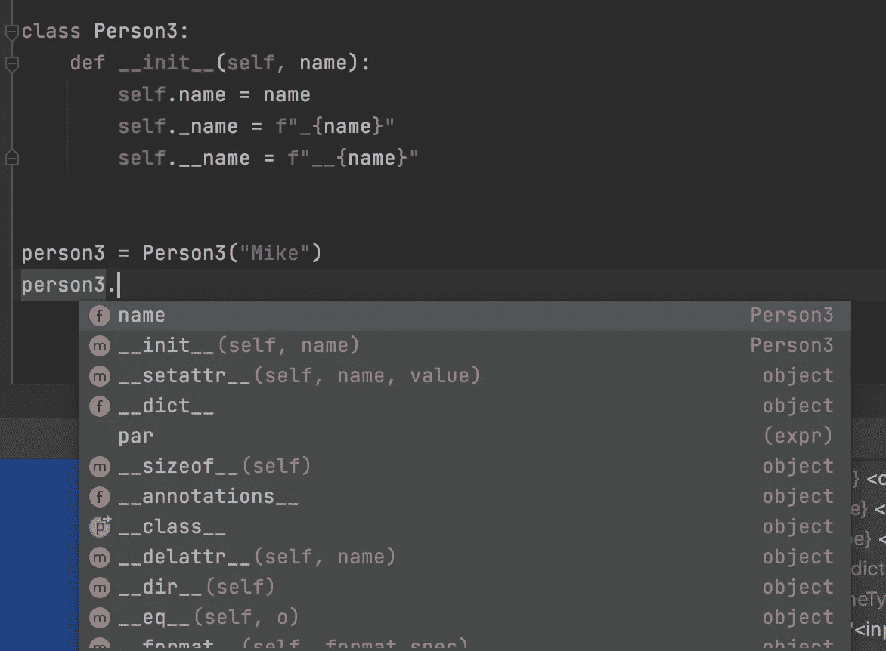

# 关于访问 Python 属性要知道的 6 件事

> 原文：<https://betterprogramming.pub/6-things-to-know-about-accessing-python-attributes-b7da11525a8e>

## 以正确的方式编写和使用 Python 属性


由[扬·坎迪](https://unsplash.com/@jancanty?utm_source=medium&utm_medium=referral)在 [Unsplash](https://unsplash.com?utm_source=medium&utm_medium=referral) 拍摄的照片

从本质上讲，Python 是一种面向对象的编程(OOP)语言。Python 中的一切——模块、类和实例——都是对象。一个基本的构建特性是每个对象拥有不同的属性。如果你来自其他 OOP 语言，你可能习惯于 setters 和 getters。然而，这在 Python 编码中并不常见。然而，这是一个你应该知道的基本话题。在本文中，我想回顾一下关于访问属性的六个要点。

# 1.使用属性装饰器进行封装

封装是一种编程风格，它将对外公开的功能与内部实现细节分开。有些人可能习惯于以下编码模式:

Getters 和 Setters

在这个模式中，我们使用适当的函数来检索和设置属性值。这个想法是隐藏属性名是如何在内部管理的。然而，这种模式更适合内置的属性装饰器。考虑下面修改后的代码。

物业装饰

属性装饰器的使用允许您使用点符号访问和设置属性，而不是像前面代码片段中的实现那样调用函数。对比如下所示。

```
>>> person = Person("Mike")
>>> person.get_name()
'Mike'
>>> person.set_name("Mike Smith")
>>> 
>>> **# Dot notation with the attribute**
>>> person1 = Person1("Mike")
>>> person1.name
'Mike'
>>> person1.name = "Mike Smith"
```

## 2.尽可能直接访问

虽然从典型的 OOP 角度来看，属性装饰器对于为 setters 和 getters 提供封装很有用，但是过度使用它会使代码库变得不必要的复杂。在大多数情况下，最好直接访问和设置属性。

你希望你的代码是可读的。如果两者都能解决问题，那么更少的代码几乎总是比更多的代码好。所以，除非有特别的原因，直截了当总是一个好习惯。考虑下面的替代方案，是不是简洁多了？

属性的直接访问

# 3.对“非公共”属性使用下划线

尽管在大多数情况下，直接访问属性是首选，但是如果您正在创建一个公共的 Python 模块，您可能希望将一些属性设为“非公共的”这将减少模块最终用户的困惑。换句话说，您希望最终用户能够访问由他们选择的 ide 提示的“公共”属性。

考虑以下更新版本的`Person`类:



隐藏非公共属性

如你所见，在`PyCharm`中，属性`_name`和`__name`不在`person3`实例的自动完成建议列表中。然而，如果我们坚持访问这些属性——我们可以在 Python 中这样做；我在上面的“非公共”和“公共”属性中使用引号，因为 Python 并没有真正区分公共和非公共属性——理论上，一切都是公共的。

```
>>> person3 = Person3("Mike")
>>> person3._name
'_Mike'
>>> person3._Person3__name
'__Mike'
```

需要注意的一点是，当您在属性名前面使用两个下划线时，名称将会与类名混淆。在这种情况下，`__name`属性将改为由`_Person3__name`访问。

# 4.明确实例属性

Python 不限制定义实例属性的位置。甚至可以在类定义的范围之外设置属性。然而，在类定义中明确适用的实例属性是一个很好的实践，因为代码的读者会理解你的类有什么属性。更具体地说，应该在`__init__`方法中提供实例属性。

显式实例属性

*   上面的代码片段向您展示了相同功能的两种可能的实现。
*   `Person5`比`Person4`好，因为它明确了可能的实例属性，即使`relative`属性的初始值被设置为`None`。但是你的代码的读者会理解这个属性在代码中的某个地方是有用的。

# 5.属性设置的值验证

有时，我们希望验证是否可以为特定属性设置某些值。有几种方法可以做到这一点。一种是将属性实现为属性。下面的代码向您展示了这样的实现。

属性验证

正如您在代码片段中看到的，我们检查设置 age 属性的值是否小于零——当值无效时，我们将引发一个错误。当它有效时，我们可以设置属性值。这种检查防止了任何可能的数据错误。

另一种方法是覆盖`__setattr__`方法。然而，如果你不熟悉这种特殊的方法，不推荐这样做。它只有在您想要管理多个属性时才有用，这不是一个常见的用例。如果您想要管理几个属性，只需使用属性装饰器方法，如上所述。进一步说，下面的代码提供了一个概念证明，说明我们如何在设置属性值之前检查它:

覆盖 __setattr__

*   我们检查设置任何属性的键为`age`时的值。
*   请注意，即使在实例初始化期间，也会调用这个特殊的方法。这就是为什么会打印“将年龄设置为无”消息的原因。
*   您还需要使用`super()`来设置属性。使用超级方法很重要，否则，你会因为重复调用类本身的`__setattr_`而陷入无限循环。

# 6.谨慎使用猴子补丁

Monkey patching 是一种向现有代码库添加自定义行为的编程技术。换句话说，就是随时修改一些预定义的功能。这可能会产生产生冲突的副作用。以下代码向您展示了一个简单的示例:

猴子补丁

*   不知何故，您在两个不同的地方使用同一个实例为方法属性`speak`分配了两个不同的函数(`foo`和`bar`)。
*   第二次分配将覆盖先前的设置。在这种情况下，`person8`实例将采用`bar`函数中定义的功能。如果您检查 speak 属性的签名，您会发现以下信息:

```
>>> person8.speak.__name__
'bar'
```

这个例子并没有说你不应该使用猴子补丁。实际上，它在你的程序开发过程中会很有帮助。在某些情况下，您可能已经创建了正在使用的类的实例。不知何故，你修改了一个特定的方法。在这种情况下，您可以在控制台中运行该方法，并将其分配给现有的实例，这允许您继续使用原始流。

# 结论

在本文中，我们回顾了在 Python 中访问属性的六个有用的技巧。当然，还有许多其他的提示。请随意分享你的，我们一起学习可以写出更好的 Python 代码！

感谢阅读这篇文章。