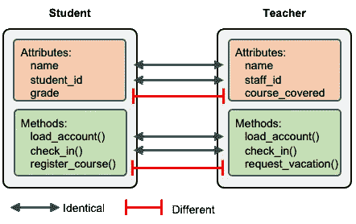
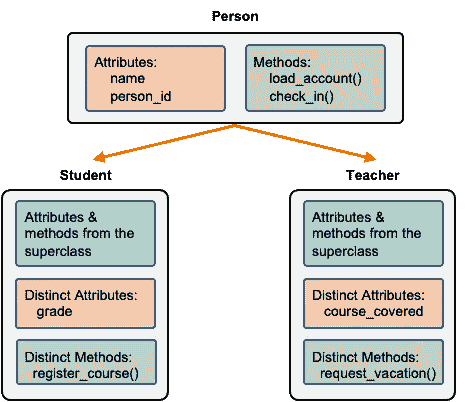
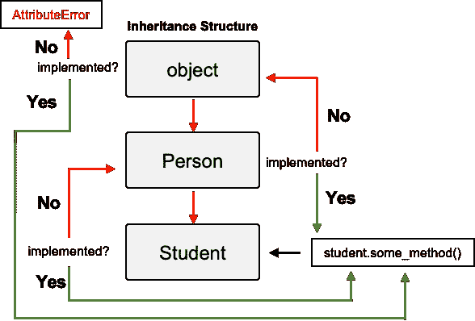
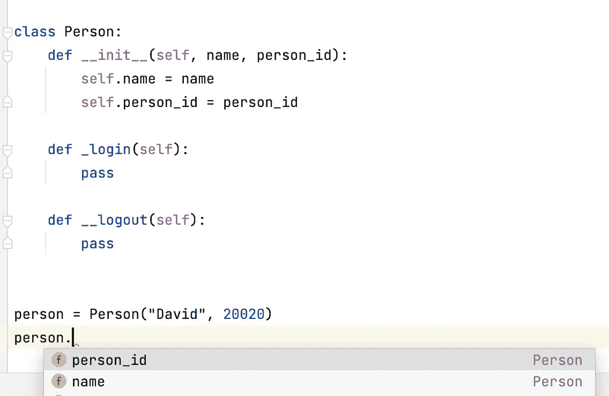

# 关于 Python 中的子类化要知道的 6 件事——为什么和如何

> 原文：<https://betterprogramming.pub/6-things-to-know-about-subclassing-in-python-why-and-how-296003b62a75>

## 触及 Python 作为面向对象语言的一些核心特性


罗伯特·科林斯在 [Unsplash](https://unsplash.com?utm_source=medium&utm_medium=referral) 上拍摄的照片

从本质上讲，Python 是一种面向对象的设计语言。它将所有东西都实现为对象、包、模块、类、函数，当然还有类的实例对象。当我们构建我们的应用程序时，我们通常必须创建定制的类来将相关的数据和功能捆绑在一起——这是解决编程问题的典型 OOP 方法。

随着项目范围的扩大，几乎不可避免地需要创建子类。在本文中，我想强调一些您在定义子类时应该注意的特性/注意事项。请注意，我没有对你的知识水平做任何假设，所以我可能会涉及非常基础的东西，但是这些要点应该足以让你开始子类化。

事不宜迟，让我们开始吧。

# 1.我们为什么要子类化？

首先，我们为什么要创建子类呢？当我们决定创建一个子类时，我们应该意识到我们要创建的不仅仅是一个子类——如果是这样的话，我们就不应该创建子类，因为我们可以简单地在初始类上工作。换句话说，当我们需要创建子类时，我们应该有创建至少两个共享同一个超类的子类的需求。如果你没有发现，我认为你不应该子类化。

上面的段落似乎在谈论“后果”——在你已经创建了一个子类之后你要检查的事情。如果我们退后一步，我们应该想知道什么时候创建子类。

假设我们正在做一个项目，为人们创建一个在学校使用的应用程序。我们知道学校里有两类人:学生和老师。因此，我们创建了两个类来管理每个类别的数据。这两个类的一些基本结构如下所示。

学生和教师(分开上课)

在`Student`类中，我们定义了三个属性:`name`、`student_id`和`grade`以及三个实例方法:`register_course`、`load_account`和`check_in`。在教师类中，我们还定义了三个属性:`name`、`staff_id`和`course_covered`，以及三个实例方法:`request_vacation`、`load_account`和`check_in`。可以看出，这两个类共享相似的属性和方法，下图提供了直观的总结。



师生关系

在上图中，我们注意到这两个类在很大程度上是相似的，这种多个类之间的相似性是创建超类的基础。

请注意，实际上，您的类可能比图中所示的更复杂。但是要观察的最重要的事情是，当两个或更多的类共享重叠的功能时，您应该考虑创建一个超类，它反过来处理这些共享的功能。

> 创建子类最重要的好处是我们使我们的代码更加结构化——更加清晰和易于维护。也就是说，不是在单独的类中实现每个功能，而是将共享的实现放到超类中，这样更容易维护。

# 2.超类的基本框架

我们现在知道了创建超类的基本原理。显而易见的第一个问题是我们应该给我们的超类取什么名字。在大多数情况下，我们可以简单地从名词或语义的角度。由于学生和老师都属于更大的“人”的概念，我们可以将超类命名为`Person`。

在`Person`类中，我们期望超类应该捕获子类的共享功能:`Student`和`Teacher`。因此，为了帮助我们定义超类的结构，如果您可以创建一个图表，向您展示超类的基本框架，以及子类的框架，而现在不指定任何实现细节，将会很有帮助。



超类——子类的结构

如您所见，我们将共享属性:`name`和`person_id`(结合了`student_id`和`staff_id`)和共享方法:`load_account`和`check_in`放在超类中。显然，不同的属性和方法应该在子类中实现:`Student`和`Teacher`。

# 3.创建超类

在上一节中，我们有一个关于超类和子类之间共享和不同功能的相对安排的计划。现在，是时候开始为超类编写代码了。在我开始解释之前，让我们看看下面的代码。

超类——人

在超类的初始化方法中，我们只包含了`Student`和`Teacher`共有的两个属性:`name`和`person_id`。同时，我们只定义子类共享的方法:`load_account`和`check_in`。

> 因此，定义超类的关键是定义子类应该继承的属性和方法。

# 4.重构子类

在我们布局了超类`Person`的基本实现之后，现在是后退一步重构我们最初的`Student`和`Teacher`类，因为它们现在应该按照计划从`Person`类继承。

## 定义子类

对于一个现有的超类，定义一个超类涉及到以下语法:`class Subclass(Superclass)`。应用此表，我们可以为`Student`和`Teacher`类创建以下标题。

```
class Student(Person):
    passclass Teacher(Person):
    pass
```

## 继承属性和方法

到目前为止，我们在学生和教师的主体中没有任何代码。但是子类化允许子类继承我们在超类中定义的所有属性和方法。这正是子类化的主要优势——超类的子类可以立即获得共享功能，而子类化不需要做任何事情。让我们来观察这个效果:

```
student = Student("David", 20020)
student.load_account(50)teacher = Teacher("Ashley", 1000033)
teacher.load_account(100)
```

正如你所看到的，我们可以使用超类中定义的构造函数创建一个`Student`类的实例，并在这个实例上调用`load_account`方法。我们可以用`Teacher`类做同样的事情。

## 重写初始化方法

在许多情况下，我们需要覆盖子类中的初始化方法，因为我们可能拥有比超类中定义的更多的属性。让我们先看看代码，仅以`Student`类为例，您可以将相同的技术应用于`Teacher`类。

```
class Student(Person):
    def __init__(self, name, student_id, grade):
        super().__init__(name, student_id)
        self.grade = gradestudent = Student("David", 20020, 3)
print(student.__dict__)# output: {'name': 'David', 'person_id': 20020, 'grade': 3}
```

在`__init__`方法中，我们可以像在自定义类中一样初始化 grade 属性。除此之外，最值得注意的是我们通过调用`super().__init__(name, student_id)`来使用超类的初始化方法。调用`super()`会创建一个引用超类(`Person`)的代理对象，这样我们就可以通过发送`name`和`person_id`来使用超类的初始化方法。您可能知道这一点，但这只是一个友好的提醒，调用`__init__`不会获得任何返回值，它只是简单地设置初始化属性。

## 覆盖其他方法

当你需要覆盖其他方法的时候，和覆盖`__init__`没有太大的区别。如果您需要完全覆盖一个方法，您可以通过使用`super()`只编写方法的主体，而不调用超类的方法。因为**方法解析顺序(MRO)** ，您可以定义该方法，就像在超类中没有相同方法的实现一样，这将在下面讨论。

如果您部分覆盖该方法，您可以使用`super()`来重用与超类相同的实现，如下所示。

更新的学生班级

在更新的`Student`类中，我们现在实现了`check_in`方法。值得注意的是，我们使用`super()`来创建一个代理对象，它是超类的实例对象，这样我们就可以在这个代理实例对象上调用超类的实例方法。因此，`super()`的独特之处在于**不仅可以创建超类的代理对象，还可以是超类实例的代理对象，让您可以访问实例方法。**

# 5.了解 MRO

当你有一个类层次结构(超类-子类)时，当你在子类的一个实例上调用一个方法时，你可能想知道这个方法是如何被调用的。例如，你的子类可能实现超类没有的方法，或者实现超类也实现的方法。

我们如何知道使用了哪个实现？这就是 MRO 的概念发挥作用的地方——它决定了如何按照特定的顺序解决方法。下图显示了 MRO 的工作原理。



MRO 流

正如您所看到的，当您调用一个方法时，比如说`some_method`，Python 首先试图通过在`Student`类中定位它来解析它。如果实现，则使用此实现。如果没有，它尝试去`Student`的超类`Person`，如果实现了，它就解决了。否则，它将上升到 object 类，默认情况下，所有自定义类都从 object 类继承。如果仍未解决，升起`AttributeError`。

您实际上可以通过调用类上的`mro`方法来检查类的 MRO，这将按照方法被解析的顺序给出类的列表。

```
>>> Student.mro()
[<class '__main__.Student'>, <class '__main__.Person'>, <class 'object'>]
```

> 如你所料，顺序与上图所示的一致，对于`Student`类，它是`Student`->-`Person`->-`object`。

当您有多个继承时，您也可以通过调用`mro`方法来找出 MRO。请注意，拥有多个继承通常不是一个好主意，这会使您的代码库变得复杂。换句话说，最好使用单一继承。

# 6.使用受保护的私有方法

在 OOP 中封装数据的一种方法是创建受保护的私有方法。虽然 Python 并不真正使用公共和非公共方法的概念/关键字，但是我们可以通过在方法名前面加上一两个下划线来创建受保护的和私有的方法，如下所示。

```
class Person:
    def __init__(self, name, person_id):
        self.name = name
        self.person_id = person_id def _login(self):
        pass def __logout(self):
        pass
```

在上面的代码片段中，`_login` 是一个受保护的方法，而`__logout`是一个私有方法。这两个方法都是非公共的，这意味着它们不打算由类外的用户调用，并且当您使用 ide(使用 PyCharm 的图)时，可以注意到这一点，其中通过自动完成提示来提示可用的方法，如下所示:



没有非公共方法的提示

受保护方法和私有方法之间的区别不仅仅是使用一两个下划线，另一个重要的区别是它们在类的子类中的可访问性。**您可以调用超类的受保护方法，但不能调用私有方法。**下面可以观察到这个效果。

```
class Student(Person):
    def test_login_logout(self):
        self._login()
        self.__logout() student = Student("David", 20020)
student.test_login_logout()# ERROR:
**AttributeError: 'Student' object has no attribute '_Student__logout'**
```

从打印输出中，我们可以看到`_login`被调用，没有任何问题。但是，`__logout`不能被调用，提高了`AttributeError`。如果我们仔细观察，我们注意到它不是试图调用`__logout`，而是试图调用`_Student__logout` 。这看起来很奇怪，但它被称为**名称篡改**功能。也就是说，当你定义一个私有方法时，假设它在一个名为`Data`的类中被命名为`__private_method`，这个方法被命名为`_Data__private_method`。

> 由于它们在子类中的不同可访问性，如果您希望它们在子类中使用，您应该定义受保护的方法，如果您不希望子类使用它们，您应该改为定义私有方法。

# 结论

在本文中，我们回顾了在 Python 中定义子类的要点。本质上，在类层次结构中，有一个超类，在其中定义共享的属性和方法。

你应该有多个继承自这个超类的子类——如果你注意到你只使用了一个子类，这是不对的——没有必要一开始就创建一个超类。