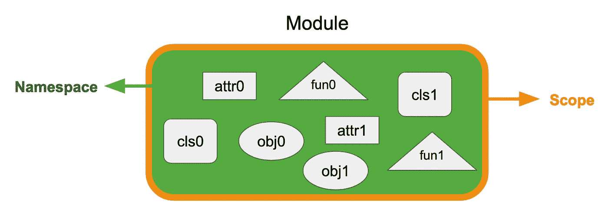
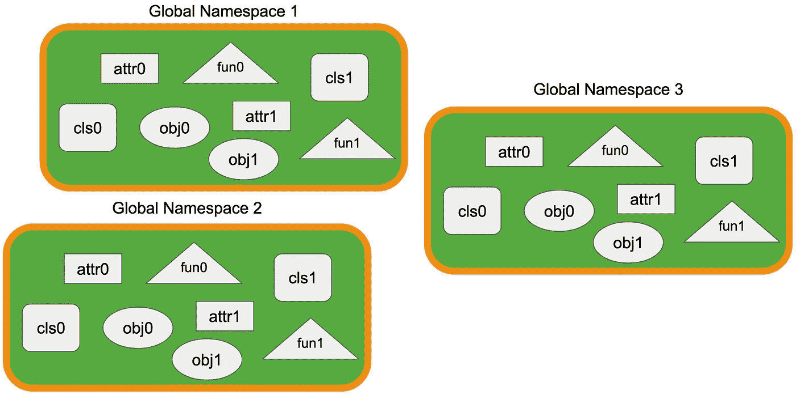
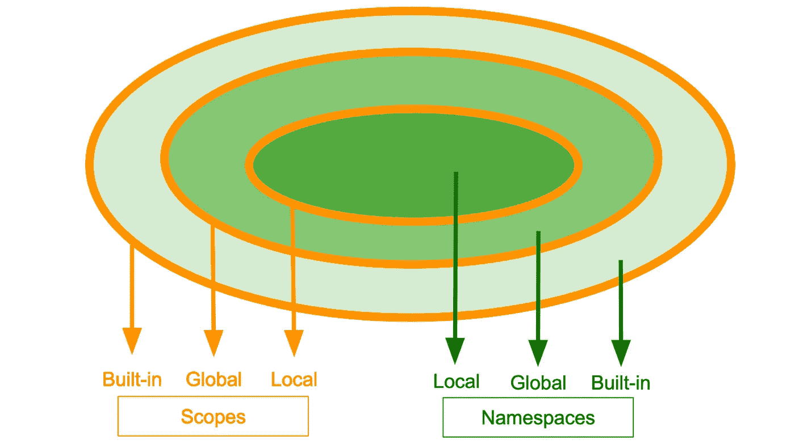
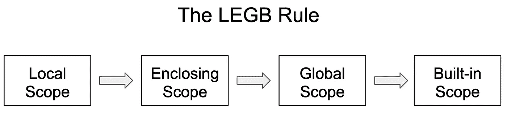

# 揭开 Python 中名称空间和作用域神秘面纱的 6 件事

> 原文：<https://betterprogramming.pub/6-things-to-know-to-demystify-namespaces-and-scopes-in-python-f5353c7ff56f>

## 让我们改进我们的代码范围和组织

照片由[格雷戈·拉科齐](https://unsplash.com/@grakozy?utm_source=unsplash&utm_medium=referral&utm_content=creditCopyText)在 [Unsplash](https://unsplash.com/s/photos/space?utm_source=unsplash&utm_medium=referral&utm_content=creditCopyText) 上拍摄

当我教 Python 编码时，名称空间和作用域是我注意到困扰我的许多学生的棘手概念之一。他们大概知道这个概念，但是当我要求他们解释它到底是什么的时候，他们被卡住了，不能把这个概念和一些相关的用法联系起来。

在本文中，我将回顾六个关键点，如果适用的话，使用每个关键点的相关示例。在本教程结束时，我希望您能更好地理解名称空间和作用域——一个与名称空间密切相关的概念。

命名空间的命名方式没有任何歧义。名称是标识符，空间是结构或组织。我们可以将名称空间类比为花名册，花名册使用个人的名字来跟踪成员。在名称空间方面，我们使用名称来跟踪对象。

但是 Python 中的对象是什么呢？

你可能听说过 Python 中的一切都是对象。当我们编写 Python 程序时，我们定义自定义的类和模块；构建列表、词典和其他自定义实例。并创建函数。这些类、模块、实例甚至函数都是 Python 中的对象。

像用于跟踪成员的花名册一样，名称空间是 Python 的内置机制，用于跟踪对象，如实例对象和函数。

# 2.名称空间被实现为字典

如上所述，名称空间使用标识符来跟踪特定对象。这听起来是不是有点耳熟？

你的直觉是对的。这种映射机制是我们在一个特定的 Python 内置数据结构中使用的:字典。虽然名称空间本身是一个抽象概念，**但是它们的具体实现使用了 Python 中的字典。**

作为字典实现的名称空间

如上面的代码片段所示，我们使用内置的`globals()`函数来显示标识符，以及它们在当前名称空间中各自的对象。您可以看到这个字典包括定义的列表、函数、类、实例对象和其他内置对象。

除了将`globals()`函数作为全局名称空间跟踪**模块中的对象之外，我们还可以使用`locals()`函数作为局部名称空间**跟踪**函数中的对象。正如您在`foo()`函数调用中看到的，我们可以看到局部变量`b`被局部名称空间跟踪。**

顺便提一下，我们可以使用`locals()`函数来显示模块的全局名称空间的跟踪对象，使用`globals()`函数具有相同的效果。相比之下，当在函数中调用`globals()`函数时，它仍然会显示全局名称空间跟踪的对象，在这种情况下，它是模块。

# 3.名称空间是动态的

名称空间用于跟踪对象。在我们的 Python 编码中，如果我们选择这样做，我们会一致地创建对象并删除一些我们不使用的对象。换句话说，名称空间是动态的。

让我们用一个简单的例子来说明名称空间的动态特性。假设我们有下面的模块。为了清楚起见，我们将使用`keys()`函数只显示全局名称空间的字典的键。如下面的代码片段所示，我们能够在全局名称空间中添加和删除变量。

动态名称空间

除了名称空间内的变化之外，名称空间的动态性也可以通过名称空间可以是临时的这一事实来反映。例如，调用一个函数会创建一个本地名称空间，它映射函数内的对象，当函数调用结束时，这个名称空间就消失了。

# 4.名称空间有边界:范围

一开始，我们说过名称空间就像花名册，因为两者都用来跟踪它们的成员。它们还有一个共同的特点:**界限**。名册上的成员属于同一个董事会、委员会或组织，而名称空间中的对象有其指定的限制。

在许多教程中，作用域是与名称空间一起讨论的。但是它们中的大多数对初学者来说太专业了，难以理解。在这里，我提出了一个可能更简单的建议。

模块的名称空间和范围

如上图所示，假设我们有一个模块，有一堆定义好的对象，包括一些属性(如`attr0`)、自定义类(如`cls0`)、函数(如`fun0`)和一些实例(如`obj0`)。

名称空间跟踪这个模块中的所有对象，这个模块可以看作是这些对象的容器。因此，我们可以将名称空间概念化为容器的内部空间，其中填充了不同的命名对象，如上面的绿色所示。

范围是容器的整个封闭结构，定义了模块的边界，如上面的橙色所示。使用更技术性的解释，**作用域是特定对象可被其他对象和操作访问的边界**。换句话说，假设我们在上面的模块中运行一个使用`attr0`的函数，如果这个函数没有访问作用域的权限，那么`attr0`就不能使用。

我们来看一个具体的例子。假设我们创建了一个名为`namespaces_student`的模块，如下面的代码片段所示。我们简单地声明了一个名为`working_hard`的布尔变量，以及一个名为`Student`的定制类，并带有一个名为`study()`的实例方法。

名称空间 _ 学生模块

当我们使用我们的解释器时，它默认当前模块为主程序。(顺便说一句，这就是为什么上面的全局名称空间的字典有`“__main__”`作为`__name__`键。)一开始，我们不能访问`working_hard`变量，因为我们在模块之外。然而，在导入之后，我们就可以访问这个变量了。尽管如此，我们必须使用模块名作为前缀，这是模块边界存在的另一个标志。此外，通过导入该模块，该模块已经成为主程序的一部分，正如调用`globals()`函数的输出所示。

名称空间的边界

名称空间边界的另一个含义是，当多个模块具有相同名称的属性时，我们应该用模块名称作为属性的前缀，以防止代码中的任何歧义。例如，如果导入的模块`a`和`b`具有相同的属性，即`shared_attribute`，我们应该使用`a.shared_attribute`或`b.shared_attribute`来具体说明。否则，一个属性会遮蔽另一个属性(参见下面关于变量遮蔽)。

因此，应该注意，名称空间是分离的实体，每个名称空间都有自己的边界或范围。下图显示了这一特征。

名称空间之间的独立关系

# 5.名称空间和范围都可以是分层的

正如上一节所讨论的，名称空间可以有独立的关系，我们可以将其概念化为这些名称空间的水平视图。如果我们从垂直的角度看它们，它们会是什么样子？

当我们启动 Python 解释器时，一些内置的数据类型(如`list`、`tuple`)和函数(如`print()`、`id()`)已经可供我们使用，因为它们是**内置名称空间**的一部分。当我们创建模块时，我们将使用`globals()`函数，拥有**全局名称空间**，如上例所示。当我们创建函数时，我们将拥有**本地名称空间**。

当创建这些名称空间时，它们对应的范围也会自动创建。名称空间的一个重要特征是它们具有层次关系。类似地，作用域具有相同的层次结构。

分层命名空间和范围

如上图所示，**内置命名空间和作用域**包含**全局命名空间和作用域**，全局命名空间和作用域又包含**局部命名空间和作用域**。

# 6.理解 LEGB 规则

我们已经介绍过，作用域是决定它们所包含的对象的可访问性的边界，并且作用域具有层次关系，这将我们带到 LEGB 规则的讨论——该规则**定义了作用域的顺序，Python 解释器按照该顺序为任何给定的操作(例如，访问属性、调用函数)解析名称(例如，变量、函数)**。

具体来说，LEGB 是局部、封闭、全局和内置范围的缩写。之前，我们已经讨论了什么是局部、全局和内置作用域。但是封闭的范围是什么呢？

让我们用下面的例子来帮助你理解什么是封闭作用域。如图，我们有一个函数叫`outer_function`，它有一个嵌套的函数叫`inner_function`，自己创建一个局部作用域。对于`inner_function`，`outer_function`的范围是**封闭范围** — 字面上封闭内部函数。

封闭范围

调用`outer_function`将为`a`、`b`和`c`产生 11、2 和 3。我们进一步注意到，`outer_function`函数的返回值是调用`inner_function`函数的返回值。在局部范围内，我们有变量`c`，但是没有`a`和`b`。所以解释器继续向上一个范围查找，在封闭范围中，它定位`a`和`b`并通过打印所有这三个变量完成函数调用。

如果它找不到需要的变量，解释器将进入全局和内置范围。如果仍然找不到需要的变量，解释器将产生一个`NameError`,表明相关变量没有定义。

因此，LEGB 规则定义了给定名称的**查找顺序，如下图所示。**

名称查找顺序

需要注意的一点是，如果一个变量位于一个较低的作用域，解释器将在那里停止，而不会升级到下一个作用域。在上面例子中的变量`a`的情况下，调用`outer_function`的打印值是 11，这是在`inner_function`的封闭范围中定义的值。如果我们在主程序中打印变量`a`，我们会注意到值是 1，这是在全局作用域中定义的值。这种现象被称为**名遮蔽**或**变遮蔽**。

# **外卖**

这篇文章并不是关于这个主题的详尽的教程。一些相关的主题，比如全局和非局部关键字，可以在我的下一篇文章中探讨。然而，我们已经回顾了与理解 Python 中的名称空间和范围相关的基本方面。

*   名称空间使用字典来跟踪带有标识符的对象。
*   名称空间可以动态创建和移除。
*   名称空间有边界或范围，它们定义了可以查找名称的区域。
*   名称的查找遵循 LEGB 规则。