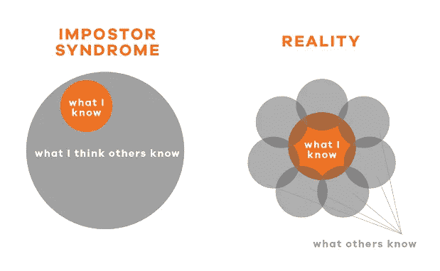
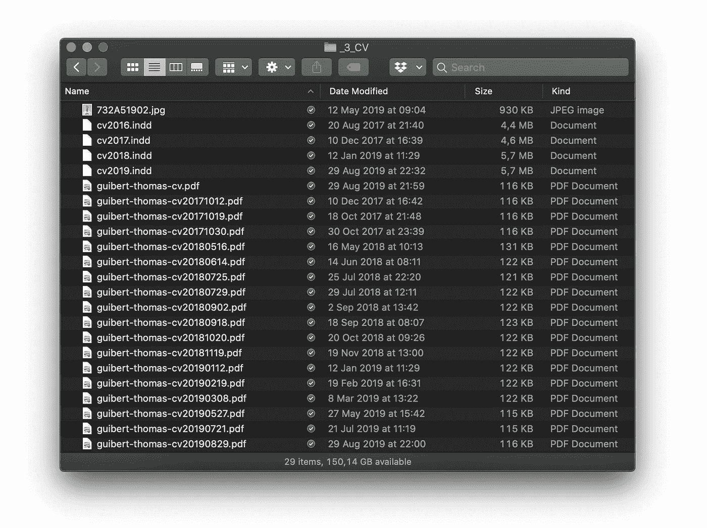

# 开发人员处理冒名顶替综合症的 6 个技巧

> 原文：<https://betterprogramming.pub/6-tips-for-developers-to-handle-imposter-syndrome-7473ea7924f6>

## 对我有效的东西

与 Raj 在 [Unsplash](https://unsplash.com?utm_source=medium&utm_medium=referral) 上的[公路旅行照片](https://unsplash.com/@roadtripwithraj?utm_source=medium&utm_medium=referral)

*   "我的每一次成功都没什么大不了的，都是因为运气."
*   “我觉得自己像个冒牌货，因为我还不知道[xxx]。”
*   “每一次失败都是因为我缺乏专业知识，我应该放弃。”
*   "在那个话题上我缺乏经验，我最好保持沉默。"

嗨！你不是一个人…我也经历过这种情况，很多开发人员也患有冒名顶替综合症！我将对你说实话。我用了一年多的时间来背书开发者这个职称。

在我受雇为开发人员的第一年，我从未像现在这样觉得自己是个骗子。当然，尽管我有自己的知识，但我周围的每个开发人员都觉得他们比我更有才华。

这是一个问题，当你不断试图把自己和别人比较。每个人似乎都比你强。出于对同事的尊重，我觉得自己还不配拥有这个头衔。

> 有多少天我回家后感觉像个骗子？很多。
> 这有道理吗，至少有一次？没有。

今天想起这些真的很荒谬。我在想什么？就因为我没有他们一样的专业知识，就说我是骗子吗？

照片由[布鲁克·卡吉尔](https://unsplash.com/@brookecagle?utm_source=medium&utm_medium=referral)在 [Unsplash](https://unsplash.com?utm_source=medium&utm_medium=referral) 上拍摄

今天，我对自己的知识感觉好多了。我对自己目前的专业知识，我的学习曲线很好，当我不知道一些事情时，不要惩罚自己。

这里有一些帮助我克服冒名顶替综合症的建议，我希望你会觉得它们有趣和有帮助！

# 1.不要拿自己和别人比较

把自己和另一个开发者比较会让你感觉很糟糕。

事实上，你从来没有进行过客观的比较。你总是把那个人知道的一切都拿来和你不知道的比较。是的，你说对了，这是一个你不可能成为赢家的比较。

和同事分享相同的职位并不意味着你需要完全相同的知识和专业技能。我们都有不同的背景，很有可能你知道他们不知道的事情！

如果你喜欢做比较，唯一允许你做的比较就是把今天的你和昨天的你做比较。这是下一点。

# 2.记录你的成长

找到并收集你能找到的任何证据来源。回顾你已经走了多远是一个巨大的推动！我选择用我的简历来做这件事:

我的简历文件夹里有我简历的每一个版本

即使我没有在找工作，我的 LinkedIn 和简历也总是与我目前的技能保持同步。

不仅如此，我还把我的简历翻译成中文。

一开始听起来可能很傻。但是请记住，冒名顶替综合症让我们觉得我们必须做很多工作，尤其是学习新东西。所以，不断有东西补充。(至少对我来说是这样)。

当我对自己的专业技能感到不满意时，我会看看以前的简历。六个月前，一年前，或者当我的职业生涯开始时，与我现在的位置相比。

这让我想起了我有多努力(因为我确实努力了)。当然，有起有落，但这证明了我绝不是一个欺诈性的开发者。

# 3.当冒名顶替综合症出现时要小心

意识是克服坏情绪的重要一步！

简单的例子:*你正在和其他开发人员开会，讨论一些你不知道的事情。*

你的第一感觉大概是:*“我在这张桌子上到底在干什么？”*

不要试图评价你的欺诈程度，提醒自己几件事:

*   您可能不需要参加此会议，或者不希望您发表意见。

你来这里可能只是因为你直接或间接地关心这个话题，但并不期望你提供任何信息。

此外，组织者会邀请一些不重要的人……借此机会打开你的知识面。

*   不是什么都知道是正常的。

不要试图隐藏你缺乏专业知识，而是问问题。说明你对讨论的话题感兴趣。

首先，它让你对参加这个会议更有信心，也让你在发表意见时更自在。的确，并不是因为你没有某方面的专业知识，你就不能给出你的观点。

*   说你会寻找答案。

如果你被问到一些你不知道的事情，不如说你会做你的研究，然后带着答案回来给他们。你肯定会同意这比说“我是个彻头彻尾的骗子，抱歉浪费了你的时间”要好。

# 4.善待自己

我们倾向于认为其他有才华的人不会犯错，但事实是:他们会犯错，而且确实犯了很多次。原谅自己偶尔犯的错误。这是游戏的一部分。

无能的感觉实际上是你受到挑战的标志。拥抱挑战，并从中学习！把它看作一个学习、变得更好和成长的机会。

不是因为你有时觉得自己没用(这种事谁都会发生)，你真的没用，对吗？

# 5.不要说你没有优点

“我运气好。”“这很容易。”当你扔掉所有别人给你的荣誉，当你为此努力时的悲伤时刻。

> 我为之努力。→对我来说很容易。
> 
> 因此，↳没什么大不了的。

我倾向于认为，如果我设法做了一些事情，我不应该得到任何赞扬，因为任何人都可以做完全一样的事情。这是一个错误的说法，实际上可能会让其他人感到不舒服。

它基本上是在对那些为你鼓掌的人说:“这很容易”，因为有些事情他们自己可能做不到。这让你看起来很傲慢，我肯定你不想看起来那样。

当然，你可以说它看起来比实际更难，但是接受它的优点，花时间解释你是如何做到的。这是展示你知识的最佳时机。

# 6.**分析你的成就**

花点时间评估导致成功的每一步。可能是你遇到的困难，你以前学到的东西使这种成功成为可能，等等。

这样，你会发现这次成功并不是因为运气或轻松，而是因为你之前所做的工作。你运用你的知识和专业技能取得了这一成就。

# 邓宁-克鲁格效应

在结束这篇文章之前，我想指出那些患有冒名顶替综合症的人有他们的对立面:那些患有[邓宁-克鲁格效应](https://en.wikipedia.org/wiki/Dunning%E2%80%93Kruger_effect)的人。

简单来说，这些人忽视了自己缺乏专业知识，因此无法客观地评估自己的能力或不能力，这会让他们感到过于自信。

这不是本文的主题，所以我长话短说。我和这两种类型的同事都共事过，到目前为止，我更喜欢和那些患有冒名顶替综合症的人共事。

你比自己想象的要聪明，当你给自己充分开发潜力的机会时，你会让每个人都感到惊讶。

# 最后的话

经历怀疑的时刻是绝对正常的，重要的是不要让它们击垮你。

这些都是对我有用的建议。我对自己正在做的事情更有信心了。这并不意味着我在任何方面都达到了很高的专业水平，当然不是。

但我知道自己知道什么，不知道什么，也不会因为忽略了什么而惩罚自己。我承认自己缺乏专业知识，但不要因此就认为我是骗子。

觉得这个作品有趣吗？
看看我下面最受欢迎的文章…

 [## 帮助你成为更好的开发者的日常活动

### 每天都变得更好是许多开发人员的目标

medium.com](https://medium.com/better-programming/everyday-activities-to-become-a-better-developer-3d00ec8d14a5)  [## 如何成为人们希望加入他们团队的开发人员

### 你不必事事都是专家

medium.com](https://medium.com/better-programming/how-to-be-a-developer-that-people-want-on-their-team-7ab349293174)  [## 构建您自己的 React 组件库，并将其发布到 GitHub 包注册表

### 当跨多个项目工作时，它总是很方便

medium.com](https://medium.com/better-programming/build-your-very-own-react-component-library-and-publish-it-to-github-package-registry-192a688a51fd)