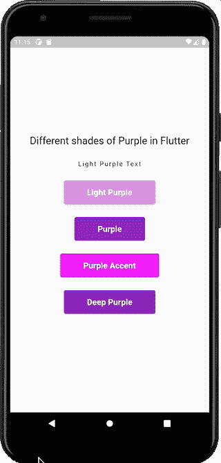

# 下一个颤振项目的 6 个技巧

> 原文：<https://betterprogramming.pub/6-tips-for-your-next-flutter-project-1bf7e055029e>

随着越来越多的公司转向跨平台开发，Flutter 不可避免地成为最受欢迎的跨平台技术。大多数 Flutter 的更新包括改进的平台兼容性，这有助于它的发展。

> Flutter 是 Google 创建的开源 UI 软件开发工具包。它用于从单一代码库为 Android、iOS、Linux、macOS、Windows、Google Fuchsia 和 web 开发跨平台应用程序。

如果您是 Flutter 的新手，请按照此链接中的说明完成安装并开始使用 Flutter。

 [## 安装

### 安装 Flutter 并开始使用。可供 Windows、macOS、Linux 和 Chrome OS 操作系统下载。

docs.flutter.dev](https://docs.flutter.dev/get-started/install) 

如果你刚刚开始使用 Flutter 或者在 Flutter 中构建应用程序，那么这些技巧一定会在某个时候帮助你，也许是在你的下一个项目中。欢迎在评论中分享你的建议。

# 1.构建较少依赖于软件包的应用程序

不要过分依赖软件包，因为它们会贬低某些特性，让您有额外的工作来创建补丁。

尽管这取决于特性的复杂程度，但是可以避免某些包，比如向容器中添加动画，因为这是你可以从头开始编写的。这将让你对小部件有更多的控制，让你可以很容易地对它进行更改。

定期更新`pubspec.yaml` *文件*，删除之前添加但项目中不再使用的包。

# 2.自定义重复小部件

项目中不断重复的小部件可以提取到一个单独的小部件中，并在多个地方使用。这避免了重新编写相同的小部件，节省了时间和精力。

让我们以一个有 4 个按钮的屏幕为例。我将把按钮提取到一个单独的小部件中，然后传递这些变量属性，而不是用`onPress`、颜色和其他属性编写按钮代码 4 次。

调用`CommonButton`小部件 4 次，每次调用都传递`onPress`、`colour`和`text`属性。现在让我们看看`CommonButton`小部件的代码:

每次调用 CommonButton 时，变量都会不同，这就是我们如何在项目中多次重用 CommonButton 小部件。

## 3.使用 log()而不是 print()

Flutter 2.5 及以上版本附带了 [*flutter_lints*](https://pub.dev/packages/flutter_lints) 包，这个包可以识别你的 dart 源代码中可能存在的问题。

每次使用`print()`，它都会显示一条警告，上面写着“避免在生产代码中‘打印’调用”。软件包将其标记为警告，因为发布版本中的打印日志可能会记录敏感信息。为了避免这种情况，使用 dart 的内置函数`log()`，它有助于发现代码中的错误，检查性能问题、编码风格和格式。

# 4.无状态或挂钩有状态小部件

与无状态窗口小部件和挂钩窗口小部件相比，有状态窗口小部件会给应用程序带来更多的负载，因为它们需要重新构建窗口小部件。

尽可能避免使用有状态的小部件。如果你是 Flutter Hooks 的新手，我已经写了一篇文章，解释如何在有状态部件上使用 Hook 部件。

# 5.常量的公共文件

一个通用的文件来放置所有的常量，比如颜色、资产字符串、装饰、文本样式，可以使整个设计过程变得流畅。

下面是一个常量文件的例子，

在整个程序中，你不需要每次都定义一个常数。在`constants.dart` 文件中定义一次，在多个地方使用。您可以在多个项目中重用常量文件。

# 6.无小部件的 SizedBox 小部件

使用高度为 0 的 SizedBox 隐藏小工具。

在下面的代码中，我只想在`showButton`属性为真时显示文本小部件，否则会绘制一个高度为 0 的`SizedBox`小部件，简而言之，如果`showButton`为假，UI 中什么都不会显示。

另一种显示/隐藏小部件的方法是使用`Visibility()`小部件。

仅当索引为 0 时才会显示以下文本小工具 *(visible 为真)*，否则，文本小工具不可见 *(visible 为假)*。

你有什么建议要分享吗？欢迎在评论中留下它们，如果你觉得有帮助的话就分享吧！