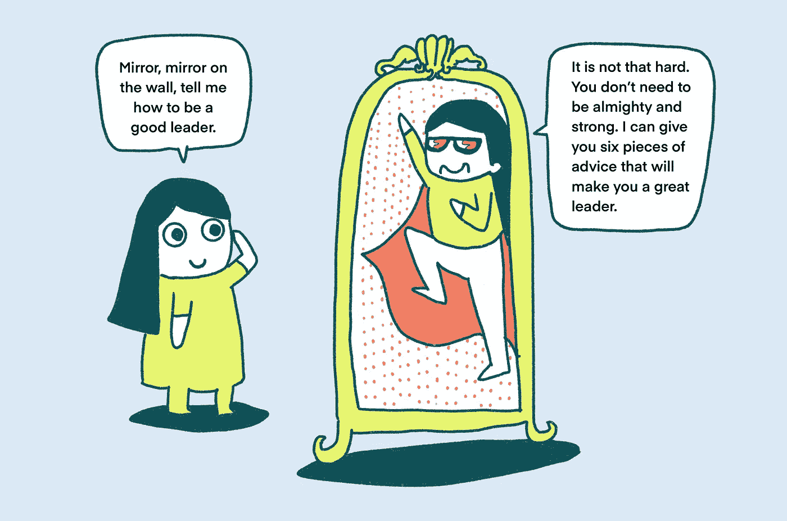
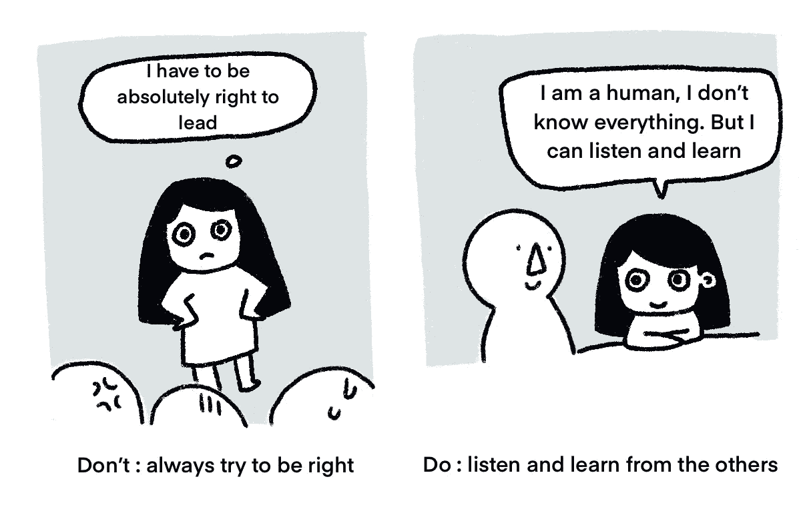
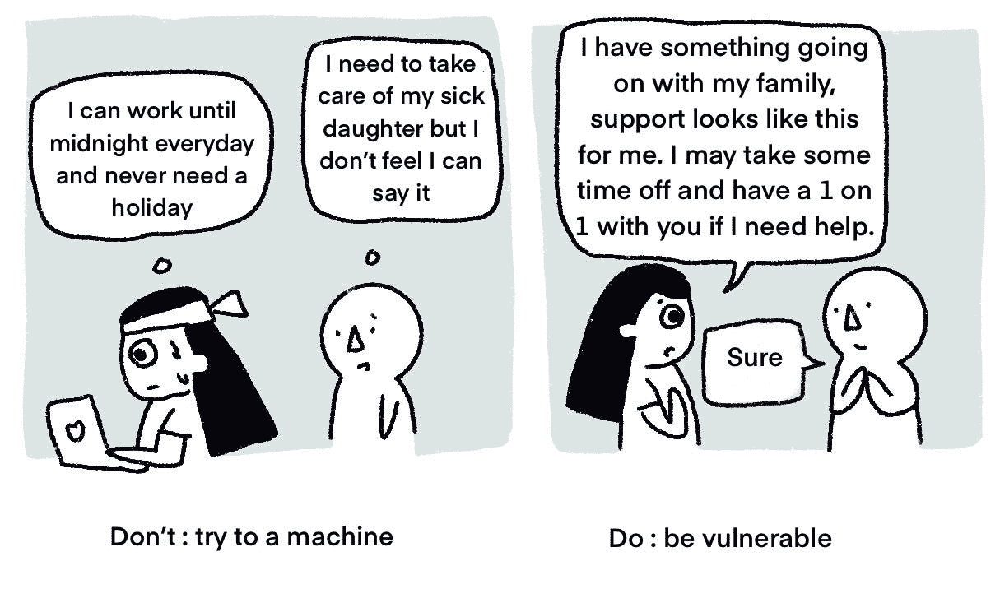
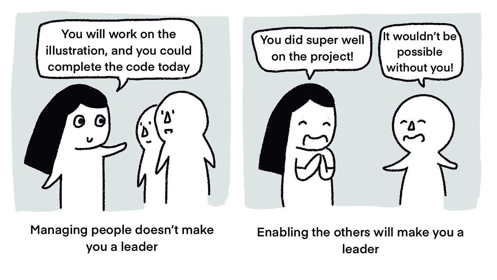
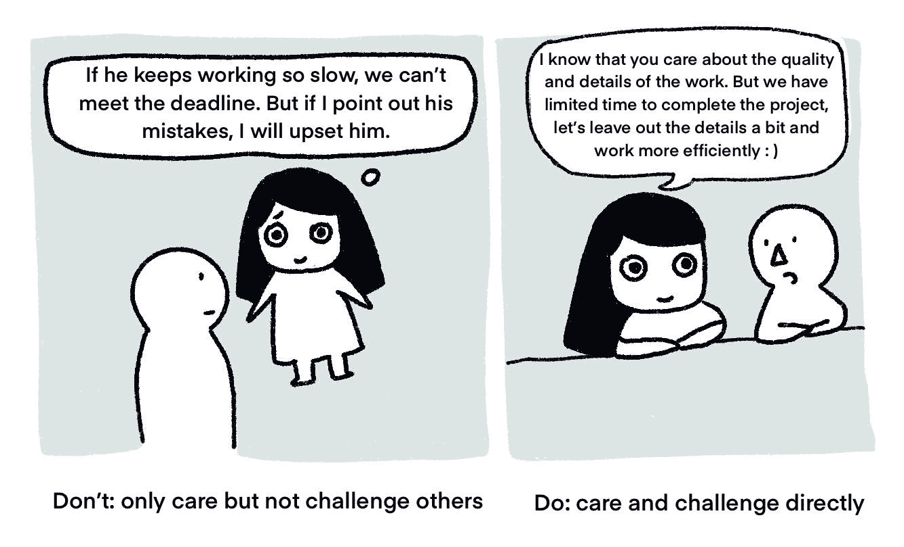
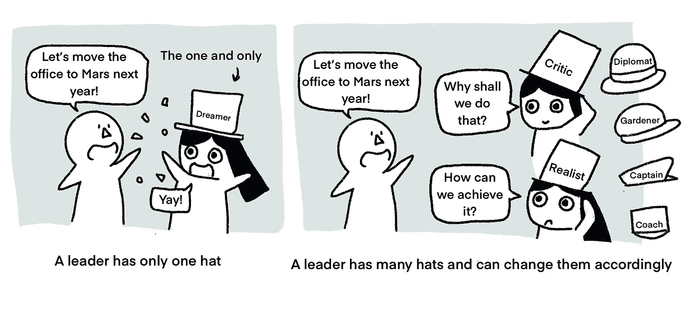
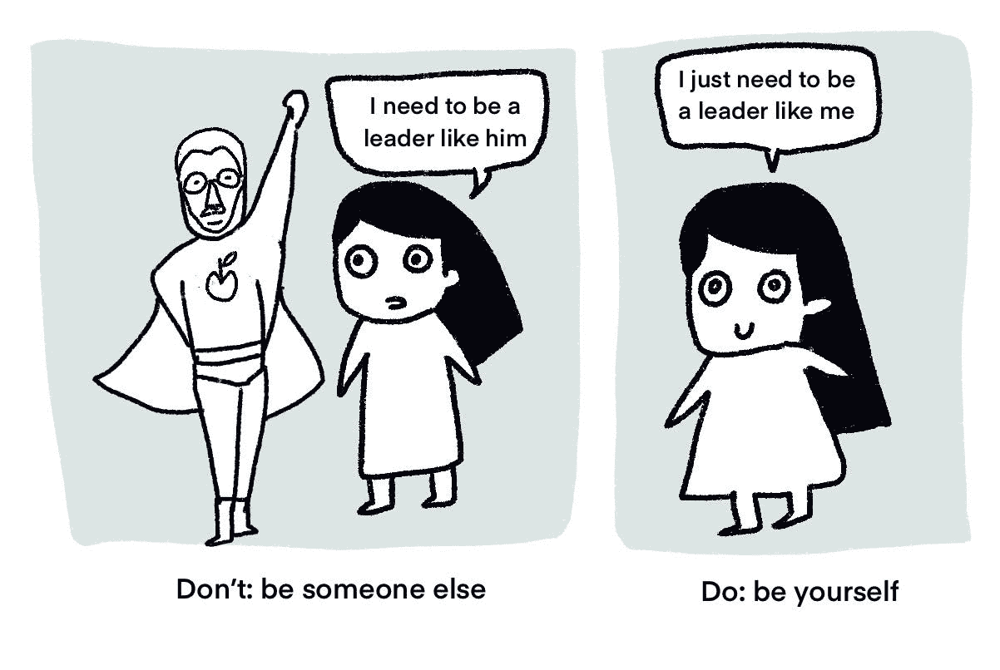

# 改变你对领导力理解的 6 个技巧

> 原文：<https://betterprogramming.pub/6-tips-that-will-transform-how-you-understand-leadership-c6e8284897e5>

## 通过插图解释

# **1。领导者不一定总是对的，相反，他们可以倾听并向他人学习。**

作为一名领导者，当你愿意承认错误并寻求支持时，你的团队会觉得冒险和寻求帮助是安全的。

当有人犯错时，以一个学习者的心态出现，不带评判地倾听。不要总是对的，试着和你的队友一起纠正问题。如果这是你的错误，接受它并承认它。

相关:布伦·布朗的“[敢于领导播客](https://brenebrown.com/podcast-show/dare-to-lead/)”分享了成为一名优秀领导者的想法。我强烈推荐！

# **2。一个领导者不需要全能——他们可能很脆弱。**

领导者的两个可贵品质是脆弱和真实。因为当一个领导者表现出他们是人的时候，团队就不必成为一台机器，在需要的时候羞于寻求支持。

> 相关:[本文](https://ideas.ted.com/how-to-be-vulnerable-at-work-without-spilling-everything-from-brene-brown/)也是来自 Brene Brown 的播客。这篇文章分享了为什么在工作中脆弱是重要的。

# **3。成为一名领导者不是管理员工，而是让员工发挥能力。**

你不需要成为一个管理者来领导。经理的目标是通过管理人员和资源来交付成果，而领导者的目标是激励和帮助他人。不做管理者，依然可以支持别人做最好版本的自己。

管理他人不会让你成为一名优秀的领导者，但授权他人会。正如 Futurice 的体验总监 Tracy 所说，“我是领导者，不是因为我是最好的，而是因为我让人们成为最好的自己。”

> 相关:[本文](https://www.forbes.com/sites/williamarruda/2016/11/15/9-differences-between-being-a-leader-and-a-manager/?sh=c05c93446096)分享了领导者与管理者的九大区别。

# **4。领导关心自己的团队，但也要挑战队友。**

关心他人是领导者的基本素质。感同身受，倾听你的队友，和他们聊聊天有助于在领导者和他们的队友之间建立亲密的关系。然而，成为一个有爱心的人并不是成为领导者的全部。当队友偏离轨道需要帮助时，领导者也必须挺身而出。

你的队友可以通过注意他们的弱点并努力改进来成长。当你挑战你的队友时，私下里当面分享你的观察和反馈。确保挑战是关于工作方式而不是个性。安排定期回顾，给予和接受来自你的队友的反馈。

> 相关:[在这段视频](https://www.youtube.com/watch?v=f-Tcr0T9Tyw)中，金·斯科特分享了她对领导力的看法。一个领导者既需要关心他人，又需要直面挑战。她讲述了自己的观察和过去的错误。

# **5。一个领导者有不止一顶帽子，他们知道戴哪一顶能得到最好的结果。**

即使是同一个领导者，根据团队的动态也会有不同的表现。过于积极的团队需要一个更挑剔的领导者，而更有经验的团队可能更喜欢教练而不是经理。一个领导者可以扮演不同的角色，根据团队动态做出不同的表现，以获得最佳效果。

> 相关:丹尼尔·戈尔曼[定义了 6 种领导风格](https://www.leadershipahoy.com/the-six-leadership-styles-by-daniel-goleman/)。它们是命令型领导风格、远见型领导风格、民主型领导风格、教练型领导风格、从属型领导风格和榜样型领导风格。一个好的领导者可以根据环境情况灵活运用所有六种技巧。

类似于 6 种领导风格，[迪士尼谈到了 3 种类型的领导](https://www.designorate.com/disneys-creative-strategy/)——梦想家、现实主义者和批评家。根据团队的动态，领导者会戴上其中一顶帽子。

这是我的[上一篇文章](https://uxdesign.cc/what-are-a-design-leads-jobs-a3a7cb317234)关于不同的领导者——媒人、队长、外交官、啦啦队员、园丁和教练。这些也是你可以在不同场合戴的帽子。

# **6。忘记领导的刻板印象——找到自己的风格。**

领导者以自己的方式与众不同，独一无二——在我的职业生涯中，我从未见过两个一模一样的领导者。你可以通过发挥自己的优势并利用它们来激励他人，从而找到自己的风格。例如，与巴拉克·奥巴马相比，史蒂夫·乔布斯是一位不同的领导人。但这并不妨碍他们以自己的方式成为鼓舞人心的领导者。

做一个好的领导者没有唯一的答案或规则。两个实力和性格完全不同的人都可以成为好的领导者。保持你的选择权——不是每个人都需要同一个领导。

# 摘要

以下六条建议改变了我对领导力的理解:

1.  领导者不一定总是对的，相反，他们可以倾听并向他人学习。
2.  一个领导者不需要全能——他们可能很脆弱。
3.  成为一名领导者不是管理员工，而是让员工发挥能力。
4.  领导关心自己的团队，但也要挑战队友。
5.  一个领导者有不止一顶帽子，他们知道戴哪一顶能得到最好的结果。
6.  忘记领导的刻板印象——找到自己的风格。

我希望这篇文章能帮助你找到你独特的领导之路。如果你有任何反馈，请告诉我。