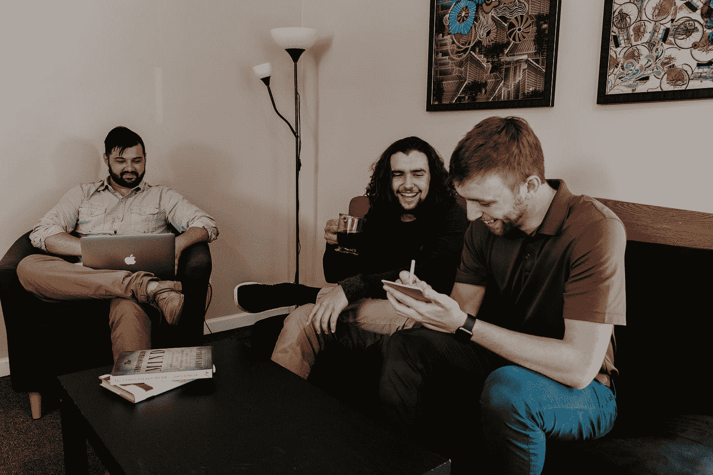

# 在你的兼职项目中保持动力的 6 个技巧

> 原文：<https://betterprogramming.pub/6-tips-to-stay-motivated-on-your-side-projects-903432041644>

## 生活中有这么多其他事情，对你的业余项目保持兴趣可能很难

照片由[photo-nic.co.uk NIC](https://unsplash.com/@chiro?utm_source=medium&utm_medium=referral)在 [Unsplash](https://unsplash.com?utm_source=medium&utm_medium=referral) 拍摄。

我发现兼职项目中最具挑战性的部分不是提出一个想法，而是将这个想法变成一个成品。

在这篇文章中，我将回顾我实施的一些策略，以帮助我在我的兼职项目中保持动力。

# 1.定义 MVP

这是我在兼职项目中保持积极性的最重要的规则:MVP。MVP 代表最小可行产品。这是实现用户可以使用的功能所需的最少功能。

在 [Unsplash](https://unsplash.com?utm_source=medium&utm_medium=referral) 上的[halance](https://unsplash.com/@halacious?utm_source=medium&utm_medium=referral)拍照。

为什么需要这么做？

这在做副业的时候非常重要，因为这是第一个主要目标，或者说是你试图达到的主要目标。因为你对需要做什么有一个清晰的想法，所以它让你在项目过程中保持正轨，并让你有动力去完成。

写下您希望在项目的第一次迭代中实现的所有特性。问自己以下问题:

*   我的应用程序试图完成什么？
*   为了让我的应用程序工作，这是必须的吗？或者这是一个不错的选择？

一旦你发布了 MVP，你就可以在它的基础上迭代，引入更多可以增强用户体验的特性。一些次要项目永远见不到阳光，因为任务不断进入待办事项列表，打着无休止的范围蔓延战。

对于我的项目，我将发布我正在尝试构建的应用程序的 1.0.0 版本，并在几周内迭代(0.1.0、0.2.0 等)。)直到我击中了我认为最有价值的版本 1.0.0。

# 2.理解项目需要时间

当构建一个东西时，不管它是不是软件，都需要时间。泰姬陵不是一天建成的。你现在住的房子也不是。这些事情需要数周的努力——有时甚至数年。抱着这种心态去做，会极大地管理你的期望。

我知道生活也会妨碍你做兼职项目，并且可能是停止做这些项目的一个很好的借口，但是即使每天花 30 分钟在这个项目上也能带来惊人的结果。

卢卡斯·布拉塞克在 [Unsplash](https://unsplash.com?utm_source=medium&utm_medium=referral) 上拍摄的照片。

为什么需要这么做？

了解你的项目需要时间的心态将有助于保持那些没有进展的期望。有时候我告诉自己这个项目会在一周内完成。我开始着手这项工作，但是没有在我给自己设定的最后期限前完成。这让我很沮丧，我开始失去注意力和驾驶。

你需要控制这些想法，告诉自己这需要时间。每天坚持下去，最终会让你完成你想要的项目。

# 3.不要做一个完美主义者

成为一个完美主义者有它的时间和地点——通常在项目的后期。当涉及到构建一个附带项目的初始阶段时，它需要退居二线。

照片由[乔纳森·霍克马克](https://unsplash.com/@hoxmark?utm_source=medium&utm_medium=referral)在 [Unsplash](https://unsplash.com?utm_source=medium&utm_medium=referral) 拍摄。

为什么需要这么做？

当你第一次开始你的项目时，拥有一个特性的子部分实现是完全没问题的。

完美主义心态只会阻碍你完成实际工作。我花了无数的时间试图完善一个实现，而我本可以用这些时间来处理其他任务。这让我觉得这一周我没有取得任何进展，这是一种可怕的感觉。

一开始有一个可工作的实现是好的。你希望感觉自己在项目上取得了进展，这样你就可以继续下去。一旦你建立了动机和动力，在 MVP 完成后重新访问代码将会是一个完美的时间来调整代码。

你也不想害怕犯错。在你的项目中犯错误是完全可以的。归根结底，我们都是人，犯错对我们来说是很自然的。不要让一个错误毁了你的精神状态。

# 4.使用看板

辅助项目最好的激励工具之一是看板。对于那些不知道看板是什么的人来说，它是一个项目需要完成的所有任务的可视化表示。如果你想了解更多，你可以在 Atlassian 上找到[。](https://www.atlassian.com/agile/kanban/boards)

[空中聚焦](https://unsplash.com/@airfocus?utm_source=medium&utm_medium=referral)在 [Unsplash](https://unsplash.com?utm_source=medium&utm_medium=referral) 上拍摄的照片。

为什么需要这么做？

我的每一个项目都有看板的原因不一定是因为它记录了需要完成的工作，更重要的是，它向我展示了我完成的所有任务。我喜欢看到完成的任务数量增加。这就像一个游戏——试图将棋盘左侧的所有项目移到右侧。随着每一项任务的完成，我知道我已经获得了一些经验，并为建设一些令人惊叹的东西做出了贡献。

即使在我独自工作的副业项目中，我也会花时间制作看板。最初的时间投入是非常值得的，因为它让你的项目走上正轨，并帮助你可视化你正在取得的进展。

无论你决定使用哪个工具来跟踪所有的任务都取决于你，但是我个人使用 [GitHub 项目板](https://docs.github.com/en/free-pro-team@latest/github/managing-your-work-on-github/about-project-boards)。我喜欢它与 GitHub 生态系统的集成。

# 5.使用版本控制

版本控制允许您保留代码的历史记录，因此您能够倒回时间，分散您的代码，并以一种有组织的方式与其他人协作。

照片由 [Unsplash](https://unsplash.com?utm_source=medium&utm_medium=referral) 上的 [Yancy Min](https://unsplash.com/@yancymin?utm_source=medium&utm_medium=referral) 拍摄。

为什么需要这么做？

我坚信每个软件项目都应该使用版本控制。当和其他人一起工作时，它可以让你更有效地合作，但是如果你是项目中唯一的一个人，你为什么要使用它呢？

嗯，当我回顾我在整个项目中所做的所有提交时，我发现这非常激励人。这是一个非常好的工具，可以鼓励你继续在项目上工作，并坚持到底，因为提交的项目会继续增加。如果你使用 GitHub，你可以在你的个人资料图中看到贡献，这也有助于游戏化体验！

能够制作代码的快照/发布也是我在所有项目中使用版本控制的另一个原因。

# 6.与朋友和家人分享进步

当做兼职项目时，向别人展示你所做的事情是一种很棒的感觉。对你所实施的事情的成就感可以让你保持动力。

由[万花筒](https://unsplash.com/@kaleidico?utm_source=medium&utm_medium=referral)在 [Unsplash](https://unsplash.com?utm_source=medium&utm_medium=referral) 上拍摄的照片。

为什么需要这么做？

朋友和家人是你最大的粉丝。

每当我做兼职项目时，我总是喜欢与我的朋友和家人分享。即使他们中的一些人不是技术人员，向他们展示我迄今为止所做的工作通常会激发他们的动力，因为他们希望看到完成的产品，或者通常是支持的。

对于我生活中与我分享项目的技术人员，我们讨论实现细节和未来的“最好有”特性。老实说，我的副业项目的一些最好的特性来自于与我的技术朋友的讨论。

在一天结束时，与朋友和家人分享你的进展会给你一个继续开发项目的理由。他们想看完成的项目——可能没有你想的那么多，但他们仍然想看。

这也适用于你可能加入的有相同兴趣的在线团体！

# 结论

保持动力是一项非常具有挑战性的任务——甚至比项目本身更难。有一个完整的行业是围绕保持个人积极性而建立的，所以我知道这不是一篇文章可以解决的。坚持下去需要努力工作和坚强的心态。

但是自从我在我的项目工作流程中实施了这些策略，我已经看到了更好的结果，并且变得更加愉快。我期待着做我的副业，它们已经变得不那么烦人了。

如果您有任何想法或希望就所提到的任何话题进行讨论，请随时在下面留下您的回复！

下集再见！