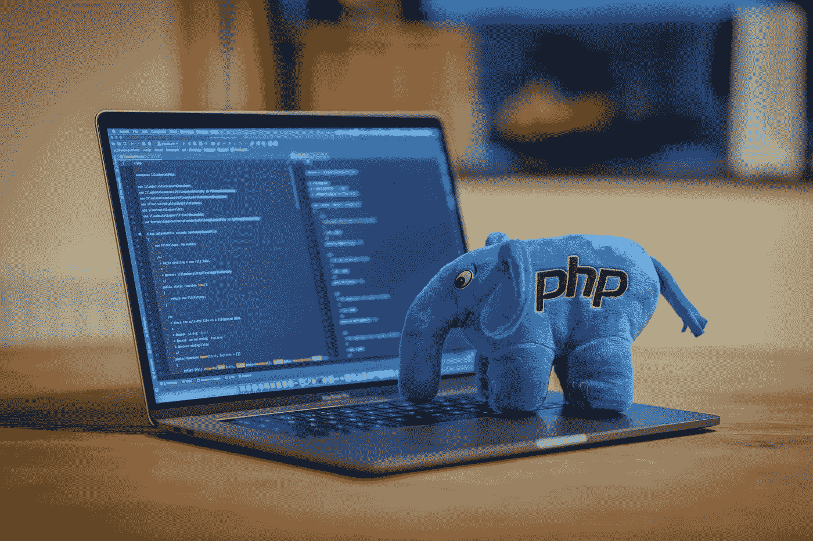
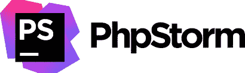
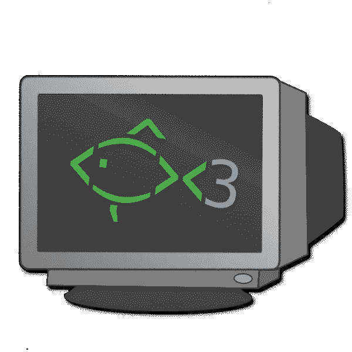
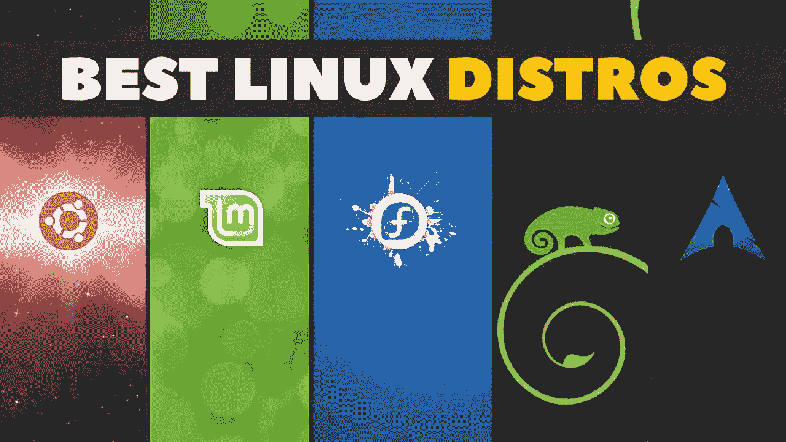
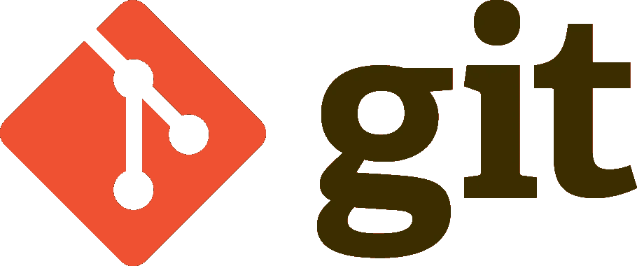
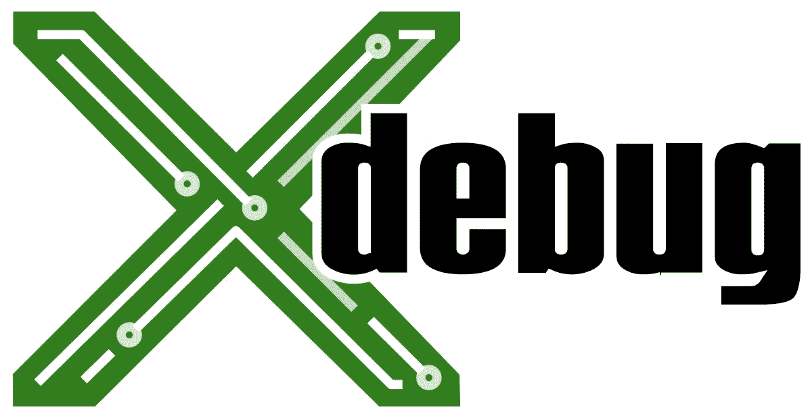

# 6 个工具是我的 PHP 编程设置的一部分

> 原文：<https://betterprogramming.pub/6-tools-that-are-a-part-of-my-php-programming-setup-d9f97e97e321>

## PHP 程序员真正有用的常用工具的简短列表

本在 [Unsplash](https://unsplash.com?utm_source=medium&utm_medium=referral) 上的照片

我自己也是一名 PHP 开发人员，我发现使用工具对你的工作效率有很大帮助，所以我列出了一些我经常使用的东西。

# PHP 风暴

PHPStorm 是 PHP 程序员可以使用的最有用的工具之一。它有许多插件和内置工具，可以帮助你比使用其他工具更快地编码。

我想到的一些优点是:

*   ide 内的终端
*   通过 IDE 访问数据库
*   棉短绒
*   自动完成是惊人的
*   维护得很好，因为它是付费的
*   如果你是学生，你可以免费得到这个。

一个缺点:

*   索引:这是超级消耗性能的

 [## PHP storm:JetBrains 开发的用于 PHP 编程的闪电智能 IDE

### PhpStorm 是一个完美的 PHP IDE，可以和 Symfony，Laravel，Drupal，WordPress，Laminas，Magento，Joomla 一起工作！，CakePHP…

www.jetbrains.com](https://www.jetbrains.com/phpstorm/) 

# 用捷径钓鱼

Fish 是一个智能且用户友好的命令行 shell，适用于 Linux、macOS 和该系列的其他产品。使用这个工具可以让你更有效率。它的一些优点是:

*   别名(可以在移动到新设置时导入)非常有用。
*   颜色可以更容易地识别出你现在所在的目录、分支或用户。
*   自我暗示:我需要解释这个吗？！
*   它的所有配置都是通过 web 界面设置的(太神奇了，tbh！).

 [## 鱼壳

### fish 是一个智能且用户友好的命令行 shell，适用于 Linux、macOS 和该系列的其他产品。教程…

fishshell.com](https://fishshell.com/) 

# Linux 操作系统

[Linux 电视频道](https://www.youtube.com/watch?v=jQKC_1efdXs&ab_channel=LinuxTV)

好的好的。Linux 很烂等等。我同意。Linux 没有最好的支持，也没有最好的 UI/UX。但与 Windows 和 macOS 相比，它确实有一定的性能，尤其是在设置开发环境方面。

如今，一切都变得依赖于容器，这使得设置更加容易，也更加一致。但遗憾的是，macOS 对 Docker 的处理不好，也不要让我入门 Windows 及其驱动问题。

这就是为什么我发现使用 Linux 进行后端开发比使用其他操作系统更好，即使我更喜欢使用 macOS，但是在 Linux 中更有效。

# Tig Git 工具

拥有一个合适的 Git 工具来帮助您提高版本控制技能是件好事。

这是一个灵活的话题，如果你习惯使用 CLI，那么试试 Tig

 [## 介绍

### Tig 是 git 的一个基于 ncurses 的文本模式接口。它的功能主要是作为一个 Git 库浏览器，但也可以…

jonas.github.io](https://jonas.github.io/tig/) 

如果你喜欢 UI，那么可以试试 GitHub GUI 工具。

 [## GitHub 桌面

### 签出具有拉式请求的分支并查看配置项状态查看您的存储库的所有打开的拉式请求并检查…

desktop.github.com](https://desktop.github.com/) 

# 码头工人

如果你还不熟悉这个，请留下这篇文章:p。

说真的，你为什么不用 Docker 呢？它是为您需要的所有技术而开箱即用的。

例子:你需要做一个使用这些的网站吗？

*   分贝
*   排队服务
*   雷迪斯
*   弹性搜索
*   ..

搞定了。你可以在五分钟内设置好。

所以给自己买本书，看看 Docker 吧。

 [## 增强开发者的应用开发能力| Docker

### 面向 M1 MAC 电脑的 Docker 台式机现在有哪些新功能宣布面向…的 Docker 台式机正式上市

www.docker.com](https://www.docker.com/) 

# Xdebug

毫无疑问，为了调试你的 PHP 代码，你需要这个。

但是我甚至建议您更深入地挖掘并使用所有 XDebug 分析工具。当试图监控您的应用程序性能时，它们会产生巨大的差异。

 [## Xdebug

### 如果你觉得 Xdebug 有用，请考虑支持这个项目。Xdebug 是 PHP 的扩展，它提供了一系列…

xdebug.org](https://xdebug.org/) 

我希望这个简短的 PHP 编程工具列表能增加你的知识。