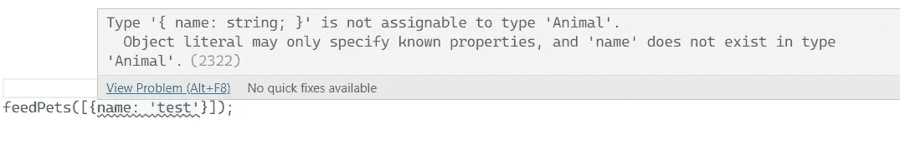

# 你应该知道的 6 个打字系统技巧

> 原文：<https://betterprogramming.pub/6-typescript-typing-system-tricks-you-should-know-5aa39bda8049>

## 我从使用 TypeScript 的类型系统中学到了什么


由[梅丽莎·艾斯丘](https://unsplash.com/@melissaaskew?utm_source=unsplash&utm_medium=referral&utm_content=creditCopyText)在 [Unsplash](https://unsplash.com/s/photos/shapes?utm_source=unsplash&utm_medium=referral&utm_content=creditCopyText) 上拍摄的照片。

TypeScript 是关于类型的。它是一种具有强大编译时类型检查的强类型语言。同时，它的静态类型是可选的，所以它与 JavaScript 兼容。

我从事打字工作已经三年多了。在这个旅程中学到了很多，但我仍然有在日常工作中学习新功能或技巧的惊喜。

以下是我通过使用打字系统学到的一些最佳实践:

*   [具体点](#376f4)
*   [启用严格模式](#c116)
*   [对泛型应用类型参数约束](#07d6)
*   [使用类型推理代替显式声明](#9643)
*   [尽量少用](#6eeb)
*   [只读的不变性](#6086)

# 具体点

在 TypeScript 中，类型是数据的形状或数据的结构([结构类型化](https://www.typescriptlang.org/play#example/structural-typing))。有了类型信息，TypeScript 的编译器将在编译时给你早期警告来检测错误，而不是让你得到一个难看的运行时错误。

在定义类型时，我们希望数据结构尽可能的具体。使用简洁的类型将有助于编译器更好地工作。定义良好的类型可以作为自我解释的文档，使代码更具可读性。

总的原则是越简洁(越窄)越好。TypeScript 的强大之处在于它为结构类型、映射类型和条件类型提供了[基于控制流的类型分析](https://www.typescriptlang.org/docs/handbook/release-notes/typescript-2-0.html#control-flow-based-type-analysis)、类型推理和[类型断言](https://www.typescriptlang.org/docs/handbook/basic-types.html)。有了这个强大的工具箱，[你可以构建一个约束良好的类型系统来最大化类型安全的好处。](https://blog.logrocket.com/type-flowing-rethinking-typescript-typing-system/)

例如，我们有一个名为`PayGrade`的类型:

```
type PayGrade: number;
```

我们可以把它变得更具体，因为我们知道它是从`1`到`5`:

```
type PayGrade = 1 | 2 | 3 | 4 | 5;
```

如果您想在语义上更好地表达类型，下面是改进后的版本:

通过使您的代码具有强类型，它会变得更加健壮。

# 启用严格模式

TypeScript 的严格模式将允许更严格的类型检查规则。可能的话应该打开。可以在`tsconfig.json`中启用严格模式:

```
{  "compilerOptions": 
    {    
        "strict": true,  
    }
}
```

严格模式实际上是一组七个选项的快捷方式，每个选项都可以单独打开/关闭，以便进行精细控制。

如果您正在处理现有项目，并且无法启用所有选项，以下两条规则比其他规则更重要:

*   `noImplicitAny` —使用隐含的`any`类型出错。
*   `strictNullChecks` —不能将`null`或`undefined`赋给变量，除非将其明确设置为允许。

其他规则包括:

*   `noImplicitThis` —不允许您引用带有隐含`any`类型的`this`。
*   `alwaysStrict"` —将“使用严格”设置在所有编译的 JS 文件的顶部。
*   `strictBindCallApply` —开启对函数的`bind`、`call`和`apply`方法的严格检查。
*   `strictFunctionTypes` —将函数类型检查设置为*逆变*，而不是默认的*双变量。*
*   `strictPropertyInitialization` —强制类属性被赋予默认值或在构造函数中初始化。

# 将类型参数约束应用于泛型

泛型允许类型作为参数。当使用泛型类型参数时，我们应该用约束来声明参数。另一种类型或接口可以约束它。

以下示例显示了如何使用`extends`关键字将类型参数约束为`Animal`类型:

```
type Animal = {
  owner: string;
}
function feedPets<T extends Animal>(pets: T[]): void { }
```

如果参数以不同的类型传入，将显示编译时错误:



# 使用类型推理而不是显式声明

我们可以使用类型推断来简化我们的代码。TypeScript 的编译器可以计算出简单类型表达式的类型，包括变量、返回类型等。在许多情况下，没有理由显式声明类型。代码越简单越好。

```
const x: string = 'John'; // string is redundant here
```

然而，也有例外。对于复杂表达式，显式类型声明有助于提高可读性。

另一个例外是函数参数，如同它们是永远不会被推断出来的。如果没有类型声明，将对它们使用`any`。

函数的返回类型可以通过 TypeScript 来推断。但是如果你的函数有一个复杂的返回类型，为了可读性，最好声明一个显式的返回类型。

# 尽量少用`any`

在大多数情况下，我们应该避免使用`any`。使用`any`可能是让您继续代码的快捷方式，但是它会在编译时隐藏错误或潜在问题。换句话说，`any`类型忽略了类型脚本的最大好处:强类型。

考虑改用`unknown`。使用`unknown`类型，你可以给它赋值，但是如果不转换或缩小类型，你就不能使用它。

```
const data: unknown = value;
```

# 只读的不变性

[不变性](https://en.wikipedia.org/wiki/Immutable_object)使得推理你的代码变得容易，并且避免了变异数据带来的复杂性。TypeScript 提供了实现不变性的`readonly`修饰符，以及`[Readonly](https://www.typescriptlang.org/docs/handbook/utility-types.html)` [实用程序类型](https://www.typescriptlang.org/docs/handbook/utility-types.html)。

`readonly` 修饰符可以应用于接口或类的属性，所以它们不能被重新分配。

```
class Fish {
   constructor(public readonly name: string) {}
}
```

`Readonly<T>`构造一个类型，该类型将`readonly`修饰符应用于泛型类型`T`的所有编译时属性。这意味着构造的`T`的属性不能被重新分配。当类型被共享时，用`Readonly`实用程序类型声明不可变类型是一个很好的实践。

请注意`readonly`修饰符和`Readonly`实用程序类型都只在编译时有效——在运行时无效。

要阅读更多关于 TypeScript 中的 readonly 和常量的内容，可以看看我的另一篇文章。

[](https://medium.com/codex/how-to-share-constants-in-typescript-project-8f76a2e40352) [## 如何在 Typescript 项目中共享常数

### 避免神奇的字符串，使你的应用程序可维护和强类型化

medium.com](https://medium.com/codex/how-to-share-constants-in-typescript-project-8f76a2e40352) 

# 摘要

在本文中，我讨论了关于类型脚本类型的最佳实践。

通过声明简洁的类型并正确使用 TypeScript 的类型系统，我们可以创建一个可读性更好、可维护性更强、更健壮的代码库。

如果你喜欢这篇文章，你可能也喜欢阅读我的其他打字稿文章。

[](https://sunnysun-5694.medium.com/path-to-functional-style-a-typescript-refactoring-example-f5f052fe4d84) [## 函数式风格之路:一个类型脚本重构示例

### 本文讨论如何将命令式风格的功能重构为函数式风格。功能是…

sunnysun-5694.medium.com](https://sunnysun-5694.medium.com/path-to-functional-style-a-typescript-refactoring-example-f5f052fe4d84) [](/typescripts-record-type-explained-691372b1a449) [## 解释了 TypeScript 的记录类型

### 您想知道的关于记录实用程序类型的所有信息

better 编程. pub](/typescripts-record-type-explained-691372b1a449) 

*如果您还不是 Medium、* [***的付费会员，您可以通过访问此链接***](https://sunnysun-5694.medium.com/membership) *进行注册。你可以无限制地阅读媒体上的所有报道。我会收你一部分会员费作为介绍费。*