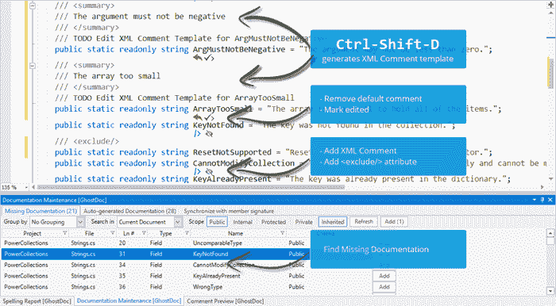
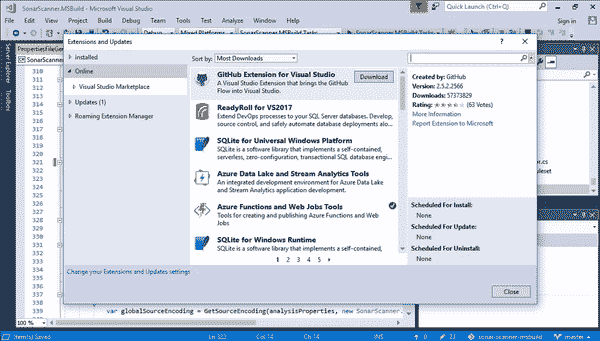
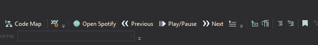
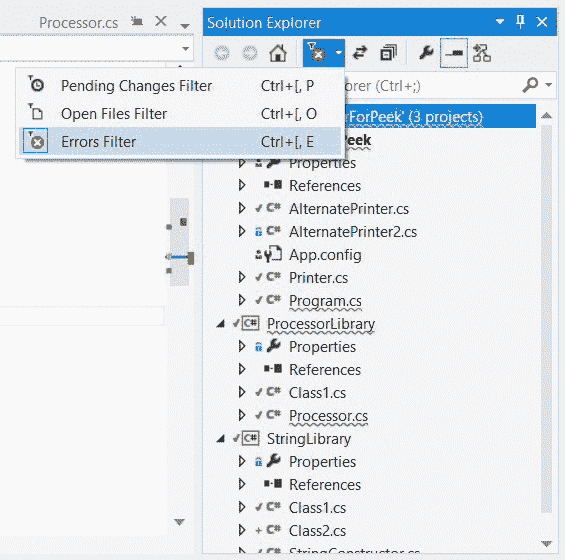
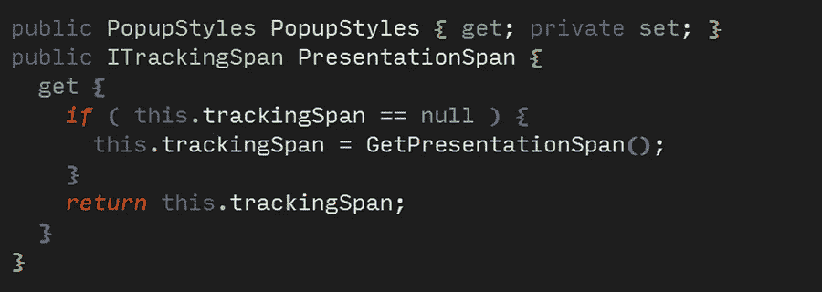

# 6 个不常见的 Visual Studio 扩展，可提高工作效率

> 原文：<https://betterprogramming.pub/6-uncommon-visual-studio-extensions-for-greater-productivity-f871d15a70a3>

## 更聪明地编码，而不是更难

罗曼·辛克维奇在 [Unsplash](https://unsplash.com?utm_source=medium&utm_medium=referral) 上拍摄的照片

扩展很棒。它们允许社区根据现实世界的需求改进给定的产品。有很好的工具可以通过减少重复任务、突出显示您需要看到的内容或者使有用的命令更容易使用来提高开发人员的生产力。

# Visual Studio 扩展

[Visual Studio 市场](https://marketplace.visualstudio.com/)提供了大量的扩展，可以将你的 IDE 变成一辆战争坦克。有数以千计的扩展可供您改进您的编码体验。有些是免费的；其他的你要付费才能使用。

然而，要考虑到你很难和一辆战车比赛。许多扩展都有性能成本。明智地选择哪些扩展值得这个成本，哪些不值得。如果你从事大型项目，你会更加感受到这一点。

也就是说，这里有六个我在日常工作中使用的免费 Visual Studio 扩展。

## **1。代码女仆——不要担心清理你的烂摊子**

CodeMaid 是一个代码清理扩展，支持 C#、C++、F#、VB、PHP、PowerShell、R、JSON、XAML、XML、ASP、HTML、CSS、LESS、SCSS、JavaScript 和 TypeScript。

主要功能包括但不限于:

*   代码清理:删除空格，使用语句排序，将单个文件的代码缩进调整到整个解决方案。
*   注释格式:以指定的大小换行注释
*   代码重组:按照微软的惯例重新安排成员的代码布局
*   进度:在 Visual Studio 中查看生成的整体进度

[下载代码女仆](https://marketplace.visualstudio.com/items?itemName=SteveCadwallader.CodeMaid)

## **2。ghost doc——点击编码文档**

GhostDoc 的伟大之处在于它可以自动为您的代码生成 XML 文档，并且可以通过 IntelliSense 进行访问。

只需点击一下，这个扩展就会读取您的代码，并生成适合您正在处理的上下文的文档。生成单个方法或整个类的文档是可能的。

来自[Visual Studio market place](https://marketplace.visualstudio.com/items?itemName=sergeb.GhostDoc)的 GhostDoc 图像

[下载 GhostDoc](https://marketplace.visualstudio.com/items?itemName=sergeb.GhostDoc)

## **3。SonarLint —在提交**之前运行质量关

如果您重视代码质量，您可能会使用质量门分析器来评估代码的质量。您使用 SonarQube 的可能性很高。

SonarQube 允许您在管道中添加一个质量关口，以在组织内强制执行代码质量标准。然而，如果你的代码在推送后被阻塞，你会感到沮丧，觉得自己本可以做得更好。

如果你能在本地机器上运行你的质量门，然后把你的代码推到每个人都能看到的地方，那会怎么样？这就是索纳林帮助的。

SonarLint 为您输入的 C#和 VB.NET 提供代码分析，并通过检查适用于您项目的规则提供完整的解决方案分析。

从 Sonarlint.org[取回](https://www.sonarlint.org/visualstudio)

[下载 SonarLint](https://marketplace.visualstudio.com/items?itemName=SonarSource.SonarLintforVisualStudio2019) 。

## 4.SpotifyRemote

在长时间的编码过程中，播放音乐对于保持注意力集中至关重要。Spotify 可能是你的伴侣。它适应你的音乐品味的方式是你在任何其他音乐流媒体平台都得不到的。

SpotifyRemote 允许你在 Visual Studio 中控制 Spotify，比如换曲目、播放或暂停音乐。

从 [Visual Studio 市场检索](https://marketplace.visualstudio.com/items?itemName=ArjanKuijpers.SpotifyRemote)

[下载 SpotifyRemote](https://marketplace.visualstudio.com/items?itemName=ArjanKuijpers.SpotifyRemote)

## **5。生产力电动工具——提高生产力的必备工具**

这是我在电脑上安装 Visual Studio 后添加的第一个扩展。

Productivity Power Tools 收集了一组扩展，可使您的工作更加轻松，例如:

*   Ctrl +单击转到定义:Ctrl +单击任何符号以查看其定义
*   保存时格式化文档
*   保存时使用删除和排序
*   显示所有文件:显示解决方案资源管理器中显示的所有项目中的隐藏文件。
*   卸载/重新加载项目:卸载/重新加载解决方案中的所有项目。
*   解决方案错误可视化工具:向解决方案资源管理器添加错误、警告和消息波形

从 [Visual Studio 市场检索](https://marketplace.visualstudio.com/items?itemName=VisualStudioPlatformTeam.SolutionErrorVisualizer)

这些特性中的许多是如此显而易见，以至于它们应该由 Visual Studio 原生提供。当我写这篇文章时，我更加重视这个扩展；—有些我以为是 Visual Studio 提供的功能，其实是生产力动力工具提供的。

[下载生产力电动工具](https://marketplace.visualstudio.com/items?itemName=VisualStudioPlatformTeam.ProductivityPowerPack2017)

## 6.viasfora——让代码再次可读

我在使用 Visual Studio 时发现的最大缺陷之一是它使用的代码突出显示。太穷了。几乎不存在。嵌套的大括号几乎无法理解，控制和变量语句都是同样的颜色。

VS 是世界上使用最多的 ide 之一。但是代码亮点是我见过的最差的，尤其是与 IntelliJ 相比。

Viasfora 提供了改进 Visual Studio 这方面的工具。彩虹括号功能是我 IDE 中最好的东西之一。它使你的嵌套括号有不同的颜色，很容易理解一个在哪里打开和关闭，而不需要任何努力。

该工具还突出显示了不同的关键字，这些关键字不是默认的。

从 viasfora.com[取回](https://viasfora.com/)

[下载 Viasfora](https://marketplace.visualstudio.com/items?itemName=TomasRestrepo.Viasfora)

# 最后的想法

扩展、调整和改进您的 IDE 的可能性是 Visual Studio 的优点之一。默认情况下，并非所有功能都必须可用。

通过简化烦人的任务，给你的 VS 安装添加扩展肯定能提高你的生产力。

然而，很多时候这是有代价的。许多优秀的扩展(例如 Resharper)都是付费订阅的。此外，您添加的扩展越多，您的 IDE 可能会变得越慢。

感谢您阅读我的文章。如果你想收到关于我最新作品的更新，[订阅我的邮件列表](http://eepurl.com/g5RQUv)。

如果您有任何问题或主题想要进一步讨论，请留下回复。我很乐意谈论它！