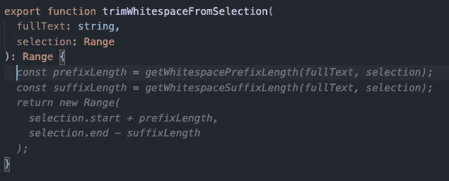
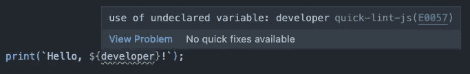
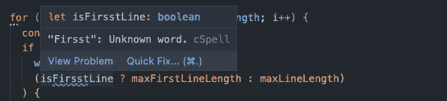
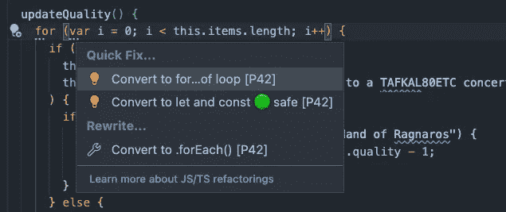
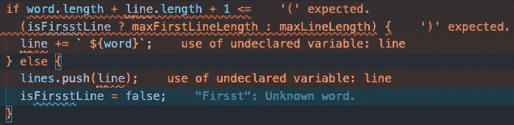

# 6 VS 用于高效 JavaScript 和类型脚本编辑的代码扩展

> 原文：<https://betterprogramming.pub/6-vs-code-extensions-for-productive-javascript-and-typescript-editing-d879674c5db0>

## 增强您的代码编辑技能


代码编辑是开发工作流程的重要组成部分。在重新运行测试或检查您的更改如何影响您正在使用的应用程序之前，它包括您在编辑器中的所有操作:

*   添加、更改和移除代码
*   修复语法错误
*   修复错别字，例如变量名和函数名中的错别字
*   修复 linter 错误和警告
*   格式化
*   重构和重组代码

代码编辑过程中的小摩擦点会导致浪费时间和挫败感。例如，当您没有立即看到或理解一个语法错误，您错过了一个潜在的 bug，或者您的编辑器突然充满了与格式相关的 linter 警告时，您可能不得不切换上下文并丢失您的思路。

Visual Studio Code 提供了可靠的编辑体验，并提供了许多扩展，您可以安装这些扩展以将其提升到下一个级别。这六个 Visual Studio 代码扩展([扩展包](https://marketplace.visualstudio.com/items?itemName=p42ai.vscode-javascript-editing-extension-pack))帮助我在编辑 JavaScript 和 TypeScript 代码时保持流畅和高效:

# GitHub 副驾驶



[GitHub Copilot](https://marketplace.visualstudio.com/items?itemName=GitHub.copilot) 为你当前的编辑职位提供代码补全建议。它的人工智能生成的建议范围从简短的语句完成到完整的函数和类。

例如，Copilot 对于自动生成样板代码、发现 API 和快速实现通用模式很有价值。当不清楚需要什么代码来解决问题时，它也有助于摆脱困境。

代码建议有时只是完美的，需要审查和改进，我经常完全放弃它们。尽管如此，总的来说，Copilot 提高了我的工作效率，帮助我保持流畅。

# 较美丽


一致的格式使代码更容易阅读，并减少拉请求中的意外变动。然而，手动格式化代码是非常繁琐且容易出错的。使用自动代码格式化程序，您可以节省时间并保持代码库的一致风格。

漂亮的是一个固执己见的代码格式化程序，许多 JavaScript 和 TypeScript 项目都使用它。它可以格式化 JavaScript、TypeScript、JSON、HTML、JSX (React)、CSS 等等。因为它只提供了少量的配置选项，所以使用 Prettier 有助于避免关于代码格式的讨论。

当你保存一个文件时，你可以配置更漂亮来自动格式化你的代码。如果要尽量减少对现有文件的修改，可以将格式限制为修改后的代码。这些是用于配置更漂亮的 Visual Studio 代码设置:

```
"editor.defaultFormatter": "esbenp.prettier-vscode",
"editor.formatOnSave": true,
"editor.formatOnSaveMode": "modificationsIfAvailable"
```

如果你经常使用键盘快捷键来保存，例如，在每次小的代码更改、修复或重构之后，你甚至可以编写格式很差的代码，并依靠更漂亮的代码来修复它，而不会有太大的摩擦。

# 快速棉绒



当你主要想检查代码的正确性时，quick-lint-js 是 [ESLint](https://marketplace.visualstudio.com/items?itemName=dbaeumer.vscode-eslint&ssr=false) 的一个很好的替代。它为 TypeScript 和 JavaScript 提供了一组固定的规则，速度极快。

虽然 quick-lint-js 没有 ESLint 的可扩展性和配置选项，但它可以帮助您快速发现常见错误并修复它们。由于它关注正确性，quick-lint-js 不包含固执己见的风格规则，并且与 Prettier 配合得很好。

# 代码拼写检查器



并非所有的错误都会导致语法错误或潜在的 bug。很容易在变量、函数或类名中出现错别字而不被注意到。但是，这可能会导致未来的可搜索性和可读性问题。[代码拼写检查](https://marketplace.visualstudio.com/items?itemName=streetsidesoftware.code-spell-checker&ssr=false)帮助你及早发现并纠正错别字。

# P42 JS 助手



小的重构有助于在编辑代码时重组和清理代码。我开发了 [P42 JS 助手](https://marketplace.visualstudio.com/items?itemName=p42ai.refactor&ssr=false)，它提供了许多自动化的代码操作，并建议进行重构，使您的代码更具可读性和现代感。

您可以通过单击灯泡图标或使用快速修复键盘快捷键(Ctrl +来打开编辑器中包含代码操作的上下文菜单。在 Windows、Linux 和⌘ +上。在 Mac 上)。您可以使用代码操作快速、安全地对代码进行语义更改。

重构建议显示了可以简化或更新代码的地方。它们可以帮助您了解最新的 JavaScript 习惯用法和最佳实践。带有三个点的下划线表示重构建议是可用的。

# 误差透镜



默认情况下，VS 代码编辑器用各种下划线指示错误、警告和其他提示的存在。您需要将鼠标光标悬停在带下划线的代码部分上，以便能够阅读消息。这个额外的步骤需要时间，并且需要您使用鼠标。

[Error Lens](https://marketplace.visualstudio.com/items?itemName=usernamehw.errorlens&ssr=false) 在编辑器的同一行显示诊断信息，节省您的时间，让您保持流畅。您可以使用颜色来区分不同的消息级别。错误显示为红色，警告显示为黄色，信息消息显示为蓝色，提示显示为绿色。

除了显示 TypeScript 和 JavaScript 错误之外，消息着色使 Error Lens 成为 quick-lint-js(错误、警告)、代码拼写检查器(信息)和 P42 JS 助手(提示)的优秀助手。您可以使用命令面板中的`Error Lens: Toggle`命令切换不同消息类型的显示。

# 摘要

编辑代码是软件开发的核心。使用上述 Visual Studio 代码扩展，您可以增强编辑体验，并更容易地编写高质量的代码。您可以使用 [JavaScript 和 TypeScript 编辑扩展包](https://marketplace.visualstudio.com/items?itemName=p42ai.vscode-javascript-editing-extension-pack&ssr=false)方便地安装扩展。