# 在 Blender 中创建 3D 剑的 6 种方法可以帮助你成为更好的程序员

> 原文：<https://betterprogramming.pub/6-ways-creating-a-3d-sword-in-blender-can-help-you-become-a-better-programmer-dacf28b844af>

## 和人

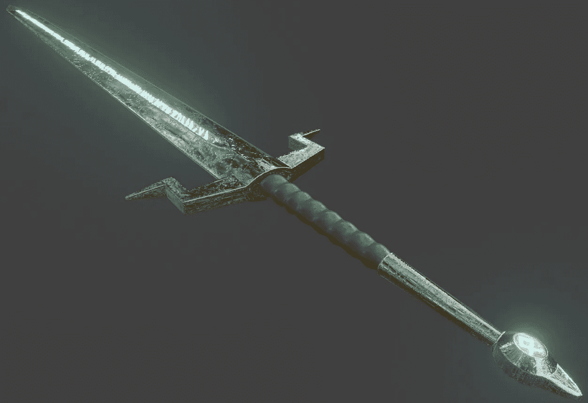

作者创建的图像

你在上面看到的这把剑是许多人在我之前完成的一个小任务的结尾:一个以《我的世界》场景开始，以亚瑟王剑结束的教程。

我的看起来和其他来自 Robby Branham 的 CG 搅拌机快速通道教程的剑非常相似。旅鼠，我们所有人。我知道。但是即使它是克隆的，我仍然为它感到骄傲，因为在它的创造背后有一个独特的故事。

而且我很努力的去抄 CG。

我不会给你看完就继续前进。我将向你们展示一些过程。

在我们的社会中，我们经常只得到某人努力的结果，这让我们认为这对他们来说很容易——对我们来说也很容易。有时候，这些黑盒创造可以帮助我们在开始之前就放弃自己的想法。

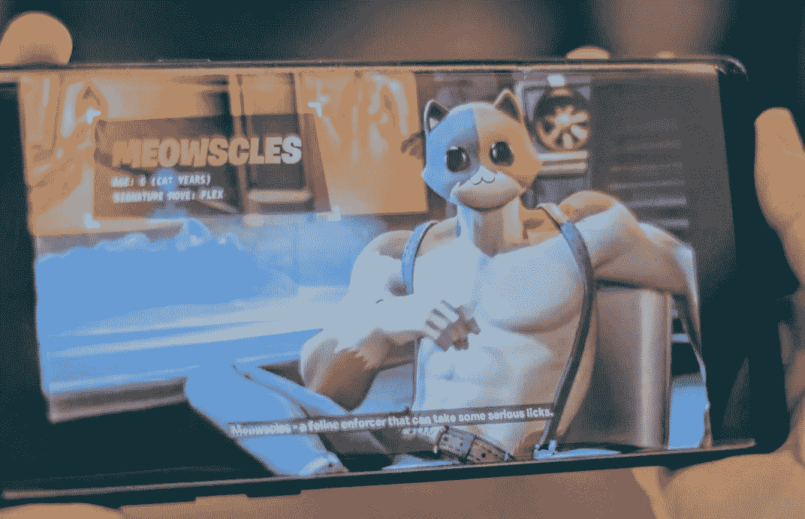

由 [Joshua Hoehne](https://unsplash.com/@mrthetrain?utm_source=medium&utm_medium=referral) 在 [Unsplash](https://unsplash.com?utm_source=medium&utm_medium=referral) 上拍摄的照片(我改变了图片以适应水平方向)

例如，经过六年狂饮咖啡、很少见到我的孩子的开发，我们得到了史诗视频游戏《堡垒之夜》,经过四年的写作，我们得到了雨果获奖小说《第五季》,创作者花了一个月时间弄清楚他们的风格后，我们得到了 15 秒钟的抖音视频——来自 We Remotely 的劳伦如是说。

虽然结果可能令人惊讶，但正是[的旅程激发了](https://ashleighbonner.medium.com/what-a-two-day-train-ride-smelly-feet-and-3-000-taught-me-6dbc1c9196c3)。

失败。迭代。丑陋、灰暗的开始。正方形的原型。

因为如果我们看到了奋斗，那么我们就知道我们也能做到。

所以，我将向你展示我在 Blender 中创建 3D 剑时复制的一步一步过程的图像。3D 建模真正帮助我学会成为一个更好的程序员和人。希望这些小技巧能帮到你。

# 1.Blender 可以教你不要因为花了时间和精力就期待杰作

你有没有想过在开始创作之前完成一部杰作？

我知道。我没耐心，还有一堆精力。

在 2019 年 10 月 22 日之前，我认为更多的时间意味着更好的产品。但我很快发现，当你是初学者时，这是不正确的。

有道理，但我是个迟钝的人。

所以，坐了 15 到 20 分钟的公交车后，我会在图书馆呆上几个小时——创作。在图书馆员下载了 Blender 2.82(T1)之后，我在电脑前呆了两个小时，非常兴奋，确信像 Branham 的 T3 这样的 T2 杰作将会由此诞生。

这是我做的:

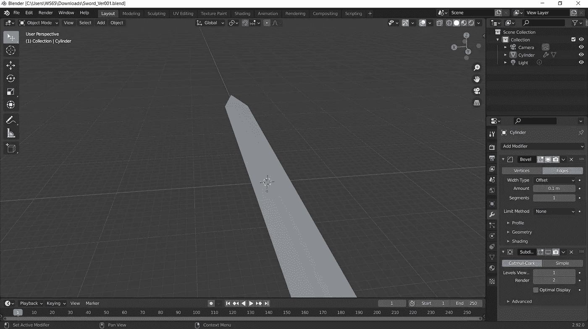

平坦的华盛顿纪念碑。我期待更多。我花了两个小时，我已经等得不耐烦了。

但老实说，我花了很多时间试图修复我做得太快了的碎片。

许多中间的凹痕在线框模式下扭曲，在对象模式下突出，刀片的一些部分有孔，光线反射奇怪。

最后，我不得不重做了几次。

为什么我会犯这么多错误？

我太忙了，没有听，试图走自己的路。对开发者来说是个大问题。制作这把剑将帮助我坚持两个月的编程错误——因为我学会了等待。

要点:放慢速度，学会做一个好的跟随者是程序员的优秀品质。尤其是当你不知道自己在做什么的时候。

# 2.Blender 可以教你从许多不同的角度看待事物

制造这把剑的大部分工作都需要我去移动它。旋转它，移动它，调整尺寸，正射地观察它。

在图书馆呆了两个半小时后(另一天)，我从各个角度看了刀片，并对每一点进行了微调。这帮助我更加灵活。

在我的个人生活、思维过程和编程方法中，我是僵化的。我很难看到其他的观点和灰色阴影。对于一个初露头角的程序员来说并不好。

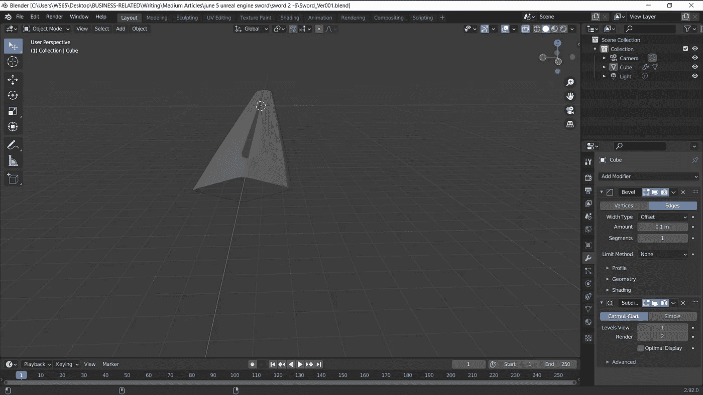

要点:使用微小的调整为你的编程和生活增加更多的灵活性。

## 两种功能模式

编程中有两种主要的功能模式:一点点错和一点点错。

Blender 帮助我了解到，当我转换视角时，我可以看到可怕的错误功能是由许多小错误功能组成的。修复每一个，直到它正常工作。

此外，在调整线框时，我了解到程序员不应该只是让程序工作，而是研究并实际修复导致问题的 bug。

翻转，旋转，放大，缩小。做那片叶子。

# 3.Blender 可以教你写出准确的评论

抓取这些一年半前的图片，我有这个教程四天的笔记。那是错误的。所以让我们增加一天，让它继续前进。

下一个是警卫。我一定是在记录时间的时候睡着了，因为 CG 通过创建一面来制造守卫，然后镜像它来匹配另一面。

这花了我几个小时，但我没有留下好的文档。

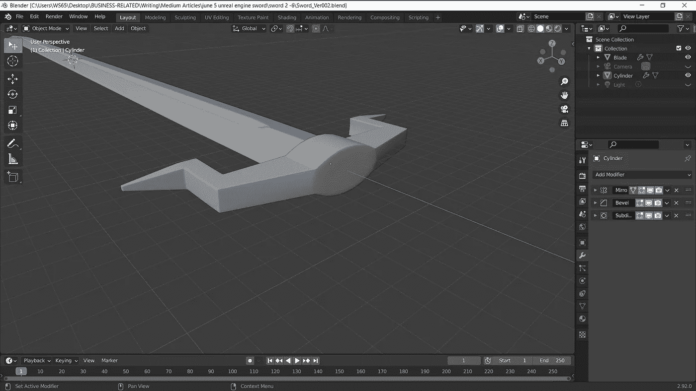

我的文档不仅缺少一些图片和 Blender 文件，还缺少日期。

当你为你的应用程序编码或构建想法时，添加准确的评论对你和你之后的每个人都有帮助。但只对真正需要说明的部分添加注释。不想过分。

这里有一些关于[如何写评论](https://medium.com/swlh/what-to-comment-and-when-write-better-code-2451f9af08e4)的技巧。

在你的个人项目中，留下一些有趣而准确的评论，就像我在一个移动应用程序中写的这样，我会在某个时候完成:

```
/* trickyWordsHelperTestCase5.cpp
test case: check if userFirstName prints message and rejects curse words
*/bool isNameCurseWord = false;

if (find(nameCurseWordsVector.begin(), nameCurseWordsVector.end(), userFirstName) != nameCurseWordsVector.end()) {
      cout << "Curse word entered. SAILOR MOUTH present.\n"; //19-century sailors would be proud, lol...
// getNameCurseWordMessages(userFirstName);
      isNameCurseWord = true;
} 	
else {
     isNameCurseWord = false;
}
} while (isNameCurseWord || firstNameOnlyAlpha != string::npos || userFirstName.empty());

// found solution at https://stackoverflow.com/questions/28584551/c-if-text-file-contains-specific-word-or-not
```

或者在地上打滚嘲笑这些 [56 真人评论开发者留下的](/56-funny-code-comments-that-people-actually-wrote-6074215ab387):)。

要点:教程可以教你详细记录事情是如何变化的，以及你是如何进步的。

# 4.搅拌机可以教你如何跳过完美

旋转握杆花了几个小时。

我倾向于完美主义，因为我担心提交东西。为什么？因为我觉得不够好——我也是。

在教程中，Branham 告诉我们不要担心抓地力是否完美。让一切都好起来。我照做了。

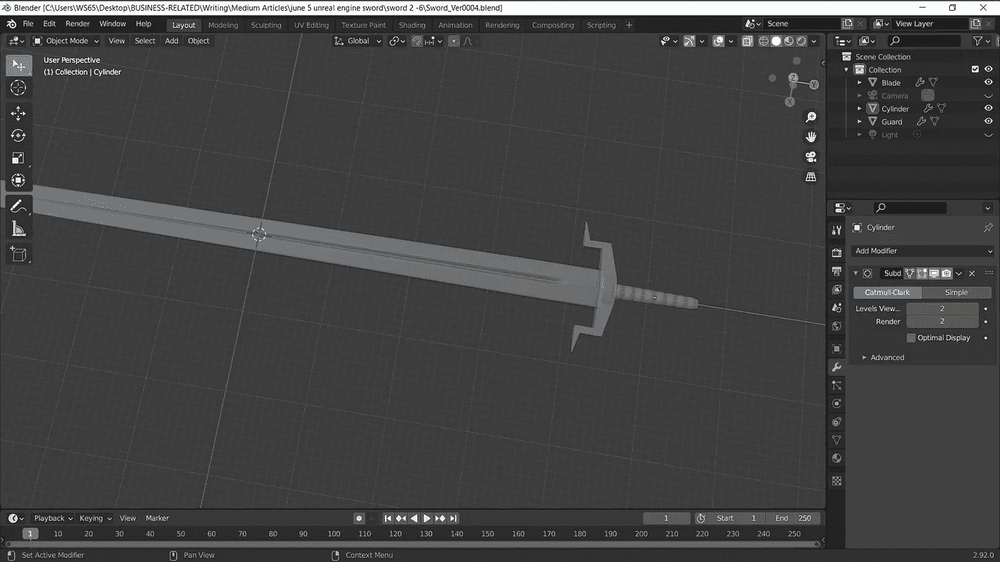

在编程中，很多时候“没问题”已经足够好了。

通常会有一堆几乎不可能的截止日期和代码、3D 模型和设计需要发货。好像是两天前。

没有时间去尝试和达到完美，真的，这对任何事情都是真的。完美是不可能的。为了我们所有人。

完成它。运出去。在用户抱怨时修复 bug。因为我们知道他们会的。又快又大声。

但那只会让你做的更好。所以他们是在帮你。谢谢你的视角转变。

现在是时候创建和添加鞍部了。我把看起来像金鱼的符文加到了它的末尾。

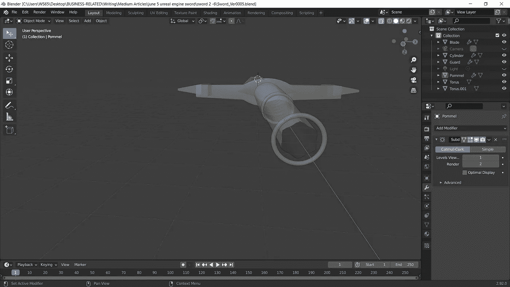

在我完成了基础之后，我继续进行着色器。像 CSS 一样，着色器使资源看起来很好。在这个阶段，这把剑看起来像是用光滑的橡皮泥制成的。


然后，我绘制出剑的不同部分，为抛光做准备，并使用非常酷的 UV 编辑模式。

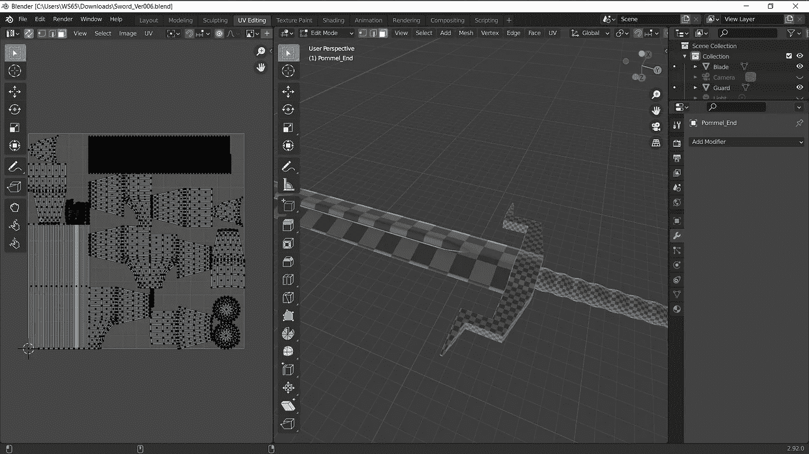

在阴影模式下，我添加了一个着色器来创建剑的反射表面。调整了一些节点，增强了“金属”和“镜面”效果，使其更加闪亮。

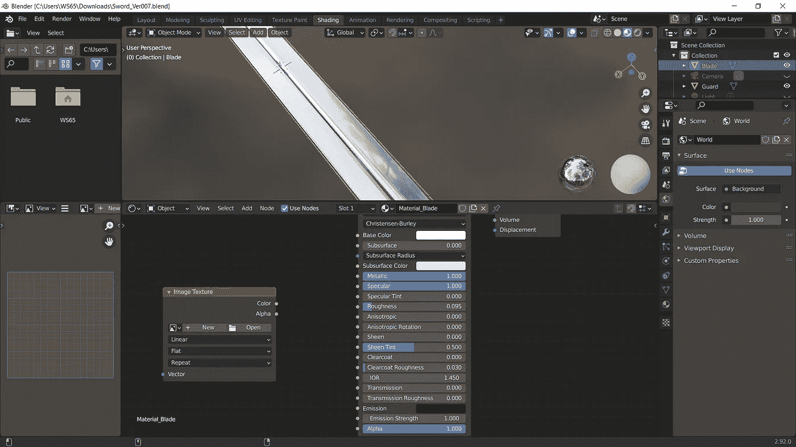

更多的 Blender node 令人惊叹，让它看起来更真实——不那么沉闷。在下一场战斗之前，要亮出那些致命的武器。

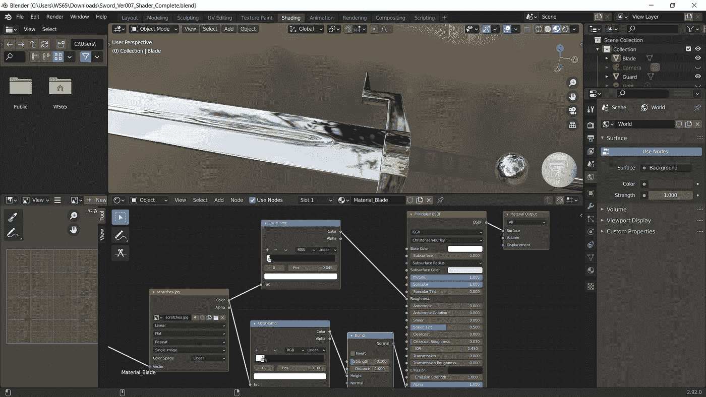

对于这一节，我给自己留了一些笔记。但是不要引用我的话。这些是一年半前写的。观看布兰汉姆的视频更新。要牛逼。

以下是我对节点的看法:

*   设置图像纹理节点。当“颜色空间的划痕”大于线性时，划痕会显示得更好，因为 Blender 不会尝试计算 RGB 颜色。
*   增加了两次色带，使得划痕更加明显。然后调整黑白滑块。
*   增加了凹凸节点，增加了看起来像凹凸不平的表面的纹理。当距离大于-1 时，凸起朝向剑的中间。不太好。
*   如何让划痕变小？需要通过添加矢量来“平铺纹理”。步骤:添加纹理坐标节点，然后将 UV 插入矢量。

# 5.搅拌机可以教你完成和运输

我在图书馆花了三个小时完成了这把剑，在开始后的近两个星期，然后我把它运给了我自己。象征性的，我知道。

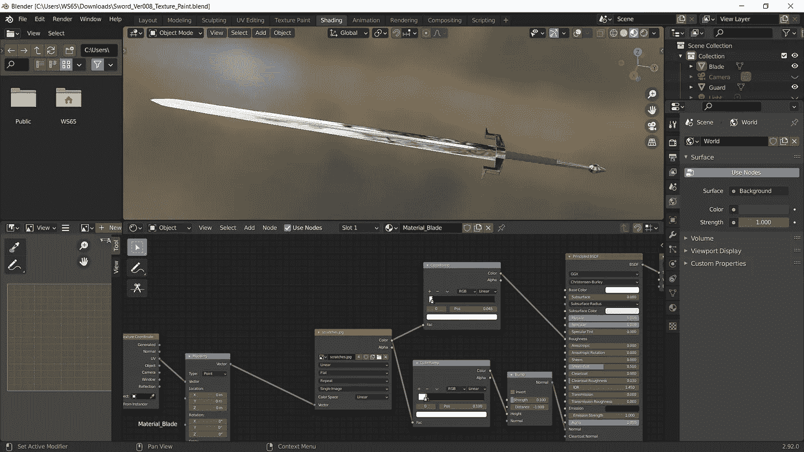

哇，这把剑的原力真强。

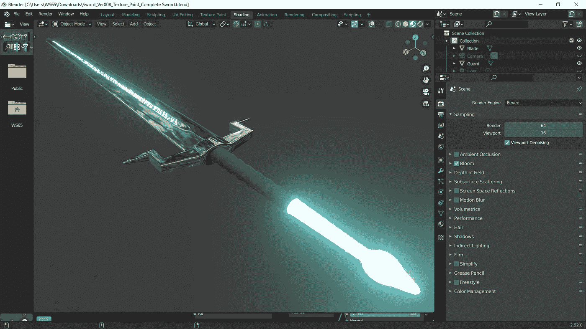

但是它吃了太多的浓缩巧克力饼，需要坐下来。那个发光的前鞍是错误的，所以我修复了它并保存了一个新版本。

总之，这把剑有大约 20 个版本。

就像在编程中一样，我需要保存大量数据，以便在出错时可以回滚到另一个版本。再次感谢 Blender，帮助我接受错误是过程的一部分。


啊，在那儿。这把剑，我的宝贝。

但是等等…布兰汉姆的教程还没完。你看，我们是要制造一个场景，而不只是一把剑。那些石头呢？风景呢？

让我们做那些部分。

因此，在图书馆又呆了两个半小时后，我在第三部中加入了[石头。布兰汉姆帮我下载了岩石资产，完成了光源，并使用](https://www.youtube.com/watch?v=y0DMMwwdBaY) [Mixamo](https://www.mixamo.com) 添加了动画 3D 角色。

你可以添加任何你想要的字符。还有一些很奇怪的。

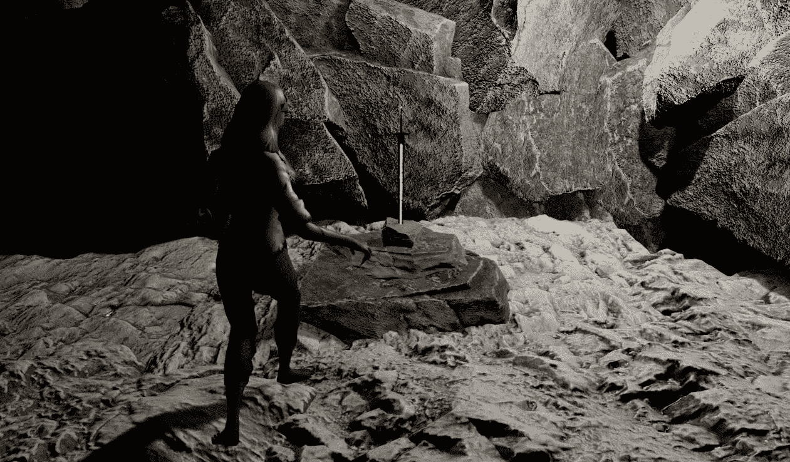

我选择了一个僵尸，创造了亚瑟王大战僵尸。不过，不要生僵尸的气，他们只是想摆脱亚瑟王的暴政。

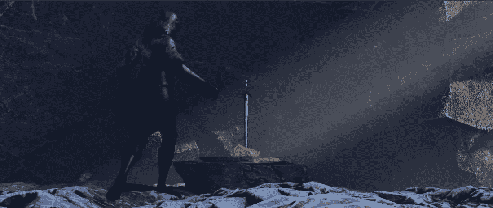

# 6.Blender 可以教你快乐地成为更大事物的一部分

在最后的场景中，剑很小，你看不到任何细节。然而，为之付出的努力是值得的。

这就是关于创造的事情:每个部分都是一个更大的愿景的一部分，每个部分的谦逊让他们一起工作。

程序可以由几千个文件、几百万行代码和几十个开发人员组成。都有自己的角色。

> 我们都是亿万颗小而聪明的齿轮中的小而聪明的齿轮。

Blender 也教了我这个。

# 资源

[教程第 1 部分:设置](https://www.youtube.com/watch?v=bpvh-9H8S1g)

教程第二部分:剑

[教程第三部分:石头](https://www.youtube.com/watch?v=y0DMMwwdBaY)

[如何写好评论的小技巧](https://medium.com/swlh/what-to-comment-and-when-write-better-code-2451f9af08e4)

[56 搞笑开发者评论](/56-funny-code-comments-that-people-actually-wrote-6074215ab387)

[3D 动画角色 Mixamo](https://www.mixamo.com/)

**如果这篇文章对你有帮助并且你想支持我的写作，** [**给一个中等会员试试**](https://ashleighbonner.medium.com/membership) **。只需 5 美元，你就可以无限制地访问数以千计的故事，而使用我的链接** **注册的** [**将会给我一小笔佣金。**](https://ashleighbonner.medium.com/membership)

[](https://ashleighbonner.medium.com/membership) [## 通过我的推荐链接加入 Medium——ash Leigh Bonner

### 作为一个媒体会员，你的会员费的一部分会给你阅读的作家，你可以完全接触到每一个故事…

ashleighbonner.medium.com](https://ashleighbonner.medium.com/membership)