# 为故事书配置全局样式的 6 种方法

> 原文：<https://betterprogramming.pub/6-ways-to-configure-global-styles-for-storybook-faa1517aaf1a>

## 更好地使用故事书的详细指南

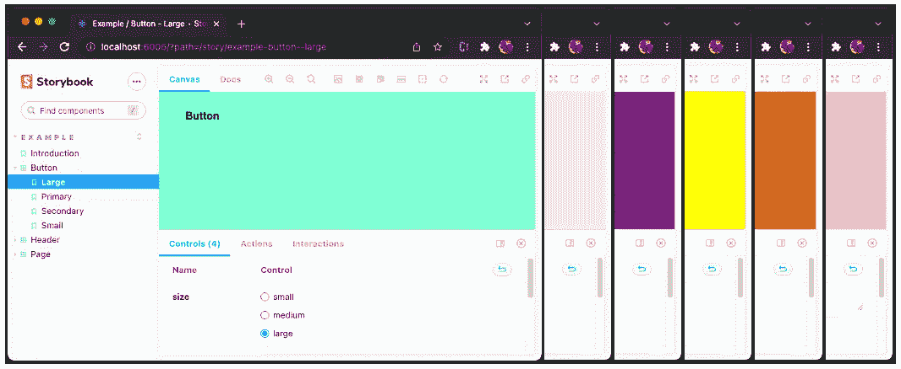

作者图片

[Storybook](https://storybook.js.org/) 是一个开源工具，用于构建独立的 UI 组件和页面。这允许我们一次处理一个组件。它简化了 UI 开发、测试和文档。

我们已经写了关于[故事书](/an-in-depth-look-at-storybook-6-8c44cd6895ee)及其特性——零配置设置、动态组件编辑、多故事书合成和文档改进。

为故事书配置全局样式是一项常见的任务，例如背景色、颜色、字体系列和字体大小。在本文中，我们以设置背景颜色为例，用 6 种不同的方法来完成这项任务。为了区分解决方案，每种方法都设置了独特的背景颜色。在这个过程中，我们会看到哪种方法具有更高的优先级。

*   *粉色背景* : [在](#c26c) `[preview-head.html](#c26c)`中使用样式表。
*   *巧克力背景* : [在](#f95e) `[main.js](#f95e)`中配置 `[previewHead](#f95e)` [。](#f95e)
*   *黄色背景*:在 `[preview.js](#3653)`中[导入样式表。](#3653)
*   *紫色背景* : [在](#2ae1) `[main.js](#2ae1)`中配置 `[previewBody](#2ae1)` [。](#2ae1)
*   *米色背景* : [在](#d359) `[preview-body.html](#d359)`内设置样式。
*   *蓝绿色背景* : [在](#5685) `[preview.js](#5685)`中配置装饰器。

让我们详细了解每种方法的工作原理。

# 在创建 React 环境中设置故事书

我们使用 [Create React App](/an-in-depth-guide-for-create-react-app-5-cra-5-b94b03c233f2) 作为探索故事书的基础。以下命令创建一个 React 项目:

```
npx create-react-app react-storybook
cd react-storybook
```

输入命令`npx sb init`，故事书就安装好了。

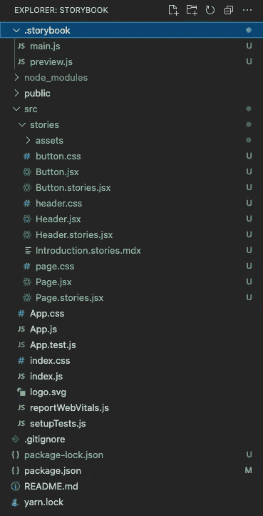

作者图片

键入命令`npm run storybook`，示例故事书在`http://localhost:6006`运行。

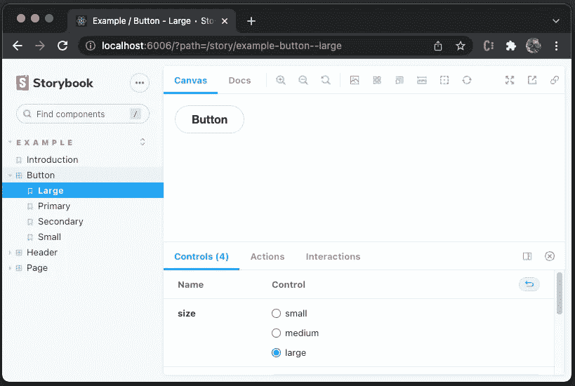

作者图片

默认情况下，背景颜色是白色。我们想把它配置成不同的颜色，而不是每个故事都设置它。

# 粉色背景:在 preview-head.html 使用样式表

在 Storybook 中，故事呈现在一个特定的“预览”iframe 中(`Canvas`选项卡)。Storybook web 应用程序读取`.storybook/preview-head.html`(如果它存在的话),这直接控制呈现的 HTML 中的`<head>`元素。

如下创建`.storybook/preview-head.html`:

第 1 行为外部资源、样式表或站点图标定义了`<link>`元素。`href`指定链接资源的 URL，定义为`public/style.css`:

重启故事书，我们看到背景变成了`pink`。

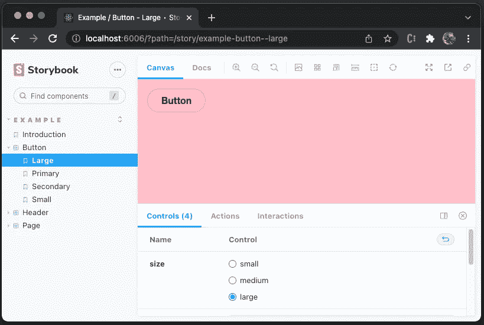

作者图片

我们可以验证全局风格的改变已经应用到每个故事中。

但是，样式更改不适用于任何文档页面。

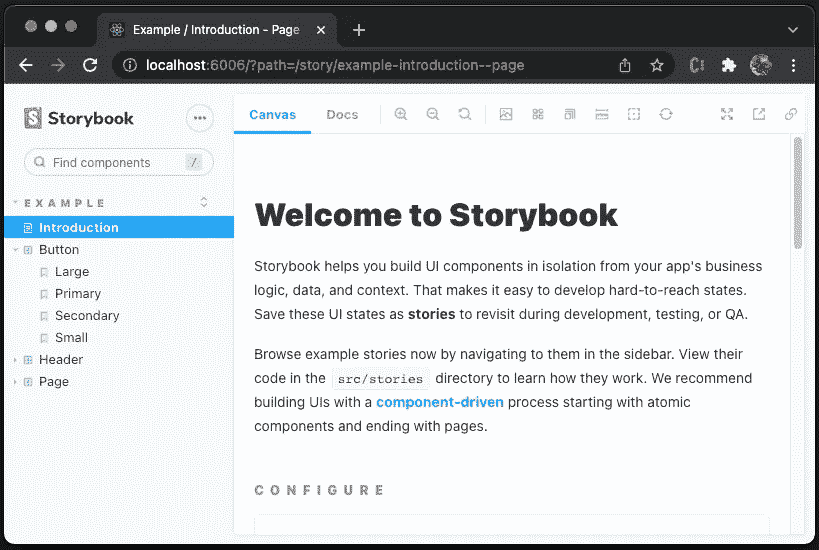

作者图片

这是预期的行为。对于每个故事，选择`Docs`选项卡，我们可以验证降价页面不受故事样式的影响。

嗯，我们把一个故事放进`src/stories/introduction.stories.dx`。

文档会自动转换为文章。然后，`Canvas`选项卡显示粉色背景。

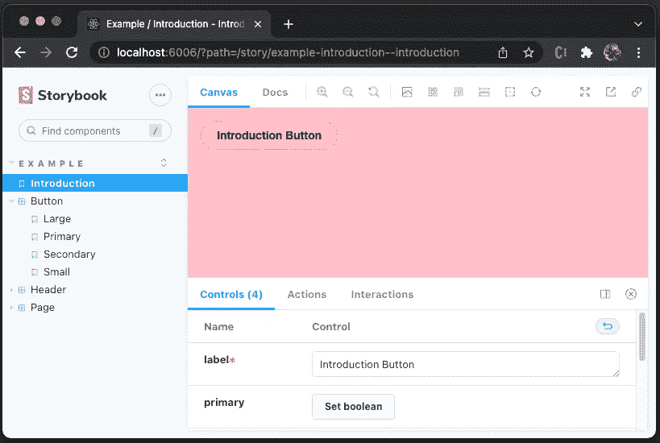

作者图片

# 巧克力背景:在 main.js 中配置 previewHead

在`.storybook`文件夹中，有一个名为`main.js`的文件，它控制故事书服务器的行为。该配置文件是一个预置文件，具有控制`stories`、`addons`、`webpackFinal`、`babel`、`framework`等的界面。

下面是`.storybook/main.js`的默认内容:

也可以使用在`main.js`文件中定义的预置以编程方式修改预览头 HTML。

添加第 16–23 行是为了用`chocolate`背景覆盖现有的`previewHead`。

因为样式元素(第 18–22 行)放在现有的`head`(第 17 行)之后。新样式覆盖了`head`中的现有样式。

重启故事书，我们看到背景变成了`chocolate`。

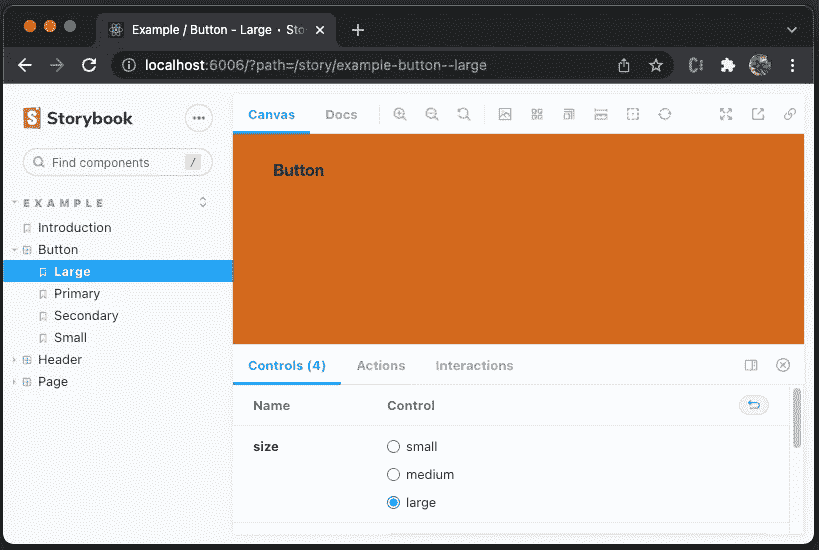

作者图片

# 黄色背景:在 preview.js 中导入样式表

在`.storybook`文件夹中，有一个名为`preview.js`的文件，它为装饰器、参数和全局类型设置全局设置。

下面是`.storybook/preview.js`的默认内容:

创建样式表，`.storybook/style.css`:

将该样式文件导入`.storybook/preview.js`(第 1 行):

该导入优先于`head`样式。

**刷新**故事书，我们看到背景变成了`yellow`。

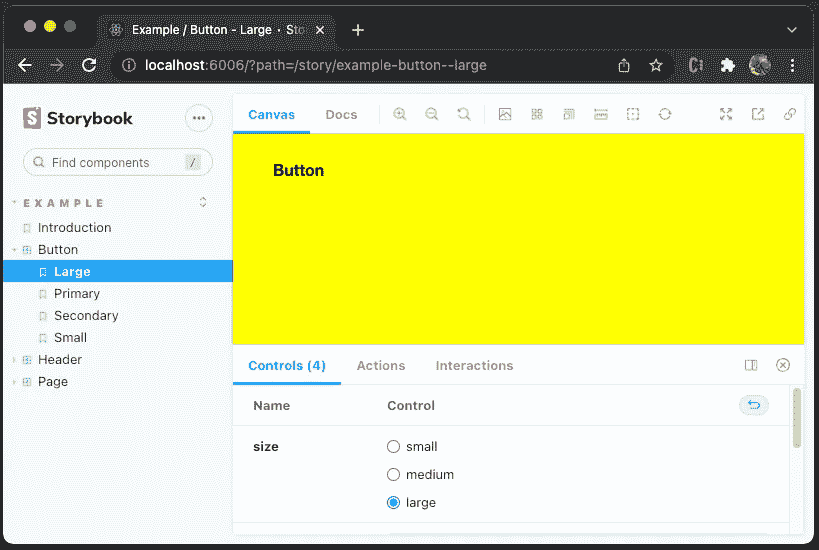

作者图片

# 紫色背景:在 main.js 中配置 previewBody

与`previewHead`类似，我们可以使用`main.js`文件中定义的预置以编程方式修改预览体 HTML。

建议在`<body>`开始之前声明 CSS。因此，造型应该设置在`previewHead`中，而不是`previewBody`中。

然而，它仍然有效。解析正文样式时，浏览器会重新呈现页面。

下面是修改后的`./sotrybook/main.js`:

添加第 24–31 行，用`purple`背景覆盖现有的`previewBody`。

因为 CSS 应该在`<body>`开始之前声明，所以样式元素(第 25–29 行)放在现有的`body`(第 30 行)之前。

重启故事书，我们看到背景变成了`purple`。

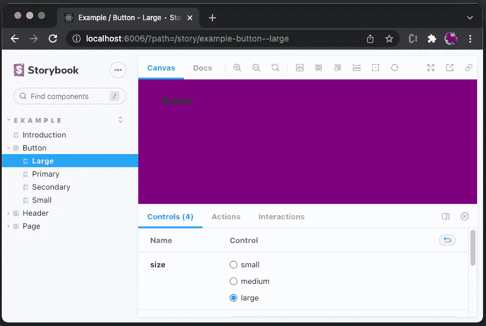

作者图片

# 米色背景:preview-body.html 内部设置风格

类似于`preview-head.html`。Storybook web 应用程序读取`.storybook/preview-body.html`(如果它存在的话),这直接控制呈现的 HTML 中的`<body>`元素。

我们已经说过，造型应该设置在头部，即`preview-head.html`，而不是`preview-body.html`。

然而，它仍然有效。

如下创建`.storybook/preview-body.html`:

重启故事书，我们看到背景变成了`beige`。

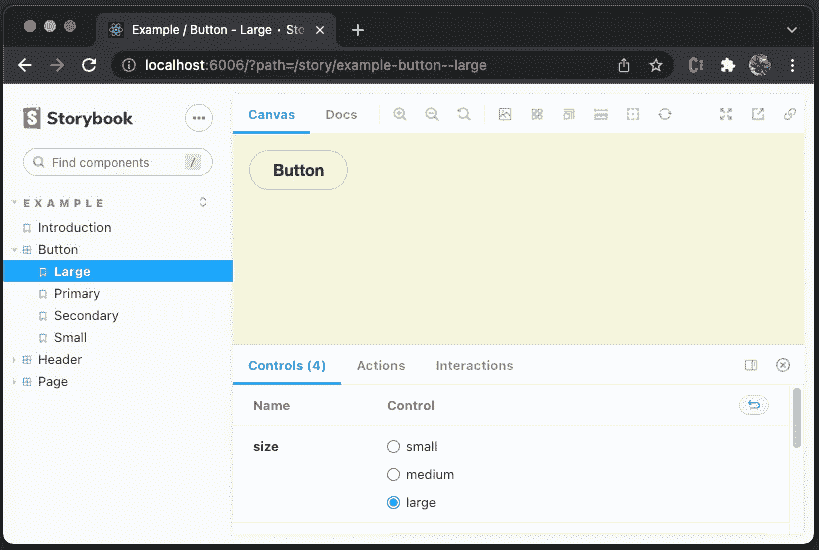

作者图片

# 海蓝宝石背景:在 preview.js 中配置装饰器。

装饰器是一种用额外的“呈现”功能包装故事的方式。自然地，我们可以使用装饰器用额外的样式、额外的标记、上下文模仿或任何东西来包装故事。

下面是改装过的`./storybook/preview.js`:

第 13–17 行定义了装饰器`withBackground`，它定义了 html 背景色(第 14 行)和正文背景色(第 15 行)。由于这是一个特设([高阶组件](/headless-ui-components-a-journey-with-high-order-components-render-props-and-custom-hooks-811c9677b4cf))，有许多可能的方式来设置造型。

第 19 行用`withBackground`配置`decorators`。

**刷新**故事书，我们看到背景变成了`aquamarine`。

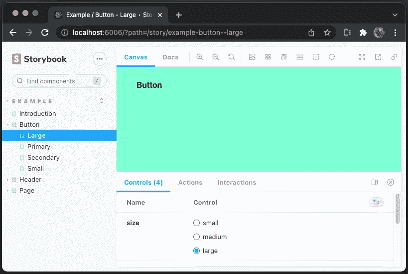

作者图片

# 结论

我们已经通过 6 种方式来配置 Storybook 的全局样式。不同的背景颜色用于显示这些解决方案的优先顺序。

在这个过程中，我们看了`main.js`、`preview.js`、`preview-head.html`和`preview-body.html`。在这些文件中，最好在`head`中设置样式，而不是在`body`中。通过这种方式，可以在 CSS 呈现之前提前加载样式，以避免可能出现的空白屏幕。此外，它避免了浏览器在解析 body 中声明的样式时重新呈现页面。

有不同的方式来设计故事书，导入，亵渎，链接元素和样式元素。其中，我们更喜欢进口方式。它在`preview.js`中导入一个全局样式文件。这很简单，更改是实时加载到故事书中的(只需要刷新，而不是重启)。

选哪条路？这取决于具体的 Web 应用和个人偏好。毕竟有 6 种方式可以选择。

感谢阅读。我希望这有所帮助。如果你有兴趣，可以看看[我的其他媒体文章](https://jenniferfubook.medium.com/jennifer-fus-web-development-publications-1a887e4454af)。

注意:感谢泰勒·劳巴赫和塞巴斯蒂安·凯塞尔给我分配了为 Storybook 配置全局样式的任务。