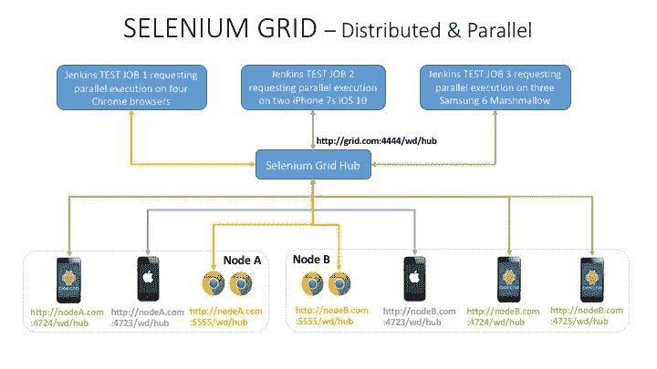
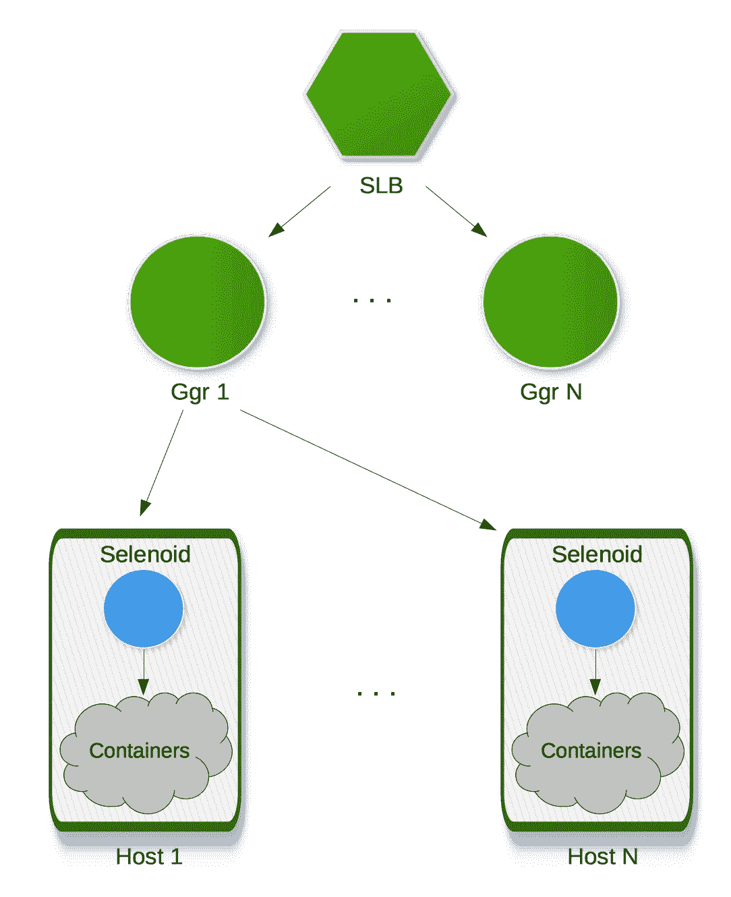

# 用 Selenium 并行进行自动化 UI 测试的 6 种方法

> 原文：<https://betterprogramming.pub/6-ways-to-do-automated-ui-testing-in-parallel-with-selenium-132e47403c4f>

## 适用于虚拟机、Docker、Kubernetes 和云的 Selenium 协议实现

形象信用；作者

大约五年前，我创建了我的第一个硒网格。整个设置(见上图)只包含两个 MacBook Pros。第一台笔记本电脑充当网格集线器和节点，第二台笔记本电脑充当第二个网格节点。这两个节点都被设置为启动 Chrome、Firefox、Android 模拟器和 iOS 模拟器并与之交互，通过将软件及其依赖项直接安装到操作系统上来进行 UI 测试。这听起来很简单，但事实上，设置起来很复杂，维护起来更糟糕。

在本文中，我们将探讨 Selenium Grid 和 selenio id/Moon 在 web 和移动应用上的 UI 并行测试，它们与 CI/CD 管道的集成，在可扩展的同时有效安排资源的方式，已经解决的痛点，以及仍然突出的那些痛点。UI 测试不仅限于基于 Selenium 协议的实现；有令人兴奋的新兴技术，比如剧作家。然而，这是一个相当广泛的话题，Selenium 仍然是使用最广泛的 UI 自动化框架，从 2004 年就已经存在了。本文将是致力于并行 UI 测试的系列文章的第一篇。我将在下一篇文章中讨论如何实现这些解决方案，敬请关注。

# 本地并行测试

在我们进入服务器端的安排之前，让我们考虑一下客户端，因为在您的测试框架能够并行启动测试之前，并行测试仍然不会发生。

有两种方法可以做到这一点:

1.  第一种方式是通过分叉。如果测试类存在，就创建新的进程，而不是产生多个线程。在 Java 世界中，最简单的方法是通过 failsafe 插件使用 Maven，通过 maxParallelForks 选项使用 Gradle。假设您的测试框架正在使用 maxParallelForks = 2 的 Gradle，并且您至少有两个测试运行器类。当您开始在 Jenkins 中运行测试时，两个 Chrome 浏览器将同时启动并运行测试。
2.  第二种方法是将测试分成几批，这样您就可以让每批测试在相同或不同的显示器上针对不同的浏览器。分割测试的一种方法是手工完成，创建针对每一批的 Maven 概要文件，最后配置 Jenkins 管道在多个任务中同时启动，并在最后合并测试结果。

您可以使用所讨论的两种方法中的一种，或者两种方法一起使用。因此，如果除了两个分支计数之外还有两个批处理作业，那么同时运行的浏览器总数将是四个。

您不需要 Selenium 服务器包就可以在本地浏览器上运行测试。但是，您需要 Appium Server 在 Android 和 iOS 上运行测试，无论是本地还是远程。

在 Appium 1.7 之前，在同一台主机上启动多个虚拟和真实移动目标的唯一方法是安装多个 Appium 服务器，在不同的端口上启动它们，并将一个目标与一个 Appium 服务器端口配对。查看本文中的第一个图，其中节点 B 在端口 4723、4724 和 4725 上配置了三个 Appium 服务器，用于一个模拟器和两个模拟器。

使用 Appium 1.7 和更高版本，一个 Appium 服务器可以通过将多个 Android 设备连接到不同系统端口上的一个 Appium 服务器来启动多个目标，然后在您的客户端代码中指定此功能以连接到预期的目标。对于 iOS 设备，驱动程序功能称为 wdaLocalPort。请注意，从 Xcode 9 开始，您只能在同一台主机上启动多个 iOS 模拟器。

这是最简单的并行测试形式，因为它可以在一台主机上完成。但是我们正在寻找更多的主机和更多种类的操作系统/浏览器组合来同时运行。此外，您无法确保一台主机能够同时可靠地运行多个目标。事实上，改变对多个目标的关注实际上可能会减慢速度。

# VM/Real 上的 Selenium 网格

进入 Selenium Grid，它是 Selenium 套件中的一个组件，由一个 hub 和连接节点组成。hub 充当代理，接受来自 WebDriver 客户机的请求，并将 JSON 命令路由到节点上的远程驱动程序来运行测试。

中枢和节点的分配发生在 Selenium 服务器包的启动过程中。默认情况下，在没有任何定制配置的情况下，启动节点允许并发使用 5 个 Firefox、5 个 Chrome 和 1 个 Internet Explorer。您还可以配置 Appium 服务器来订阅网格中心，从而允许在 Android 模拟器、iOS 模拟器和真实设备上远程执行测试。

使用分布式网格，您将获得以下好处:

1.  同时在不同的浏览器和操作系统上运行测试。
2.  如果一个节点出现故障，hub 会将测试转发到其他节点，这样就不会在最后一刻吵着购买另一台机器、安装所需的包、配置节点功能、订阅 hub，最后运行您的测试。

正如我在本文开始时所说的，我从 Selenium Grid 开始，直接在操作系统上手动安装必要的软件，操作系统可以是主机操作系统，也可以是虚拟机管理程序上的来宾操作系统。这种设置的问题如下:

1.  最明显的弱点是网格中心。这是一个单点故障。如果它坏了，没有其他方法可以到达所有的节点。不，为了容错，不能在负载平衡器后面放置多个集线器，因为 Selenium Server 是有状态的，实例之间不共享会话。
2.  该解决方案不可扩展。网格中心经常被认为是效率低下的 Java 实现，它只能支持少数几个节点。通过垂直扩展向组合中投入更多的能力来实现性能不会有所帮助，也不值得付出成本。这篇[文章](https://medium.com/hackernoon/selenium-testing-a-new-hope-a00649cdb100)建议使用一个只有 2 个虚拟 CPU 和 4Gb 内存的虚拟机作为中枢。
3.  您不能轻易添加额外的节点。您需要在想要添加到网格中的每个新节点上手动重复安装和配置任务。
4.  版本同步受挫。例如，最新的 web 驱动程序可能无法与您的浏览器版本配合使用，尤其是当您想要测试旧版本的浏览器时。或者，您可能会发现您必须升级 Appium 服务器来测试新的 Android 操作系统。
5.  浪费的资源。中心及其所有节点一直都在运行——除非您在需要运行一些测试时手动停止并逐个启动它们。
6.  陈旧的资源。众所周知，一段时间后，网格最终会处于不良状态，因此时不时需要手动重启。
7.  如何在同一个操作系统上安装和测试同一个浏览器的不同版本？答案是，你没有。Windows 操作系统的更新删除了旧版本的 IE 和 Edge。
8.  grid hub 无法在 Appium 服务器崩溃时自动恢复(针对移动目标)。
9.  因为虚拟机一直都在运行，所以浏览器容易出现内存不足和进程泄漏。你最终会得到一个缓慢的网页浏览体验或者一个需要很长时间才能启动的浏览器。
10.  VirtualBox 和 VMWare 等虚拟机的引入是为了通过在同一台机器上拥有多个操作系统和隔离的环境来降低成本和提高效率。然而，虚拟机是操作系统的完整副本，这意味着它们会占用大量系统资源。

对于任何感兴趣的人来说，可以在我的 [Github 页面](https://github.com/soap6gal/distributed-parallel-testing)上找到这个解决方案的机制的进一步解释。

在即将发布的 Selenium 中， [Selenium Grid 4](https://github.com/SeleniumHQ/selenium/wiki/Selenium-Grid-4) 将被完全改写。除了传统的 hub-node 模式之外，新的网格还将支持独立模式和完全分布式模式，前者在本地启动一切，后者通过将每个组件(路由器、会话映射和分配器)作为自己的进程来提供，从而公开 hub 的原始内部结构。当出现问题时，分布式模式将允许您更好地调试和排除故障。它还将使您能够更好地利用现代技术的特性，如 Docker、Kubernetes 和云。

# 硒码头工人

随着容器化的出现，作为一种标准化应用程序和依赖项打包的方式，以在不同的计算环境中运行，我很快就开始使用 Selenium-Docker，这是 Selenium 的人们非常慷慨地为我们提供的容器映像。

使用 Selenium-Docker 的优势显而易见:

1.  现在，通过 docker-compose 来增加节点容器的数量、启动和停止它们变得更加容易。
2.  您可以避免设置和维护网格的痛苦。只需指定您想要使用的浏览器版本，所有需要的依赖项都在映像中准备好了。您也不必处理版本同步问题。
3.  更稳定的测试，因为网格不会长时间运行，因此出现故障的可能性更大。
4.  没有浪费资源。测试资源是按需创建的，并在测试完成时销毁。
5.  您可以选择只在每个容器的一个目标上运行测试，因为创建一个新的目标很容易。事实上，这是首选，因为在同一个节点中的多个目标上运行测试是不可靠的。
6.  短暂的测试架构意味着您可以潜在地摆脱阶段化或 QA 测试阶段。如果开发人员或测试人员能够在 CI 中快速启动容器应用程序和容器 Selenium 网格，他们可能会更热衷于测试特性分支。当测试通过时，每个分支都被接受并提交，因此不需要再有一个测试开发或主分支的测试周期。这也鼓励了开发周期中的早期反馈。

中枢节点模式下 Selenium-Docker 无法解决的突出问题有:

1.  事实是，hub 只能处理有限数量的节点，这使得向网格添加更多节点的能力变得毫无用处。
2.  该中心仍然是一个 SPOF。
3.  您可以选择使用像 Kubernetes 这样的容器编排工具来实现 Selenium 容器的自动伸缩、自动恢复和监控，但是当网格中心没有被设计为容错并且不能处理很多节点时，使用如此强大的工具是没有意义的。

# 硒样的

[Selenoid](https://github.com/aerokube/selenoid) 的诞生是为了解决网格 hub 的弱点。Selenoid 通过基本上去掉 Selenium 服务器来解决这个问题，Selenium 服务器的唯一职责是启动和代理所有 Selenium 会话到 web 驱动程序。以前，Selenium Server 做的不仅仅是这些，但是随着除了 Chrome 的 chromedriver 和 Safari 的 safaridriver 之外，Firefox 的 geckodriver 的出现，事情变得简单多了。

这些属性使 Selenoid 成为一个优秀的解决方案:

1.  这是一个用 golang 编写的轻量级守护进程，与 Selenium Server 的笨重形成对比。
2.  Selenoid 的配置管理器使得安装 Selenoid 和容器变得非常简单。它只需要一个命令来安装和启动一个守护进程，该守护进程根据所需的功能启动容器，然后将测试请求转发给容器中的 Webdriver。
3.  它为每次测试旋转出一个新的浏览器容器，每次都在一个隔离且稳定的环境中提供一个新的浏览器。您不再需要担心浏览器缓存和设置会影响另一个测试。
4.  默认情况下，每个 Selenoid 运行五个并行会话。这可以根据您的硬件能力进行配置。建议设置为 CPU 核心数* 1.5 - 2。当与 Ggr(也是同一批人开发的一个负载平衡器)一起使用时，为了在多个 Selenoid 实例之间分配负载，您可以创建一个真正可伸缩的 Selenoid 集群。
5.  Selenoid UI 与 Selenoid 一起提供，您可以在其中查看实时浏览器屏幕、会话日志和浏览器消耗，以便进行故障排除。
6.  适用于 Firefox、Chrome、Opera 和 Android 的最新 Docker 图像。

接下来的问题是——你不能对 Selenoid 做什么？

1.  将 Selenoid 与容器编排工具一起使用没有任何价值。Selenoid 使用 Docker API 启动浏览器容器，因此所有浏览器将只在一个 Kubernetes 节点上启动。
2.  Selenoid 仅用于跨浏览器测试，不适用于移动应用。

图片来自 [Hackernoon](https://medium.com/hackernoon/selenium-testing-a-new-hope-a00649cdb100) 。

# 月球

月亮是由 [Aerokube](https://aerokube.com/) 的同一批人开发的商业产品，其工作原理类似于 Selenoid，但旨在与 [Kubernetes](https://kubernetes.io/) 和 [OpenShift](https://www.openshift.com/) 一起工作。您可以通过运行多达四个并行浏览器来免费使用它。

使月亮比类月星更好的特征是:

1.  Moon 没有通过 Docker API 启动容器，而是使用 Kubernetes API 启动和停止浏览器容器。
2.  月球完全没有国家。这允许跨数据中心复制月球。当一个或多个副本关闭时，浏览器会话保持活动状态。
3.  基于负载的自动缩放。
4.  月亮可以在[数字海洋](https://marketplace.digitalocean.com/apps/moon)和[谷歌云](https://console.cloud.google.com/marketplace/details/aerokube/moon?q=Moon)市场买到。只需点击几下鼠标，您就可以在 Moon 上安装 Kubernetes 集群。要使用另一个云提供商，您可以创建一个 Kubernetes 集群，然后应用 Moon ready-to-use 清单。

与 Selenoid 类似，Moon 不支持移动目标。

# 云解决方案

像 Sauce Labs、BrowserStack 和 Perfecto Mobile 这样的云测试平台提供商使用户能够在云端运行 web 和移动测试。大多数人求助于这些提供商是因为:

1.  它们支持世界上几乎所有的操作系统，包括 Safari、IE 和 Edge。
2.  他们负责一切，如设备升级、维护、连接和充电，因此您可以避免在测试运行期间(在真实设备上)要求您确认软件升级的情况。
3.  与流行的配置项集成。
4.  他们通常会很快提供即将发布的新版本的测试版。
5.  Sauce Labs 免费为开源项目提供对大量浏览器、真实和虚拟设备的访问(最多五个并行测试的并发会话)。
6.  Sauce Labs 通过配置一个 Sauce 连接隧道池实现高可用性。

它们听起来像是我们以前的解决方案中几乎所有问题的答案。那你为什么不想和他们中的一个签约呢？

1.  首先，它们并不便宜(如果你不是开源的),这是意料之中的，因为你选择的真实和虚拟操作系统和设备都是为你保留的，直到你的测试完成。
2.  Sauce Labs 每次测试都会旋转一个新的虚拟机。虚拟机比开销较少的容器慢。当您运行多个测试时，延迟可能会很大。
3.  如果您的应用程序位于公司的防火墙之后，或者有一个现有的内部网络代理，那么设置和维护起来会相当复杂。
4.  BrowserStack 在此发布硒云优于硒网格[的优势。您发现自己需要访问手机摄像头进行自动化 UI 测试的频率有多高？](https://www.browserstack.com/dockerize-selenium-test-vs-cloud)
5.  它们确实消除了你大部分的维护痛苦，但不是全部。当出现问题时，您仍然需要花时间分析日志，以确定是您的问题还是他们的问题，然后按下红色按钮，提醒他们他们那边出现了问题。

# 无硒溶液

值得简要讨论一下其他非 Selenium 实现中的并行测试支持。比较受欢迎的有微软的[剧作家](https://github.com/microsoft/playwright)，谷歌的[木偶师](https://github.com/puppeteer/puppeteer)，还有[赛普拉斯](https://www.cypress.io/)。

剧作家是木偶剧的继承者，因为剧作家的主要开发者在跳槽之前都在研究木偶剧。剧作家支持 Chromium(谷歌 Chrome 和新的微软 Edge)、Firefox 和 WebKit。同时，Cypress 支持前两种浏览器，而 Puppeteer 目前只支持 Chromium。

剧作家是涵盖各种浏览器的 Selenium 的主要竞争者，其 1.0 版本仅在几个月前发布。在剧作家中，JSON 对象是通过 WebSocket 发送的，它始终保持活动状态，而 Selenium 的方法是为每个测试命令发送一个 HTTP 请求。

使其成为游戏改变者的一个特性是一个叫做浏览器环境的新概念。浏览器上下文可以托管多个 web 视图和上下文行为，模拟移动视点，以及模拟地理位置。这使得跨多种设备配置(如 iPhone、iPad 和台式机)的多页面场景并行实现。所有这一切只需一个浏览器实例就能实现。

Cypress 是另一个流行的跨浏览器自动化实现，在一个值得研究的[许可版本](https://www.cypress.io/pricing/)中支持并行测试。

# 结论

所以你有它。并行运行 UI 自动化测试的六种不同方式。概括来说，这些是:

1.  在客户端使用分叉和批处理方法进行本地运行，并安装 Appium 服务器在多个移动目标上进行同步测试。
2.  远程通过 Selenium 网格在 hub 和 node 模式下的虚拟机上运行。
3.  通过 selenium-docker 远程运行。我们已经确定在 Selenium Grid 4 之前的容器编排工具上运行 dockerised Selenium Grid 没有什么意义。
4.  通过 Selenoid 远程运行，直接使用 Docker API。
5.  通过月球远程运行，与 Kubernetes 和 OpenShift 合作。
6.  通过云测试提供商(如 Sauce Labs 和 BrowserStack)进行远程运行。

即将发布的 Selenium Grid 4 还可能带来另外三种方式:

1.  Remote 通过 Selenium Grid 以独立模式运行。
2.  远程通过 Selenium Grid 以完全分布式的模式运行(有或没有 Kubernetes)。
3.  通过 Selenium IDE 进行本地运行。

选择哪一个取决于项目的规模和成熟度、可用的预算、资源、技能和时间。我们没有考虑过 [Zalenium](https://github.com/zalando/zalenium) ，这是一个开源项目，在灵活和一次性的 Selenium 网格上提供额外的功能，因为它在 2020 年 3 月不再受支持。

我们还讨论了每个解决方案的优缺点。结论是 Selenoid/Moon(解决方案 4 和 5)对于基于 Selenium 和剧作家 API 的浏览器测试非常有前途。

对于移动设备上的大规模测试，大多数人会转向云测试提供商(解决方案 6)。基于我以前和其中一个人的经历，我对此持保留态度。话虽如此，除非您的组织有一个团队专门管理内部虚拟/真实设备场，否则根本没有其他可行的选择，而这是一项艰巨的任务。移动应用程序测试也没有类似的月面/月面。因此，您只能使用 Selenium Grid(解决方案 2 和 3)，或者使用 Appium 在一台机器上运行多个目标(解决方案 1)。

也许一个更好的方法是再次检查你的 UI 测试，并问你自己这些问题来减少运行的 UI 测试的数量:它们应该被覆盖为更低层次的测试吗？它们是代码变更的正确测试吗？