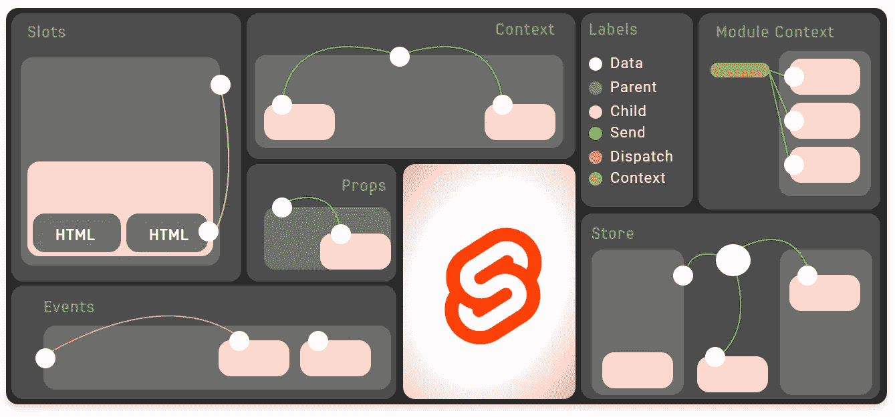
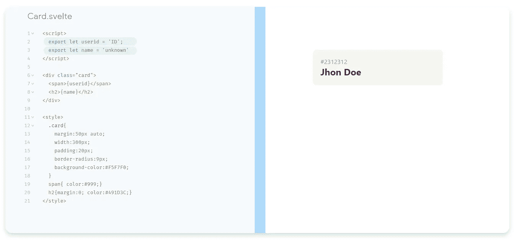
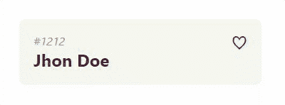
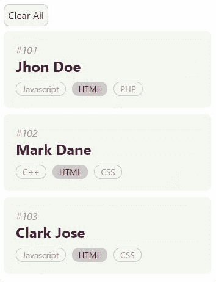

# 6 种简单的组件通信方式

> 原文：<https://betterprogramming.pub/6-ways-to-do-component-communications-in-svelte-b3f2a483913c>

## 在组件之间共享反应数据和事件



图片由作者提供。

现代 web 应用程序是建立在反应式组件之上的。苗条的应用程序由一个或多个组件组成。组件是一个可重用的自包含代码块，它封装了 HTML、CSS 和 JavaScript，将它们一起写入一个`.svelte`文件。

用组件设计用户界面的主要挑战是管理不同组件上的应用程序状态。在苗条，我们有强大的技术来有效地沟通的组成部分。

> “伟大的沟通始于联系。”
> 
> ——奥普拉·温弗瑞

让我们通过使用组件通信技术，结合对需求及其解决方案的理解，将这些点连接起来。

1.  将数据从父节点发送到子节点:**道具**
2.  在你的组件中渲染 HTML:**插槽**
3.  子通知事件给其父，带有可选数据:**事件**
4.  祖先将数据共享给他们的所有后代:**上下文 API**
5.  在组件的所有实例之间共享数据:**模块上下文**
6.  与任何组件共享数据:**存储**

在本文中，我们可以制作样本子组件，并应用所有不同的瘦组件通信技术。它不会涵盖每一个细节，但它给出了一个本质的更好的想法。如果您从基础到高级循序渐进地遵循每个示例。

# 1.小道具

在任何实际的应用程序中，您都需要将数据从一个组件向下传递到其子组件。为此，我们需要声明属性，通常简称为“道具”在 Svelte 中，我们用关键字`export`来做这件事。

用`Card.svelte`组件中的`export`关键字检查下面突出显示的代码。



带道具的卡片

只需导入卡片组件，将用户数据作为道具发送即可。

```
<script>
  import Card from './Card.svelte';
</script><Card userid="#2312312" name="Jhon Doe"/>
```

提示:在 Svelte 中使用 Typescript 将解决组件内部属性的类型检查。

# 2.时间

组件可能有多个子组件，通过使用插槽，我们可以定义子组件的位置。它基于 web 组件插槽提议。

```
<div class="card">
  <slot/>
</div>
```

默认槽可以被定义为子组件中的`<slot>` HTML 标签。

插槽帮助我们将组件设计为模板，我们基于命名的插槽注入 HTML。以下示例将显示带回退的命名插槽组件。


具有插槽的卡组件

# 3.事件

当我们设计组件时，从子组件捕获事件是一件有趣的事情。让我们用最喜欢的 toggle heart 按钮更新我们的 card 组件，并根据用户事件显示它已被填充。



心形标签示例。

为了调度事件，我们必须从 Svelte 导入`{createEventDispatcher}`。在子事件函数上，我们发送想要触发的数据和事件名称。

`dispatch(<eventName>, <data-object>)`源自`createEventDispatcher`

让我们看看下面的代码是如何做到的。

带有调度收藏夹按钮事件的 CardEvent.svelte 文件

我们从父节点获得三个属性 id、name、favor，并在单击`heartIcon`时用数据调度事件。

使用 CardEvent.svelte 的 App.svelte

我们使用扩展操作符`{...}`将`user`对象设置为子组件的道具，并监听`favorite`点击事件，当它发生时我们调用`whenFavored()`函数并将值设置为父对象。

## 奖金方法

1.  在多层嵌套组件上，可以使用事件转发方法来转发事件，如`<card on:favorite />`将事件传递给其父组件。它也适用于 DOM 事件。
2.  我们还可以将子组件绑定为对父对象的引用，并访问所有导出的子方法。例如，我们将`userCard`对象中的`Card`组件称为`<Card bind:this={userCard} />`。

# 4.上下文 API

我们现在正进入通信技术的高级但有用的特征。上下文 API 为我们提供了强大的机制来与子组件“对话”,而无需传递数据和函数作为道具或分派大量事件。

> “只有当我们以对接受者有意义的方式交流，而不是对我们自己有意义的方式交流，交流才是有效的。”
> 
> —里奇·西蒙兹

使用`setContext()`所需的祖先(顶层组件)及其所有后代(子组件)将使用`getContext()`获得数据看起来很简单，对吗？是的，就这么简单。

```
//App.svelte<script>
 import Card from './CardContext.svelte' 
 import {setContext} from 'svelte'; let user ={
  id:123456,
  name:'Jhon Doe',
  favor : true
 } 
 setContext('user', user);</script><Card/>
```

我们通过使用键`'User'`来设置用户对象，以使用它的所有后代。

CardContext.svelte

上下文的状态仅对其子代可用。如果您希望使用一个组件的多个实例，并且其中一个实例的状态不会干扰其他实例的状态，这可能会很有帮助。

# 5.**模块上下文**

在同一个组件的所有实例之间共享数据就像在模块脚本中添加变量一样简单。

让我们看一个例子，单击一个组件中的标签，并以有趣的方式突出显示同一组件的其他实例上的标签名称。



标签点击清除所有按钮

使用`users`对象在 App.svelte 父组件中创建所有卡片实例，并将用户数据作为道具发送。

App.svelte

我们还添加了一个模块方法`{clearAll}`来清除点击“Clear All”按钮时的高亮显示。

CardWithModuleContext.svelte

变量`tagSelected`在所有实例之间共享。以一种有趣的理解方式，我们添加了一个 100 毫秒的固定间隔来更新突出显示的标签。正如您所看到的，所有的逻辑都被添加到子组件中，并与其他实例“对话”。

# 6.商店

随着应用程序的发展，添加更多的功能意味着添加更多的组件。这往往会增加复杂性。此时，我们需要将应用程序状态置于组件的层次结构之外。内置的苗条商店可以方便地做到这一点。

在苗条商店中，我们可以保存单个对象或一个数组。斯韦特有许多不同种类的商店。存储可以是可写的、可读的、派生的或自定义的。

让我们用表单和列表组件创建一个简单的可写书店。

*BookStore.js*

```
import { writable } from 'svelte/store'export let bookStore = writable([
 {name:"Hamlet",author:"William Shakespeare"},
 {name:"The Great Gatsby",author:"F. Scott Fitzgerald"}
]);
```

*BookList.svelte*

```
<script>
 import { bookStore } from './BookStore.js' 
</script>
<ul>
 {#each $bookStore as book}
  <li>{book.name} - {book.author}</li>
 {/each} 
</ul>
```

*BookForm.svelte*

```
<script>
 import { bookStore } from './BookStore.js' 
 let bookName;
 let author;
 const addNew = ()=>{
  $bookStore = [{name:bookName, author:author},...$bookStore,];
 }
</script>
<input type="text" bind:value={bookName} placeholder="Book Name"/>
<input type="text" bind:value={author} placeholder="Author Name"/>
<button on:click={addNew}>+ Add Book</button>
```

*App.svelte*

```
<script>
 import BookList from './BookList.svelte'
 import BookForm from './BookForm.svelte' 
</script>
<BookForm/>
<BookList/>
```

我们将`bookStore`创建为一个可写数组。通过使用 sugar 语法`$`访问数据，它被导入到表单和列表组件中。是啊！`$bookStore`是反应式的，可以用在我们应用的任何地方。

# 上下文与存储

上下文和存储二者是相似的。不同之处仅在于应用程序的任何部分都可以访问存储，而上下文只对其后代可用。

# 资源

在这篇文章中解释的所有例子都可以在苗条的 REPL 找到。通过导入不同的卡组件来检查结果，以测试更新 App.svelte 文件。([演示](https://svelte.dev/repl/4ba0194c810b487b88c266c115c2d4dc?version=3.25.1))

# 结论

组件之间的通信是应用程序设计中最重要的部分。在 Svelte 中，我们有内置的状态管理功能，可以为我们设计更好的应用程序提供良好的灵活性。