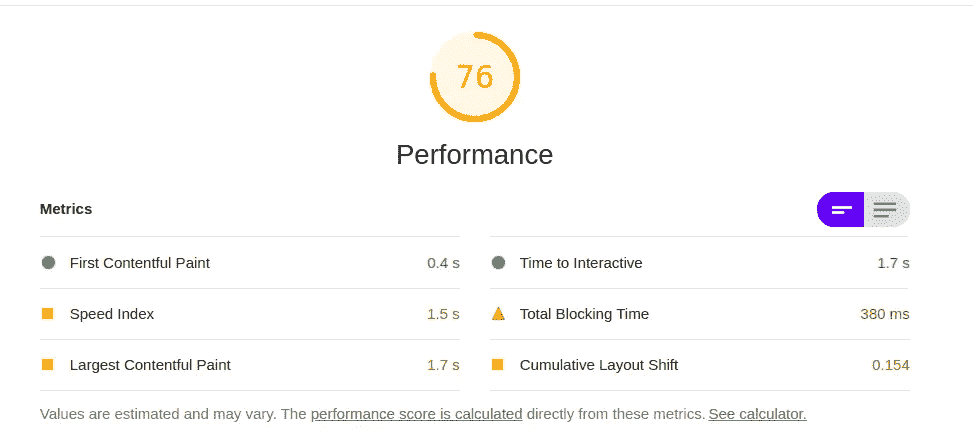
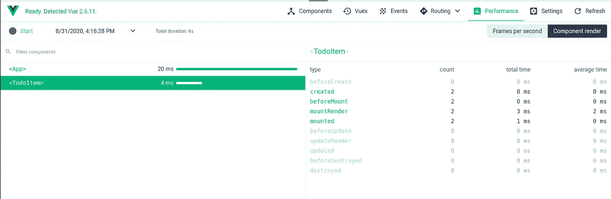
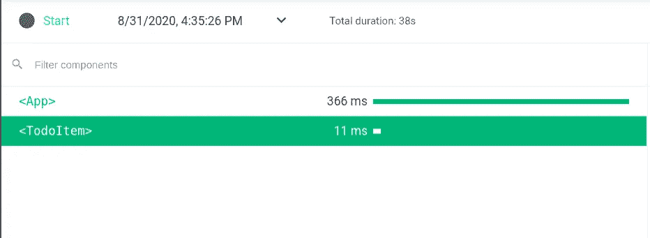
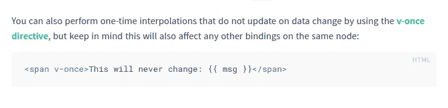

# 加速 Vue.js 应用程序的 6 种方法

> 原文：<https://betterprogramming.pub/6-ways-to-speed-up-your-vue-js-application-2673a6f1cde4>

## 一份清单，你可以用它来确保你的 Vue 应用快如闪电


凯文·巴加特在 [Unsplash](https://unsplash.com/s/photos/website?utm_source=unsplash&utm_medium=referral&utm_content=creditCopyText) 上拍摄的照片

如果你曾经使用过 Google 的 Pagespeed Insights 或者 Google Lighthouse，那么你会看到这个网页性能评估:



你会收到一组统计数据，然后对你的网站的速度进行诊断。

有些诊断非常有用，可以指出一些简单的修复、未使用的文件，以及缓慢或占用大量空间的请求。

其他诊断，如主线程工作和 Javascript 执行时间确实显示了问题，但它们并不能真正帮助您解决问题。

在本文中，我将详细介绍确保 Vue 应用程序尽快运行的步骤。通过这些步骤，您将确切地知道要修复什么，而不必猜测任何事情。

# 1.仅更新需要的内容

使用 VueJS 可能遇到的最糟糕的问题之一是过多地渲染相同的元素或元素列表。为了理解为什么或如何发生这种情况，我们必须了解 Vue 的反应性。

这个例子来自官方的 Vue.js 文档，它显示了哪些属性是反应性的，哪些不是。Vue 中有许多反应性元素:分配给数据对象的属性、计算属性或依赖于反应性属性的方法。

但是普通的 JavaScript 代码，比如`{{ 'value' }}`或`{{ new Date() }}`，Vue 不会将其作为一个反应性属性进行跟踪。

那么反应性和复制渲染有什么关系呢？

假设您的`data`对象中有一个这样的对象数组:

```
values: [{id: 1, t: 'a'}, {id: 2, t: 'b'}]
```

你用`v-for`渲染它:

```
<div v-for="value in values" :key="value.id">{{ value.t }}</div>
```

当一个新元素被添加到列表中时，Vue 将重新呈现整个列表。不服气？试着这样写:

```
<div v-for="value in values" :key="value.id">
  {{ value.t }}
  {{ new Date() }}
</div>
```

JavaScript `Date`对象不是被动的，所以它不会影响渲染。只有当元素必须再次呈现时，才会调用它。在这个例子中，你将会看到，每次从`values`中添加或删除一个值，一个新的日期将会出现在所有呈现的元素上。

在一个更优化的页面中你应该期待什么？您应该只期望新的或改变的元素显示一个新的`Date`，而其他元素根本不应该被呈现。

那么，`key`是做什么的，为什么我们要通过它呢？属性帮助 Vue 理解哪个元素是哪个。如果数组的顺序改变了，`key`会帮助 Vue 将元素重新排列到位，而不是一个一个地重新排列。

指定一个`key`很重要，但这还不够。为了确保您获得最佳性能，您需要创建`Child`组件。没错，解决方案非常简单。你只需要把你的 Vue 应用分成小的、轻量级的组件。

```
<item :itemValue="value" v-for="item in items" :key="item.id"></item>
```

仅当特定项目发生反应性变化时，该项目组件才会更新(例如使用 [Vue.set](https://vuejs.org/v2/api/#Vue-set) )

使用组件呈现列表的性能提升是巨大的。如果在数组中添加或删除了一个元素，Vue 不会再一个接一个地渲染所有的组件。如果数组是排序的，Vue 只是依靠提供的`key`来打乱元素。

如果组件真的很轻量级，你可以做得更好。您可以传递类似于`:itemText="value.t”`的原始属性(字符串或数字),而不是传递类似于`value`的完整对象。这样一来，`<item>` 只有在您传递的原始值发生变化时才会被重新渲染。这意味着即使是被动的变化也会导致更新——但这是不必要的！

# 2.消除重复渲染

不必要地多次呈现完整列表或重元素是一个相当狡猾的问题，但这很容易发生。

假设您有一个组件，它在数据对象中有一个`entities`属性。

如果您遵循前面的步骤，那么您可能有一个子组件来呈现每个实体。

```
<entity :entity="entity" v-for="entity in entities" :key="entity.id" />
```

实体模板如下所示:

它输出`entity.value`，但也从`vuex`状态使用`user`。现在假设您有一个`auth`函数来刷新用户令牌，或者全局用户属性以任何方式被更改。这将导致整个视图随时更新，即使`user.status`保持不变！

有几种方法可以处理。一个简单的方法是将`user.status`值作为`userStatus`道具从父节点传递。如果值不变，Vue 不会再次渲染它，因为它不需要。

这里的关键是要意识到渲染的依赖性。任何改变的属性、数据值或计算值都会导致重新渲染。

如何识别重复的渲染？

首先下载官方 [Vue.js 开发工具](https://chrome.google.com/webstore/detail/vuejs-devtools/nhdogjmejiglipccpnnnanhbledajbpd?hl=en)！

然后使用“性能选项卡”来衡量您的 Vue 应用程序的性能。按 start 和 stop 运行性能检查，最好是在应用程序加载期间。



Vue.js 开发工具截图

然后转到“组件渲染”选项卡。如果您的页面呈现 100 个组件，那么您应该会看到 100 个`created`事件。

这里需要注意的是`updated`事件。如果更新的事件比创建的事件多，而实际值没有更新，很可能是重复的更改导致了重复的渲染。

如果您的代码多次更改`entities`值，而不是批量更新，就会发生这种情况。或者，如果您使用 Firestore 之类的实时数据库，并且获得了比预期更多的快照，也会发生这种情况。(Firestore 可以在每次更新时发送许多快照，尤其是如果您有更新相关文档的 Firestore 触发器)。

这里的解决方案是避免不必要地多次更改实体。对于 Firestore 快照，您可以使用去抖或节流功能来避免过于频繁地更改`entities`属性。

# 3.优化事件处理

不是所有的事件都是平等的，因此你必须确保你对每个事件都进行了正确的优化。

两个很好的例子是`@mouseover`和`window.scroll`事件。即使在正常使用的情况下，这两种类型的事件也可能被触发多次。如果您现有的事件处理程序进行高成本的计算，这些计算将每秒运行多次，导致您的应用程序延迟。一种解决方案是使用去抖功能来限制处理这些事件的次数。

# 4.移除或减少慢速组件

当您自己创建新组件时，尤其是导入第三方组件时，您需要确保它们运行良好。

您可以使用 Vue.js 开发工具的“性能”选项卡来估计您正在使用的每个组件的渲染时间。当添加一个新的组件时，你可以看到与你自己的组件相比渲染花费了多少时间。

如果新组件比您自己的组件花费更多的时间，那么您可能需要寻找替代组件，删除它，或者尝试减少它的使用。



# 5.渲染一次



这是来自 Vue.js 官方文档。如果你有一些元素，一旦所有的东西都被挂载了，那么你可以使用 v-once 指令。

假设您的应用程序中有一部分要求数据在整个会话期间不发生变化。通过使用 v-once 指令，可以确保这个部分只呈现一次。

# 6.虚拟滚动

这是优化 Vue 应用性能的最后一步。你曾经在桌面上滚动过脸书吗？(或者 Twitter，或者 Instagram，或者任何流行的社交媒体应用？)我打赌你有！你可以无休止地滚动，页面不会变慢。但是如果你有一个很大的列表要在你的 Vue 应用中呈现，你会看到页面越长越慢。

如果您决定实现无休止的滚动而不是分页，您可以并且应该使用这两个开源项目中的一个来实现虚拟滚动和呈现巨大的项目列表:

*   [https://github.com/tangbc/vue-virtual-scroll-list](https://github.com/tangbc/vue-virtual-scroll-list)
*   [https://github.com/Akryum/vue-virtual-scroller](https://github.com/Akryum/vue-virtual-scroller)

我两种都用过，以我的经验来看,`vue-virtual-scroll-list`更好，因为它更容易使用，并且不依赖会破坏 UI 的绝对位置。

# 结论

尽管本指南没有考虑所有场景，但这六种方法涵盖了 Vue 应用程序的许多常见性能问题。

实现出色的前端性能比您可能意识到的更重要。开发者通常拥有比最终使用你的应用的用户更好的电脑。你的用户可能甚至不使用电脑，而是使用速度慢且过时的智能手机。

因此，这取决于我们，开发人员，尽我们所能，提供最佳的用户体验。您可以使用这六种方式作为检查清单，以帮助确保您的 Vue 应用程序为所有用户顺利运行。