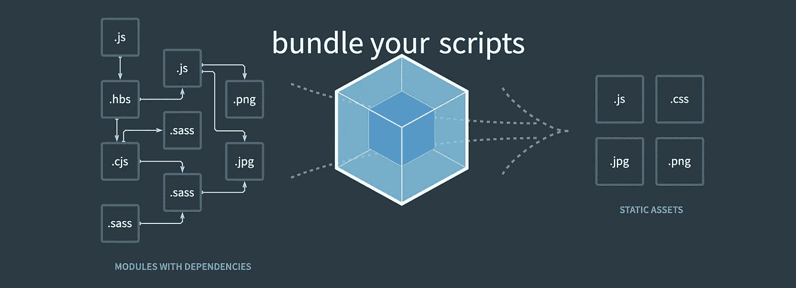
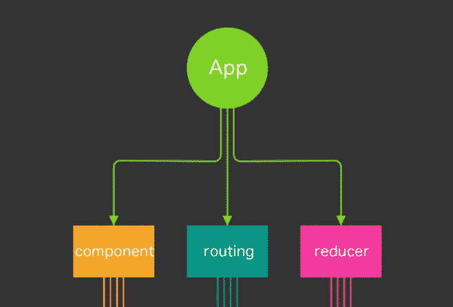

# 面向高级 React 开发人员的 6 个 Webpack 概念

> 原文：<https://betterprogramming.pub/6-webpack-concepts-for-advanced-react-developers-d016da2cad52>

## 帮助您理解从内部做出反应的概念

照片由 [Brunno Tozzo](https://unsplash.com/@brunnotozzo?utm_source=unsplash&utm_medium=referral&utm_content=creditCopyText) 在 [Unsplash](https://unsplash.com/s/photos/package?utm_source=unsplash&utm_medium=referral&utm_content=creditCopyText) 上拍摄。

我们通常使用`create-react-app`来搭建一个新的 React 应用程序，然后就到此为止。

但是在幕后，许多图书馆都在努力确保一切正常运行。而 [**webpack**](https://webpack.js.org/) 就是其中最重要的。

今天，我们将深入探讨 webpack，并尝试理解与 **React 开发**相关的 webpack 的不同部分。

# 有什么问题？

我们知道我们的浏览器除了 HTML、JavaScript 和 CSS 什么都不懂。所以显而易见的问题是。

*   我们的浏览器如何理解其他文件，比如`.jsx`
*   所有不同的文件是如何加载到浏览器中的？
*   我们的应用程序是如何捆绑的？
*   我们如何优化它们？

# 拯救网络包

Webpack 是来拯救我们的！这是最受欢迎的捆扎机，原因很明显！

**webpack** 所做的是将所有内容转换成**浏览器可读的**文件，如下图所示:

来源:[网络包](https://webpack.js.org/)

# 你为什么要在乎？

大多数时候你不会。但是 webpack 的知识可以在一些高级情况下帮助您:

*   从头开始构建应用程序
*   性能优化
*   实现微前端

一般来说，对捆绑过程有一个大致的了解会让你对自己的手艺更有信心，并了解生产系统中的错误。

# Webpack 如何工作

通常，webpack 通过一个名为`webpack.config.js`的文件进行配置。这是我们可以配置一切的地方！

让我们从一个简单的配置文件开始，试着理解它的各个部分。

## 例子

以下是一个非常简单的 webpack 配置文件:

我们来谈谈`entry`和`output`。

# 1.进入

`entry`是你申请的切入点。这是 webpack 开始旅程的地方。我们知道我们的 React 应用程序就像一棵树。所有组件从`App.js`开始延伸。

作者照片。

但是我们的`App.js`住在哪里呢？它存在于`index.js`文件中，这就是为什么 webpack 通过`index.js`进入应用程序，并创建一个依赖图来确定哪些文件需要首先加载。

# 2.输出

这是另一个容易理解的概念。所有工作完成后，webpack 创建一个包文件。在`output`中，我们可以指定输出文件的**名称**和**位置**。

它也有其他用途。如果您想为版本管理的生产系统生成动态包名，您可以在这里完成！

让我们更进一步，试着理解我们的`**.jsx**`或`**.css**`文件是如何处理的。

# 3.装货设备

加载器是 webpack 中一个非常重要的概念。他们就像编译器。Webpack 检查特定类型的文件，并使用适当的加载程序来处理它们。

`loader`的典型配置如下:

现在，看`module`部分。这需要一系列的规则。每个规则都有几个部分:

*   `test` - >检查某种文件类型。它使用正则表达式。
*   `use` - >它指定了用于该特定文件类型的加载器列表。
*   `include` - >应该处理哪些文件。
*   `exclude` - >哪些不应该处理。

有时我们需要不止一种类型的加载程序来加载一个特定的文件。一个很好的例子是加载`CSS`文件。规则是:

这里，`css-loader`和`style-loader`都用来处理文件。这里需要注意的一点是，这些加载程序的加载顺序是相反的。

这意味着首先`css-loader`将工作，然后`style-loader`将处理`css-loader`产生的输出。

同样，对于我们的`.scss`文件:

# 4.插件

插件是 webpack 的另一个非常重要的方面。插件是 webpack 如此强大的主要原因。

插件就像库。他们可以进入编译过程的任何阶段，做他们想做的任何事情。

在上面的例子中，我们使用了一个名为`clean-webpack-plugin`的插件。这个插件的作用是在我们每次运行构建命令时清理输出文件夹。

有很多你可以利用的插件。有兴趣可以参考 [webpack 的官网](https://webpack.js.org/plugins/)。

# 5.方式

这是一个很容易理解的概念。您可能希望为您的开发和生产使用不同的设置。对此，可以使用`mode`。

如果您将模式设置为`production`，那么您的输出束将被缩小和优化。

# 6.开发服务器

这是应用程序的最终设置。在开发应用程序时，您不希望每次更改时都要编译它。这就是为什么您的应用程序需要一个`devServer`设置。

现在，这个设置将为您之前设置为`output`的`dist`中的应用程序提供服务。

# 结论

给你。现在您应该对 webpack 及其不同部分有了基本的了解。如果您感兴趣，这里有一个完整的设置:

祝您愉快！

**有话要说？通过** [**LinkedIn**](https://www.linkedin.com/in/56faisal/) 联系我

# 资源

*   网络包:[https://webpack.js.org/](https://webpack.js.org/)
*   外挂:[https://webpack.js.org/plugins/](https://webpack.js.org/plugins/)
*   模块:**[https://webpack.js.org/concepts/modules/](https://webpack.js.org/concepts/modules/)**