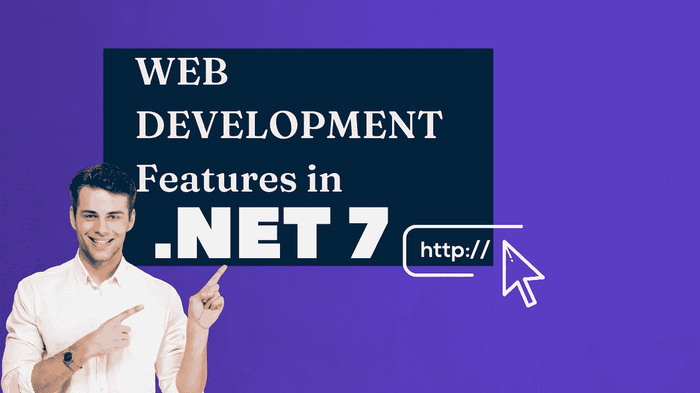
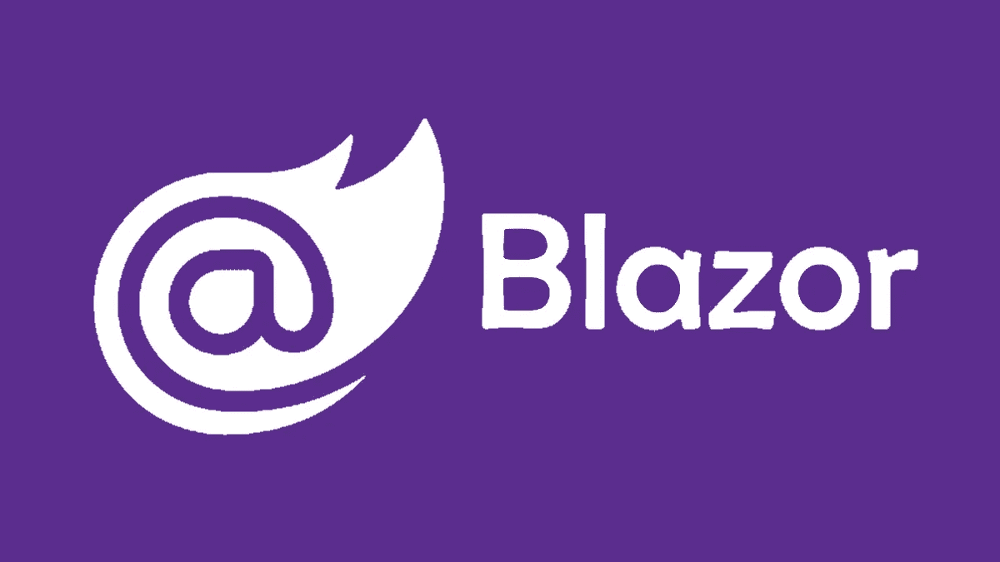
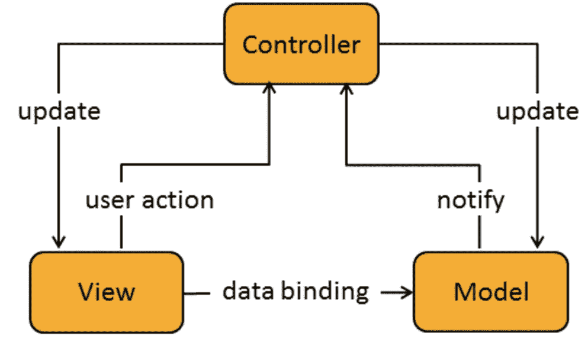

# 6 个有价值的特性。面向任何 Web 开发人员的. Net 7

> 原文：<https://betterprogramming.pub/6-worthy-features-in-net-7-for-any-web-developer-6ac42b20426b>

## 。NET 7 使您的 web 开发工作更加容易

图片由作者通过 Canva 制作

的第二次预览。NET 7.0 已经到来，为 web 开发人员带来了至关重要的改进。

路线图给你一个很好的预览即将到来的版本。一些特性还在讨论中，而另一些已经实现了。

关注……的透明发展仍然令人兴奋。GitHub 上的 NET。

# 1.布拉佐尔

[Blazor 标志](https://www.google.com/url?sa=i&url=https%3A%2F%2Fwww.tremplin-numerique.org%2Fde%2FWas-ist-das-Blazor-Web-Framework-von-Microsoft-und-sollten-Sie-es-verwenden%253F&psig=AOvVaw1gDcqRQzTllBjJunQAb0ao&ust=1654004965161000&source=images&cd=vfe&ved=0CAwQjRxqFwoTCID12uiuh_gCFQAAAAAdAAAAABAD)

介绍了。NET 6，Blazor 正在准备桌面。

这包括性能、可访问性和安全性，以及考虑不同屏幕分辨率的可能性。换句话说，现在增加了对桌面的支持，这是以前没有的。

Blazor 仍然是版本 7 路线图中的一个大问题。

Blazor 的问题列表是路线图中最长的。除了性能优化和多线程支持，Blazor 通常是微调。对它的需求似乎如此之大，以至于微软继续投入大量精力。

# 2.最小的 API 改进

[最小 API](https://docs.microsoft.com/en-us/aspnet/core/fundamentals/minimal-apis?view=aspnetcore-6.0) 得到了一系列进一步的改进。

仅举几个例子，对端点过滤器的支持已经实现。除了更好地支持查询或头参数的绑定。此外，请求主体现在可以作为流读取，这优化了文件上载。

还计划改进最小 API 的语法。

应可以将路线定义为组。可以包含更多的组。这将使构造端点变得更加容易:

认证领域也应该简化。

身份验证的配置通常是一个非常复杂的话题。特别是 [OAuth](https://fusionauth.io/learn/expert-advice/oauth/what-is-oauth?utm_campaign=Content%20Push%20Test%202%2F22&utm_source=ppc&utm_medium=google&utm_term=oauth%202&gclid=Cj0KCQjw1tGUBhDXARIsAIJx01lj8X2CMM4DrJn0jnSOXBH1mw2ISF01f8km6HtuVKeD3uMxMhgppOQaAreaEALw_wcB) 配置需要一定的知识。因此，对于初学者来说，复杂的配置将被简化。

最小 API 似乎满足了最常见的需求。

这将使 API 开发者更加感兴趣。

# 3.手动音量调节

[MVC 概述](https://www.google.com/url?sa=i&url=https%3A%2F%2Fblogs.sap.com%2F2016%2F01%2F02%2Fan-insight-into-model-view-controller-mvc-in-the-context-of-sap-ui5%2F&psig=AOvVaw0WIfC41EhO9WW0i1iZzP3D&ust=1654005085769000&source=images&cd=vfe&ved=0CAwQjRxqFwoTCPC7q5-vh_gCFQAAAAAdAAAAABAe)

[MVC](https://blogs.sap.com/2016/01/02/an-insight-into-model-view-controller-mvc-in-the-context-of-sap-ui5/) 包括经典的模型-视图-控制器系统和 Razor 页面，以及 Web API。

最小的 API 特性被添加到模型绑定中，这也将被添加到 MVC 中。

模型绑定确保动作方法的参数填充了值。以前，复杂类型是通过请求体绑定的，简单类型是通过路由或查询字符串绑定的——完全按照这个顺序。

Minimal API 还支持通过依赖注入容器绑定复杂类型。如果复杂类型在依赖注入容器中注册为服务，它们将被传递给 action 方法。这在将来对于控制器和 razor 页面也是可能的。

不能从字符串直接转换为相应类型的类型被视为复杂类型。这使得将服务注入动作方法成为可能。不再需要专门注入控制器的构造函数。

一个`TryParse`模型活页夹也是新的。这是在所有其他模型绑定之前执行的，如果需要，可以删除。目标是能够绑定实现`TryParse`方法的所有类型。

# 4.链接

许多小的创新都与链路生成和路由有关。链路生成甚至有自己的路线图，其中包含经典路由的问题，也包含较新的端点路由的问题。

当然，让链接生成更加类型安全是一个好主意。

与将控制器名和动作名作为字符串传递不同，泛型和类型安全的变体绝对有意义。该特性尚未实现，但是 API 建议很有希望，如下所示:

# 5.限速

速率限制是一种限制每个会话请求的技术。

结果:应用程序的安全性和稳定性更高。DDOS 攻击更难完成。客户端可以被限制为每分钟一定数量的请求。

微软可能会在 Preview 3 中为 Kestrel、Yarp 以及中间件实现速率限制。

因此，可以在 HTTP 服务器级别或应用程序级别配置速率限制。在应用程序级别，您决定通过中间件对所有端点或仅对特定端点应用限制。

# 6.ASP.NET 核心 7.0 运行时

一个重要的焦点在于 6.0 和 7.0 两个版本的性能。

HTTP/3 在协议层提供了一些速度优势。这可以从 HTTP/3 支持中看出。在 ASP.NET 核心 7.0 中，此功能现已最终确定。

各种性能之间的实际输出缓存最终支持优化。

以前，缓存头被设置为控制客户端缓存和 UI 级别的缓存或特定的数据缓存。输出缓存现在在中间件级别存储完全生成的输出。

# 资源

*   [ASP.NET 核心路线图。网 7](https://github.com/dotnet/aspnetcore/issues/39504)
*   [链接生成改进](https://github.com/dotnet/aspnetcore/issues/38121)
*   [平台支持](https://dotnet.microsoft.com/en-us/platform/support/policy/dotnet-core#whats-covered)