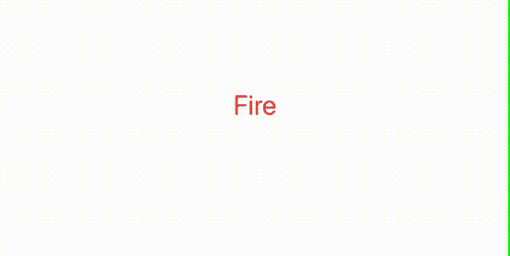

# SwiftUI 中的 7 个警报视图选项

> 原文：<https://betterprogramming.pub/7-alertview-options-in-swiftui-691ccb742d22>

## gif 中 AlertView 的不同用法

罗伯特·哈弗利在 [Unsplash](https://unsplash.com/s/photos/tech?utm_source=unsplash&utm_medium=referral&utm_content=creditCopyText) 上拍摄的照片

可悲的是，SwiftUI 2.0 没有解决的一个缺点是`AlertView`，它仍然有些过于简单。下面是创建基本代码的模板代码:

Swift 1.0 中的简单警报视图

这给了我们这个:

基本 SwiftIU 警报

然而，大多数`alertView`需要做的不仅仅是警告你应用程序已经做了一些事情——他们需要更多的按钮。现在，即使在 SwiftUI 1.0 中，您也可以添加两个按钮——一个主要按钮和一个次要按钮，以及操作。

看起来像这样:

带有两个按钮的标准 SwiftUI 警报

到目前为止，一切顺利。但是你知道这是怎么回事——你的客户当然想要更多。SwiftUI 中的标准`alertView`让你做不了更多的事情。你需要一个不同的解决方案。你有什么选择？与 SwiftUI 一起，我们可以使用一个`actionSheet`，就像这样:

看起来像这样:

UISwift 行动表

你能增加多少个动作？当我写这篇文章时，我不确定。我原以为会有一些合理的限制。我试着增加 16 种可能性[这很愚蠢],它只是滚动。所以它看起来是无限的，但它不是 T4，你知道你的客户会想要更多。

但是在我们放弃之前，我们在 SwiftUI 中还有几个小技巧。我们可以选择定制的`alertView`。这是其中一个带有开关的代码。显然，天空是这方面的限制，你可以添加任何你能想象/建立的控制。

看起来像这样:

SwiftIU 自定义警报视图

当然，您也可以使用不同的过渡让这个视图出现在屏幕上。这是一个看起来很像动作表的版本，只是这是一个自定义视图。

但是，你知道也可以使用`UIAlertViewController`。万一他已经卖出了一个，而其他的都失败了，一切都还没完。下面是在 SwiftUI 中实现这一点的代码:

这里有一个提示:

SwiftUI 中的 UIAlertViewContoller

至此，我结束了这篇文章。

保持冷静，继续编码！