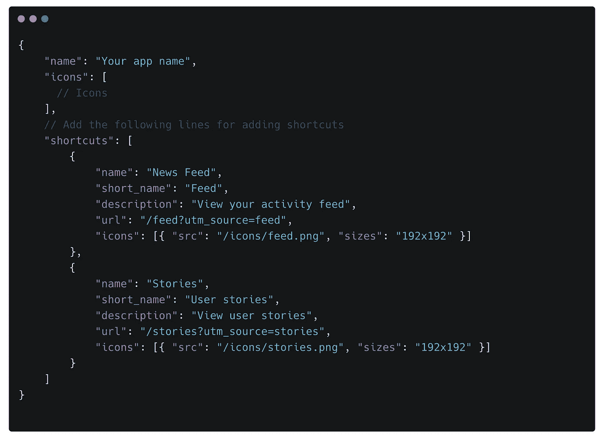
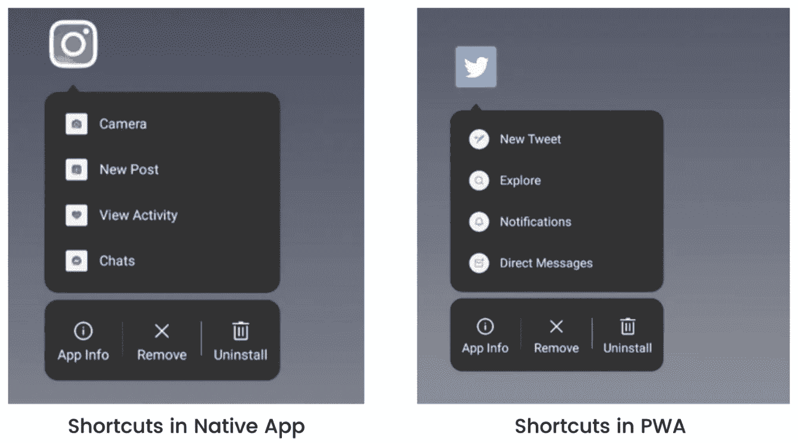
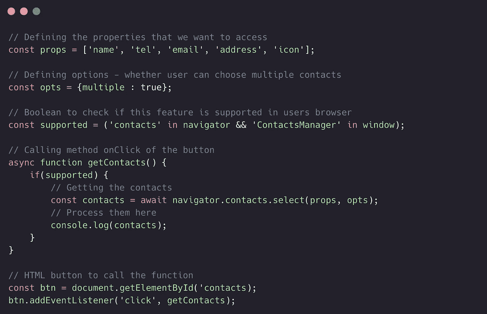
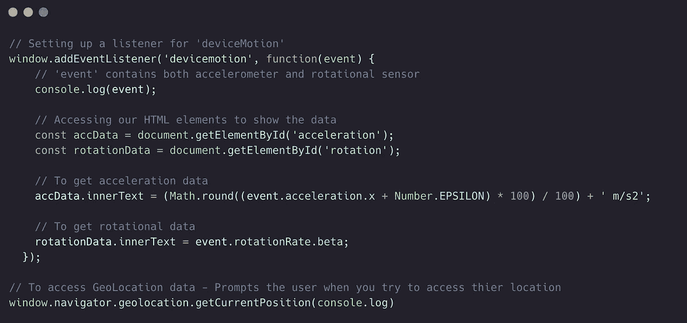
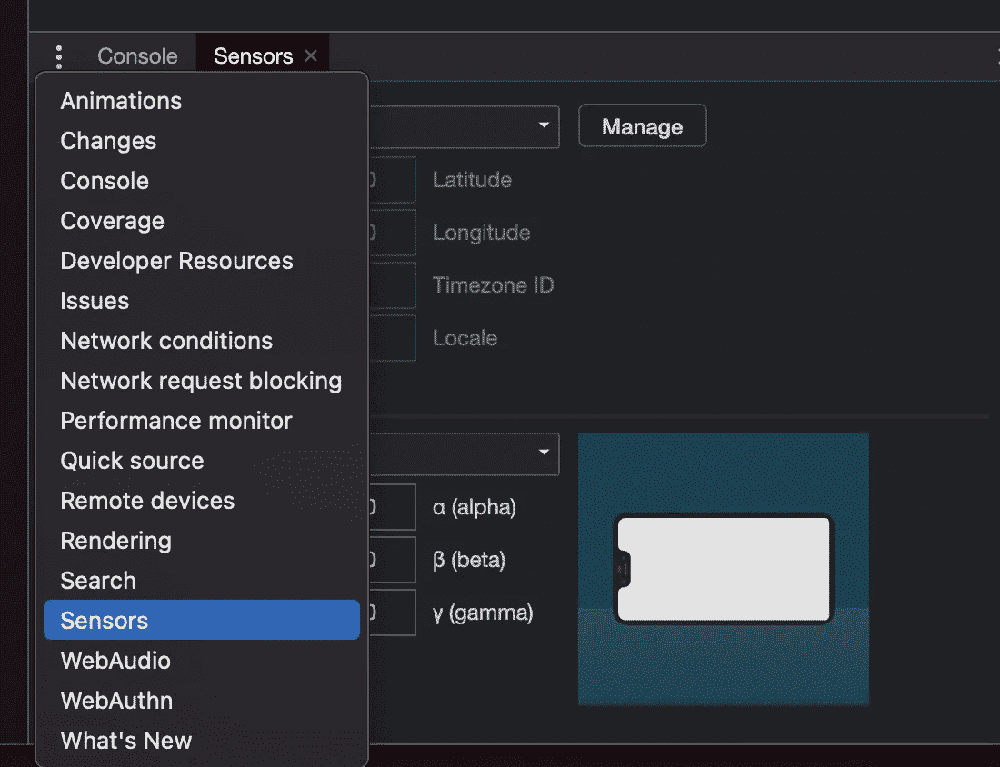
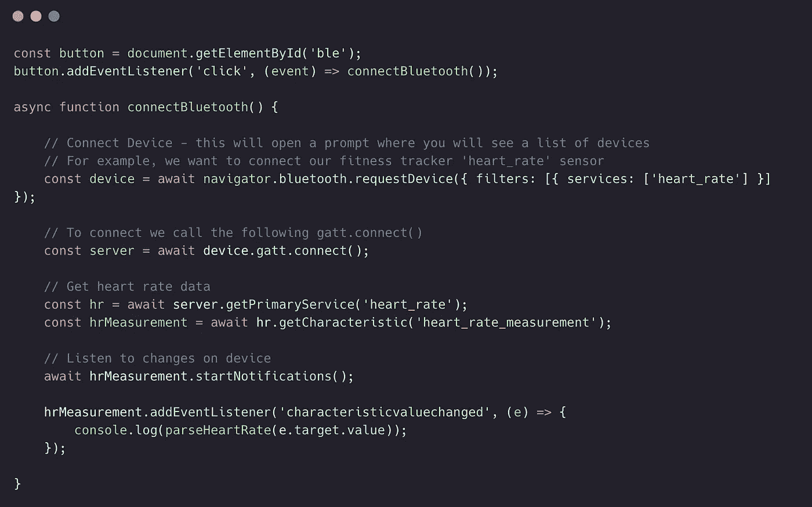
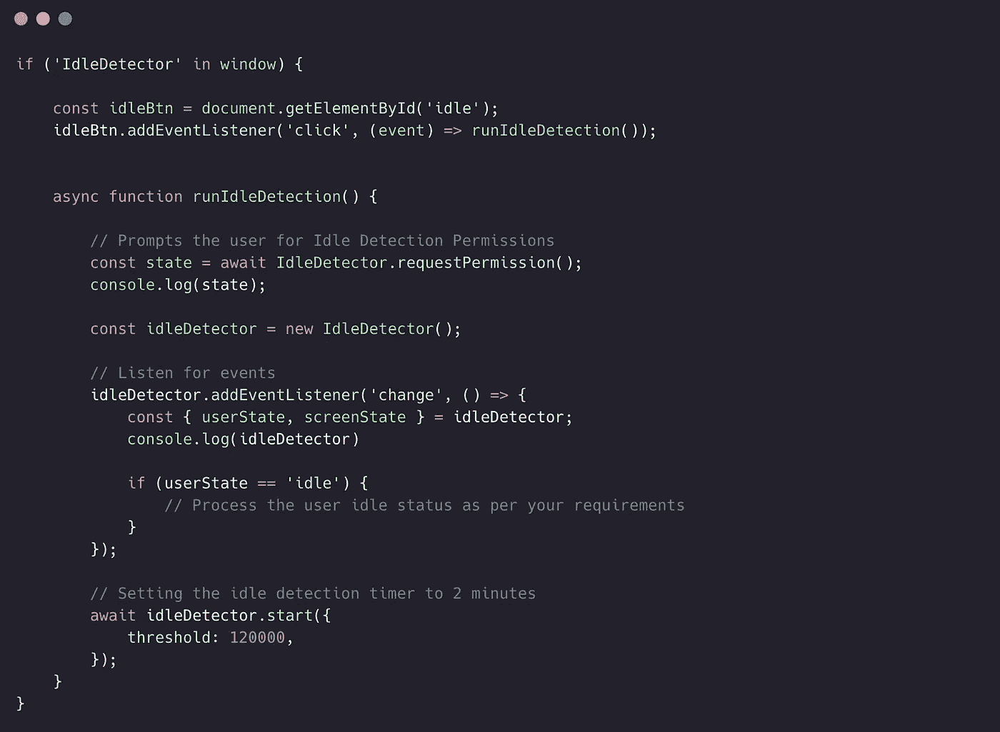
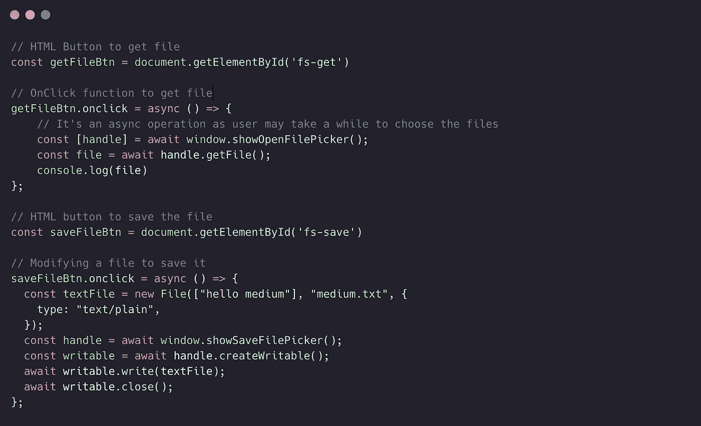
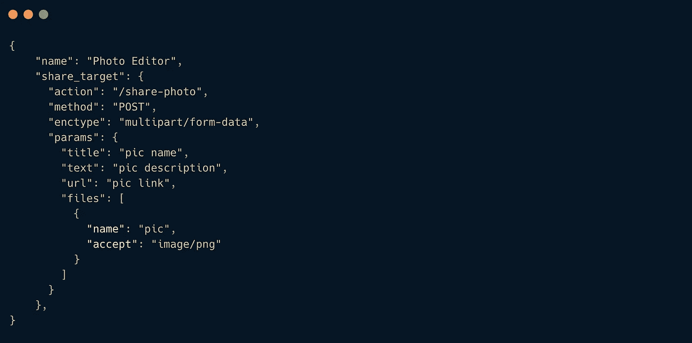
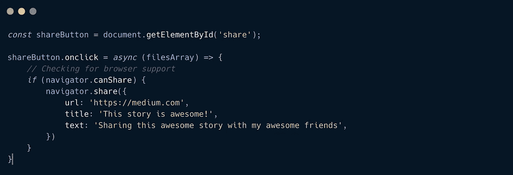

# 你(可能)不知道的 7 个惊人的 Web APIs

> 原文：<https://betterprogramming.pub/7-amazing-web-apis-you-probably-didnt-know-existed-2db46f723ab9>

## 我们不必急于为这些特性构建本地应用

照片由[埃迪·科普](https://unsplash.com/@fiveohfilms?utm_source=medium&utm_medium=referral)在 [Unsplash](https://unsplash.com?utm_source=medium&utm_medium=referral) 拍摄

渐进式 web 应用程序(PWA)的概念已经有一段时间了，作为开发人员，我们知道通过添加服务工作者、清单和徽标来使传统 Web 应用程序成为 PWA 是多么容易。

# 1.为已安装的 Web 应用添加快捷方式

在设备上安装 web 应用程序会将您的应用程序图标添加到他们的应用程序菜单中，但您可以像任何其他本机应用程序一样为您的应用程序自定义快捷方式。

因此，不用每次都打开主屏幕，你的用户可以选择使用快捷方式访问应用程序的热门部分。代码如下:

您可以通过修改`manifest.json`文件来实现

完成后，你会在 PWA 中看到快捷方式，就像任何其他本机应用程序一样。

# 2.联系人选取器

假设您想要实现一个共享功能，让您可以访问用户的联系人。

下面的[代码](https://gist.github.com/devDeejay/0a8c2d3dbdf73a35a7a343dcc19e0543) 展示了如何在您的 web 应用程序中实现此功能:

在您的 Web 应用程序中实现联系人选择器

为了成功执行这段代码，它需要在 HTTPS 上执行，并且您需要建立一个 SSH 隧道来在本地开发和测试这段代码。

# 3.地理定位和设备运动

如果您想从用户的设备访问地理位置和运动传感器数据，您可以通过使用[代码](https://gist.github.com/devDeejay/6aae063ba7aa1f8bad0f17053070200f)在您的 web 应用程序中轻松完成:

请确保在开发工具中启用“传感器”面板，这样您就可以模拟各种设备方向、移动甚至位置。

查看以下页面，深入了解如何在浏览器中使用传感器数据—[https://web.dev/generic-sensor/](https://web.dev/generic-sensor/)

# 4.使用外部设备

如果需要使用具有蓝牙或 NFC 功能的物联网设备，我们通常需要查找原生移动应用，但现在不再需要了。我们现在可以构建一个可以与外部设备协同工作的 web 应用程序。下面是[代码](https://gist.github.com/devDeejay/dfe5dd080a8da72b1129942e310dd2bc):

生成的数据是二进制的，需要额外的处理，您可以在 Google 上搜索以了解更多信息。

# 5.空闲检测

在某些情况下，您可能想知道用户当前是否正在与应用程序交互，或者设备屏幕是打开还是关闭的。假设您必须为实时聊天 web 应用程序实现“活动状态”图标。

下面是完成这项工作的[代码](https://gist.github.com/devDeejay/c0d851c004bb92f17b6d2b6b49431c88):

# 6.文件系统

你可能已经在网上实现了一个文件选择器，但是如何构建一个像 IDE 或视频/照片编辑 web 应用程序那样一起读取所有文件的应用程序呢？

到目前为止，对浏览器的支持是有限的，所以需要提醒一下。

让我们来看看[代码](https://gist.github.com/devDeejay/b603f412318e56165898a49280a08d91):

# 7.共享/共享目标

假设您已经构建了一个图像编辑渐进式 web 应用程序，并且您希望当用户单击照片上的共享按钮时，您的应用程序会出现在建议中。

如果你想实现共享功能——就像本地应用程序一样——那么更新`manifest.json`文件就很简单，如[代码](https://gist.github.com/devDeejay/28c710739d9dac9556b9ed3dc8ac0475)所示:

此外，如果你想将编辑过的照片从你的网络应用程序分享到 Instagram 或 Twitter 等其他应用程序，你不必通过超链接来完成。

相反，您可以使用[代码](https://gist.github.com/devDeejay/bccbd014880d7ff46364ad9037a39380):

您可以探索更多令人惊叹的 web APIs:

*   [Web VR/AR](https://medium.com/@kristen.carter/build-your-next-ar-vr-web-app-using-javascript-32d3252e5756)
*   [内容索引](https://developers.google.com/search/blog/2016/11/building-indexable-progressive-web-apps)
*   [支付](https://medium.com/dev-channel/web-payments-payment-request-api-and-google-pay-a1073e405235)
*   [语音识别](https://developers.google.com/web/updates/2013/01/Voice-Driven-Web-Apps-Introduction-to-the-Web-Speech-API)
*   [Web RTC](https://codelabs.developers.google.com/codelabs/webrtc-web#0)
*   [本地字体访问](https://web.dev/local-fonts/)

# 有一个陷阱！

*   某些 Web APIs 可能在某些平台/浏览器上可用，而在其他平台/浏览器上可能不可用，特别是苹果，它有时会阻止/不实现 Safari 的某些 API。
*   地理围栏、屏幕亮度和唤醒锁等功能可能在您的 Web 应用程序中不可用。

谢谢你读了这个故事。我希望你今天学到了新东西！

请在评论中分享一些令人惊叹的 web APIs。

回头见！