# 我早期用来重写 JavaScript 代码的 7 个技巧

> 原文：<https://betterprogramming.pub/7-approaches-to-rewriting-javascript-from-my-early-days-c6ada526d55f>

## 3.移除过多的中间函数返回


照片由[欧文·史密斯](https://unsplash.com/@mr_vero?utm_source=unsplash&utm_medium=referral&utm_content=creditCopyText)在 [Unsplash](https://unsplash.com/s/photos/javascript-code?utm_source=unsplash&utm_medium=referral&utm_content=creditCopyText) 上拍摄

当我回到过去编写的 JavaScript 代码库时，我有时会遇到现在通常以更紧凑和可读的方式编写的代码。事实上，特定的旧代码模式如此突出，以至于当我看到它们时，很难不重构它们。

下面是我早年使用的七个旧代码模式的例子，以及我通常喜欢如何重写它们。

# 1.删除不必要的括号

在使用方括号深入研究 PHP 中的对象之后，我很早就将这个习惯带入了 JavaScript 的编写中。下面是一个例子，我检查了一本书的`preface`属性，以便获得它的`intro`属性:

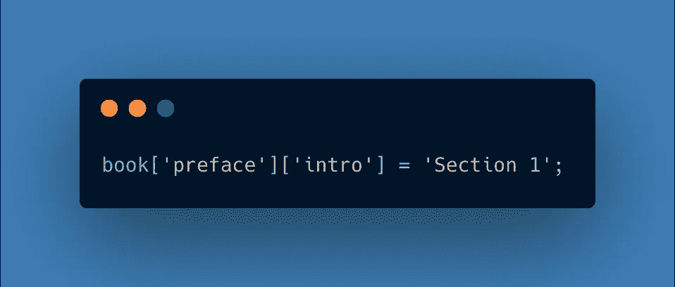

不必要的括号语法。

在某一点上，我在括号语法和点语法之间建立了联系，并开始使用点语法来访问我知道不会改变的属性。

现在每当我知道我的属性是什么时，我就使用点语法。我发现它使我的代码更简洁，更易读。

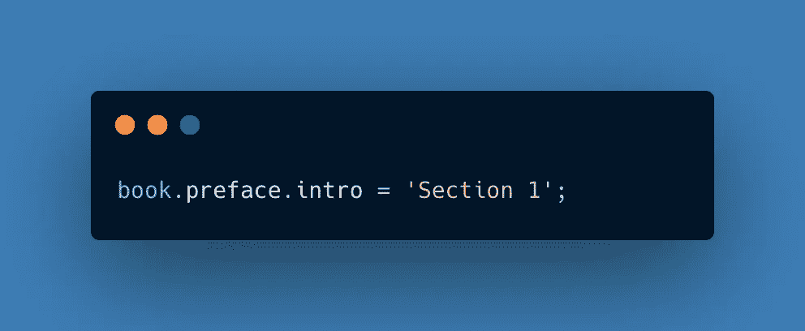

使用点语法钻取对象。

我唯一一次使用括号语法是在属性是一个可能会改变的变量的时候。下面是一个通过`myProp`变量任意选择一个属性进行访问的简单例子:

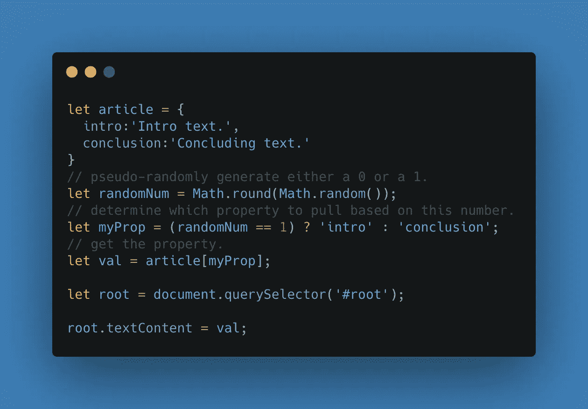

使用不确定变量时，括号语法很有用。

# 2.构建字符串时换入模板文本

过去，我总是使用加号(`+`)来连接字符串。现在，这通常感觉空间效率低下——尤其是当我合并多个变量时。

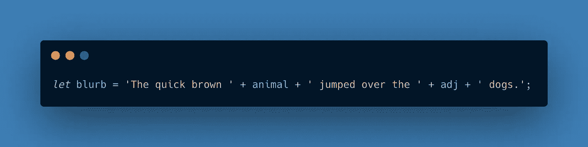

通过连接字符串和变量来初始化字符串。

如果我发现一个难以阅读的串联字符串，我会用一个模板文字替换它，这样更容易查看。请注意，两个反斜线(````)用于区分字符串，一个美元符号加上一对花括号(`${}`)用于表示每个变量:

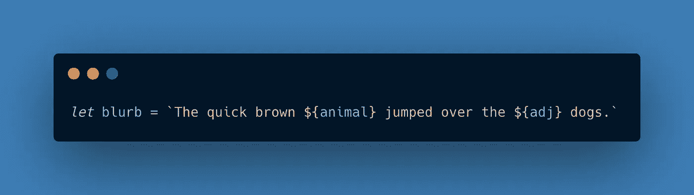

使用模板文本初始化字符串。

# 3.移除过多的中间函数返回

当我开始编写可以与外界交互的代码时，我最初编写了许多中间函数`returns`,以确保我不会因为缺少属性而破坏我的应用程序的功能。这导致了许多额外的行来处理我认为可能发生的每个问题:

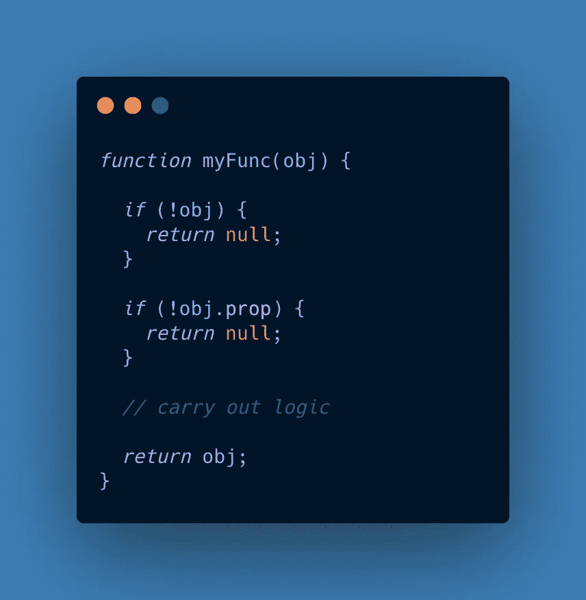

两个中间函数返回。

最近，我开始意识到过多的中间函数`returns`会使我的代码混乱，并鼓励我以灾难优先的心态思考，这会分散我的代码读者对函数目的的注意力。虽然我的目标仍然是处理相同的问题，但我现在尝试编写代码，首先给自己一个默认值，首先关注期望的结果，然后处理潜在的无值情况。

您可以在下面的例子中看到这个方法，它将一个空对象作为默认对象分配给`obj`，然后使用一个`if`语句来运行预期的代码，只要该属性存在。我仍然处理无价值的情况，但是最后:

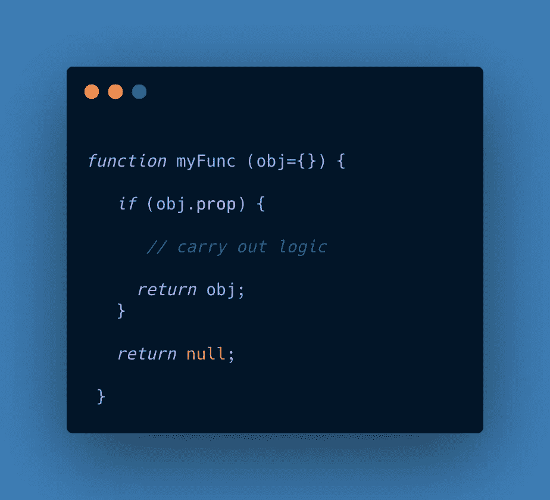

使用默认参数和正的 if 条件。

中间函数`returns`在某些情况下仍然可能有它们的位置——特别是当我喜欢限制你的缩进量时——但是我现在尝试更多地使用默认参数和正的`if`条件。

# 4.对默认属性使用 OR 运算符

在我不确定属性是否存在的情况下，我的老方法是使用一个`if`语句来检查丢失的属性，并在必要时给它一个默认属性:

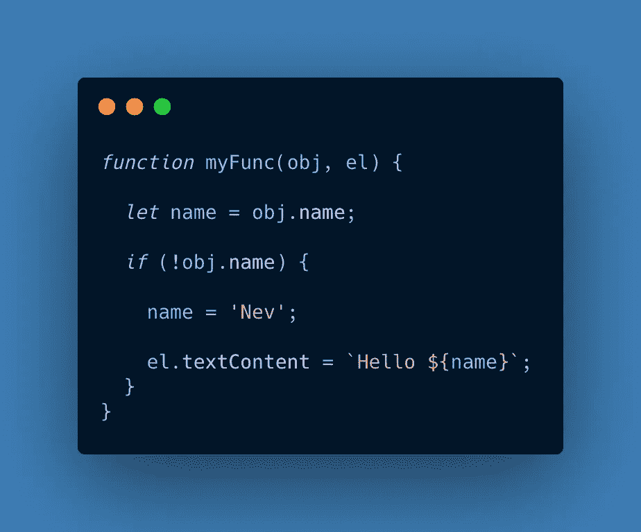

旧方法:使用 if 语句分配默认属性

虽然处理这种情况仍然很重要，但我现在的目标是以更紧凑的方式编写它，首先处理期望的结果。所以我现在的方法是使用 OR 运算符(`||`)来指定一个默认值，如果有必要的话:

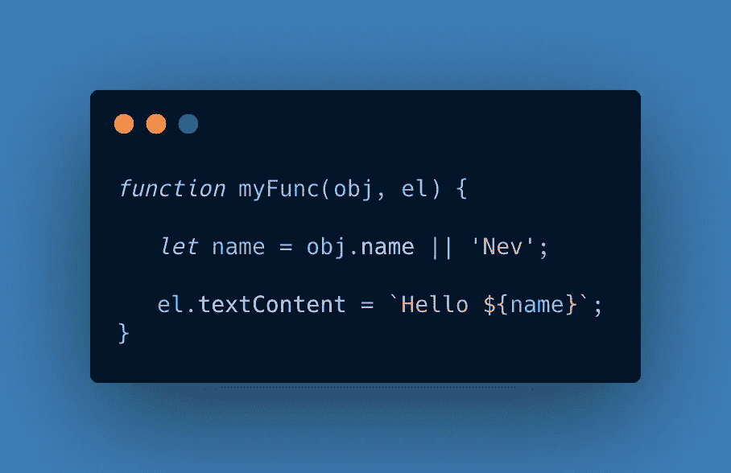

新方法:使用 OR 运算符分配默认属性。

# 5.用一个对象替换多个参数

在我的更复杂的应用程序中，我有时发现自己编写的函数接受许多参数。这个函数一开始可能只有一两个参数，但是随着函数变得越来越复杂，参数的数量也会增加。下面是一个相当短的例子，有五个参数:

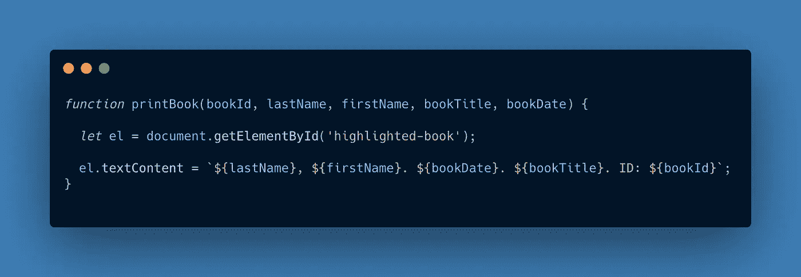

当我调用这些函数时，参数的顺序变得至关重要。这些年来，我注意到我所犯的许多错误都源于参数的顺序。如果您只使用下面的方法调用该函数一次或两次，可能不会有任何问题:

```
 printBook(bookId, lastName, firstName, bookTitle, bookDate); 
```

也就是说，如果您在许多地方调用该函数，并决定更改参数的顺序，这可能会导致错误。

所以对于有很多参数的函数，我已经开始将所有属性捆绑到一个对象中，然后作为一个参数传入:

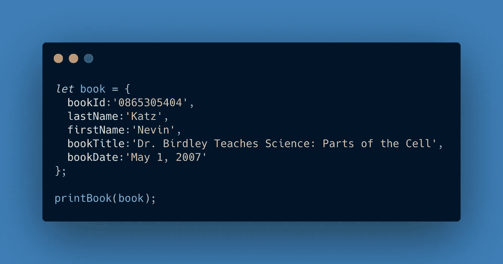

捆绑到作为参数传入的对象中的各种属性。

对于新的`printBook`函数，我在参数空间中使用花括号(`{}`)来析构传入的对象并解包我需要的属性:

```
function printBook (**{**lastName, firstName, bookTitle, bookDate**}**) {

   // logic goes here}
```

对于析构，参数的顺序和数量无关紧要。我发现这给了我一种受欢迎的灵活性，并且导致了更少的与参数相关的错误。下面是完整的功能:

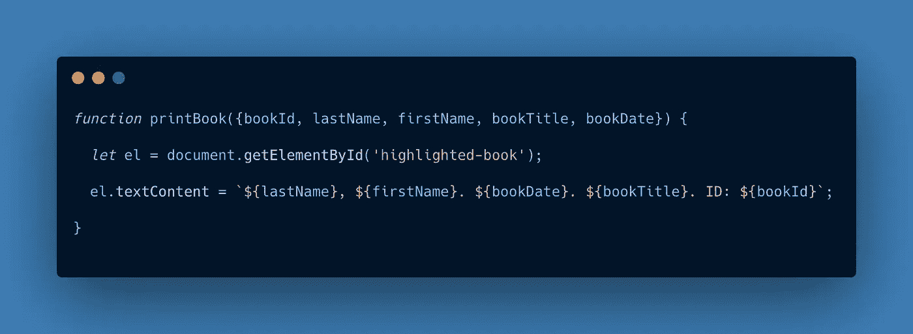

析构赋值语法。

下面是该示例的工作演示:

属性捆绑技术的演示。

虽然像这样将属性分组到一个对象中是一种强大的技术，但是当属性相互关联时效果最好。例如，如果我想将一个 DOM 元素的参数传入到`printBook`中，这将发生在这个对象之外。注意函数和相关函数调用末尾的`el`参数。

```
function printBook (**{**lastName, firstName, bookTitle, bookDate**}**, **el**) {}printBook(object, **el**)
```

# 6.在某些情况下，将 forEach 替换为 for…of

过去，我经常将`forEach`与异步实用程序方法结合使用，比如一个定制的`getJSON`请求:

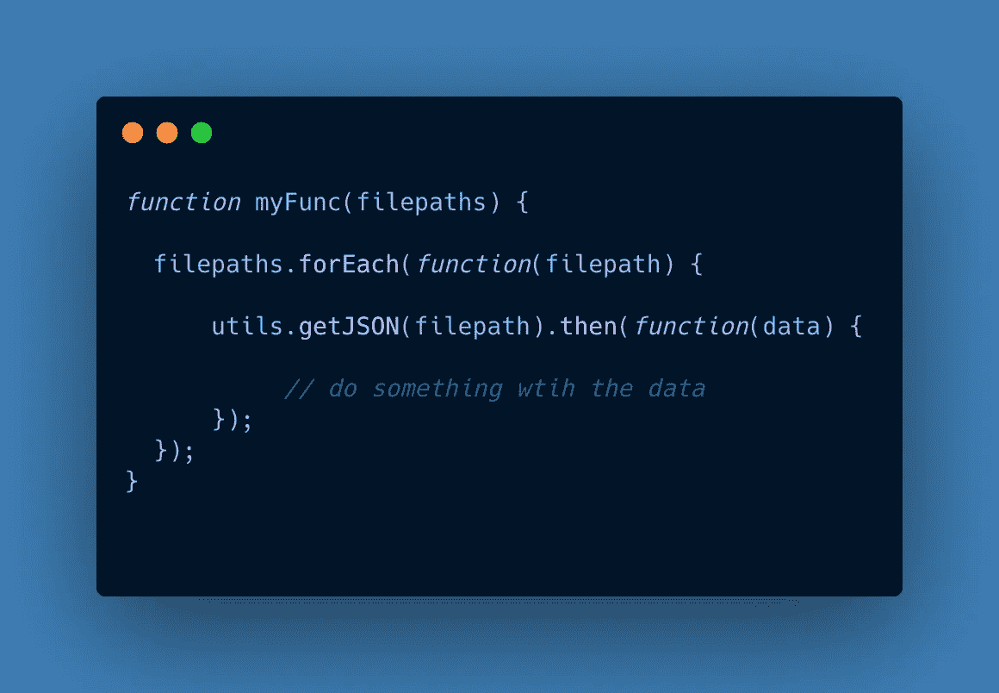

使用 forEach 语法的异步函数。

虽然`forEach`在某些情况下仍然非常重要——尤其是 DOM 操作——但当我开始使用`async/await`时，我发现它不够用，因为我想以顺序方式处理每个`getJSON`调用的结果。

为了更好地控制何时处理结果，我使用了`for...of`循环:

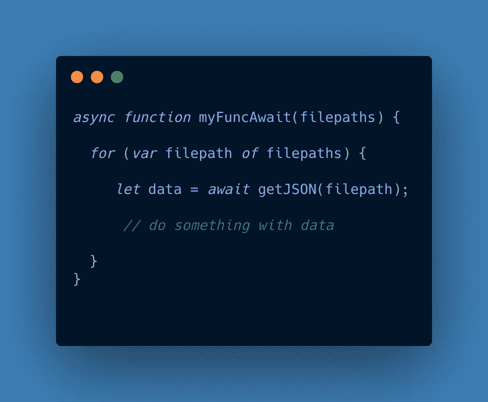

for…of 循环。

我发现这是一种以可预测的顺序方式处理多个异步函数结果的更好方法。

# 7.使用自定义方法构建复杂的 DOM 元素

在我停止定期使用 jQuery 之后，我开始从头开始创建 DOM 元素。这感觉更干净，但也更罗嗦:

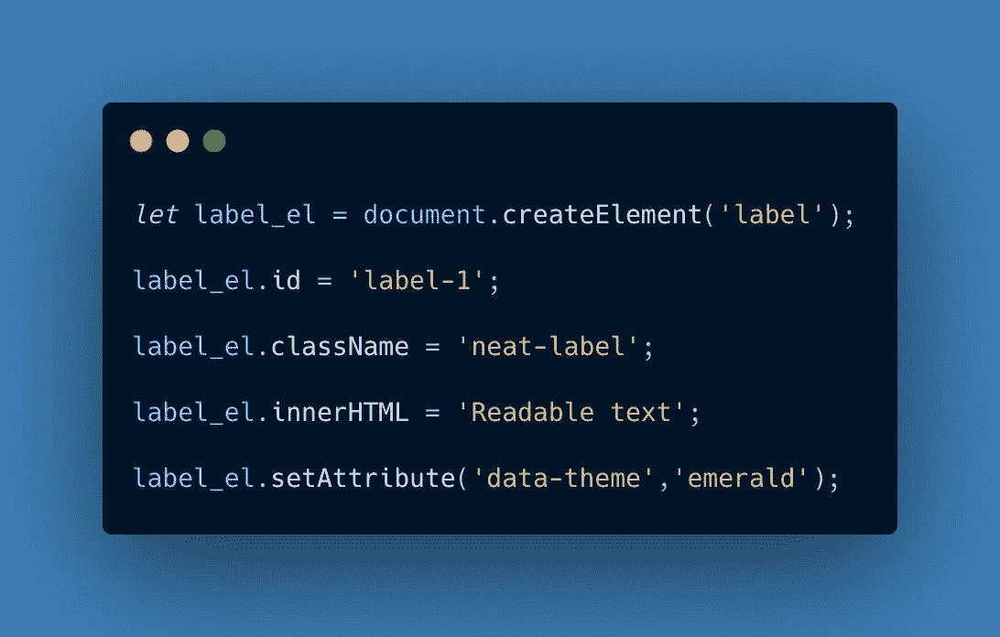

使用传统语法创建标签元素。

几年后，我编写了一个小的实用方法，允许我更紧凑地编写 DOM 元素。注意，我遍历了一个`attrs`属性中的键来设置定制属性:


添加 DOM 元素的实用方法。

现在，我可以使用自定义方法以简洁的方式声明一个元素:

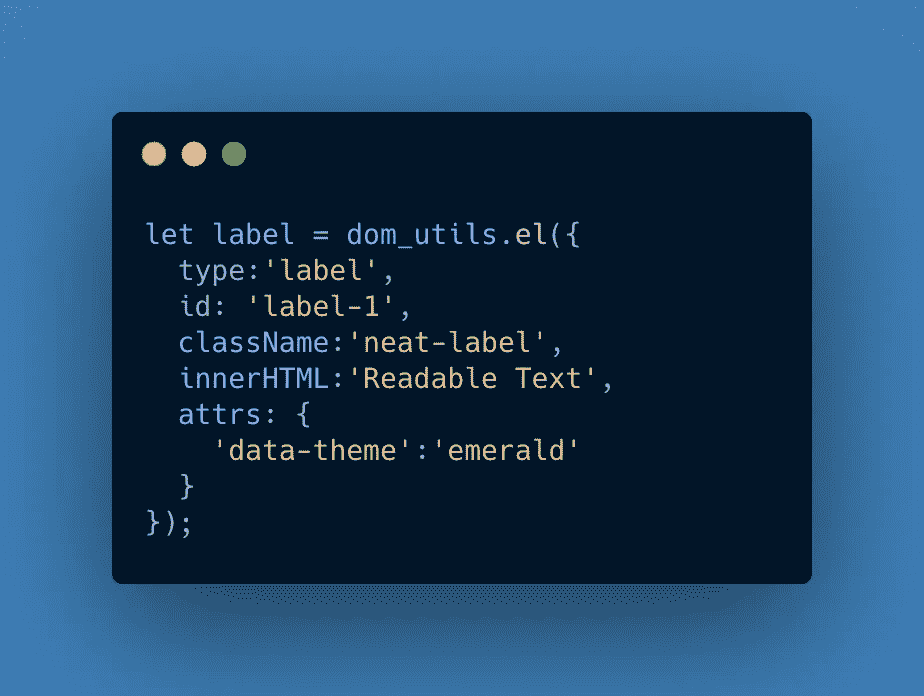

用我的助手方法声明一个标签元素。

我发现自己现在经常使用这样的效用函数。下面是上例的工作演示:

一个 DOM 实用方法的演示。

我发现这个实用方法帮助我使创建 DOM 元素的语法更加紧凑和易读。

# 最后的想法

令人惊讶的是，当我遇到它时，我在某一点上不假思索地写下的东西现在会让我如此困扰。如果您遇到这种情况，并发现自己对旧代码望而却步，请振作起来。这意味着你的编码实践在进步。我希望这些方法可以作为有用的例子，让您的 JavaScript 代码更清晰、更简洁。

感谢阅读！

# 在别处

下面是我写的另外两篇文章，你可能也会喜欢。

寻找代码中最棘手 bug 的 7 种策略

[用普通的 JavaScript 捕获并显示你的 JSON 数据](https://medium.com/geekculture/capture-and-display-your-json-data-with-vanilla-javascript-4675f81cfb54)