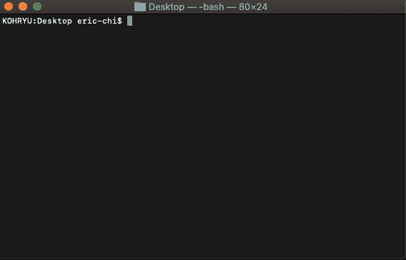
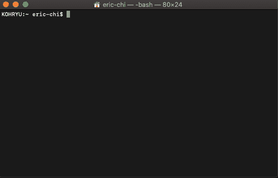
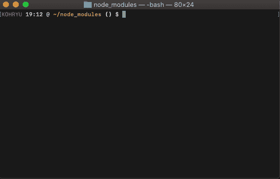
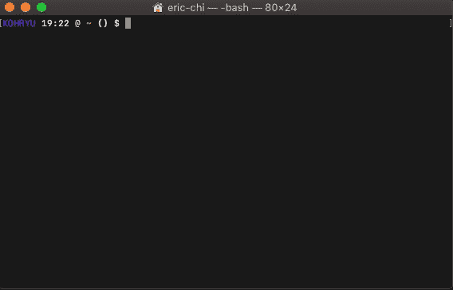
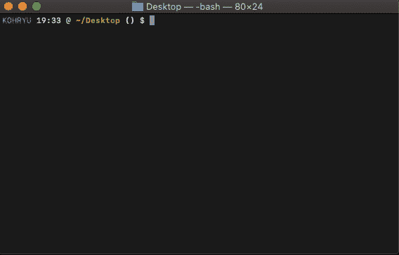
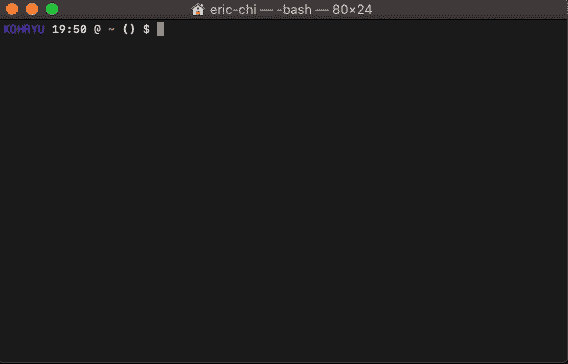
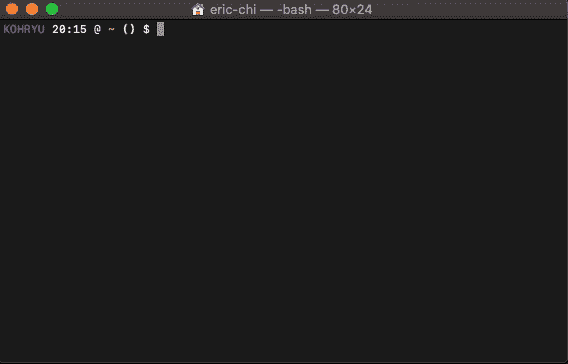
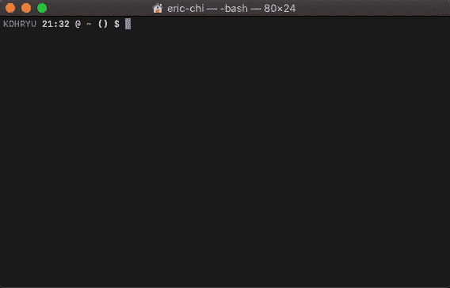

# 7 个非常棒的命令行工具

> 原文：<https://betterprogramming.pub/7-awesome-command-line-tools-36cea5cfc026>

## 一些熟悉的工具和一些您可能还没有尝试过的工具


由 [Maxwell Nelson](https://unsplash.com/@maxcodes?utm_source=medium&utm_medium=referral) 在 [Unsplash](https://unsplash.com?utm_source=medium&utm_medium=referral) 上拍摄的照片。

终端/命令行是开发人员随身携带的神圣工具。它可能是程序员最常用的工具。我相信这是因为它的重量很轻，而且你可以用它做不可思议的事情。一些开发人员甚至在终端内部做了更多的工作。向他们致敬。

我将展示一些 CLI(命令行界面)工具，我个人认为这些工具非常棒，而且几乎每天都在使用。诚然，有如此多的命令行工具，这个列表仅仅触及了皮毛。

# 1.精力

什么样的终端列表不会包含`[vim](https://github.com/vim/vim)`？关于`vim` 是否是用于编程的***编辑器，或者它是否是为疯子发明的工具，有大量的争论，但是我们不会在这里讨论。***

***对于那些不熟悉`vim`的人来说，它是一个文本编辑器，改进了任何 UNIX 系统自带的开箱即用的`vi`工具。它允许您通过终端编辑或创建文件。***

******

***vim 的基本用法。***

***如果您想在终端中快速编辑文件，并且不想打开 IDE 或 GUI 文本编辑器(如 VSCode 或 Sublime Text ),此工具很有用。***

***请记住，这个工具在第一次学习时使用起来可能有点棘手，因为许多快捷方式不像现代的文本编辑器那样直观。然而，如果你真的花时间去学习`vim`，这对开发者来说是非常强大的。这也是`vim`拥有庞大社区的原因。这个社区如此之大，以至于开发者甚至会为流行的 ide 和文本编辑器制作插件来模仿`vim`体验。***

# ***2.vtop***

***`top`是一个非常常见的命令，在终端中用来显示系统正在运行的进程的信息，以及机器的内存和 CPU 使用情况的一般信息。如果你曾经用过`top`，看着可能会有点混乱。那么，我们怎样才能使这些信息更容易处理呢？介绍`[vtop](https://github.com/MrRio/vtop)`，一个有图的`top`的实现！***

******

***vtop 正在运行。***

***我喜欢对任何事情都有一个可视化的指南，对`top`信息有一个是致命的。我让它整天运行，这样我就可以密切关注我的系统负载。***

***这个工具需要`npm`。***

# ***3.fzf***

***下一个是非常酷的工具。叫`[fzf](https://github.com/junegunn/fzf)`。这是一个通用的命令行模糊查找器，允许您根据您键入的内容来查找文件。就其本身而言，它是一个不错的工具。它会列出当前目录中所有不同的文件。你可以把它想成一个聚光灯搜索，但是在你的终端里。***

******

***在我家发现模糊。***

***现在，当您将`fzf`与其他现有命令如`kill`或`cat`结合使用时，这个工具的真正威力就显现出来了。为了做到这一点，您需要运行软件包或存储库中提供的安装脚本:***

```
***/usr/local/opt/fzf/installor~/.fzf/install***
```

***你需要重启你的终端或者`source`你的`.bashrc`。它会问你一些问题，一旦你回答了所有问题，你就会释放出`fzf`最大的潜力。***

***现在，您可以运行如下命令:***

```
***cat **[TAB]
vim **[TAB]
ssh **[TAB]***
```

***`fzf`将进入工作状态，并找到所有可能与命令一起工作的条目:***

******

***类似于文件查找 IDE。***

***另一个很酷的应用是与`kill`命令一起使用。这大概是我用的最多的一个。键入`ps -ef | grep [process-name]`然后要么手动键入要么复制进程 ID 来杀死的日子已经一去不复返了。相反，您可以运行`kill [tab]`或`kill -9 [tab]`。fuzzy-找到你想要终止的进程，然后按回车键。它会自动为您填充进程 ID。***

******

***非常棒的用例。***

***还有很多其他的用例我可以一一介绍，但这是我想指出的主要用例。***

# ***4.trash-cli***

***有没有过这样的经历:某样东西突然意识到它不是你想永远删除的东西？我希望这不只是我。如果你不想处理那种焦虑，那么我会推荐使用`[trash-cli](https://github.com/sindresorhus/trash-cli)`。***

***这个工具基本上只是将项目放入系统的垃圾中，而不是将其彻底清除。***

******

***将文件移入垃圾箱，而不是被遗忘。***

***我没有键入`trash`，而是在我的`.bashrc`中使用了一个别名来代替`rm`命令:***

```
***alias rm=trash***
```

***现在当使用`rm`删除某个东西时，你不必担心它会永远消失。如果你喜欢，你可以简单地从垃圾桶里找到它。是的，这适用于`rm`提供的不同标志。***

# ***5.速度测试***

***这个很简单。如果你想在不打开 Chrome 的情况下看看你的互联网有多快，`[speed-test](https://github.com/sindresorhus/speed-test)`就是为你准备的。***

******

***我不会给你展示我所有的恐怖速度。你明白了。***

***这是一个我经常使用的工具，我总是喜欢把它放在我的后口袋里，这样我就不用从 Chrome 上获取额外的资源了。而且，在终端里做也挺酷的。***

***你将需要`npm`来使用这个工具。***

# ***6.维基特***

***这是一个小得多的回购，我喜欢它。我通过 iTerm2 让我的终端整天开着，所以能够搜索维基百科真是太棒了。`[wikit](https://github.com/KorySchneider/wikit)`允许您从终端执行此操作。你会惊讶于我每天使用它的频率。***

******

***“维基苹果公司”如果你想搜索苹果。***

***这个工具需要`npm`。***

# ***7.硬币顶部***

***最后一个可能不适合每个人，但我每天都用。对于那些在加密领域的人来说，你可能已经知道这个工具了。***

***我到处涉猎加密货币，跟踪这么多不同类型的硬币——更不用说它们的价格了——可能会让人筋疲力尽。随着价格在密码世界中快速波动，`[cointop](https://github.com/miguelmota/cointop)`是一个救星。***

***`cointop`是对`top`命令的一种发挥。然而，`cointop`显示的不是系统信息，而是加密货币的信息。***

******

***斯通克斯***

# ***结论***

***我日常使用的 CLI 工具还有很多，但这是我的工具包中最突出的几个。我可以没完没了地谈论 CLI 工具。它们是我在软件世界中最喜欢摆弄的东西之一。每当我发现一个新的 CLI 工具可以让我完成一些微不足道的事情时，我总是很兴奋。***

***我还喜欢这样一个事实，即大多数工具都是社区驱动的——一群开发人员只是在开发一个小工具，因为他们认为它们很棒。***

***下集再见！***