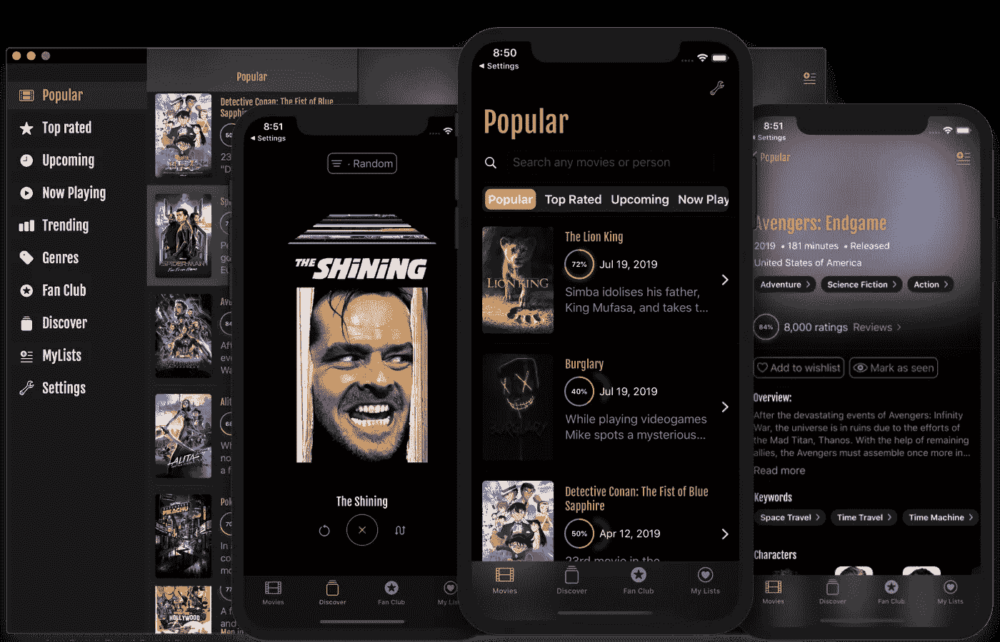
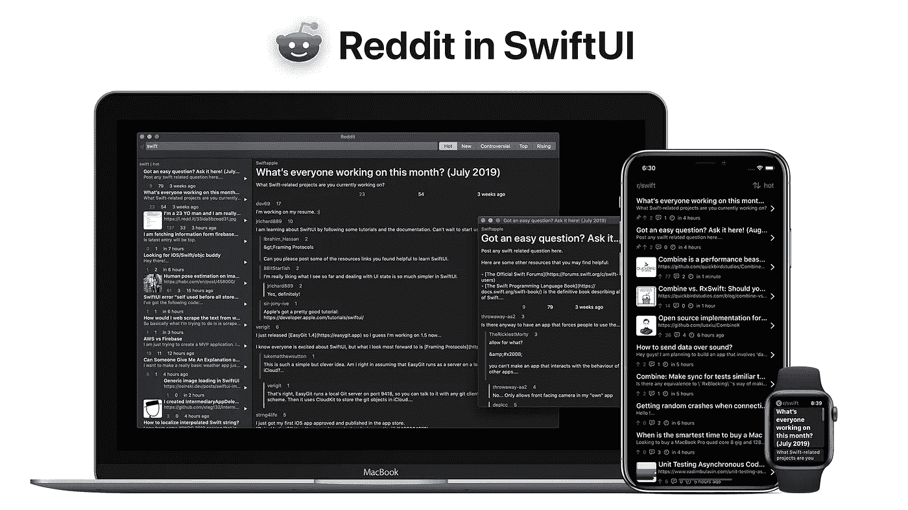
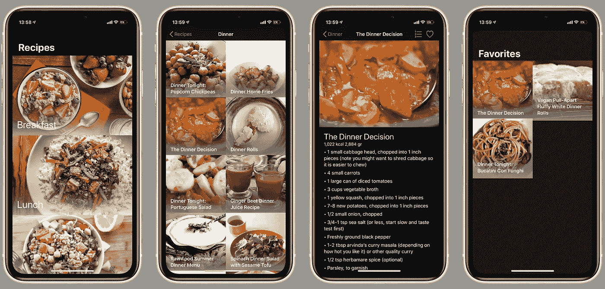
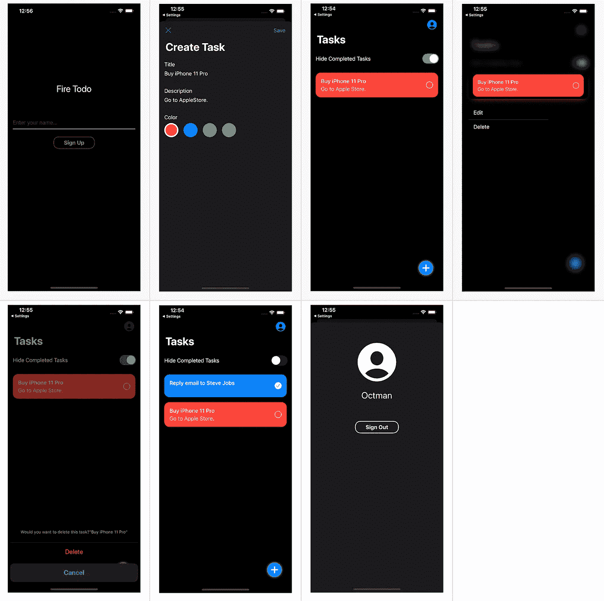
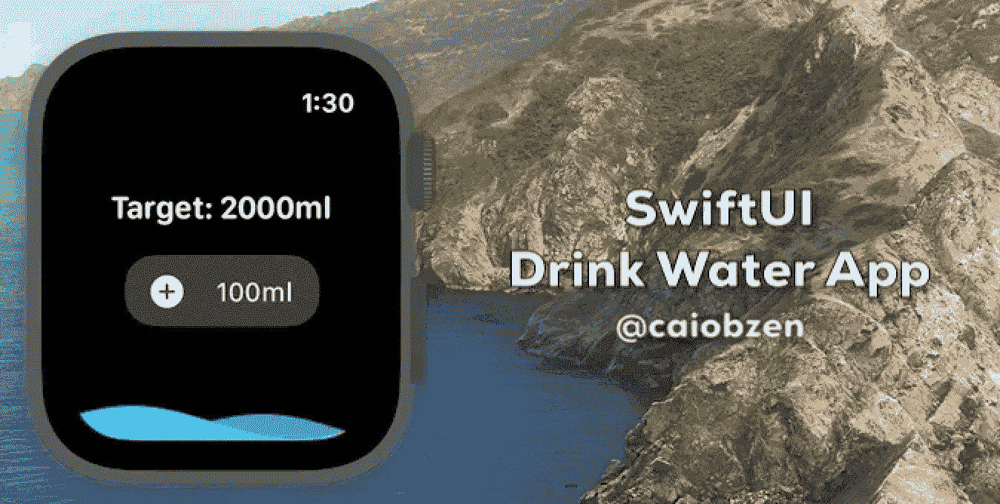
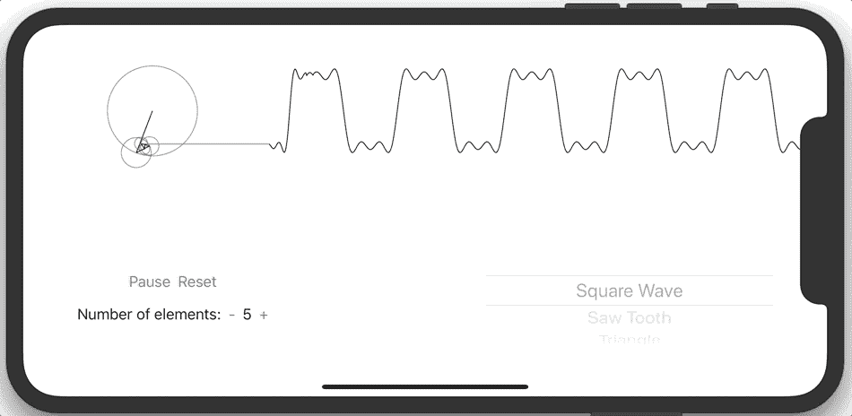

# 7 个了不起的开源 SwiftUI 项目给你灵感

> 原文：<https://betterprogramming.pub/7-awesome-open-source-swiftui-projects-to-inspire-you-aff778e5d413>

## 无论你是刚刚学习 SwiftUI 还是想要探索一些代码库，这些项目都可以帮你解决问题

马克斯·尼尔森在 [Unsplash](https://unsplash.com?utm_source=medium&utm_medium=referral) 上拍摄的照片

苹果的最新框架 SwiftUI 已经席卷了 iOS 开发界。

> SwiftUI 是一种创新的、极其简单的方式，可以借助 Swift 的力量在所有苹果平台上构建用户界面。
> 
> 只使用一套工具和 API 为任何苹果设备构建用户界面。SwiftUI 具有易于阅读和自然书写的声明性 Swift 语法，可与新的 Xcode 设计工具无缝协作，使您的代码和设计完美同步。
> 
> 对动态类型、黑暗模式、本地化和可访问性的自动支持意味着您的第一行 SwiftUI 代码已经是您编写的最强大的 UI 代码。
> 
> —苹果的 SwiftUI 网站

如果您已经开始使用它或将其用于您的爱好项目，这里有五个令人惊叹的开源项目可以从中获得灵感。

# 1.托马斯·里库德的电影

MovieSwiftUI 是一个使用 MovieDB API 的应用程序，使用 SwiftUI 构建。

它演示了一些 SwiftUI (& Combine)概念。

目标是只使用 SwiftUI 开发一个真实的应用程序。

 [## Dimillian/MovieSwiftUI

### MovieSwiftUI 是一个使用 MovieDB API 的应用程序，使用 SwiftUI 构建。它演示了一些 SwiftUI (& Combine)…

github.com](https://github.com/Dimillian/MovieSwiftUI) 

# 2.Carson Katri 的 Reddit 客户端

在 SwiftUI 中创建的跨平台 Reddit 客户端。

 [## 卡森-卡特里/reddit-swiftui

### 获得公共测试版注意:这个项目还远远没有完成。它仍然缺乏典型的 Reddit 客户端的许多功能…

github.com](https://github.com/carson-katri/reddit-swiftui) 

# 3.Majid Jabrayilov 的食谱应用程序

食谱应用程序是在 SwiftUI 中使用单状态容器编写的。

这个应用程序实现了一个单一状态容器概念的例子。

 [## mecid/swift ui-食谱-应用程序

### 食谱应用程序是在 SwiftUI 中使用单状态容器编写的，这个应用程序是作为单状态的一个例子来实现的…

github.com](https://github.com/mecid/swiftui-recipes-app) 

# 4.SwiftUIx:vats al Manot 对标准 swift ui 库的扩展

SwiftUIX 试图填补仍处于萌芽阶段的 SwiftUI 框架的空白，提供一套广泛的组件、扩展和实用程序来补充标准库。

 [## SwiftUIX/SwiftUIX

### SwiftUIX 试图填补仍处于萌芽阶段的 SwiftUI 框架的空白，提供一套广泛的组件…

github.com](https://github.com/SwiftUIX/SwiftUIX) 

您可以在此处找到文档:

 [## SwiftUIX/SwiftUIX

### 标准 SwiftUI 库的扩展。通过在…上创建帐户，为 SwiftUIX/SwiftUIX 开发做出贡献

github.com](https://github.com/SwiftUIX/SwiftUIX/wiki) 

# 5.杉本的托多申请

使用 SwiftUI/Firebase/Redux/Combine 的简单 Todo 应用程序。

 [## sgr-ksmt/FireTodo

### 使用 SwiftUI / Firebase / Redux 的简单 Todo 应用程序。- sgr-ksmt/FireTodo

github.com](https://github.com/sgr-ksmt/FireTodo) 

# 6.卡洛斯·科雷·阿达·西尔瓦的《看水人》

一个简单的 Apple Watch app 提醒你喝水。

 [## caiobzen/水-提醒-swiftui

### 一个简单的 Apple Watch app 提醒你喝水。使用 SwiftUI 和 Combine 构建，您可以找到一篇文章…

github.com](https://github.com/caiobzen/water-reminder-swiftui) 

# 7.西蒙·斯蒂费尔的傅立叶级数可视化

这个小应用程序使用本轮和图表来可视化不同的傅立叶级数。

功能的数量和系列的类型可以改变。支持以下系列:

*   方波
*   锯齿
*   三角形
*   脉搏

 [## Simon boots/swiftuifourier series

### 这个小应用程序使用本轮和图表来显示不同的傅立叶级数。函数的数量和类型…

github.com](https://github.com/simonboots/SwiftUIFourierSeries) 

# 结论

SwiftUI 会一直存在。

我希望你喜欢这些项目，并在未来更多地探索这个框架。