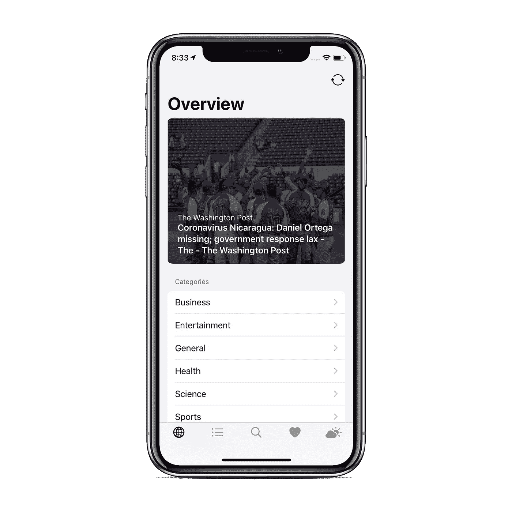
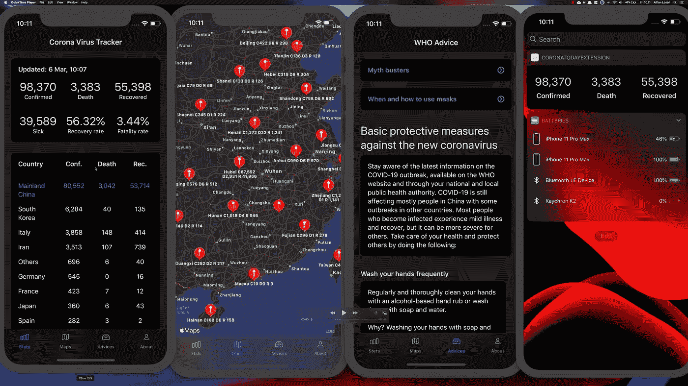
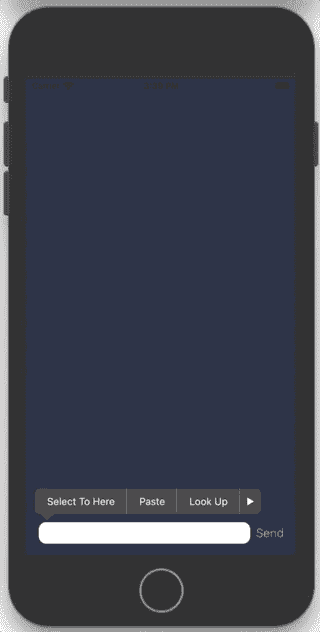
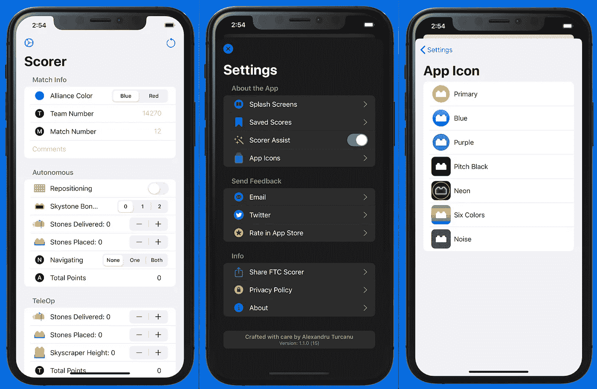
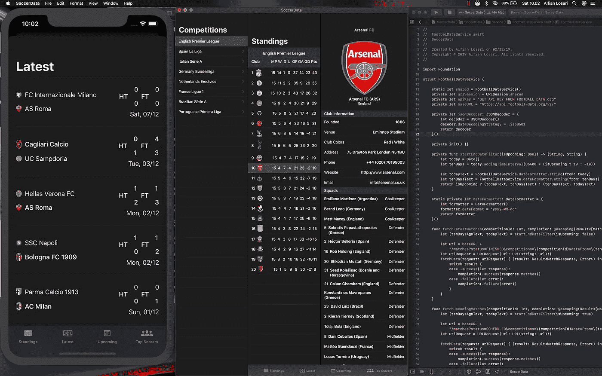
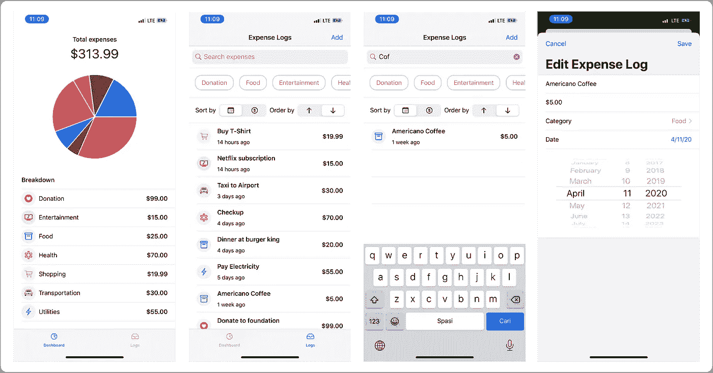

# 启发您的 7 个令人敬畏的开源 SwiftUI 项目(第 2 部分)

> 原文：<https://betterprogramming.pub/7-awesome-open-source-swiftui-projects-to-inspire-you-part-2-1f7ef8f9879>

## 无论你是刚刚学习 SwiftUI 还是想要探索一些代码库，这些项目都可以帮你解决问题

由 [Ales Nesetril](https://unsplash.com/@alesnesetril?utm_source=medium&utm_medium=referral) 在 [Unsplash](https://unsplash.com?utm_source=medium&utm_medium=referral) 上拍摄的照片

这是我的文章[的第二部分，7 个令人敬畏的开源 SwiftUI 项目启发了你](https://medium.com/better-programming/7-awesome-open-source-swiftui-projects-to-inspire-you-aff778e5d413)，这是我在第一篇文章得到大量回应后写的。

如果你已经开始使用开源软件或将其用于你的爱好项目，这里有七个令人惊奇的项目可以从中获得灵感。

# 1.动物穿越新视野

这是一个完全在 SwiftUI 中的全功能动物穿越助手应用。

## 特征

*   仪表板跟踪您的鱼，错误，收集进度，和积极的事件
*   看看这个月活跃的动物，把它们都抓起来！
*   芜菁价格跟踪和预测与每日推送通知
*   芜菁交换整合
*   Nookazon 集成
*   具有过滤、排序和搜索功能的完整目录浏览器
*   村民名单
*   为应用程序中的任何内容添加书签，将其添加到您的收藏中
*   iOS、iPad 和 macOS (Catalyst 支持)

 [## 迪米利安/阿欣布罗斯鲁伊

### 这是一个完全在 SwiftUI 中的全功能动物穿越助手应用。仪表板跟踪你的鱼，虫子…

github.com](https://github.com/Dimillian/ACHNBrowserUI) 

# 2.Alexey 的 NewsApp

使用 SwiftUI 和 Combine 的新闻和天气应用程序

 [## alexeyvoronov 96/news app-With-swift ui-And-Combine

### 使用:SwiftUI 和 Combine。为 alexeyvoronov 96/news app-With-swift ui-And-Combine 开发做出贡献，创建一个…

github.com](https://github.com/AlexeyVoronov96/NewsApp-With-SwiftUI-And-Combine) 

# 3.电晕病毒跟踪器&阿尔菲安·洛萨里的建议

## 特征

*   全球确诊、死亡和痊愈病例总数的当前统计数据
*   国家和地区统计
*   带有批注针和受影响地区描述的世界地图
*   数据集由 ArcGIS Esri Corona 病毒数据集提供
*   预防和处理病毒的基本建议，神话终结者，来自世卫组织的问答

 [## alfianlosari/冠状病毒跟踪器 SwiftUI

### Corona 病毒追踪器和建议 iOS 应用程序，带 swift ui-alfianlosari/CoronaVirusTrackerSwiftUI

github.com](https://github.com/alfianlosari/CoronaVirusTrackerSwiftUI) 

# 4.亚采克·丘巴的客户情绪分析器

这是一个基于产品评论检查客户情绪的应用程序。

核心 ML 模型已经使用来自亚马逊美国市场的 12，000 个客户评论来教授，类别:玩具。

 [## cja ca/客户情绪分析器

### 基于产品评论检查客户情绪的微型应用程序💸。已使用 12 000 名客户教授了核心 ML 模型…

github.com](https://github.com/cjaca/Client-Sentiment-Analyzer) 

# 5.亚历山大·图尔卡努的 FTC 得分手

FTC 记分员是一个简单而强大的方法来评分你的练习赛。

## 特征

*   多平台支持— iPhone、iPad、Mac
*   黑暗模式支持
*   保存分数
*   得分助攻
*   备选应用程序图标
*   iMessage 贴纸应用程序

 [## Pondorasti/StonkScorer

### FTC 的记分员是一个非常简单而强大的方法来给你的练习赛打分。这个项目最初是作为…的游乐场

github.com](https://github.com/Pondorasti/StonkScorer) 

# 6.Alfian Losari 开发的 SwiftUI 足球数据应用

显示足球数据，如分数，即将到来的比赛，球队地位，和足球数据 API 的最佳射手。

 [## alfianlosari/FootballDataSwiftUI

### 显示足球数据，如分数，即将到来的比赛，球队排名，与足球数据 API 和 SwiftUI 的最佳射手…

github.com](https://github.com/alfianlosari/FootballDataSwiftUI) 

# 7.Alfian Losari 的费用跟踪

## 特征

*   创建、编辑和删除费用日志
*   显示费用列表
*   按类别过滤费用并搜索查询
*   按日期或金额以降序或升序对费用进行排序
*   显示所有类别和每个类别的总费用总额的仪表板，并使用饼图显示每个类别的分布情况

 [## alfianlosari/swiftuicdexpensetracker 已完成

### 按照 alfianlosari.com 的教程创建、编辑和删除费用日志。显示费用列表。过滤器…

github.com](https://github.com/alfianlosari/SwiftUICDExpenseTrackerCompleted) 

# 结论

SwiftUI 是未来，我期待着今年的 WWDC 2020。

我希望你喜欢这些项目，并在未来更多地探索这个框架。