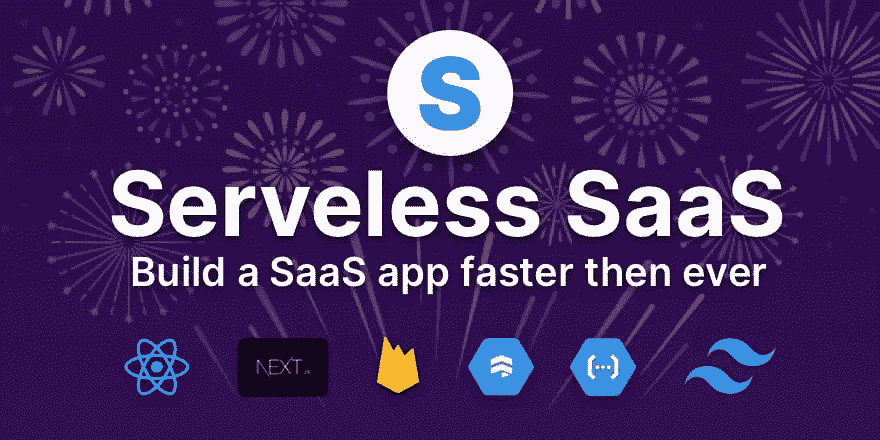
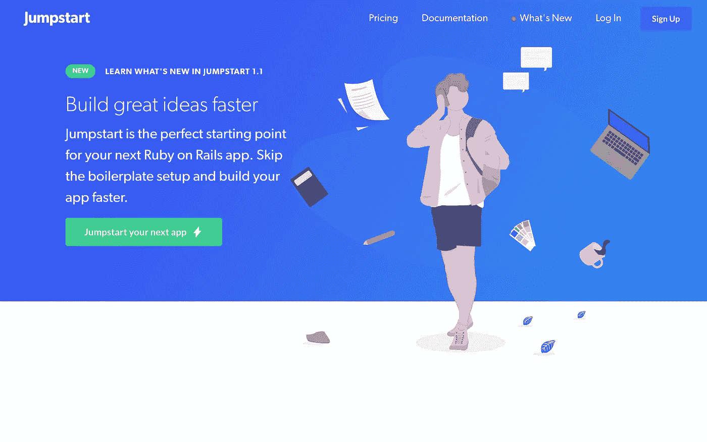
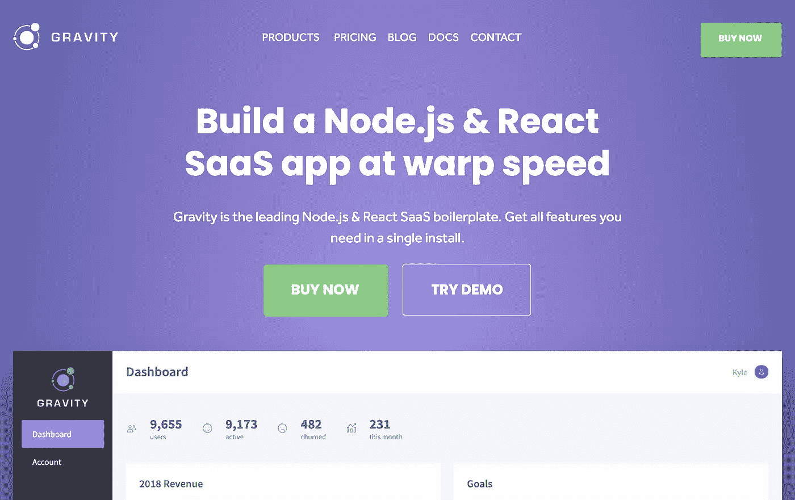
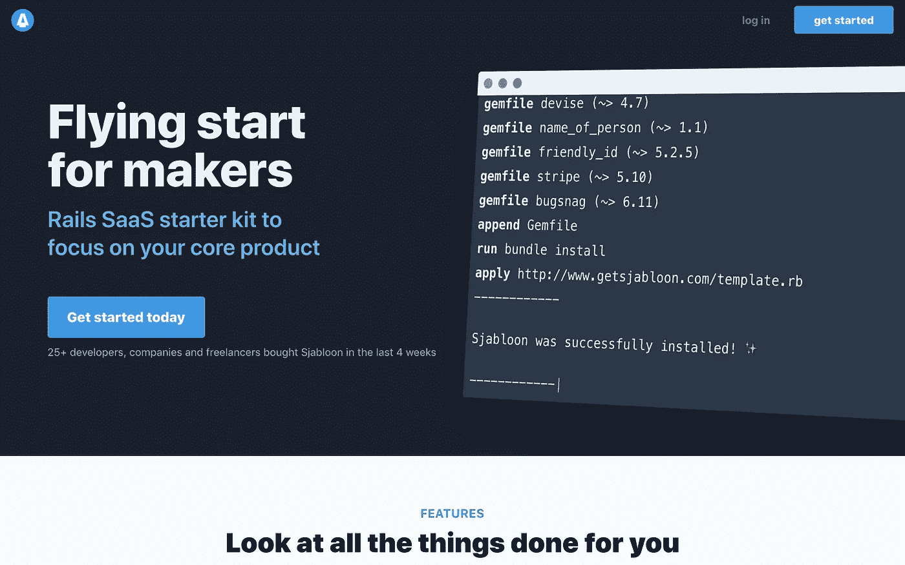
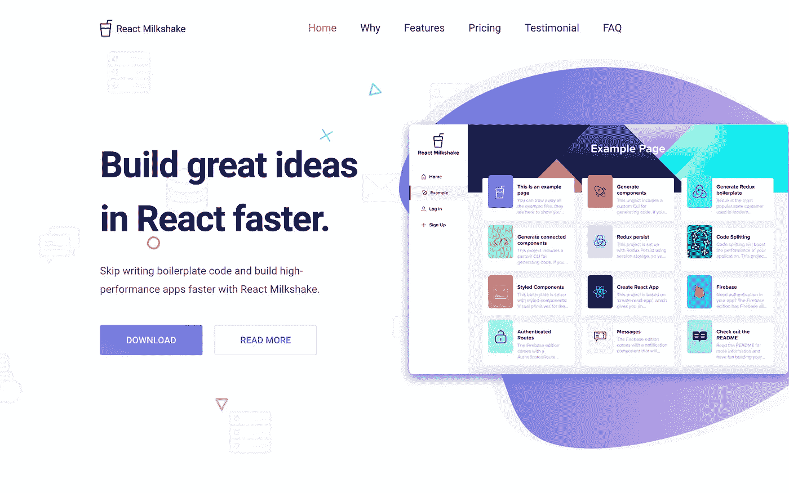
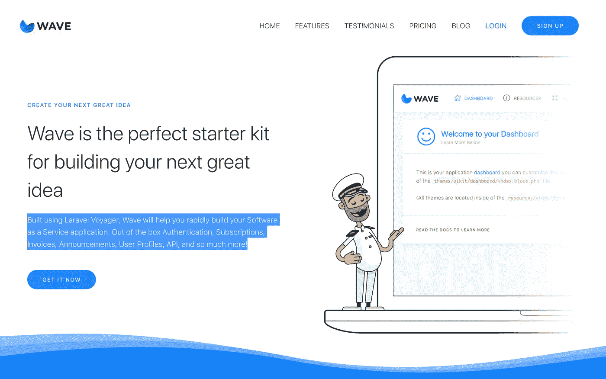

# 构建 SaaS 应用程序时的 7 个模板

> 原文：<https://betterprogramming.pub/7-boilerplates-for-a-head-start-when-building-a-saas-app-237667d2388c>

## 帮助您更快构建和启动项目的选项

[摄于](https://unsplash.com/@claybanks?utm_source=medium&utm_medium=referral) [Unsplash](https://unsplash.com?utm_source=medium&utm_medium=referral) 上的粘土堤岸。

建立一个 SaaS 平台是很难的，尤其是如果你是一个单枪匹马的创始人，需要自己做所有的事情。但是有一些选项可以帮助您更快地构建和启动项目。

当你有了一个好主意，并开始为之努力时，你会感到一阵兴奋。从事一个有趣的想法是很好的，但是不要把注意力放在让你的产品独一无二的东西上，你首先需要花时间去做一些不那么令人兴奋的事情:配置一个项目、构建认证流程、集成支付、构建表单等等。

如果你想更快地启动，有些事情你可能要考虑。您可能希望使用 web 框架来提高开发速度。没有人用普通的 Ruby 代码构建他们的 SaaS。你更愿意使用像 Rails 这样的框架。应用程序的样式也是如此。您可以使用 Bootstrap、Material 或 Tailwind 之类的框架，而不是自己编写所有的 CSS。但是如果你真的想节省很多时间，你应该从 SaaS 样板文件开始。

一个 SaaS 样板文件包含了很多你需要花费大量时间来构建的功能。想想认证或计费。这些都是每个 SaaS 都需要的东西，为什么要自己建造呢？

你应该尽快推出你的 SaaS，这样你就可以尽快得到反馈。要做到这一点，从样板/初学者工具包开始可以节省你大量的时间。这里列出了七个样板文件，可以帮助你更快地构建你的 SaaS。

# **无服务器 SaaS**

无服务器的 SaaS 样板文件是你下一个 React 应用的完美起点。它是用 TypeScript、Next.js、Tailwind 和 Firebase 构建的。您可以轻松实现用户认证、Stripe 支付、团队等功能。

走向无服务器是削减成本的一个好方法，因为现收现付的定价模式意味着你可以免费开始，只有当你的初创公司获得真正的牵引力时才需要付费。您也不必担心缩放问题。使用无服务器平台，你可以将许多职责外包出去，这样你可以更快地行动。

这使得这个初学者工具包非常适合想要快速发布东西而不花钱的单独开发人员和小团队。

来源:[https://serverless.page/](https://serverless.page/)

# **快速启动**

Jumpstart 是你下一个 Ruby on Rails 应用的绝佳入门套件。您可以跳过样板设置，更快地构建您的 Rails 应用程序。它处理所有你需要的东西，像用户认证系统，甚至后台处理。它也有非常好的[文档](https://jumpstartrails.com/docs)。你甚至可以在 [Github](https://github.com/excid3/jumpstart) 上免费试用 *lite* 版本。

来源:[https://jumpstartrails.com](https://jumpstartrails.com/docs)

# **拉勒维尔火花**

[Laravel Spark](https://spark.laravel.com/) 是 Laravel 软件包，由 Laravel 的创造者 Taylor Otwell 构建。一个惊人的项目，帮助你用 PHP 开发下一个伟大的产品。它提供了许多脚手架特性，因此您不必自己编写所有代码。它还具有每个 SaaS 企业都需要的功能，如(双因素)身份验证、订阅计费和发票。

资料来源:https://spark.laravel.com/

# **重力**

有了 Gravity，你可以构建一个 Node.js 和 React SaaS 应用程序。它附带了许多功能和预构建的组件，可以让您快速启动并运行。它甚至有一个内置的用户入职流程反馈小部件。

来源: [https://usegravity.app](https://usegravity.app)

# 约翰内斯堡

Sjabloon 是一个现代的 Ruby on Rails SaaS 入门套件，它还包含了所有 SaaS 的特性，比如使用 Stripe 进行身份验证和支付，而且还附带了一个巨大的 UI 组件库，该组件库是用 Tailwind(一个新兴的 CSS 框架)构建的。这让你从一开始就专注于你的核心产品。就像 Jumpstart 一样，它也有一个精简版，可以在 [Github](https://github.com/GetSjabloon/sjabloon-lite) 上免费获得。

来源:[https://www.getsjabloon.com/](https://www.getsjabloon.com/)

# **反应奶昔**

[React Milkshake](https://www.reactmilkshake.com/) 是一个基本的 React 样板文件，用于更快地构建高性能应用。它没有提到的其他样板文件那么多特性，但是它有一个代码生成器，可以生成组件和 [Redux](https://redux.js.org/) 代码。如果您使用 Redux 作为状态管理工具，使用这个样板文件将会节省您很多时间。

来源:https://www.reactmilkshake.com

# **波**

Voyager 是一个流行的 Laravel 管理包，而 [Wave](https://wave.devdojo.com/) 是一个建立在 Laravel 和 [Voyager](https://voyager.devdojo.com/) 之上的初学者工具包。您可以在自己的服务器上安装这个初学者工具包，并根据需要进行定制。Wave 与 Stripe 或 Braintree 都集成在一起，并且有很好的文档记录。它还支持三种不同的入门主题。您可以从 Bootstrap、UIKit 或 Tailwind 中选择。Wave 还检查了所有其他 SaaS 特性的复选框，因此当你从头开始制作 SaaS 时，它很可能会加快你的开发时间。

来源:[https://wave.devdojo.com](https://wave.devdojo.com)

感谢阅读！我希望这些对你有帮助。