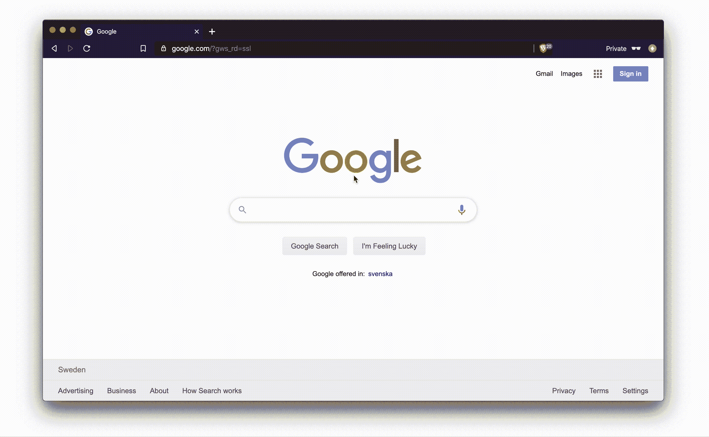
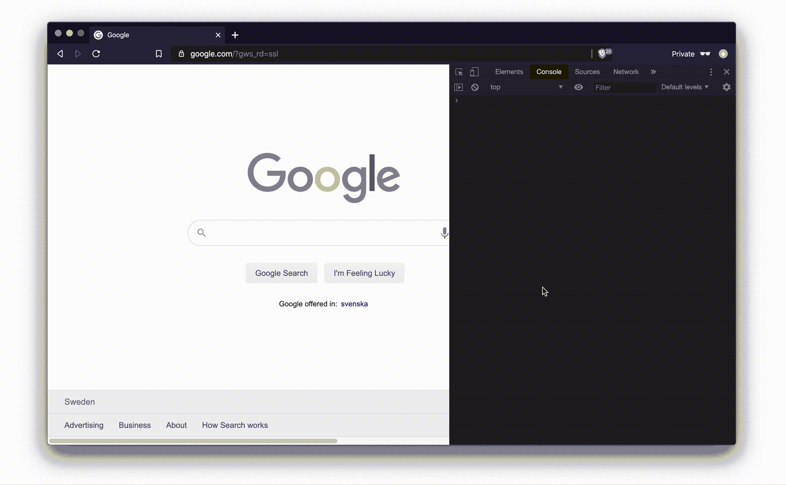

# 7 个 Chrome DevTools 快捷方式提高您的工作效率

> 原文：<https://betterprogramming.pub/7-chrome-devtools-shortcuts-to-boost-your-productivity-5343323214a6>

## 在这个列表中，至少有一个提示你可能不知道

普瑞亚·贝伦吉在 [Unsplash](https://unsplash.com?utm_source=medium&utm_medium=referral) 上的照片

没有捷径我们会做什么？我个人每天都要使用上百次快捷方式，我相信你也一样。

减少使用鼠标的需要，自发地使用快捷方式来完成一项任务是非常节省时间的。

这里有更多提高你工作效率的捷径。

# 打开 DevTools 到最后使用的面板

**Mac:** ⌘ + ⇧ +我 **Windows:** F12 或者 Ctrl + ⇧ +我

这肯定比进入主菜单，悬停在更多工具子菜单上，然后点击开发者工具要容易得多。

# 在页面中选择要检查的元素

**MAC:**⌘+⇧+c **windows:**ctrl+⇧+c

如果 DevTools 没有打开，它会首先打开元素面板。
然后，将光标悬停在网页上，它会显示您的目标节点。它提供了元素的基本信息。

点击时，它在 DevTools 的节点列表中定位它

# 切换控制台抽屉

**Mac 和 Windows:** Esc

如果您在除控制台面板之外的任何面板上，并且仍然希望在控制台打开的情况下工作，这将非常有用。

# 清空控制台

**MAC:**⌘+k**t20】windows:**ctrl+l

这是为那些像我一样喜欢从一个空的控制台开始工作的人准备的(就像您可能在终端中做的那样)。

# 更改 DevTools 的停靠位置

**MAC:**⌘+⇧+d**windows:**ctrl+⇧+d

此快捷方式会切换回您正在使用的上一个停靠位置。

# 切换设备工具栏

**MAC:**⌘+⇧+m**t30】windows:**ctrl+⇧+m

如果您想在设备模式和正常模式之间快速切换，这很有用。

**重要提示:**需要打开 DevTools 才能使用该快捷方式。

# 递增和递减 CSS 属性值

## 递增 0.1

**Mac:** Option + Up 和 Option+Down**Windows:**Alt+Up 和 Alt + Down

## 增加 1

**Mac:** 向上+向下 **Windows:** 向上+向下

## 增加 10

**Mac:** ⇧ +向上和⇧+向下 **Windows:** ⇧ +向上和⇧+向下

## 增加 100

**Mac:** ⌘ +向上和⌘ +向下 **Windows:** Ctrl +向上和 Ctrl +向下

# 结论

感谢阅读！快捷方式既高效又省时。我希望您在此列表中至少找到了一个新的快捷方式来添加到您的设置中。