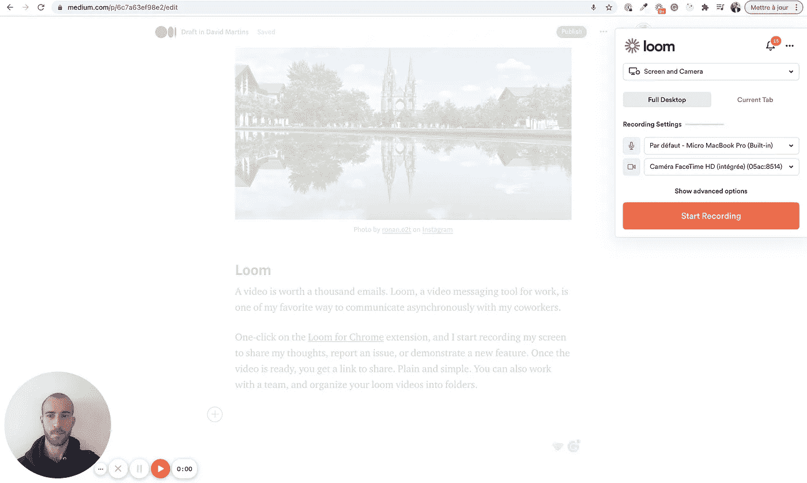
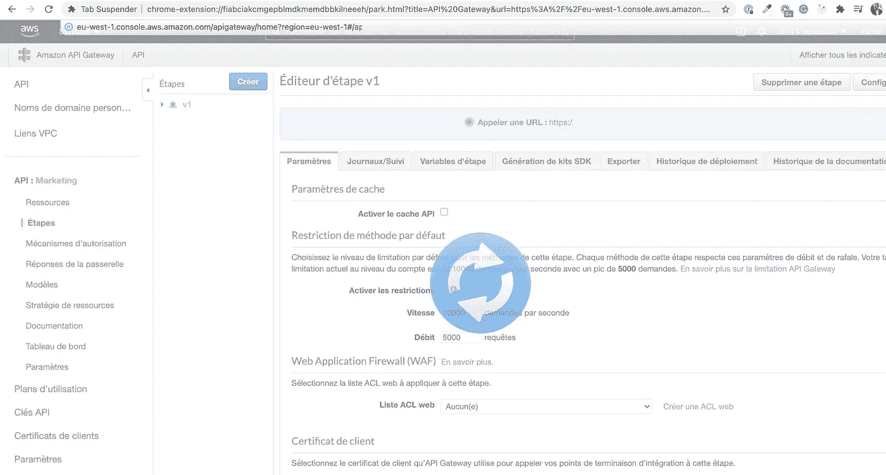
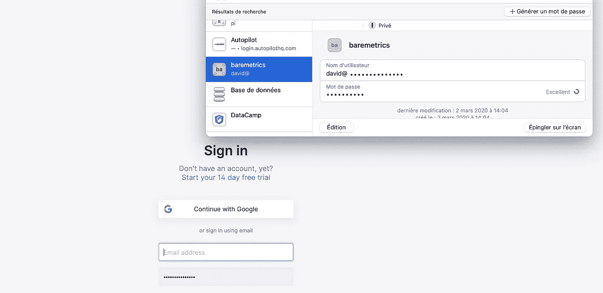
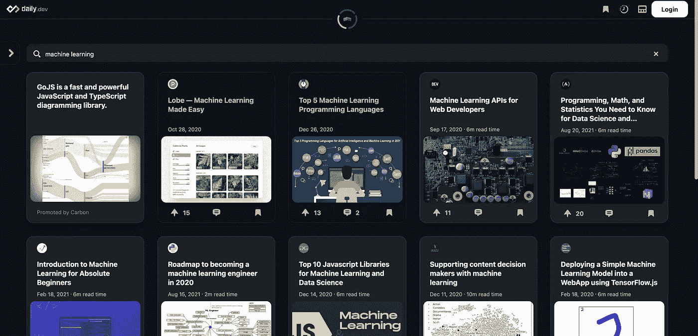
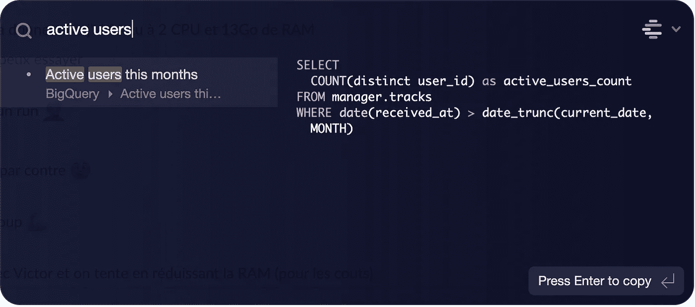

# 我每天使用 7 个 Chrome 扩展来提高效率和生产力

> 原文：<https://betterprogramming.pub/7-chrome-extensions-i-use-daily-to-be-efficient-and-productive-e7fa68ac6a44>

## 使用这些 Chrome 扩展提高您的工作效率

图片由 [@firmbee](http://twitter.com/firmbee) 在 [Unsplash](http://unsplash.com) 上拍摄

已经很久了，我一直想写一篇简短的文章来分享一些我最喜欢的 Chrome 扩展。对开发人员、数据工程师或数据科学家有用的扩展。

不要分享非常特殊和特定技术的扩展，而是更广泛用途的扩展，任何开发人员都可以使用它来提高工作效率。

# 织布机

一个视频抵得上一千封邮件。Loom 是一款工作视频通讯工具，是我最喜欢的与同事异步交流的方式之一。

点击 Chrome 扩展的[织机，我开始记录我的屏幕，分享我的想法，报告一个问题，或者演示一个新功能。一旦视频准备好了，你就会得到一个分享的链接。简单明了。您还可以与团队合作，将您的 loom 视频整理到文件夹中。](https://chrome.google.com/webstore/detail/loom-for-chrome/liecbddmkiiihnedobmlmillhodjkdmb)

# 拉环吊杆

你的浏览器中有多少标签页是打开的？要么你开始做某件事而被打断，要么你只是想留着以后再做。这是开发人员中的一种常见模式，以打开大量标签结束，这会占用大量内存并降低计算机速度。

标签挂起器简单地挂起你不用的标签来节省内存和 CPU。我能看出这有多大的区别，尤其是当你的计算机需要所有可用的资源来运行 IntelliJ 的时候

# ColorZilla 和 WhatFont

这实际上是两个不同的扩展，服务于相似的目的。一个非常简单的插件，可以从你的页面中选择颜色代码(十六进制或 RGB)。它还配有颜色选择器和调色板浏览器、网页颜色分析器、已选颜色历史记录以及其他一些方便的功能。

[WhatFont](https://chrome.google.com/webstore/detail/whatfont/jabopobgcpjmedljpbcaablpmlmfcogm) 类似于 ColorZilla，但是用来识别网页上使用的字体而不是颜色。虽然两者都是简单的扩展，但是它们为许多开发人员节省了大量时间。

# 视频速度控制器

像许多开发人员、数据工程师和数据科学家一样，我看了很多技术视频。无论是通过在线课程、教程、会议还是技术演示，视频都是我最喜欢的学习新技能或找到技术问题答案的方式之一。

[视频速度控制器](https://chrome.google.com/webstore/detail/video-speed-controller/nffaoalbilbmmfgbnbgppjihopabppdk)允许你通过键盘快捷键来加快或减慢你的视频，所以你得到的信息是一样的，但是更快。

图片来源:作者

# 1 密码

作为技术工程师，我们必须保护对我们使用的众多平台和工具的访问。在任何地方都使用同一个密码当然不是一个好习惯，但是记住几十个不同的密码是很难的。

[1 密码](https://chrome.google.com/webstore/detail/1password-%E2%80%93-password-mana/aeblfdkhhhdcdjpifhhbdiojplfjncoa?hl=en)是存储和使用强密码的最简单方法之一，无论是为自己还是与团队共享。只需点击 Chrome 扩展，你就可以安全地登录网站和填写表格。

# 每日发展

[Daily.dev](https://daily.dev/) 是一个面向开发者的新闻聚合器。他们声称监控 400 多个新闻来源，包括一些主要的媒体出版物。

您可以搜索特定的主题，或者使用基于标签的推荐。对于每一个充满激情的开发者来说，这绝对是一个伟大的工具。

# 奖励:代码片段管理器

代码段管理器是存储和组织可重用代码的最简单的解决方案。作为开发人员或数据分析师/科学家，这可能真的会让你更有效率。

一些代码片段管理器与 Google Chrome 集成在一起，所以你可以通过右键上下文菜单保存网页中的一段代码(Medium，Stack Overflow，…)。

有许多代码片段管理器，其中一些有免费版本( [Snipper App](https://snipper.app/) ， [Cacher.io](https://www.cacher.io/) )，或者开源版本(`[massCode](https://masscode.io/)`)。我最近换了一个 [Cacher.io](https://www.cacher.io/) ，因为它提供了一个团队工作区，没有 Chrome 扩展，但是有一个菜单栏访问。

# 结论

使用这些应用程序无疑让我更有效率:如果这篇文章能帮助你发现一些你可能会使用的应用程序，我会很高兴的！

请注意，对于这些应用程序中的每一个，如果我的建议不符合您的需求，您也可以找到替代方案。

感谢阅读。