# 围棋中我不能没有的 7 种代码模式

> 原文：<https://betterprogramming.pub/7-code-patterns-in-go-i-cant-live-without-f46f72f58c4b>

## 代码模式使你的程序更可靠，更有效，并使你的生活更轻松

照片由 [XPS](https://unsplash.com/@xps?utm_source=medium&utm_medium=referral) 在 [Unsplash](https://unsplash.com?utm_source=medium&utm_medium=referral) 上拍摄

7 年来，我一直在开发 EDR 解决方案。

这意味着我必须编写既有弹性又高效的长期运行的系统软件。

我在这项工作中大量使用 Go，我想分享一些最重要的代码模式，你可以依靠它们使你的程序更加可靠和高效。

# 将地图作为一个集合使用

我们经常需要检查一些东西的存在。例如，我们可能想检查一个文件路径/URL/ID 以前是否被访问过。在这些情况下，我们可以使用`map[string]struct{}`。例如:

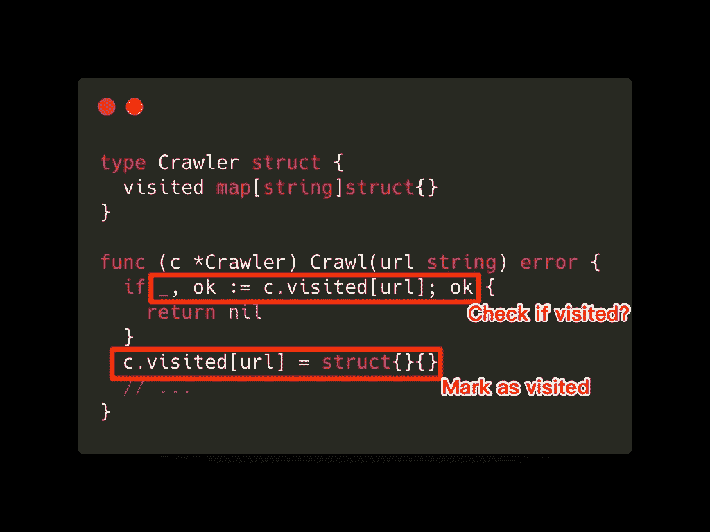

[要点链接](https://gist.github.com/Happyholic1203/6e5e2455e9db5b09770d4f3727af75cc#file-set-go)

使用空结构`struct{}`，意味着我们不希望 map 的值部分占用任何空间。有时人们使用`map[string]bool`，但是基准测试表明`map[string]struct{}` [在内存和时间](https://itnext.io/set-in-go-map-bool-and-map-struct-performance-comparison-5315b4b107b)上都表现得更好。

另外值得一提的是，map 操作通常被认为具有`O(1)`时间复杂度( [StackOverflow](https://stackoverflow.com/questions/29677670/what-is-the-big-o-performance-of-maps-in-golang) )，但是 go runtime 并没有提供这样的保证。

# 使用 chan struct{}同步 Goroutines

信道可以承载数据，但不是必须的。有时，我们只是出于同步的目的需要它们。

在下面的例子中，通道携带一个数据类型`struct{}`，这是一个不占用空间的空结构。这与上一个地图示例中的技巧相同:

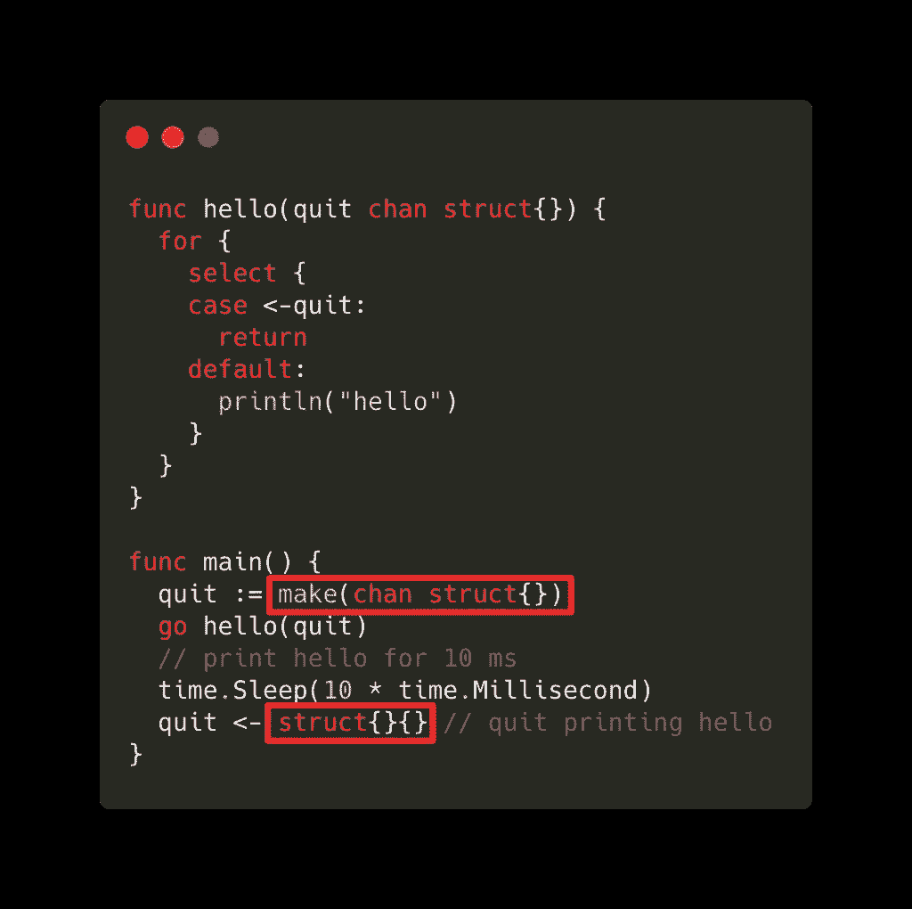

[要诀链接](https://gist.github.com/Happyholic1203/6e5e2455e9db5b09770d4f3727af75cc#file-chan_struct-go)

# 使用 Close 来广播

继续前面的例子，如果我们运行多个`go hello(quit)`，那么我们可以关闭`quit`通道来广播信号，而不是发送多个`struct{}{}`到`quit`:

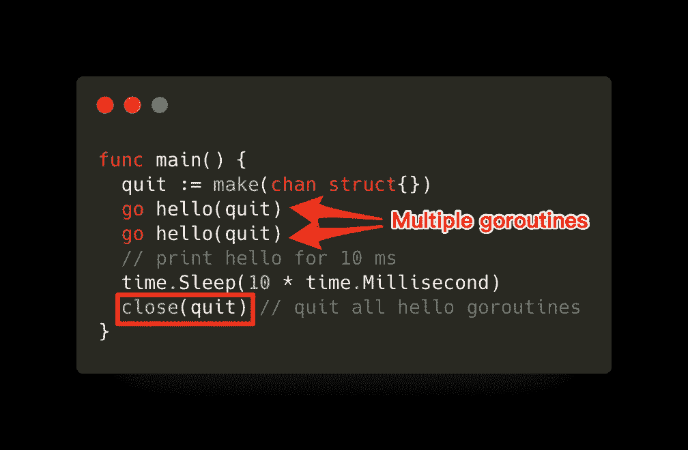

使用接近广播([要点](https://gist.github.com/Happyholic1203/6e5e2455e9db5b09770d4f3727af75cc#file-broadcast-go))

请注意，关闭一个频道来广播信号适用于任意数量的 goroutines，因此`close(quit)`也适用于前面的示例。

# 使用零通道阻止选择情况

有时，我们需要在 select 语句中禁用某些情况，如下面的函数，它从事件源读取事件，并将事件发送到调度通道。(这类函数通常涉及到原始数据的处理，以形成事件对象，但这里我们开门见山)。

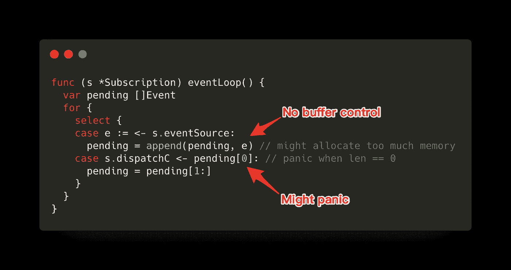

[要点链接](https://gist.github.com/Happyholic1203/6e5e2455e9db5b09770d4f3727af75cc#file-eventloop_naive-go)

我们希望改进的地方:

*   当`len(pending) == 0`时禁用`case s.dispatchC`,这样代码就不会死机
*   当`len(pending) >= maxPending`时禁用`case s.eventSource`以避免分配过多内存

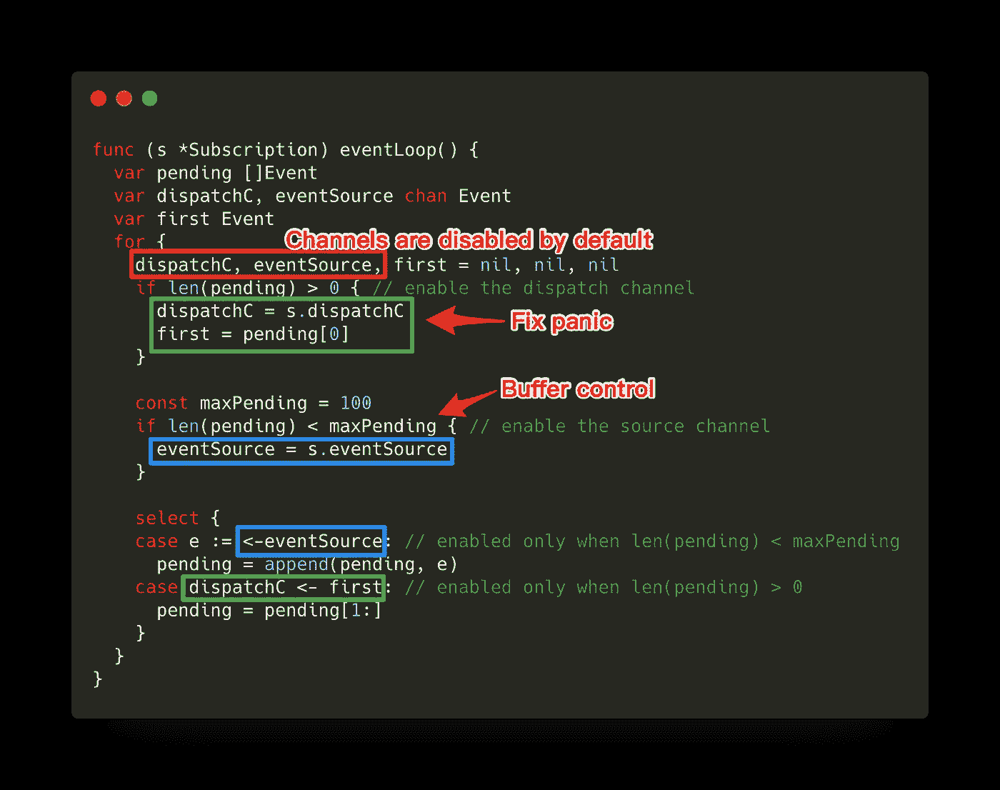

[要点链接](https://gist.github.com/Happyholic1203/6e5e2455e9db5b09770d4f3727af75cc#file-eventloop_improved-go)

这里的技巧是使用一个额外的变量来打开/关闭原始通道，然后将该变量用于 select 情况。

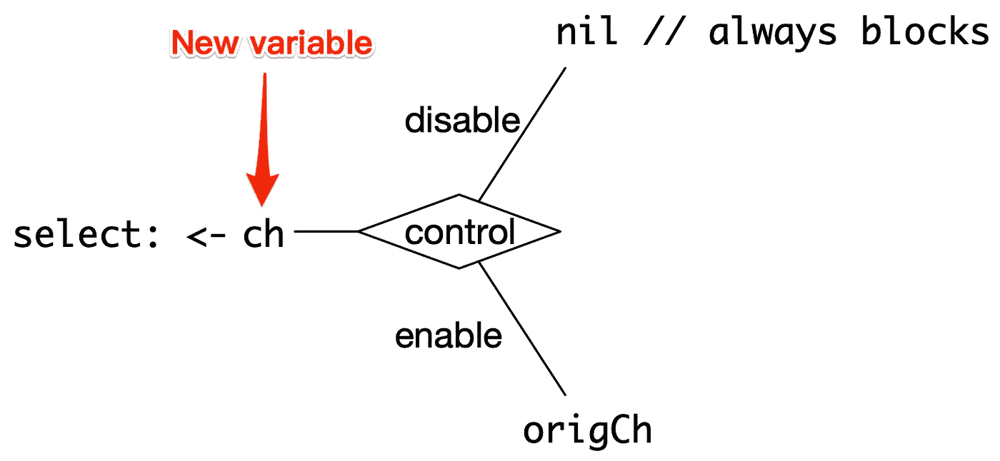

使用新变量启用/禁用选择案例

警告:注意不要同时禁用所有情况，否则 for-select 循环将停止工作。

# 从通道进行非阻塞读取

有时，我们希望提供“尽力而为”的服务。也就是说，我们希望信道是故意“有损耗”的。

例如，当我们有过多的事件要发送给接收者，而其中一些可能没有响应时，这是有意义的。我们可以忽略那些没有响应的接收器:

1.  及时发送给其他接收者
2.  避免为未决事件分配太多内存

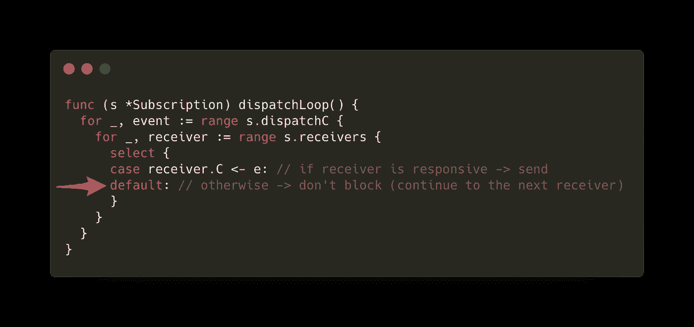

从通道进行非阻塞读取([要点](https://gist.github.com/Happyholic1203/6e5e2455e9db5b09770d4f3727af75cc#file-nonblocking_read-go)

# 匿名结构

有时候我们只是希望一个容器来容纳一组相关的值，这种分组不会出现在其他任何地方。在这些情况下，我们不关心它的类型。在 Python 中，我们可能会为这些情况创建一个字典或元组。在 Go 中，你可以为这种情况创建一个匿名结构。我将用两个例子来说明。

## 案例 1:配置

因此，您希望将配置值分组到一个变量中。但是为它创建一个类型似乎有些矫枉过正。

所以代替这个的是:

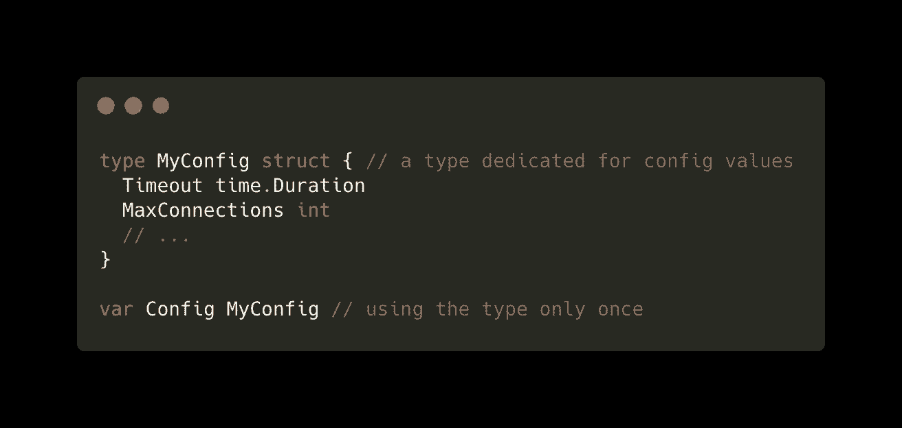

为配置变量创建一次性类型

您可以这样做:

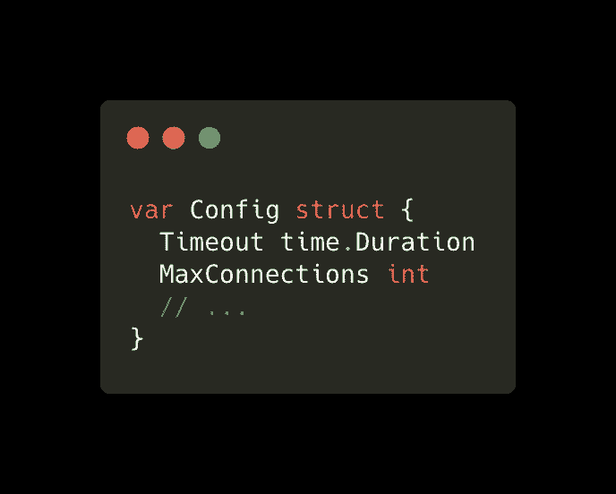

为配置变量使用匿名结构

注意`struct {...}`是变量`Config`的类型——现在你可以通过`Config.Timeout`访问你的配置值。

## 案例 2:测试案例

假设你想测试你的奇特的`Add()`函数，而不是像这样写很多 if-else 语句:

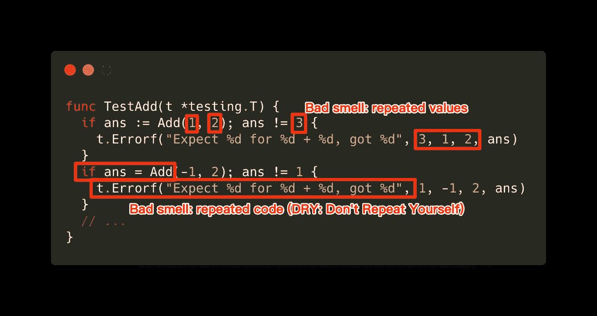

测试没有匿名结构的函数([要点](https://gist.github.com/Happyholic1203/6e5e2455e9db5b09770d4f3727af75cc#file-add_test_naive-go)

您可以像这样分离您的测试用例以及测试逻辑:

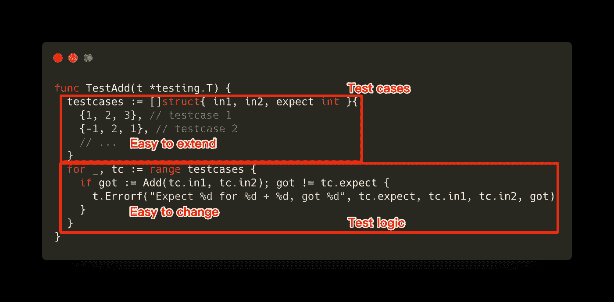

使用一部分匿名结构来声明测试用例

当您有许多测试用例时，或者当您有时需要改变测试逻辑时，这是值得的。

您肯定会在更多的场景中发现匿名结构。例如，当你想解析下面的 JSON 时，你可以定义一个嵌套匿名结构的匿名结构，这样你就可以用`encoding/json`库来解析它。

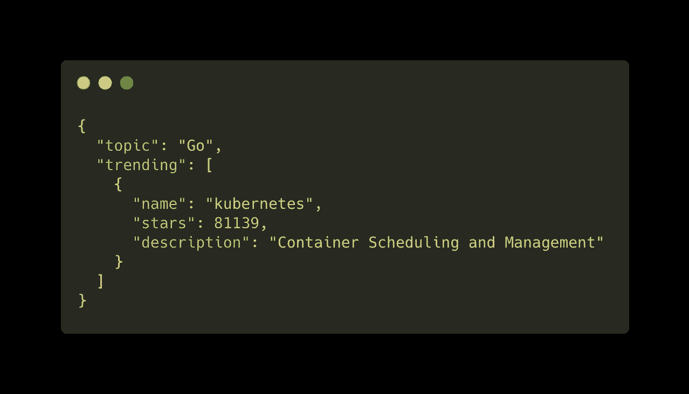

要解析的一些嵌套 JSON 对象([要点](https://gist.github.com/Happyholic1203/6e5e2455e9db5b09770d4f3727af75cc#file-exercise-json))

# 带功能的包装选项

有时我们有一个复杂的结构，其中有许多可选字段，你真的很怀念在 Python 中使用可选参数的日子:

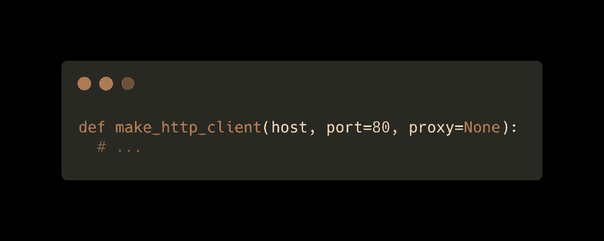

[要点链接](https://gist.github.com/Happyholic1203/6e5e2455e9db5b09770d4f3727af75cc#file-optional_args-py)

我最喜欢在 Go 中实现这一点的方法是使用函数包装这些选项(端口、代理)。也就是说，我们可以构造函数来应用我们的选项值，这些值存储在函数的闭包中。

使用上面的例子，我们有 2 个可选字段(端口、代理)，用户可以在创建`Client`实例时指定:

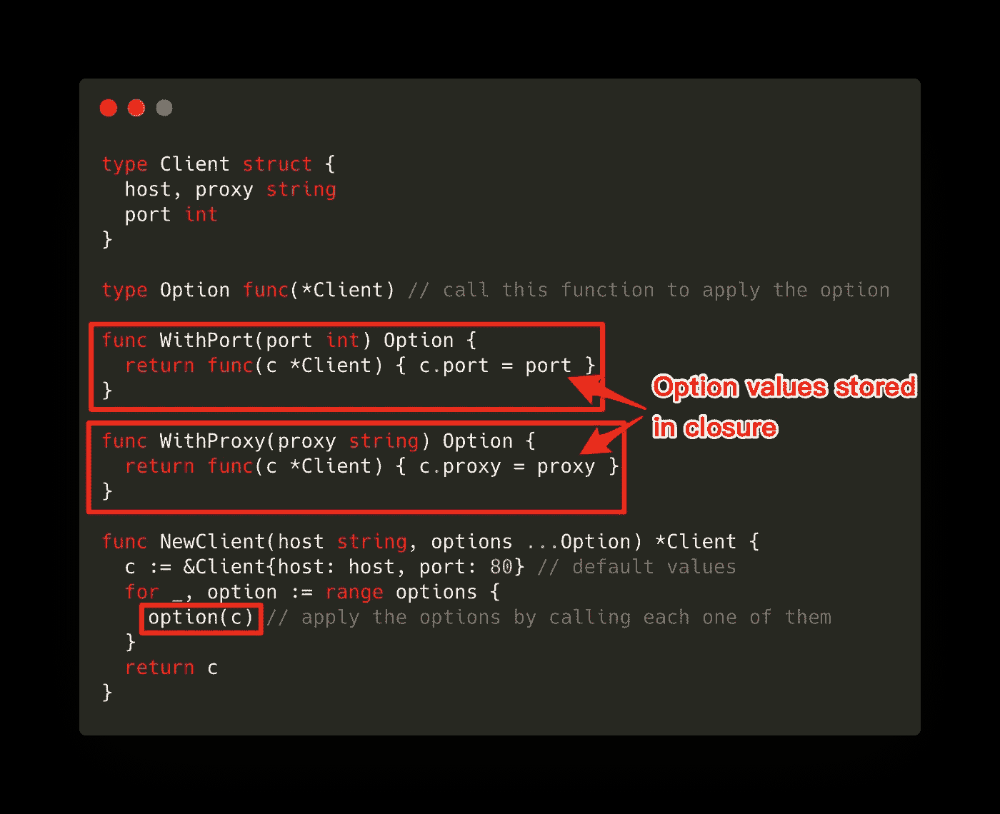

[要点链接](https://gist.github.com/Happyholic1203/6e5e2455e9db5b09770d4f3727af75cc#file-options_func-go)

以这种方式包装选项便于使用，更重要的是，便于阅读:

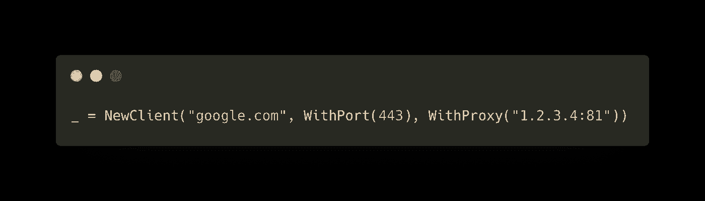

[要点链接](https://gist.github.com/Happyholic1203/6e5e2455e9db5b09770d4f3727af75cc#file-using_options_func-go)

# 结论

所以我们讨论了

*   使用设置的 `map[string]struct{}`
*   使用`chan struct{}`有效地同步 go routine，并使用`close()`向任意数量的 go routine 广播信号
*   将通道变量设置为`nil`以禁用选择案例
*   通过`select-default`模式构建有损信道
*   使用匿名结构对配置值和测试用例分组
*   将选项包装为功能

如果你是一个经验丰富的 Go 程序员，那么你可能以前见过这些代码模式。然而，当我第一次开始用 Go 编程时，这一点对我来说一点也不明显。

Go 是一种非常强大的语言，与我们熟悉的大多数语言(如 C/C++、Python、PHP、Java 等)相比，它有着完全不同的结构。所以正确使用它漂亮的语法是非常重要的，否则你可能会得到非常讨厌的错误，要么很难触发，要么你可能不知道它来自哪里。

我试图用上面的代码模式来描绘 Go 的本质，但是它们还远远没有完成。要了解更多，我建议查看谷歌的[精彩演讲。](https://talks.golang.org/)

# 进一步阅读

*   [高级 Go 并发模式](https://talks.golang.org/2013/advconc.slide#1)
*   [你(可能)不知道的 10 件事 Go](https://talks.golang.org/2012/10things.slide#1)
*   [在 Go 中设置，map[]bool 和 map[]struct{}性能比较](https://itnext.io/set-in-go-map-bool-and-map-struct-performance-comparison-5315b4b107b)