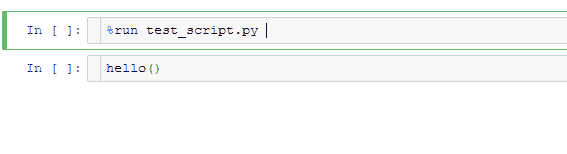
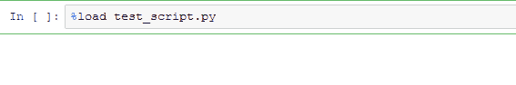
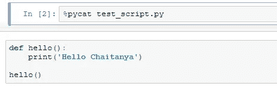
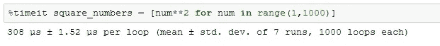
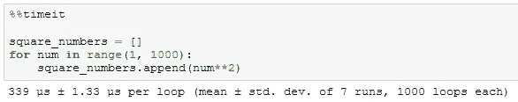
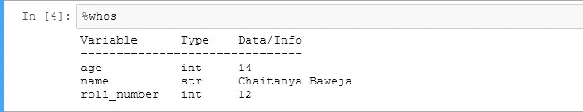
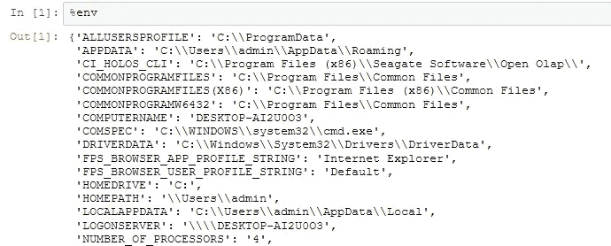
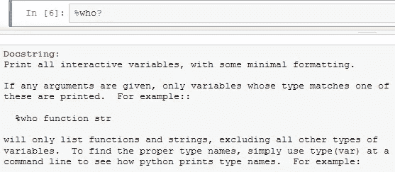

# Python 中的 7 个命令让您的生活更轻松

> 原文：<https://betterprogramming.pub/7-commands-in-python-to-make-your-life-easier-d48dd0992b57>

## IPython 和 Jupyter 笔记本的有用命令


由[格雷格·拉科齐](https://unsplash.com/@grakozy?utm_source=unsplash&utm_medium=referral&utm_content=creditCopyText)在 [Unsplash](https://unsplash.com/s/photos/magical?utm_source=unsplash&utm_medium=referral&utm_content=creditCopyText) 上拍摄的照片

当 Python 在 1991 年首次出现时，它更多地被视为一种“风险自负”的计算语言。今天，它是数据科学、机器学习和软件开发的主要语言。

Python 受欢迎的一个关键原因是它在添加新功能和技术时的灵活性，如[魔法命令](https://ipython.readthedocs.io/en/stable/interactive/magics.html)。

那么，Python 中的神奇命令到底是什么？

魔术命令是普通 Python 语法的增强或快捷方式，旨在简化日常任务。

这些特殊命令使我们能够轻松控制 [IPython](https://ipython.org/) 系统的行为，并解决标准数据分析中的各种常见问题，例如，运行外部脚本或计算一段代码的执行时间。

在本教程中，我将教你一些非常有用的咒语。这些将帮助你成为更好的编程奇才。

所有这些命令都在运行 Python 版本 3.7.4 的 Jupyter 笔记本上测试过。这些命令应该可以在 IDE 上的任何 IPython shell 中完美运行，比如 [Spyder](https://www.python.org/downloads/release/python-374/) 、 [Pycharm](https://www.jetbrains.com/pycharm/) 等。

魔法命令有两种不同的形式:

*   **行魔** —由单个`%`前缀表示，对单行输入进行操作
*   **单元格魔术** —由双`%%`前缀表示，对整个单元格或多行输入进行操作。

让我们来看看一些最流行的魔法命令。

# 运行外部脚本

假设你正在 Jupyter 上做一个新项目，你希望使用你之前写的一个脚本。您可以使用一些 Python 技巧，而不是将整个代码复制到 Jupyter 单元格中。

使用`%run`命令，任何脚本都可以在我们的 IPython 会话环境中运行。

假设我有一个名为`test_script.py`的文件，代码如下:

为了运行它，我们使用:

```
%run test_script.py
```

该脚本将在没有定义导入或变量的空名称空间中运行。

其行为等同于使用`python test_script.py`在命令行上运行程序。

注意:您可以使用`%run -i`提供对已经定义的变量的访问。

在执行的脚本中定义的所有变量现在都可以在 IPython shell 中访问。

例如，查看我如何重用外部脚本中定义的函数:



来源:作者

如果需要，我们也可以传递参数。这里，我们将一个整数参数和命令一起传递。

```
%run python_script.py 10`
```

你可以在这里阅读更多关于[运行外部脚本的信息](https://ipython.readthedocs.io/en/stable/interactive/magics.html#magic-run)。

# 将外部脚本导入/查看单元格

我们可以使用`%run`命令运行一个外部脚本。但是，有些情况下，我们必须将脚本复制到笔记本单元格中。

不用担心，不需要回到 Ctrl-C 和 Ctrl-V。


照片由[艾莉·约翰逊](https://unsplash.com/@lejo?utm_source=medium&utm_medium=referral)在 [Unsplash](https://unsplash.com?utm_source=medium&utm_medium=referral) 上拍摄

`%load`魔法函数允许我们将脚本直接导入到代码单元中。

```
%load test_script.py
```

只需输入上述语句，然后按 run。来，你自己看看这个魔术:



来源:作者

类似于`load`命令，我们有`pycat`。它让我们不用离开笔记本就可以查看任何文件的内容。

```
%pycat test_script.py
```

`%pycat`显示外部文件的所有内容作为其输出。



来源:作者

你可以在这里阅读更多关于[导入外部脚本的信息](https://ipython.readthedocs.io/en/stable/interactive/magics.html#magic-load)。

# 将笔记本单元格导出为外部脚本

作为一名数据科学家，我经常在 [Jupyter 笔记本](https://jupyter.org/)上写代码。但是到了生产阶段，代码需要在一个`.py`脚本文件中。

在这里，`writefile`魔法派上了用场。`writefile`将整个单元格的内容导出到外部文件。

看一看:

注意这里的双百分比(`%%`)符号，因为`writefile`是一个单元格魔术。

我们还可以将代码添加到现有文件中。

你可以在这里阅读更多关于[导出单元格的信息。](https://ipython.readthedocs.io/en/stable/interactive/magics.html#cellmagic-writefile)

# 代码执行时间

`%timeit`计算 IPython 环境执行一个 Python 表达式所需的时间。


照片由 [Aron 视觉效果](https://unsplash.com/@aronvisuals?utm_source=medium&utm_medium=referral)在 [Unsplash](https://unsplash.com?utm_source=medium&utm_medium=referral) 上拍摄

让我们用这个来比较列表理解和一个`for` 循环的性能。

我们将创建一个包含前 1000 个自然数的平方的列表。



来源:作者

`timeit`执行表达式的多次运行。由于我们收到的是几次执行的平均值，所以结果更可靠。

我们还有一个代码块的单元版本`timeit` ( `%%timeit`)。

让我们使用一个`for`循环来创建相同的列表:



在这种情况下，列表理解比同等的`for`循环快 10%。

你可以在这里阅读更多关于[代码时间执行的信息](https://ipython.readthedocs.io/en/stable/interactive/magics.html#magic-timeit)。

# 列出命名空间中的变量

如果我们需要列出名称空间中定义的所有变量，我们有三个命令可以使用。

*   `who`:以最少的格式打印所有的交互变量
*   `who_ls`:以排序列表的形式返回所有变量
*   `whos`:类似`%who`，但是给出了一些关于每个变量的额外信息

这里有一个例子:

上面的代码显示了命名空间中所有用户定义的变量。我们可以通过传递参数来显示特定的数据类型。

```
%who str# Output
# name
```

`who_ls`工作原理非常类似。唯一的区别是输出是列表的形式。

```
%who_ls#Output:
# ['age', 'name', 'roll_number']
```

`whos`提供关于变量的详细信息。



来源:作者

你可以在这里阅读更多关于[列表变量的内容。](https://ipython.readthedocs.io/en/stable/interactive/magics.html#magic-who)

# 执行 HTML 脚本

如果需要为代码提供一些简单的 UI 元素，也可以在 IPython 中执行 HTML 和 JavaScript 代码。

`%%html`允许我们在单元格中编写 HTML 代码。对于 JavaScript，使用`%%js`。

下面是一个用 HTML 呈现简单表格的例子:

该单元格充当 HTML 编辑器。代码运行后，您会收到 HTML 输出。


来源:作者

你可以在这里阅读更多关于[执行 HTML 脚本的内容。](https://ipython.readthedocs.io/en/stable/interactive/magics.html#cellmagic-html)

# 使用环境变量

`env`魔法命令允许你访问和操作系统环境变量。


照片由 [Isaac Smith](https://unsplash.com/@isaacmsmith?utm_source=medium&utm_medium=referral) 在 [Unsplash](https://unsplash.com?utm_source=medium&utm_medium=referral) 上拍摄

您可以:

*   `%env` —列出所有环境变量
*   `%env var` —获取变量的值`var`
*   `%env var value` —设定变量`var`的值

没有任何参数，`%env`将列出所有的环境变量。



来源:作者

我们添加一个参数来返回特定变量的值。


来源:作者

你可以在这里阅读更多关于[使用环境变量的内容。](https://ipython.readthedocs.io/en/stable/interactive/magics.html#magic-env)

# 结论

您可以查看可用魔术函数的一般描述，以及一些示例，使用:

```
%magic
```

我们还可以获得特定魔法函数的信息。例如，要阅读`%who`魔术的文档，只需键入以下内容:



来源:作者

如果你想定义你自己的神奇函数，你应该看看这个:[更多 IPython 资源](https://jakevdp.github.io/PythonDataScienceHandbook/01.08-more-ipython-resources.html)。

这里是我珍藏的一些 Python 魔术命令。请在下面的评论中让我知道你最喜欢的。

我希望你觉得这个教程有趣并且有用。

# 进一步阅读

*   内置魔法命令 IPython
*   [教程要点——魔法命令](https://www.tutorialspoint.com/jupyter/ipython_magic_commands.htm)