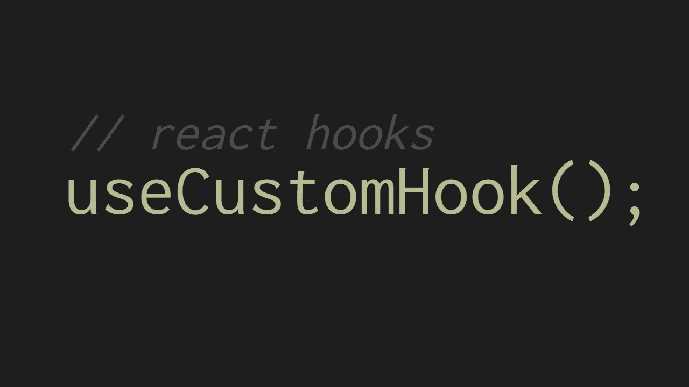

# 你的项目中可能需要的 7 个自定义 React 挂钩

> 原文：<https://betterprogramming.pub/7-custom-react-hooks-you-probably-need-in-your-project-12f86216df94>

## 提取和重用 react 代码和 JS 逻辑的有用钩子



钩子非常适合将逻辑提取到可重用的函数中。有很多 npm 包提供了内置的定制钩子。我个人不喜欢安装一些 npm 模块来获得我自己只用十行代码就能编写的功能。

我整理了一个列表，列出了我在项目中使用的七个有用的常用钩子。

# 1.使用开关

这个钩子很常见，它用于在真和假之间切换布尔值。当我们想要显示/隐藏模态或打开/关闭侧菜单时，这很有用。这个钩子的一个基本版本如下所示:

## 例子

```
import useToggle from './useToggle';const App = () => {
  const [show, toggleShow] = useToggle(); return (
    <Modal show={show} onClose={toggleShow}>
      <h1>Hello there</h1>
    </Modal>
  );
}
```

当我们想要显示/隐藏表中某一行的模态时，可以根据用例对这个钩子稍加修改。我添加了一个`customToggle`方法，它将值设置为一个给定值，而不是切换之前的状态值。

## 用例

假设我们在一个表中有许多行，我们想提供一个删除行的选项。单击删除按钮应该会打开一个确认模式。

对于这种类型的功能，我们需要状态中的两个变量。第一，保存用于确定是否显示删除确认模式的布尔值，第二，保存必须显示删除模式的行 id。

使用这个钩子，我们可以用一个状态变量来完成。以下是如何做到这一点:

# 2.使用页面底部

使用这个钩子，您可以确定用户是否已经滚动到页面的底部。非常适合无限滚动的应用程序，当用户滚动到页面底部时，您需要获取更多数据。

## 例子

```
import usePageBottom from './usePageBottom';const App = (props) => {
  // hook usage
  const scrolledBottom = usePageBottom(); return (
    <div className="App" style={{ height: '150vh' }}>
      <h1>This is app</h1>
      <p>Scrolled to bottom {scrolledBottom}</p>
    </div>
  );
}
```

## 添加节流阀(可选)

减少像窗口滚动事件这样多次触发的事件的通知是一个最佳实践，我们可以使用一个节流设置事件侦听器。我用的是 lodash 的油门；也可以使用去抖。

# 3.useElementBottom

就像 page bottom 一样，我们也可以确定用户是否已经滚动到元素的底部。在这个钩子中，传递了对元素的引用，因此我们可以使用元素的高度和当前滚动位置来确定元素是否滚动到底部。

## 例子

# 4.使用以前的

我们可以定制一个钩子来获取属性或状态的前一个值。有了 React 类组件，`componentDidUpdate` lifecycle 可以用来获取以前的 prop 和 state 值。对于功能组件，我们可以使用自定义挂钩来实现，如下所示:

我们使用一个`useRef`钩子来存储先前的值。我们的钩子返回引用对象在`useEffect`中更新之前的值。

# 5.使用窗口大小

这个钩子返回窗口的宽度和高度。我们在调整窗口大小时设置了一个 throttled set 事件监听器，这样我们每次都能得到正确的宽度和高度。

## 例子

当您想根据窗口的宽度或高度在 JS 代码中做一些事情时，这很有用。

# 6.useEventListener

有了这个钩子，将事件侦听器绑定到窗口或窗口元素变得很容易。在钩子的效果中，我们检查元素是否是来自`useRef`的引用。如果没有，我们将把事件监听器添加到全局窗口对象中。

## 例子

我们也可以使用相同的钩子将事件添加到窗口中

# 7.使用位置

有时，您需要在本地存储和状态之间同步一个值。这个钩子做的完全一样。我们使用`useState`并检查指定的键在本地存储中是否有值，这样我们就可以用它作为初始值。这允许我们在页面刷新时保持值与状态同步。

当值更新时，会运行一个更新本地存储中的值的效果。

## 例子

假设您想要在本地存储中存储一个用户主题偏好

当您点击更改主题按钮时，状态和本地存储中的值都将更新。在页面刷新之后，您将获得存储在本地存储中的最后一个值。

您不局限于这些常见的挂钩，您还可以创建适合您的项目的定制挂钩。有没有什么可以在这里列出的？

感谢阅读。如果你喜欢你读到的东西，也可以看看这个故事:

[](/10-modern-javascript-tricks-every-developer-should-use-377857311d79) [## 每个开发人员都应该使用的 10 个现代 JavaScript 技巧

### 编写简短、简洁、干净的 JavaScript 代码的技巧

better 编程. pub](/10-modern-javascript-tricks-every-developer-should-use-377857311d79)