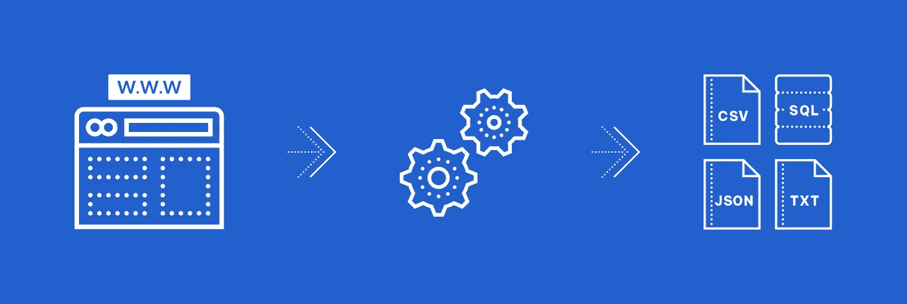
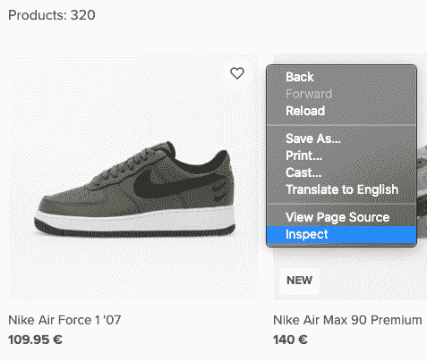
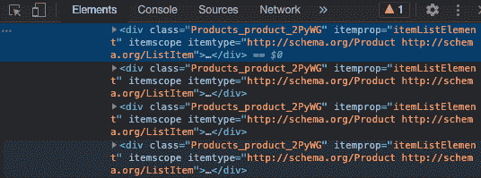
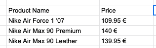

# 使用 Python 创建自己的 Web Scraper 的 7 个简单步骤

> 原文：<https://betterprogramming.pub/7-easy-steps-for-your-own-web-scraper-using-python-97b43abc8a48>

## 高效提取 web 内容


[玛丽娜](https://unsplash.com/@marinajune?utm_source=medium&utm_medium=referral)在 [Unsplash](https://unsplash.com?utm_source=medium&utm_medium=referral) 上拍照。

从网站中手动提取大量数据会耗费大量时间和精力。如你所知，时间就是金钱。

这就是网页抓取变得更简单更快捷的地方。制作一个基本的刮刀也不难。

所以如果你想知道更多关于网络抓取和如何用 Python 创建你自己的版本，请系好安全带！

# **什么是网页抓取？**

网页抓取是一种自动数据提取方法，用于从网站收集非结构化信息，并将其格式化为所需的布局，以便用户可以轻松阅读。做那件事有不同的方法。你可以使用在线服务、[API](http://webscrapingapi.com)，或者自己动手。



作者照片。

在我们进入用 Python 创建自己的 web scraper 的分步指南之前，让我们看看如何使用它。

# **为什么网页抓取有用？**

正如我们上面提到的，网络抓取是用来快速收集大量信息的。怎么可能有用？很多企业利用这个工具的原因如下:

*   收集电子邮件地址:使用时事通讯和电子邮件营销来推销自己的公司需要尽可能多的地址来接触他们的目标受众。您可以使用 web scraper 从您感兴趣的网站下载有用的联系信息。Hunter.io 是一个方便的工具，可以做到这一点。
*   定价优化:你可以了解你的竞争对手对一种产品或服务收取多少费用，并轻松跟踪市场的变化。即使你只是想买些东西，数据提取工具也能帮你找到最好的报价。
*   研究:收集数据报告和统计数据对于完成高质量的研究项目至关重要。有了 web scraper，你自己手动复制大量数据所浪费的时间就更少了。
*   社交媒体:浏览社交媒体网站可以帮助你确定目前的流行趋势，看看哪些方法可以帮助你和你的企业脱颖而出。这也是监测人们对你的品牌的想法和评价的好方法。
*   测试:如果不进行测试，你就无法确定自己的网站能够处理什么，或者如何与用户交互。通过使用 web 抓取工具，您可以发送大量的请求来查看站点是否能够处理这些请求，或者使用不同位置的代理来检查响应时间。

# **为什么要用 Python？**

Python 是一种流行的编程语言，因为它易于使用和学习，对于初学者来说是很好的练习。以下是让 Python 成为优秀选择的一些优势:

*   易读的语法:Python 有一个干净的语法，通常被称为“可执行伪代码”多亏了用来指示区块的凹痕，它的可读性特别好。
*   易于使用:不需要分号(`;`)或花括号(`{}`)来表示块。同样，缩进使得代码不那么杂乱，可读性更好。
*   社区:Python 社区是一个大家庭，它每天都在增长。如果你被代码卡住了，你可以随时寻求帮助。你可能不是第一个遇到这个问题的程序员。
*   丰富的库集合:Python 有许多有用的库，如 Selenium、BeautifulSoup 和 pandas，我们稍后将使用它们进行 web 抓取。
*   动态类型:这意味着变量类型只在运行时确定，这为我们节省了一些宝贵的时间。
*   少写:大量的代码不一定意味着好的代码。在 Python 中，小代码片段可以做相当多的工作！因此，即使在编写代码时，您也节省了时间。

# **打造自己的网络刮刀**

现在你知道为什么 web scrapers 和 Python 很酷了。接下来，我们将经历创建我们的网页抓取器的步骤。

## **1。选择要刮的页面**

在本例中，我们将从 [Footshop](http://www.footshop.eu) 中收集一些不错的运动鞋型号及其价格。然后，我们将以 CSV 格式存储数据以备将来使用。我们想在这个网站上了解有关耐克运动鞋型号的详细信息，所以我们将使用的网址是[https://www.footshop.eu/en/2311-nike-men-s-shoes](https://www.footshop.eu/en/2311-nike-men-s-shoes)。

## **2。检查网站代码**

数据存在于嵌套的标签中，所以我们需要检查页面，看看我们需要的信息在哪个标签下。要检查页面，右键单击元素并选择“检查”



将弹出一个“浏览器检查框”窗口:



我知道一开始可能会有点吓人，但别担心。浏览一个网站的代码比看起来要简单得多——而且随着经验的积累，它只会变得更加容易。

## **3。找到您想要提取的数据**

我们希望提取的数据嵌套在突出显示的`<div>`标签中。我们需要产品名称和价格。通过打开`<div>`标签，更多的标签将出现在屏幕上。

注意每个标签都有一个“类”在我们的例子中，为了获得每个产品的名称，我们需要提取位于带有类`Product_name_3eWGG`的`<h4>`标签中的信息。

根据您要查找的内容，标签和类名可能会有所不同。你可以搜索不同网站甚至图片的链接。

## **4。准备工作空间**

首先，你需要下载安装 [Python](https://www.python.org/downloads/) 。

您可以使用任何适合您的 IDE，但是我推荐使用 [PyCharm](https://www.jetbrains.com/pycharm/download/#section=mac) ,因为它工作起来很有魅力！

创建新项目后，您将需要以下库:

*   Selenium:用于 web 测试和自动化浏览器活动。
*   BeautifulSoup:用于解析 HTML 和 XML 文档。
*   熊猫:用于数据操作和分析。您可以提取数据并以您想要的格式存储数据。

您可以通过打开项目中的终端并使用以下命令行来安装它们:

```
python -m pip install selenium pandas beautifulsoup4
```

## **5。编写代码**

让我们导入一分钟前安装的库:

```
from selenium import webdriver 
from bs4 import BeautifulSoup
import pandas as pd
```

现在我们需要通过将路径设置为`[chromedriver](https://chromedriver.chromium.org/downloads)`来配置 webdriver 使用 Chrome 浏览器。只要路径正确，`chromedriver`位于何处并不重要。不要忘记在末尾添加可执行文件的名称，而不仅仅是它的位置！

```
driver = webdriver.Chrome("/your/path/here/chromedriver")
```

声明变量并设置您希望抓取的网站的 URL:

```
models = []
prices = []
driver.get('[https://www.footshop.eu/en/2311-nike-men-s-shoes](https://www.footshop.eu/en/2311-nike-men-s-shoes)')
```

快好了！

我们需要从网站中提取所需的信息，这些信息位于嵌套的`<div>`标签中。找到具有相应类名的标签，并将数据存储在上面声明的变量中:

## **6。运行代码**

要运行代码，使用以下命令(基本上是告诉 Python 运行您编写代码的`.py`文件):

```
python main.py
```

## **7。存储提取的数据**

你提取了数据，但你打算用它做什么？以更好的格式存储它以供进一步分析是一种解决方案。在本例中，我们将以 CSV(逗号分隔值)格式存储它，因为它可以很容易地导入:

```
df = pd.DataFrame({'Product Name': models, 'Price': prices})
df.to_csv('sneakers.csv', index=False, encoding='utf-8')
```

如果我们重新运行代码，就会创建一个名为`sneakers.csv`的文件。如果您收到“无法从节点连接读取描述符”错误，没有必要惊慌。这只是一个无害的警告。



然后…我们结束了！

我希望这篇文章已经帮助你理解了使用 Python 进行 web 抓取的基础知识。

请注意，这种方法非常方便易用，但不是最有效的，因为一次只能抓取一个网页。您还需要手动选择嵌套在网站上的标签。

但是，这比手动操作要快得多——尤其是如果您想要抓取几个相似的页面。例如，如果我们接下来要检查阿迪达斯的鞋子，我们只需要更改几行代码。

如果你想一起刮，你可以找到更先进的工具。首先，看看 web 抓取 API 能做什么。WebScraping API 编写了一份关于选择 API 的指南，其中也包括一些建议。

编码和刮擦快乐！