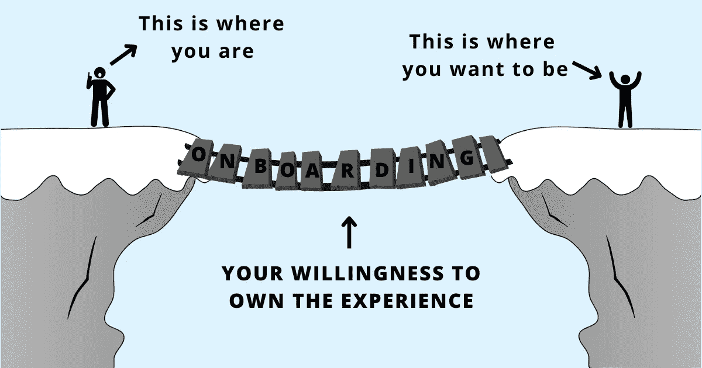

# 让自己适应新工作的 7 个有效方法

> 原文：<https://betterprogramming.pub/7-effective-practices-to-onboard-yourself-in-your-new-job-dfe4c5021f08>

## 没有人能比你做得更好，因为没有人能像你一样投入到你的成长中

鸣谢:作者

在加入的头几个月内脱颖而出的员工和那些努力融入的员工之间的最大区别是什么？

不是他们的才华引起了别人的注意，也不是他们的天赋、技能或知识使他们比别人优越。他们没有更好的资源、优秀的团队或伟大的经理(尽管这些东西在许多其他方面都很有用)。

在工作中表现出色的新员工会脱颖而出，因为他们拥有入职经验。他们不是让组织中的入职流程来决定他们的结局，而是坐在驾驶座上，系好安全带，开始工作。

了解他们与谁互动，他们做什么，他们如何学习不仅给了他们做好工作的背景和清晰性。在工作的头几个星期里，独立应对各种复杂情况和挑战给了他们一种掌控感。对自己的经历负责能给他们采取行动和前进所需的精神空间。

当他们做得不好或在某些事情上挣扎时，他们不会浪费他们的精神周期来证明他们的糟糕表现——通过让某人或某事负责——他们会用它来确定他们做错了什么，以及他们可以做些什么来变得更好。

问题是:难道你的经理不希望你加入吗？是的，就是这个期望。但是，如果你所在组织的入职流程很糟糕，或者你的经理没有足够的时间来完成这个流程，该怎么办呢？抱怨没有得到自己应得的，还是为自己在工作中的学习和成长负责，哪个更好？是的，你可能得不到完美的入职体验，但是沮丧、感到委屈或责怪你的经理不会解决你的问题。

消极拉动消极。对自己感觉不好并陷入这些负面情绪会影响你的判断——破坏性的行为和[糟糕的决定](https://www.techtello.com/avoid-making-bad-decisions/)会让入职经历不仅不愉快，而且没有成效。如果你对入职很认真，那么在开始一份新工作时，遵循以下 7 种做法，让自己加入进来，把自己的成长掌握在自己手中。

但首先，让我们定义一下你的入职目标:

*   获得相关的知识和背景来做好你的工作。
*   通过感觉控制和正确的开始来获得自信。
*   通过创造价值获得认可。
*   表现得积极主动，对自己的成长负责。

> “你是自己船的船长；你越是从这个角度出发，事情对你就越有利。”—大卫·艾伦，把事情做好

# 1.了解现有的入职流程

开始时，理解现有的和你实际需要的之间的区别是很重要的。为了了解这种差异，从遵循指示转移到提出问题和进行观察。

存在什么:

*   您的组织是否有正式的入职流程？持续多长时间？它包括什么？
*   在持续期间和结束时的期望是什么？了解以后的预期将有助于您确定入职工作的优先级，以便在入职结束后与您需要做的工作保持一致。
*   您的入职培训仅限于您自己的团队，还是涉及其他跨职能团队？

您需要什么:

*   了解你的团队参与的工作类型，以及做好你的工作所需的技能。
*   做出更好决策所需的信息—产品知识、业务理解、运营背景或特定技术的细节。
*   过去决策的背景以及导致这些决策的因素。
*   利益相关者和你需要合作的其他职能部门。
*   团队动态、[沟通实践](https://www.techtello.com/team-communication/)，以及你需要遵循的其他流程。

一旦你理解了这种差异，积极地弥合过程的一部分和你真正需要的之间的差距。

# 2.把贡献放在首位

获取有关人员、产品和流程的知识很重要，但被动知识仅在一定程度上有用。从入职之初就做出贡献不仅能让你脱颖而出，还能带来真正的学习。你最初的可交付成果不必是影响巨大的宏大项目。从小处着手，找出你可以提供帮助的机会——错误修复、文档、自动化、分析，或者分享你的想法和建议。

> “安全早胜。早期的胜利会建立你的信誉并创造动力。他们创造良性循环，利用你投入到组织中的能量，创造一种美好事物正在发生的普遍感觉。在最初几周，你需要找到建立个人信誉的机会。”—迈克尔·沃特金斯，头 90 天

找出你现在所处的位置与你可以开始做出贡献的位置之间的差距:

*   你需要什么信息？
*   您需要什么权限或访问控制？
*   目前你在哪些方面差距最大？
*   什么看起来是获取上下文和构建所需知识的好顺序(从步骤的顺序来考虑)。
*   确定一个[小胜](https://www.techtello.com/team-communication/)。你应该优先考虑什么？实施它的可行时间表是怎样的？你如何将这一点传达给你的经理并寻求一致？

当你开始自己做出贡献时，你的经理就少了一件担心的事情。他们会钦佩你的努力[积极](https://techtello.com/how-to-create-a-thriving-relationship-with-manager/)，并负责你自己的入职、学习和成长。

# **3。确定盟友**

新的环境、新的人、新的项目、新的流程以及新工作的其他挑战让你的身体高度警惕。一开始一切都像是威胁。

如果你不小心:

*   小的失望会变成大的挫折。
*   期望值的微小差异会让你失去兴趣。
*   你可能会感到格格不入，并采取[自我破坏行为](https://www.techtello.com/what-type-of-imposter-are-you/)(取悦他人、拖延等)来应对这种不属于自己的感觉。
*   看到别人做得多好会导致怨恨和嫉妒。
*   你可能会过度担心做得不好，浪费宝贵的时间沉思，而不是采取行动。

> "你的支持网络是一个坚实的基础，从这里你可以推动自己向上."—安娜·巴恩斯，如何适应

在消极情绪袭来的时候，有人给你建议会有很大的不同。你的盟友可以帮助你改变你的处境——让你充满力量，振奋人心。它们可以帮助你明白你的感受是人类共同经历的一部分，而不是你独有的。

如果你得到了你需要的人的支持，入职并不一定是一次痛苦的经历。识别你工作中的盟友:

*   观察你周围的人——他们如何与他人相处？他们有帮助吗？他们是想把别人拉起来还是拉下来？
*   你的盟友不需要来自你自己的团队。从其他团队、职能部门和部门中寻找真正有兴趣帮助他人的人。
*   不时地接近他们，征求他们的意见。

不要因为你还不了解别人而回避接近他们。主动去更好地了解他们，建立信任，成为他们支持网络的一部分。

# 4.不要等着分享你的观点

入职过程中最大的恐惧是“直言不讳”你可能会发现很难表达你的观点或分享你的想法，即使你有一些有价值的东西要说——如果你说了一些愚蠢的话怎么办？别人觉得你傻怎么办？如果他们无视你的建议怎么办？一开始保持沉默似乎是一个安全的赌注，但是安全不会带来学习。真正的成长需要走出你的舒适区。

不要等待完美的机会或者只有在你 100%自信的时候才说出来，[说出你要说的话](https://www.techtello.com/how-to-get-your-ideas-heard/)而不用担心别人会如何评价你。不要犹豫，表明你有发言权。让人们承认和认可你。

以下是这样做时的一些注意事项:

*   不要试图显得聪明。
*   不要说刻薄的话或粗鲁的评论。
*   不要评判他人或批评他们的建议。
*   一定要邀请反馈。
*   一定要把它表述为一种观点。
*   一定要保持开放的心态。

当你说出来并带着正确的意图分享时，即使你的想法不是最好的，其他人也会欣赏你的投入并钦佩你的自信。

# 5.尊重他人的时间

你的入职不会发生在筒仓中。它实际上占用了别人的时间。如果你的工作涉及[与其他团队和职能部门的人](https://www.techtello.com/cross-functional-collaboration/)合作，或者你处于管理/领导职位，你的入职应该包括与相当数量的人进行 1:1 的时间。了解他们所负责的领域和他们团队的具体挑战，可以让你深入了解如何更好地合作。

与其为了开会而开会，不知道该问什么，浪费时间，不如有备而来，问一些具体的问题，以示尊重。

*   他们拥有哪些区域？
*   你的工作有哪些部分是重叠的？
*   你如何能有所贡献？
*   他们过去在与他人合作时面临过哪些挑战，你如何能让他们更轻松？
*   征求他们的意见，看看还能见谁。

一次让他们感到被重视和被尊重的伟大谈话会让他们感到充满活力，并最终建立信任。

# 6.专注于建立关系

展示你的能力，培养新技能，证明你的能力是入职的重要部分，但更重要的是建立关系。不要以找不到时间与工作中的人联系为代价，急于实现一个目标。把工作放在首位，而不是去了解你的同事，出去闲逛，和他们共度一些快乐时光，这是一个限制职业生涯的大错误。由于工作中的大量时间都花在了与他人的合作上，所以与人建立关系有助于更容易地完成工作。

表现出好奇心。作为一个人去了解他们:

*   他们喜欢什么？
*   是什么让他们失去兴趣？
*   他们来自哪里？
*   他们的优势是什么？
*   他们目前在做什么？
*   他们如何找到工作？
*   他们的爱好是什么？
*   他们喜欢什么样的音乐、食物和生活？

…等等。等。我希望你明白我的意思。

花一点时间去了解他人将对[建立信任](https://www.techtello.com/leading-with-trust/)大有帮助。了解工作之外的其他人不仅会让工作变得更有意义，还会为你打开新的机会。当别人信任你时，他们更愿意和你一起工作。

# 7.练习自我保健

不管你有多努力，不管你在入职时付出了多少努力，一切都不会如你所愿:

*   你会[犯错误](https://www.techtello.com/learning-from-mistakes/)。
*   有些事情会比预期的更难。
*   你将得不到想要的结果。
*   你会努力想出解决问题的办法。

不管是什么原因，自我同情研究的先驱克里斯汀·内夫建议，在那些时刻，善待自己——完全停止判断和评价自己。不要给自己贴上“好”或“坏”的标签，简单地用开放的心接纳自己。她建议的这条路通向自我同情:

> “自我同情不是无情地评判和批评自己的各种不足或缺点，而是意味着当你面临个人失败时，你是善良和理解的。你不再只是以一种“僵硬的上嘴唇”的心态忽视你的痛苦，而是停下来告诉自己“现在真的很难，”我该如何安慰和关心此时此刻的自己？”

自怜是一种以善意和理解面对错误和失败的能力，而不是让它们定义你或决定你的价值。这是对你自己有同样的温暖感、同理心和积极的尊重，就像你在别人面临困境时对他们一样。

例如，如果一个朋友走近你，告诉你他们前几天是如何搞砸的，现在觉得自己完全配不上他们的职位，你会不会安慰他们，让他们放心，提醒他们他们是多么聪明和有能力，并解释说错误是学习和成长的自然组成部分？自我同情是每当你失败或感到不足时给自己同样的保证:“错误不能定义我。我可以从这个错误中吸取教训。我可以实施新的策略，然后再试一次。”

练习同情会给你从错误中学习的弹性，使你在面对挫折时能够前进，而不是陷入对错误的无休止的沉思。

如果你刚开始一份新工作，恭喜你！不要指望你的经理或导师负责提供完美的入职流程，而是让入职成为你自己的优先事项——弥合现有信息与你需要知道的信息之间的差距，优先做出贡献，确定盟友，不要犹豫分享你的观点，尊重他人的时间，建立关系，在困难时刻善待自己。

记住这一点:没有人能比你做得更好，因为没有人能像你一样对你的成长投入。

# 摘要

1.  让新团队成员正确入职应该是每个经理的首要任务。但是，如果你的组织缺乏入职流程，或者你的经理拒绝将其视为优先事项，该怎么办？不要悲叹和浪费时间去思考“没有发生什么”，而是花时间和精力去设计你自己的入职体验。
2.  找出“现有的”和“你需要的”之间的差距，以便更好地完成你的角色。通过设计一系列步骤来达到你的目标，积极地弥补这个差距。
3.  获取知识是入职的一个有用部分，但将知识付诸实践才是最重要的。它将使学习不仅更有用，而且更持久。
4.  开始时你需要很多支持。找出你能指望给你建议的人。
5.  与他人分享你的想法和观点不是为了证明你的聪明，而是带着增值的态度，向他人学习。
6.  如果你和另一个人安排了一对一的会面，准备好问他们有用的问题，以便更好地了解他们，他们的角色，以及他们在工作中面临的挑战。寻找有贡献的领域以及如何有效地合作。
7.  将关系置于完成工作之上。从长远来看，你如何与他人联系更重要。
8.  最后，你的入职经历不会没有挑战。当生活变得艰难时，善待自己。

在[推特](https://twitter.com/techtello)上关注我，了解更多故事。

*这个故事最初发表于*[*【https://www.techtello.com】*](https://www.techtello.com/onboard-yourself/)*。*