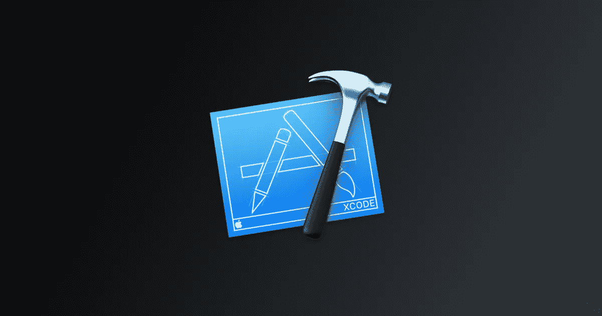
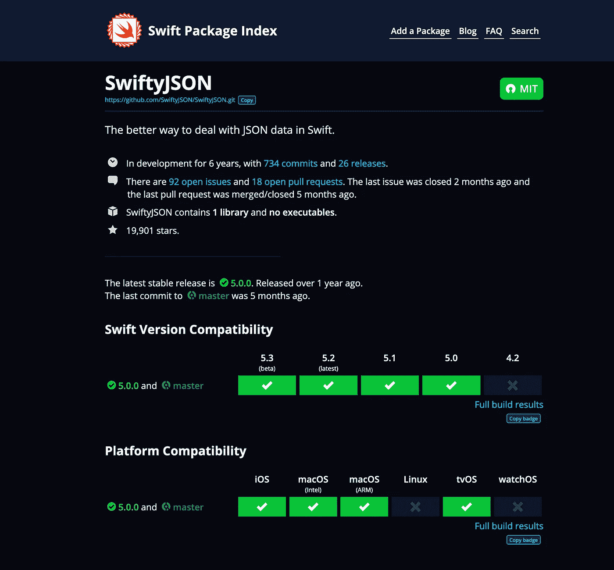
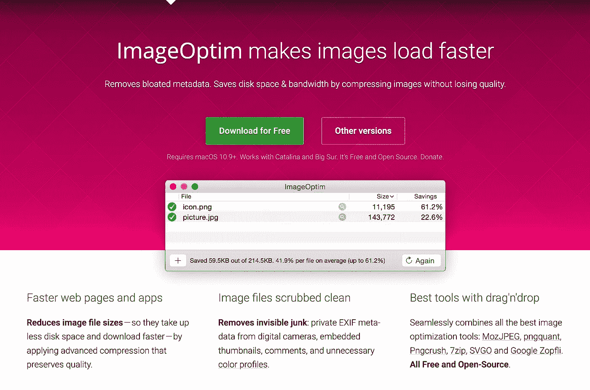
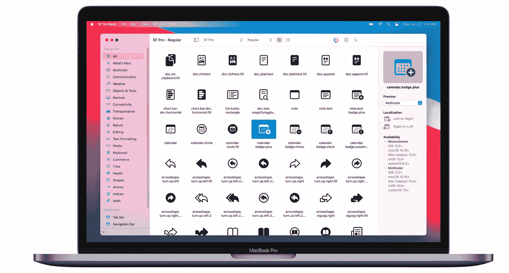
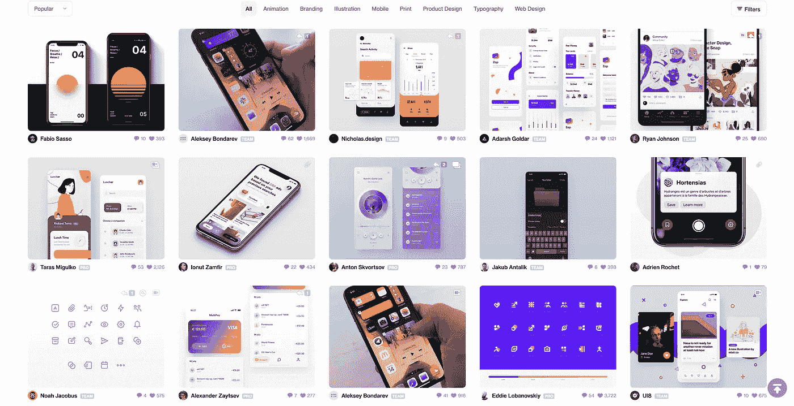
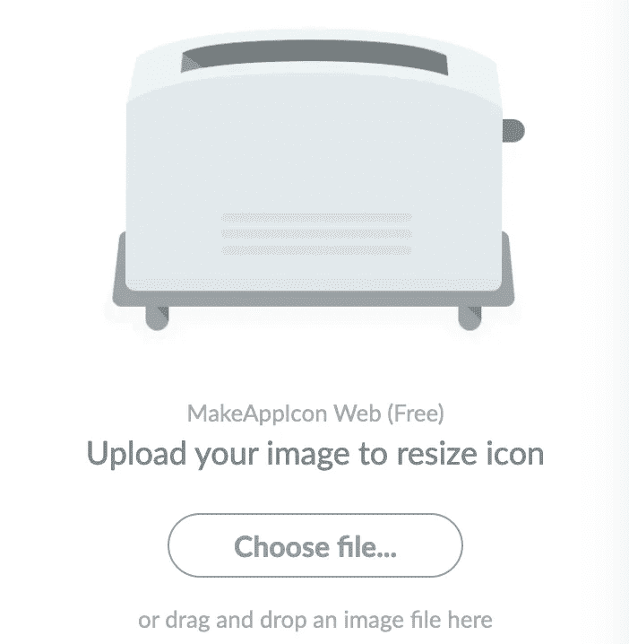
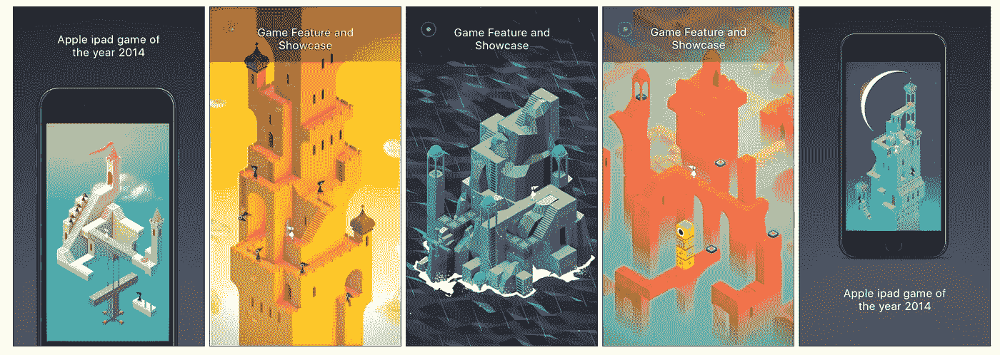
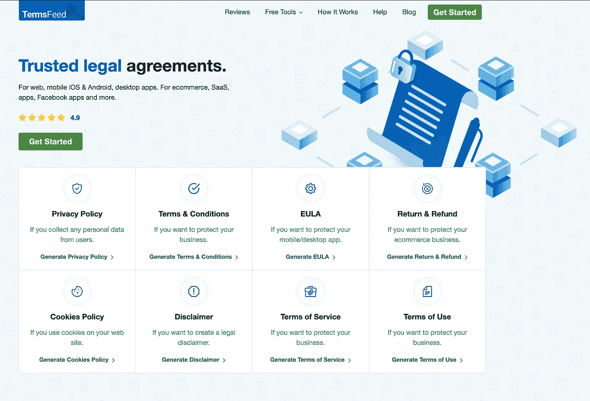

# 7 个重要的 iOS 开发工具

> 原文：<https://betterprogramming.pub/7-essential-ios-developer-tools-6bbc8ce53675>

## 提高您的生产力

图片: [Xcode 图标](https://en.wikipedia.org/wiki/File:Xcode_Icon.png)(公共领域)

无论你是一名经验丰富的 iOS 开发者，还是刚刚入门，拥有合适的工具都是必不可少的。有很多有用的工具可以帮助您在开发的各个阶段节省时间。

以下是我使用过的工具列表，它们可以为任何开发人员节省大量时间。

# 1.Swift 包裹索引

[Swift 包索引](https://swiftpackageindex.com/)是 Swift 库的缺失包注册表。该索引包含 3000 多个 Swift 库，并且每天都有新的库加入，是查找 Swift 库的最佳途径。

Swift Package Index 的最大优势在于，它在一个简洁的视图中向您展示了项目的活跃程度及其版本兼容性。

swiftpackageindex.com

# 2.图像优化

保持较小的应用安装规模对于应用商店的成功至关重要。一种简单的方法是压缩应用程序图像。

[Image Optim](https://imageoptim.com/mac) 通过拖放功能轻松实现这一点。这个工具是如此之好，以至于你会很难找到质量上的差异。

imageoptim.com/mac

# 3.SF 符号

[SF Symbols](https://developer.apple.com/sf-symbols/) 是一组超过 2400 个符号，您可以在您的应用程序中使用。它们可配置一系列重量和尺寸，以适应您的设计。

它是一个 Mac 桌面应用程序，非常容易上手。

在 Mac 上使用 SF 符号桌面应用程序。

# 4.滴水不漏

对于每个开发人员来说，一点设计灵感永远不会有坏处。在这里，你可以找到任何类型的设计或应用的灵感。用 Dribbble 让你的设计更上一层楼。

运球热门 iOS 搜索结果

# 5.制作应用程序图标

iOS 开发中最乏味的部分之一是调整应用程序图标的大小 26 次，以创建应用程序图标集。

[制作应用图标](https://makeappicon.com/)完全自动化这一过程，为您节省大量时间，让您将更多时间花在功能上。虽然用户界面毫无修饰，但他们的输出质量是完美的。

makeappicon.com

# 6.ShotBot 3.0

虽然有很多应用商店截图生成器，但没有一个像 [Shotbot](https://app.shotbot.io) 一样拥有如此广泛的免费层。

除了通常的附加功能，Shotbot 还提供了多个免费模板和设备选项。Shotbot 导出的图像可以立即上传到 iTunes Connect 媒体管理器。

app.shotbot.io

# 7.TermsFeed

最后但同样重要的是， [TermsFeed](https://www.termsfeed.com/) 是一个为您生成大量法律协议的工具。要在 App Store 上部署，您必须拥有应用程序隐私策略。TermsFeed 让这个过程变得轻而易举。

TermsFeed 提供免费托管和随着政策变化的自动更新，在部署到 App Store 时可以让您完全放心。一个主要的好处是，对于大多数 iOS 应用程序来说，隐私策略可以自由生成。

# 结论

谢谢你读到这里。你还会列出其他的 iOS 开发工具吗？无论你是初学者还是有经验的开发者，这些工具都可以让你的开发过程更加高效。我希望你今天学到了新东西！