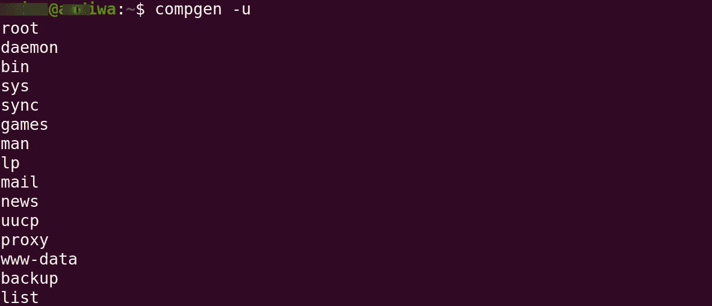
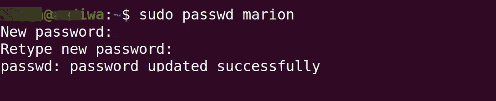
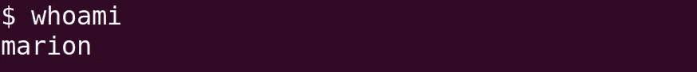
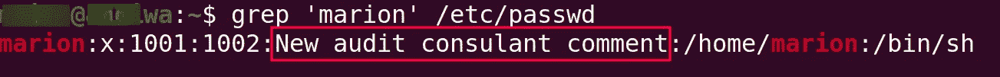

# 管理用户的 7 个基本 Linux 命令

> 原文：<https://betterprogramming.pub/7-essential-linux-commands-for-managing-users-4407cff0ccb6>

## Linux 用户管理命令


照片由[乔希·索伦森](https://www.pexels.com/@joshsorenson?utm_content=attributionCopyText&utm_medium=referral&utm_source=pexels)从 [Pexels](https://www.pexels.com/photo/black-flat-screen-computer-monitor-1714208/?utm_content=attributionCopyText&utm_medium=referral&utm_source=pexels) 拍摄。

从一开始，Linux 操作系统就被设计成一个多用户操作系统。因此，在 Linux 机器上执行的最常见的管理任务之一是管理用户帐户。这是保持健康和安全的 Linux 机器的关键部分。

您可能会认为从命令行管理用户是一件令人不知所措的事情。反之，则完全不是。您只需要知道几个基本命令，我将在本文中介绍它们。

# 背景

Linux 中的用户帐户是获得系统访问权限的主要方式——无论是本地还是远程。

Linux 系统上有三种主要类型的用户帐户:

1.  Root 帐户—可以无限制地修改 Linux 系统的用户。
2.  系统帐户—用于运行服务或特定程序。一些最常见的包括 MySQL、mail、daemon、bin 等。
3.  用户帐户—对系统具有有限访问权限的普通用户。

在 Linux 中，大多数用户信息可以在位于`/etc/passwd`、`/etc/shadow`和`/etc/group`的三个文件中找到。

*注意:您需要提升权限才能运行本指南中指定的一些命令。*

# 1.列出所有用户

要列出计算机上的所有可用用户，可以运行以下命令:

```
$ compgen -u
```

或者，您可以使用以下命令直接从`/etc/passwd`文件中输出用户:

```
$ cat /etc/passwd
```

正如您从输出中注意到的，您的列表将包含根用户、几个系统用户和一般用户帐户。输出如下所示:



# 2.创建用户帐户

最常见的管理任务之一是向系统添加用户。简单的命令就是`useradd`。例如，要添加名为 Marion 的用户，我们可以运行以下命令:

```
$ sudo useradd -c "audit consultant" marion
```

`-c`是一个可选参数，允许您添加与您正在创建的用户相关联的注释。

`useradd`命令也接受其他可选参数。您可以通过运行以下命令来查看它们:

```
man useradd
```

*提示:* *基于 Debian 的系统有* `*adduser*` *命令作为替代。*

# 3.更改用户密码

要为我们刚刚创建的用户添加默认密码，我们可以使用`passwd`命令。`passwd`命令也可用于修改任何用户的密码，如下所示:

```
$ sudo passwd marion
```

然后会提示您输入想要设置的密码。输出如下所示:



*注意:当您输入密码时，终端上不会显示任何内容。只能说这是 Unix 的做事方式。*

# 4.切换用户帐户

正如我前面提到的，Linux 是真正的多用户操作系统。您可以随意从终端切换用户帐户(只要您被允许这样做)。

要切换到我们刚刚在上面创建的`marion`用户帐户，我们可以使用如下的`su`命令:

```
$ su marion
```

然后会提示您输入要切换到的用户的密码。

如果您成功切换了用户，您可以通过运行以下命令来确认您的新身份:

```
$ whoami
```

您的输出应该类似于下面的内容:



要切换回之前的账户，只需输入`exit`命令。

# 5.修改用户帐户

`usermod`命令允许您更改用户帐户。它采用与`useradd`命令相似的可选参数。

例如，要修改我们上面创建的`marion`用户帐户的注释，您可以执行以下操作:

```
$ sudo usermod -c "New audit consulant comment" marion
```

为了检查注释是否确实被修改，我们可以使用以下命令在`/etc/passwd`文件中搜索用户帐户名称:

```
$ grep 'marion' /etc/passwd
```



# 6.删除用户帐户

从命令行删除用户帐户非常容易。因此，你需要谨慎行事。

`userdel`命令用于删除用户账户。它只需要一个可选参数:`-r`。当指定了`-r`参数时，您将删除用户的主目录和邮件假脱机。

要删除我们在本指南中创建的用户帐户，请执行以下操作:

```
$ sudo userdel -r marion
```

# 7.以超级用户身份运行命令

我们已经使用了我们现在要看的命令，但是我没有真正解释它。`sudo`(超级用户 do)命令允许您作为根用户运行命令。将提示您输入用户密码来运行此命令。

如果您不能以 root 用户的身份运行命令，将通过终端通知您不能在系统上运行`sudo`。

要运行提升的命令，使用`sudo`命令，后跟您想要运行的提升的命令。例如，要添加用户，您可以这样做:

```
$ sudo useradd newuser
```

# 最后的想法

现在，您已经有了:一些强大的命令允许您在 Linux 系统上管理用户帐户。

如果你喜欢其他的用户管理命令，请在评论区发表。