# React 中掌握高位图表的 7 个例子

> 原文：<https://betterprogramming.pub/7-examples-to-master-highcharts-in-react-33938fab5171>

## 企业级 JavaScript 图表库


卢克·切瑟在 [Unsplash](https://unsplash.com?utm_source=medium&utm_medium=referral) 拍摄的照片

[Highcharts](https://github.com/highcharts) 是一个基于 SVG 的企业级 JavaScript 图表库。它于 2009 年由挪威 Vik 的 Highsoft 首次发布。

Highcharts 支持一长串不同的图表类型，包括`line`、`spline`、`area`、`areaspline`、`column`、`bar`、`pie`、`scatter`、`scatter3d`、`heatmap`、`treemap`、`gauge`以及几乎所有的图表类型。它附带了优秀的文档和无数的例子。它功能强大，学习曲线低。唯一的缺点是许可证是专有的。个人/非商业用途是免费的，但商业用途需要付费。

连同 [D3.js](/construct-d3-charts-in-react-cfecc2848ae2) ，Highcharts 主导了图表应用。让我们来看看它是如何工作的。

# 设置工作环境

我们将使用 [Create React App](/an-in-depth-guide-for-create-react-app-5-cra-5-b94b03c233f2) 来探索高图表。以下命令创建一个 React 项目:

```
% yarn create react-app react-highcharts
% cd react-highcharts
```

安装`highcharts`和`highcharts-react-official`。

*   `highcharts`:是 JavaScript 制图库。
*   `highcharts-react-official`:这是 React 官方支持的 Highcharts 包装器。

```
% yarn add highcharts highcharts-react-official
```

安装后，这些包成为`package.json`中`[dependencies](/package-jsons-dependencies-in-depth-a1f0637a3129)`的一部分:

```
"dependencies": {
  "highcharts": "^10.3.2",
  "highcharts-react-official": "^3.1.0"
}
```

在工作环境中，添加图表就像添加一行代码一样简单:

```
<HighchartsReact highcharts={Highcharts} options={option} />
```

# 示例 1:基本类型图表

数据系列是图表上绘制的行或列数字。对于我们的示例，创建两个简单的数据序列，每个序列有六个点。

```
series: [
  {
    data: [1, 2, 1, 4, 3, 6],
  },
  {
    data: [2, 7, 0, 4, 6, 2],
  },
]
```

修改`src/App.css`以具有`flex`布局。

```
div {
  display: flex;
  flex-wrap: wrap;
}
```

修改`src/App.js`，绘制`line`、`spline`、`area`、`areaspline`、`column`、`bar`、`pie`、`scatter`八种类型的图表。

*   在第 6–28 行，创建了一个图表配置。
    –在第 7-11 行，定义了图表的`type`、`width`和`height`。
    –在第 12–14 行，图表标题由字体组成。由于 [lodash 附带 Create React App](https://medium.com/better-programming/lodash-create-react-apps-built-in-library-for-debounce-and-throttle-with-hooks-3418087f44d8) ，所以调用`_.startCase`使每个首字母大写。
    –在第 15–19 行，`yAxis`，Y 轴或数值轴配置有`title`。
    –在第 20–27 行，创建两个数据系列。
*   在第 33–40 行，每行创建一个具有指定类型的图表:
    –`line`(第 33 行):折线图由一系列用直线连接的数据点表示。
    –`spline`(第 34 行):样条图表在数据系列中的点之间绘制一条曲线。
    –`area`(第 35 行):面积图的功能与折线图相同，只是它填充线条和阈值之间的区域，默认情况下阈值为 0。
    –`areaspline`(第 36 行):面积样条图与面积图相同，只是线条是样条而不是直线。
    –`column`(第 37 行):柱形图以竖条的形式显示数据。
    –`bar`(第 38 行):条形图和柱形图一样，只是 X 轴和 Y 轴切换了。
    –`pie`(第 39 行):饼图是一个圆形的图表，分为扇形，与它所代表的数量成正比。
    –`scatter`(第 40 行):散点图为每个数据点画一个点，不连接它们。

执行`yarn start`，我们会看到八个图表，每个图表都是一个特定的类型。

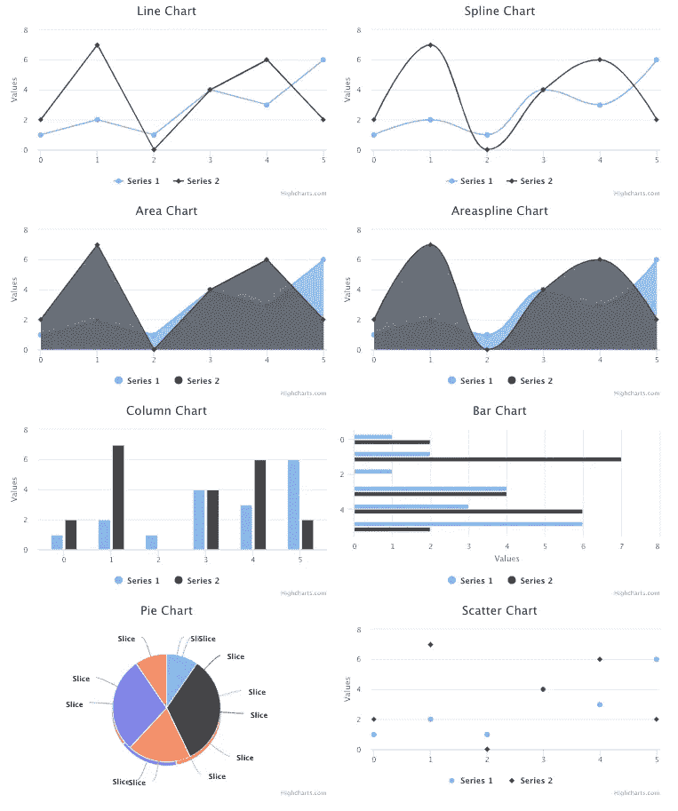

作者图片

# 示例 2:图表配额和导出菜单

看上面的截图。默认情况下，Highcharts 会在图表的右下角放置一个致谢名单标签/链接。

可以配置文本和链接。这里有一个例子:

```
credits: {
  text: 'My Credits',
  href: 'https://jenniferfubook.medium.com/jennifer-fus-web-development-publications-1a887e4454af',
}
```

或者可以使用以下代码将其关闭:

```
credits: {
  enabled: false,
}
```

“Highcharts”导出模块为`View in full screen`、`Print chart`、`Download PNG image`、`Download JPEG image`、`Download PDF document`、`Download SVG vector image`提供一个带有导出相关菜单项的菜单。

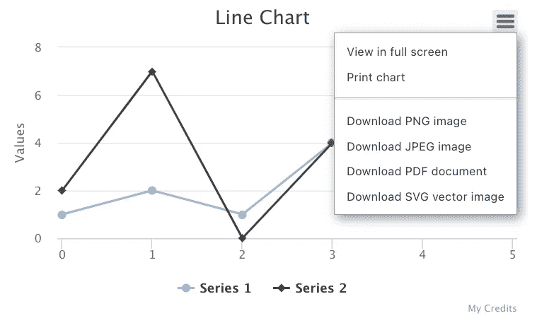

作者图片

这个模块可以包含在一行代码中。

```
require('highcharts/modules/exporting')(Highcharts);
```

或者两行:

```
import HighchartsExporting from 'highcharts/modules/exporting';
HighchartsExporting(Highcharts);
```

默认情况下，菜单位于图表的右上角。位置和内容可以定制。

下面是修改后的`src/App.js`:

*   在第 5–6 行，加载了导出模块。
*   在第 30–32 行，默认信用已被关闭。

执行`yarn start`，我们看到八个图表。每个图表都有一个导出菜单，并且已关闭积分。

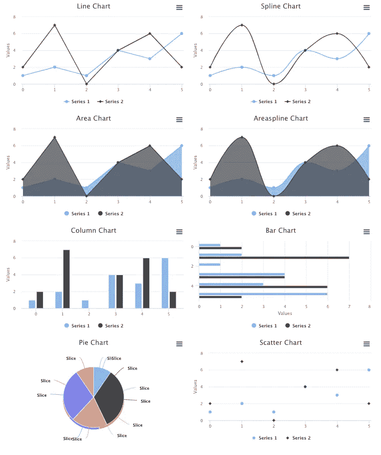

作者图片

在折线图上，点击`Print chart`菜单项，弹出一个模式，可以打印图表或保存为 PDF 文件。

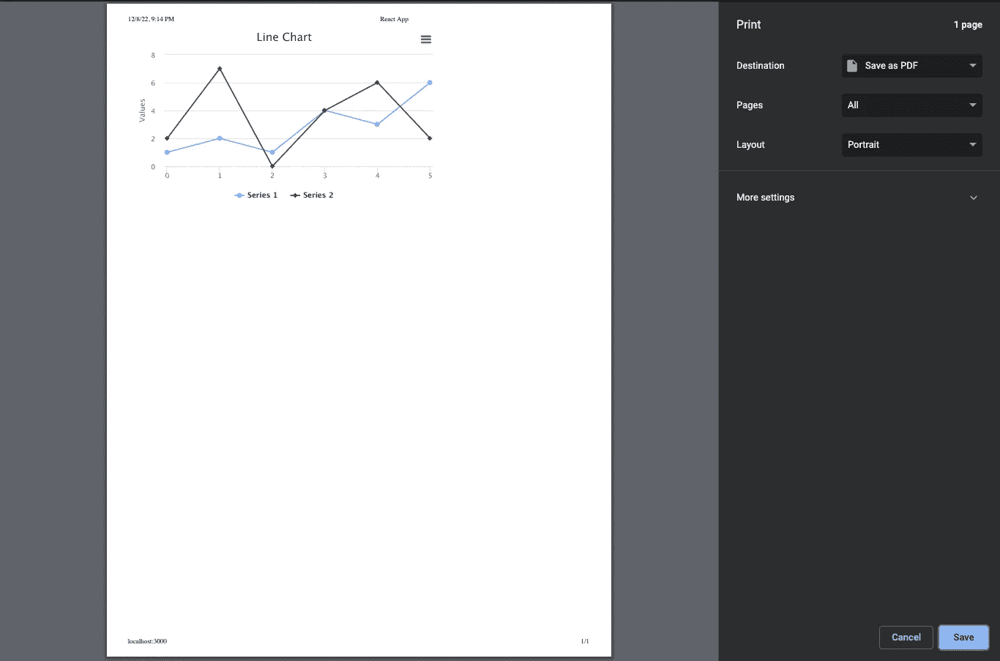

作者图片

在折线图上，点击`Download PNG image`菜单项，将一个 PNG 文件保存到`Downloads`文件夹中。

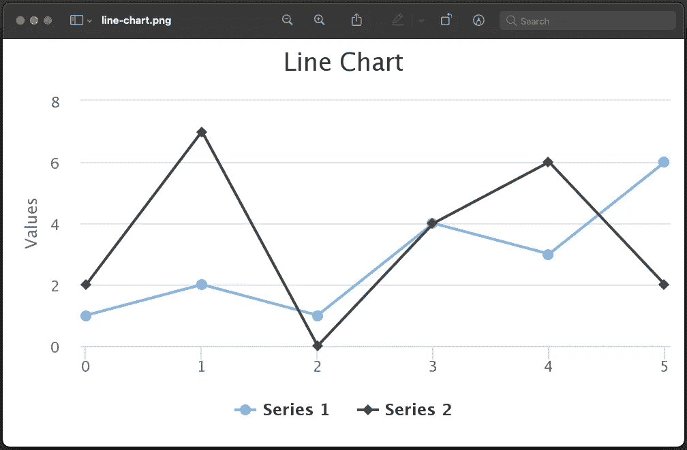

作者图片

每个图表都可以保存为 JPEG、PDF 或 SVG 格式。

# 示例 3:3D 视图中的基本图表

`highcharts-3d`是一个提供 3D 支持的 Highcharts 模块。需要导入它来创建三维图表。

这个模块可以包含在一行代码中

```
require('highcharts/highcharts-3d')(Highcharts);
```

或者两行

```
import Highcharts3D from 'highcharts/highcharts-3d';
Highcharts3D(Highcharts);
```

除了以下选项之外，配置三维图表类似于配置常规图表:

*   `options3d`配置 3D 选项。标志`enabled`启用 3D 图表。`alpha`和`beta`是旋转图表视图的角度，`depth`用默认值`100`定义总深度。这里有一个例子:

```
options3d: {
  enabled: true,
  alpha: 15,
  beta: 30,
  depth: 300,
}
```

*   `plotOptions.[type].depth`定义每个图的深度。
*   对于每种类型，图表数据的格式可能不同。`xAxis`定义 X 轴或分类轴。对于我们的 3D 示例，为不同深度的绘图定义了三个`xAxis`，尽管这些`xAxis`本身不可见。

下面是修改后的`src/App.js`:

*   在第 6 行和第 8 行，加载了 Highcharts 的 3D 模块。
*   在第 13–18 行，`options3d`启用 3D 图表并配置旋转角度和深度。
*   在第 28-38 行，三个`xAxis`被设置为不可见。
*   在第 39–43 行，`plotOptions.[type].depth`被设置为 100。
*   在第 44-57 行，`series`定义了`xAxis 0`、`xAxis 1`和`xAxis 2`的绘图。每个情节有六个点。

执行`yarn start`，我们会在 3D 视图中看到八个图表。

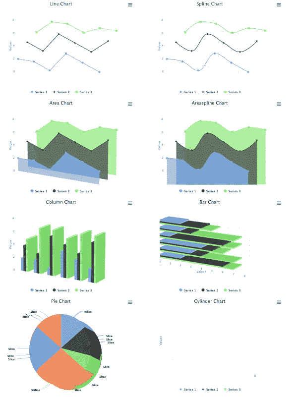

作者图片

以下是上面截图中的一些观察结果:

*   `line`、`spline`、`area`、`column`和`bar`图表在 3D 视图中显示良好。
*   `areaspline`不旋转视图，因为 3D 类型不受官方支持。
*   `pie`图有效，但是三个馅饼叠在一起很笨拙。将其简化为一个饼图会使它看起来更好:

```
series: [
  {
    data: [2, 2, 1, 4, 3, 2],
  },
]
```

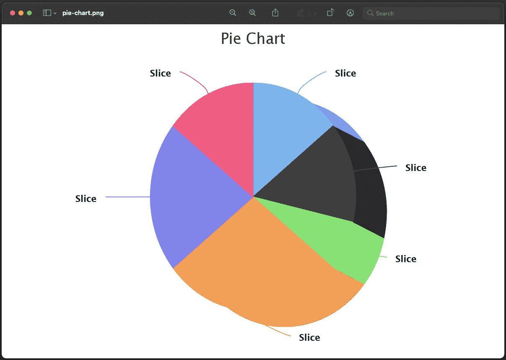

作者图片

*   `scatter`图表不显示。我们使用的常用选项不适用于`scatter`图表。数据需要以`[x, y, z]`格式编码。同样，它应该使用类型`scatter3d`，而不是`scatter`。以下是固定配置:

```
const getOptions = (type) => ({
  chart: {
    type: 'scatter3d',
    options3d: {
      enabled: true,
      alpha: 15,
      beta: 30,
      depth: 300,
    },
  },
  title: {
    text: _.startCase(`${type} chart`),
  },
  yAxis: {
    title: {
      text: 'Values',
    },
  },
  series: [
    {
      data: [[0, 2, 0], [1, 2, 0], [2, 1, 0], [3, 4, 0], [4, 3, 0], [5, 2, 0]],
    },
    {
      data: [[0, 4, 100], [1, 3, 100], [2, 6, 100], [3, 5, 100], [4, 4, 100], [5, 6, 100]],
    },
    {
      data: [[0, 5, 200], [1, 7, 200], [2, 7, 200], [3, 6, 200], [4, 7, 200], [5, 7, 200]],
    },
  ],
  credits: {
    enabled: false,
  },
});
```

然后，三维散点图显示出来:

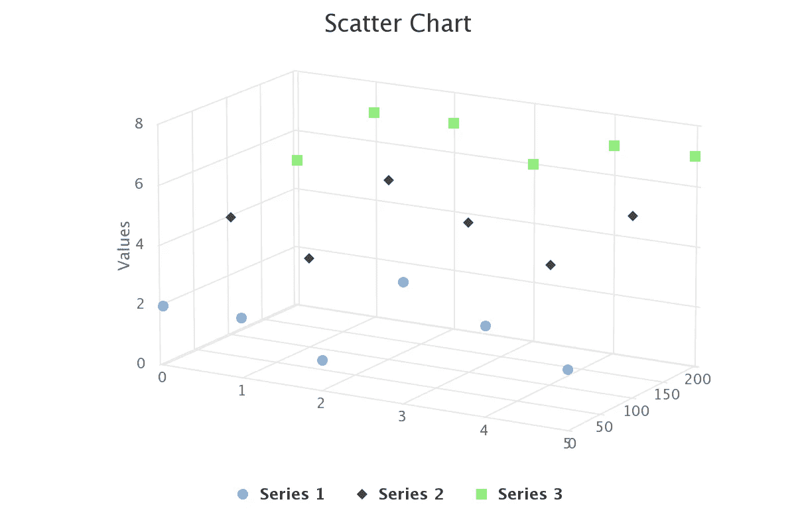

作者图片

在上面的截图中，`xAxis`结束标签`5`被`zAxis`开始标签`0`卡住。旁边的两个数字看起来像`50`。为了避免混淆，我们关闭了第一个标签`zAxis`，它代表 3D 绘图的 Z 轴或深度轴。

```
zAxis: {
  showFirstLabel: false
}
```

现在看起来好多了。

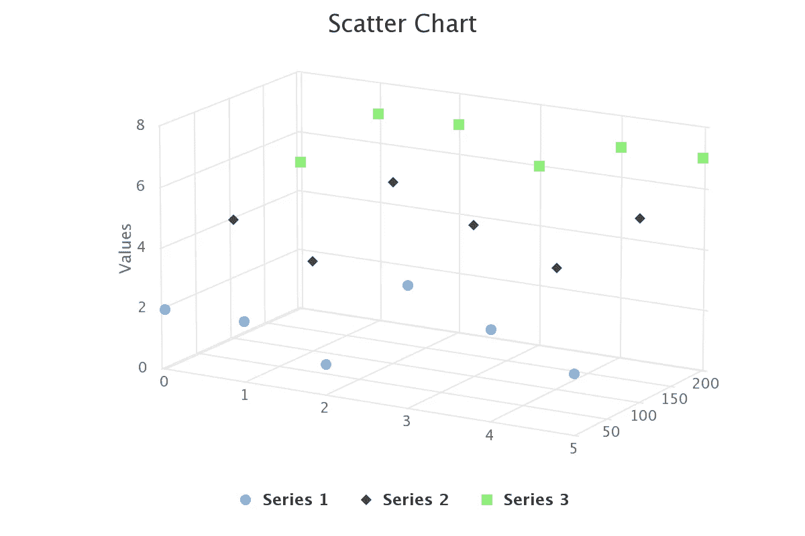

作者图片

# 示例 4:热图图表

热图是数据的图形表示，其中矩阵中包含的各个值用颜色表示。

热图需要导入热图模块。这可以通过一行代码来完成:

```
require('highcharts/modules/heatmap')(Highcharts);
```

或者两行:

```
import HighchartsHeatmap from 'highcharts/modules/heatmap';
HighchartsHeatmap(Highcharts);
```

`xAxis.categories`定义如下:

```
xAxis: {
  categories: ['A', 'B', 'C', 'D', 'E', 'F'],
}
```

`yAxis.categories`定义如下:

```
yAxis: {
  categories: ['Apple', 'Banana', 'Pear'],
}
```

然后，`data`是一个 6×3 的矩阵，其中`[x, y, z]`表示在`[x, y]`处的 z 值:

```
data: [
  [0, 0, 5], [0, 1, 8], [0, 2, 9],
  [1, 0, 3], [1, 1, 6], [1, 2, 2],
  [2, 0, 7], [2, 1, 1], [2, 2, 9],
  [3, 0, 4], [3, 1, 5], [3, 2, 1],
  [4, 0, 8], [4, 1, 6], [4, 2, 7],
  [5, 0, 7], [5, 1, 3], [5, 2, 4],
]
```

`colorAxis`是系列的颜色轴。从视觉上看，它在图例中显示为渐变或单独的项目。这里的`colorAxis`定义了从`'#FF0000'`(红色)到`'#0000FF'`(蓝色)的渐变

```
colorAxis: {
  min: 0,
  minColor: '#FF0000',
  maxColor: '#0000FF',
}
```

看起来是这样的:

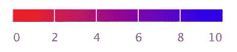

作者图片

下面是改装过的`src/App.js`:

*   在第 6 行和第 8 行，加载了热图模块。
*   在第 13 行，添加`plotBorderWidth`来分隔热图区域。
*   在第 18–20 行，`xAxis`用 6 个`categories`定义。
*   在第 21-25 行，`yAxis`由 3 个`categories`定义。`title`关闭(第 23 行)，按照`reversed`的顺序显示`categories`。
*   在第 26–30 行，`colorAxis`被定义为从白色(第 28 行)到第一个系列的颜色(第 29 行)的渐变颜色。`colorAxis`替换系列的默认标签。
*   在第 31–45 行，定义了`data`，并且`dataLables`能够显示每个区域的热图值。
*   在第 53 行，创建了热图。

执行`yarn start`，我们会看到一个热图。

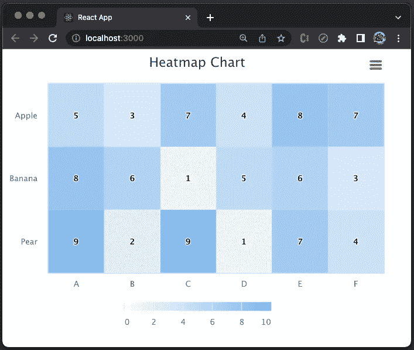

作者图片

# 示例 5:树形图图表

树形图是数据的图形表示，其中使用嵌套图形(通常是矩形)显示分层数据。

树形图需要导入树形图模块。这可以通过一行代码来完成:

```
require('highcharts/modules/treemap')(Highcharts);
```

或者两行:

```
import HighchartsTreemap from 'highcharts/modules/treemap';
HighchartsTreemap(Highcharts);
```

`data`定义层次父子关系以及值。这里有一个例子:

```
data: [
  {
    id: 'parentId',
    name: 'Parent',
    color: '#FF0000',
  },
  {
    name: 'child1',
    parent: 'parentId',
    value: 3,
  },
  {
    name: 'child2',
    parent: 'parentId',
    value: 5,
  },
]
```

下面是修改后的`src/App.js`:

*   在第 6 行和第 8 行，加载了 treemap 模块。
*   在第 16 行，`series`中指定的是`type`，而不是`chart`。
*   在第 17 行，`layoutAlgorithm`被设置为`'sliceAndDice’`，这是将区域划分为更小部分的默认行为。
*   在第 18–79 行，`data`定义了层次数据，该数据定义了三个父数据:`Red`(第 19–23 行)、`Green`(第 24–28 行)和`Blue`(第 29–33 行)。`Red`有三个孩子(第 34–48 行)，`Green`有两个孩子(第 49–58 行)，而`Blue`有四个孩子(第 59–78 行)。
*   在第 89 行，创建了树形图。

执行`yarn start`，我们会看到一个树形图。


作者图片

将`layoutAlgorithm`改为`'stripes’`，我们可以看到这些区域被分成了几条:

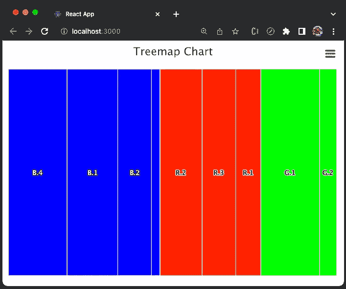

作者图片

将`layoutAlgorithm`改为`'squarified’`或`'strip’`，我们看到这些区域被分成以下形状:

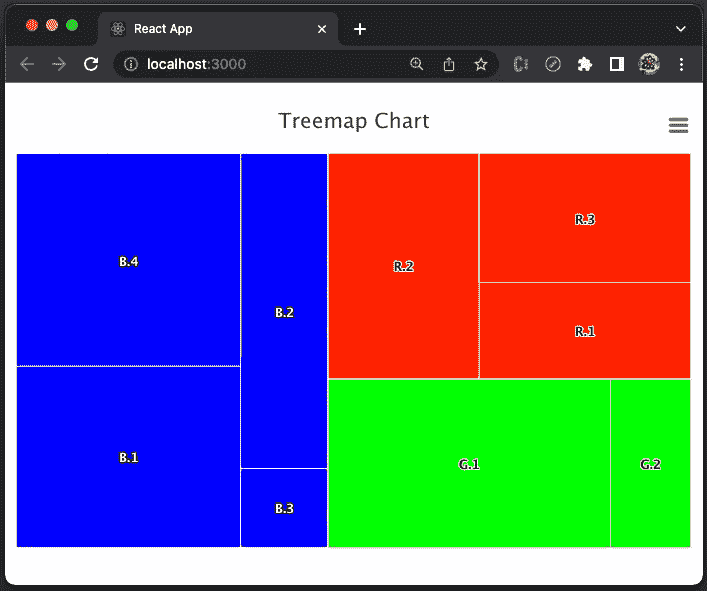

作者图片

# 示例 6:仪表图

仪表图也称为速度表图或表盘图。图表有一根指针，它指向枢轴点上方的某个值。这是一种有效的可视化方法，可用于评估绩效、跟踪进度和促进决策制定。

仪表图需要导入`highcharts-more`模块。这可以通过一行代码来完成:

```
require('highcharts/highcharts-more')(Highcharts);
```

或者两行:

```
import HighchartsMore from 'highcharts/highcharts-more';
HighchartsMore(Highcharts);
```

对于仪表图，`yAxis`设置`min`和`max`的值，`series.data`定义一个值。

```
yAxis: {
  min: 0,
  max: 100,
},
series: [
  {
    data: [80],
  },
]
```

下面是修改后的`src/App.js`:

*   在第 6 行和第 8 行，`highcharts-more`被加载。
*   在第 17-23 行，`yAxis`将`min`和`max`设置为 0 和 100。`yAxis.title.text` 设置为`'Speed'`。
*   在第 24–28 行，`series.data`被设置为 80。
*   在第 36 行，创建了仪表图。

执行`yarn start`，我们会看到一个仪表图。

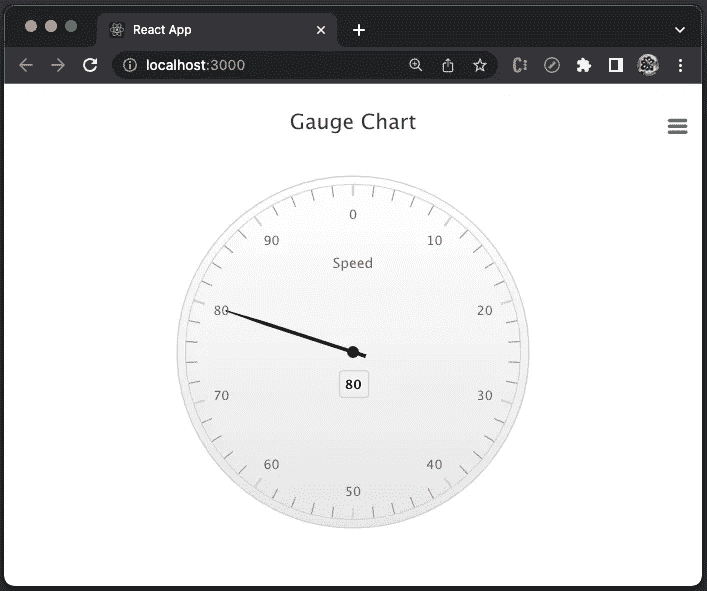

作者图片

用`pane.startAngle`和`pane.endAngle`可以为任何圆弧定义一个量规图。当不是一整圈时，`pane.background`应设置为`null`。将中心调整到位置`[x, y]`也是一个好主意。

```
pane: {
  startAngle: -90,
  endAngle: 89.9,
  background: null,
  center: ['50%', '70%'],
}
```

现在我们看到一个半量规:

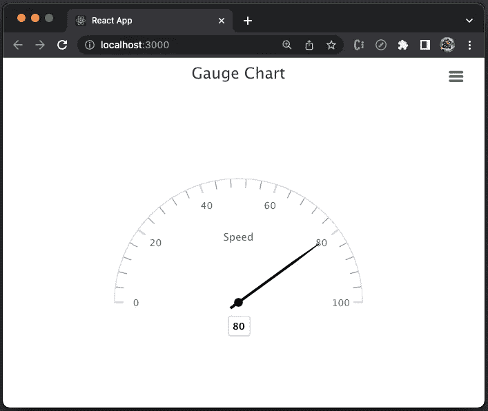

作者图片

我们可以根据`yAxis`值设定仪表带的样式。

```
yAxis: {
    min: 0,
    max: 100,
    title: {
      text: 'Speed',
    },
    plotBands: [
      {
        from: 0,
        to: 25,
        color: '#FF0000',
        thickness: 15,
      },
      {
        from: 25,
        to: 80,
        color: '#00FF00',
        thickness: 15,
      },
      {
        from: 80,
        to: 100,
        color: '#0000FF',
        thickness: 15,
      },
    ],
  }
```

上面的代码为值 0-25 定义了一个红色带，为值 25-80 定义了一个绿色带，为值 80-100 定义了一个蓝色带。

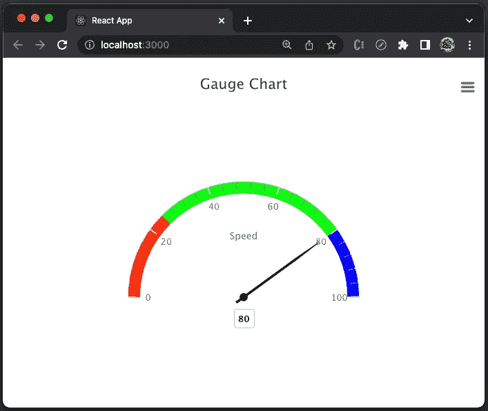

作者图片

好像支点离数字太近了。

我们将带的大小调整为 120%的大小:

```
pane: {
  startAngle: -90,
  endAngle: 89.9,
  background: null,
  center: ['50%', '70%'],
  size: '120%',
}
```

这张图表看起来更好。

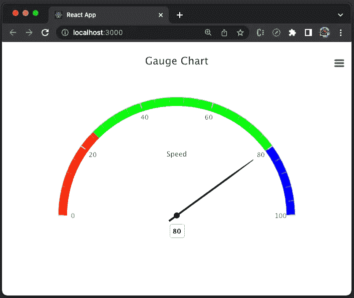

作者图片

# 示例 7:图表可访问性

执行图表示例，我们会在控制台中看到以下警告。

> `highcharts.src.js:223` Highcharts 警告:考虑包含“accessibility.js”模块，使您的图表对残障人士更有用。将“accessibility.enabled”选项设置为 false 以移除此警告。参见[https://www . high charts . com/docs/accessibility/accessibility-module](https://www.highcharts.com/docs/accessibility/accessibility-module)。

检查图表元素，我们看不到可访问性信息。

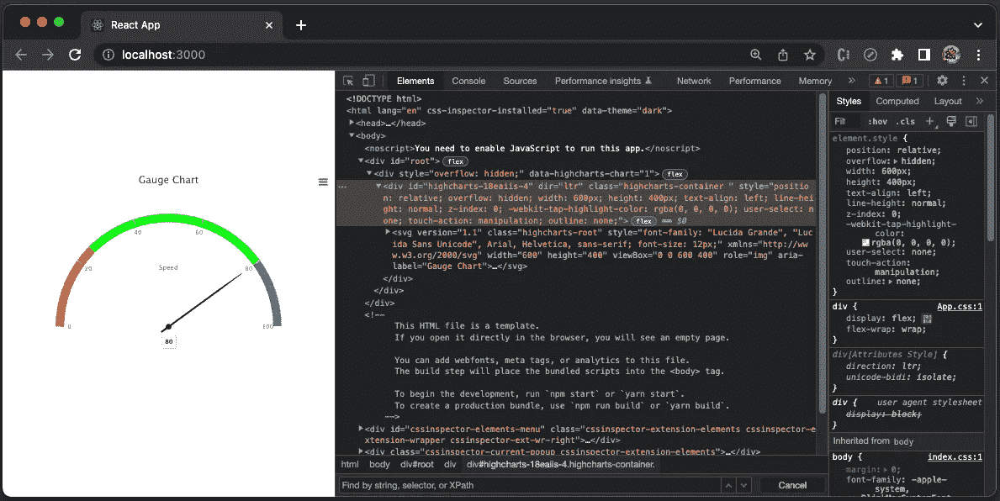

作者图片

[可访问性](/10-steps-to-building-web-applications-with-accessibility-a11y-81cd2c1dd499)使 web 应用程序对那些在某些方面能力有限的人有用，例如视力(使用屏幕阅读器)和行动能力(仅使用键盘)。此外，限制可能来自设备的能力，如移动设备。[让企业软件无障碍](https://javascript.plainenglish.io/how-to-fill-in-voluntary-product-accessibility-template-vpat-78ff28552e35)非常重要。

可访问性模块可以通过一行代码导入:

```
require('highcharts/modules/accessibility')(Highcharts);
```

或者两行:

```
import HighchartsAccessibility from 'highcharts/modules/accessibility';
HighchartsAccessibility(Highcharts);
```

只需导入这个模块，图表就可以访问了。此外，还有`accessibility`选项来配置`description`和更多功能，例如向屏幕阅读器用户宣布新数据，配置特殊的键盘导航等。

*   在第 7 行和第 10 行，可访问性模块被加载。
*   在第 19–22 行，`accessibility`定义了一个`description`。

执行`yarn start`，重新检查图表元素。

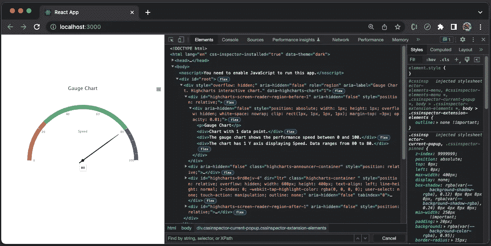

作者图片

在上面的屏幕截图中有许多可访问性信息，包括我们已经指定的可访问性描述:

```
<div aria-hidden="false" style="position: absolute; width: 1px; height: 1px; overflow: hidden; white-space: nowrap; clip: rect(1px, 1px, 1px, 1px); margin-top: -3px; opacity: 0.01;">
  <p>Gauge Chart</p>
  <div>Chart with 1 data point.</div>
  <div>The gauge chart shows the performance speed between 0 and 100.</div>
  <div>The chart has 1 Y axis displaying Speed. Data ranges from 80 to 80.</div>
</div>
```

如果您稍微注意一下，就会发现每个图表都是一个 SVG 文件。

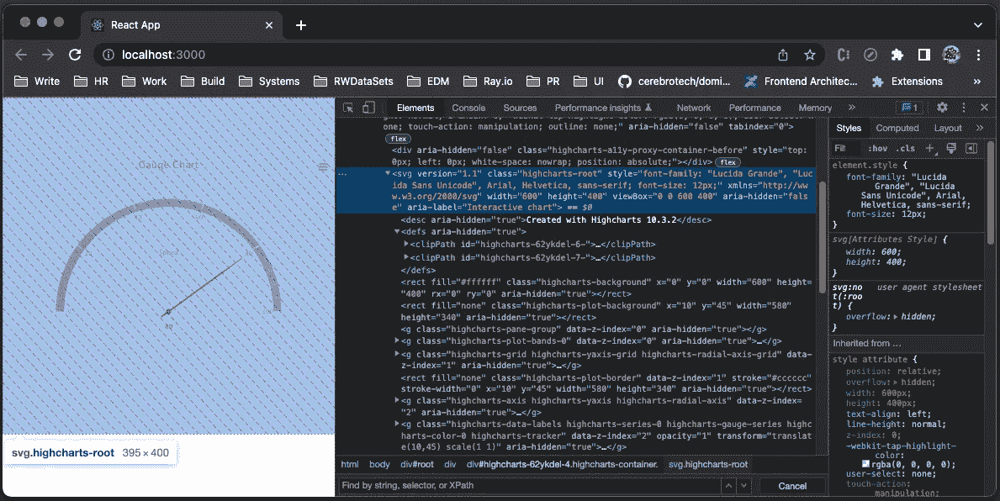

作者图片

# 结论

我们在 React 中展示了 7 个 Highcharts 的例子，包括`line`、`spline`、`area`、`areaspline`、`column`、`bar`、`pie`、`scatter`、`scatter3d`、`heatmap`、`treemap`、`gauge`12 种图表类型。

我们也写过关于其他高图表类型的文章:

*   在[这篇文章中有](https://medium.com/better-programming/meeting-more-chart-types-bubble-packed-bubble-stream-graph-and-cylinder-7f625c88047d)、`bubble`、`packedbubble`、`streamgraph`和`cylinder`。
*   本条中的`sankeydiagram``arcdiagram``dependencywheel``networkgraph`。
*   在[这篇文章里](https://javascript.plainenglish.io/exploring-parallel-coordinates-highcharts-in-react-dba3affc45a0) : `parallelCoordinates`。

开箱即用，Highcharts 提供了企业级的 JavaScript 图表功能。如果你的预算允许，强烈推荐 Highcharts。

感谢阅读。

```
**Want to Connect?** 

If you are interested, check out [my directory of web development articles](https://jenniferfubook.medium.com/jennifer-fus-web-development-publications-1a887e4454af).
```