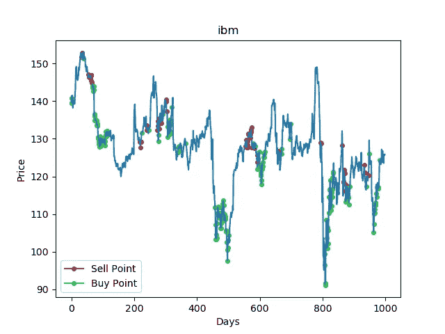
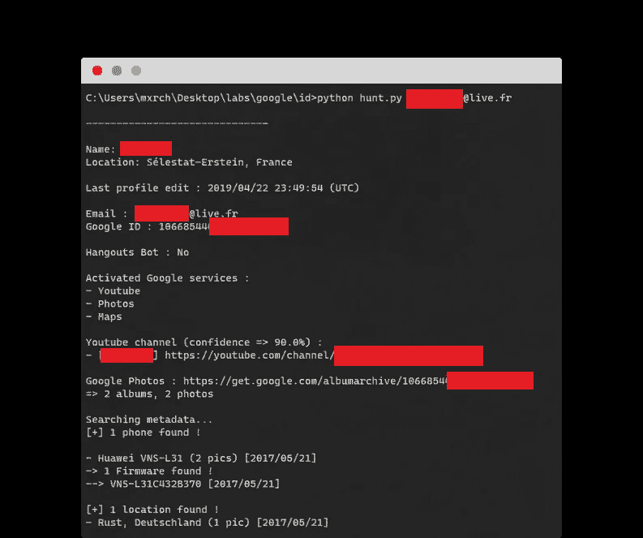
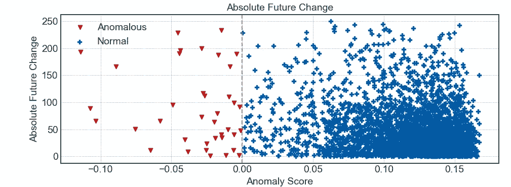
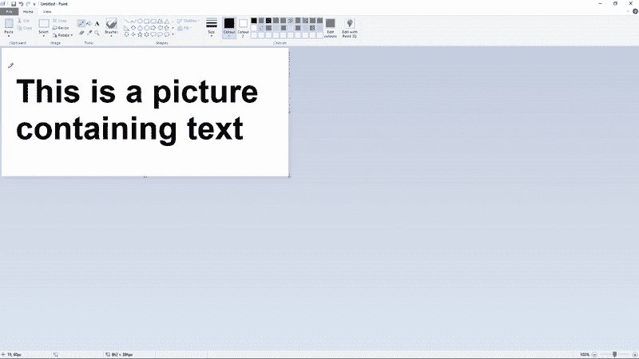
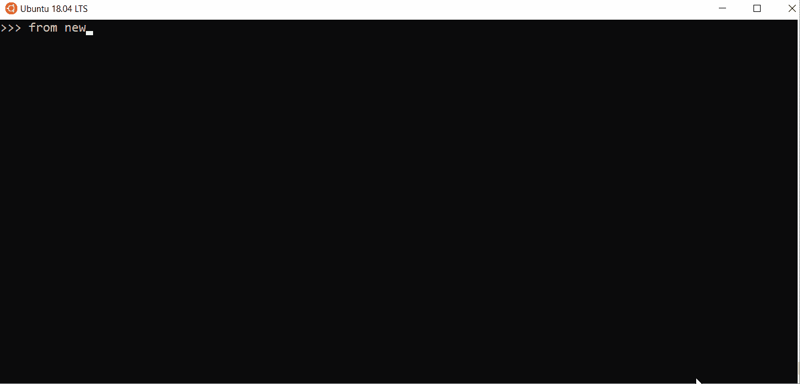

# 2020 年的 7 个激动人心的真实世界 Python 项目

> 原文：<https://betterprogramming.pub/7-exciting-real-world-python-projects-from-2020-db32571af3d6>

## Python 社区流行的 GitHub 库

由[塞尔日·库图佐夫](https://unsplash.com/@serge_k?utm_source=medium&utm_medium=referral)在 [Unsplash](https://unsplash.com?utm_source=medium&utm_medium=referral) 上拍摄的照片。

Python 成为最受欢迎的编程语言已经有一段时间了。

它像英语一样，易于理解的语法和大量的软件包可能是它越来越受欢迎的主要原因。难怪有抱负的软件工程师、ML 工程师和数据科学家希望在 Python 中找到自己的立足点。这也意味着我们从不缺少使用这种语言构建的项目和库。

在接下来的几节中，我们将浏览 2020 年发布的一些最令人惊叹和激动的真实世界 Python 项目。其中一些可能看起来微不足道，而另一些则会让你大吃一惊。

# 1.去 pix

首先，我们有一个有趣的密码恢复工具[Python](https://github.com/beurtschipper/Depix)。我们已经看到了如何消除面部模糊或模糊图像中的敏感信息。这个项目通过利用图像去像素化带来了一点小小的变化。

具体来说，该工具通过使用线性箱式过滤器(确定性算法)从像素化的屏幕截图中解密密码。想法很简单:将搜索图像像素化(充当我们的查找表),并将其与像素化的截图进行比较，以逐块找到匹配的模式。

从检索信用卡号到密码，这个项目可以应用的用例是无限的。

来源:[GitHub 上的 Depix](https://github.com/beurtschipper/Depix)

# 2.StockBot

股票市场已经飙升了一年，从开发者的角度来看，这可能是测试他们算法交易技巧的最佳时机。

StockBot 正是你需要的 Python 应用程序。该算法允许您指定股票代码、预期利润/回报，甚至修改和测试您自己的每日股票交易算法。

要更改算法，您可以编写出现在`[stockbot.py](https://github.com/ryantcullen/stock-bot/blob/master/stockbot.py)`文件中的`Decide()`方法。默认情况下，该脚本使用不同时间段的移动平均线，同时利用凯利标准数学公式来帮助计算出您应该在单一股票中保持的最佳位置。

来源:GitHub 上的[stock bot](https://github.com/ryantcullen/stock-bot)

# 3.GHunt

接下来，我们有一个 Python OSINT(开源智能工具),可以通过人们的 Gmail 地址来跟踪他们的信息。

如果你曾经想成为夏洛克·福尔摩斯，调查谷歌账户，这可能就是你的工具。

使用 [GHunt](https://github.com/mxrch/GHunt) 工具，您可以找到所有者的姓名、上次编辑个人资料的时间、帐户是否是 Hangouts bot、他们激活的谷歌服务(如果有的话)、他们可能的 YouTube 频道，以及其他一些基于用户是否允许访问这些设置的指标。

这可能是一个有趣的工具，从隐私的角度向你的朋友展示使用谷歌服务的危险。

来源:[GitHub 上的 GHunt](https://github.com/mxrch/GHunt)

# 4.苏普里弗

就像暴风雨前有一个平静期，每只股票在上涨或下跌前都会有一点横向移动。

这里有[另一个股票投资 Python 工具](https://github.com/tradytics/surpriver)，它通过利用异常检测和机器学习，在高波动股票实际波动之前找到它们。本质上，它通过观察每只股票的成交量和价格变化来发现不寻常的模式。

使用这个软件包，你可以找到当天高波动股票的预测，根据历史数据对某些股票进行回溯测试，甚至将其用于加密货币——投资者中的最新时尚。

来源:[GitHub 上的 sur priver](https://github.com/tradytics/surpriver)

# 5.Rembg

我们都希望用纯色背景来制作 Gravatars 有时仅仅是为了剪切掉风景——对吗？

[这个 Python 工具](https://github.com/danielgatis/rembg)顾名思义就是做这个的。它从图像中移除背景。为此，它利用了一个 [PyTorch](https://pytorch.org/) 模型。下面是如何在 [PIL](https://pillow.readthedocs.io/en/stable/) (Python 图像库)上运行它的代码:

该项目提供了多种运行脚本的方式——从服务器、命令行或将其用作库。最重要的是，人们可以切换阿尔法抠图，以获得更好的结果。

来源:[GitHub 上的 Rembg](https://github.com/danielgatis/rembg)

# 6.文本快照

你可能已经无数次捕获了一个截图，只是为了从中提取文本。遗憾的是，要做到这一点，人们通常会使用基于 OCR 的 Python 工具。

幸运的是， [TextShot](https://github.com/ianzhao05/textshot) 加速了这个过程，它让用户能够截图并将其文本内容复制到剪贴板。

该应用程序在屏幕上打开一个覆盖图，可以将一个矩形拖到您希望从中提取和复制文本的屏幕部分上。为了进行识别，项目使用了`pytesseract`模块。

来源:[GitHub 上的 text shot](https://github.com/ianzhao05/textshot)

# 7.新闻捕手

最后但同样重要的是，我们有一个[新闻聚合器 Python 项目](https://github.com/kotartemiy/newscatcher)。

程序员通常被拨入。这让他们有点难以跟上世界各地的最新新闻趋势。

这个项目努力从(几乎)任何网站收集规范化的新闻。通过利用 [NewsCatcher API](https://newscatcherapi.com/) ，人们可以按主题、国家、语言过滤新闻，或者如果他们赶时间的话，只需抓取现场头条新闻。

来源:GitHub 上的[新闻捕手](https://github.com/kotartemiy/newscatcher)

只需启动您的终端，按照[文档](https://github.com/kotartemiy/newscatcher)运行 REPL。

# 结论

在本文中，我们看到了不同的 Python 项目，从基于机器学习的图像识别到密码解密，以及检索 Gmail 用户详细信息的工具。

希望这些对你有启发。这一次到此为止。感谢阅读。