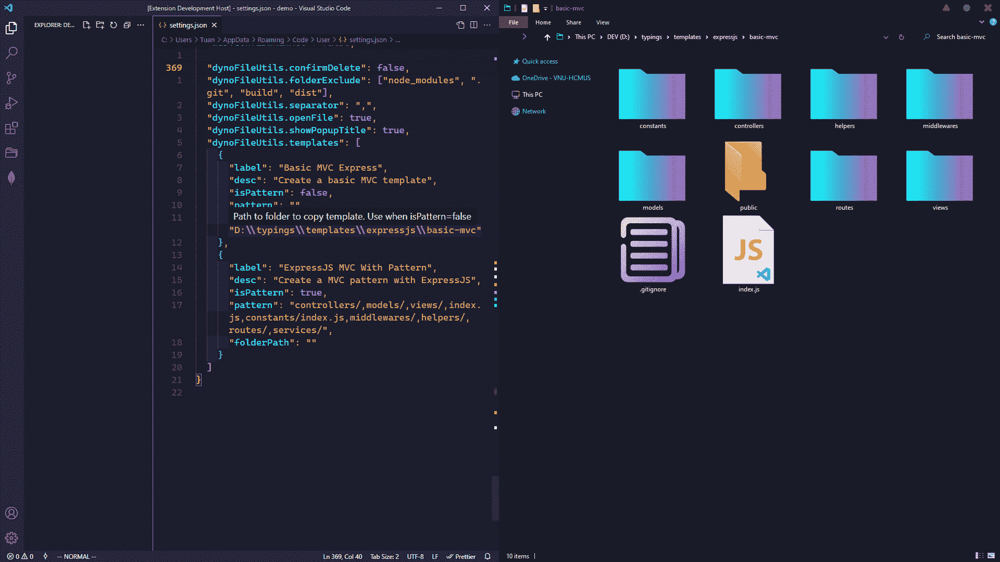
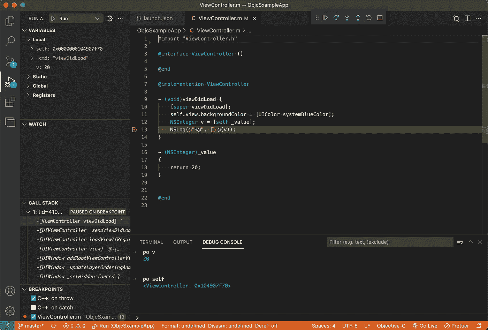
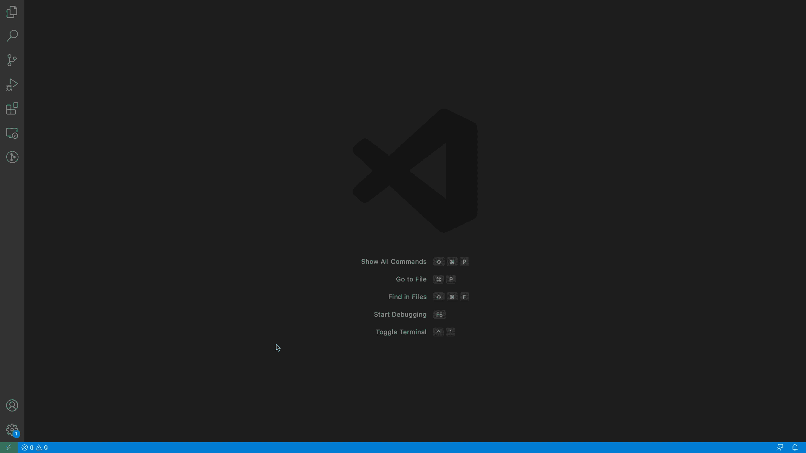
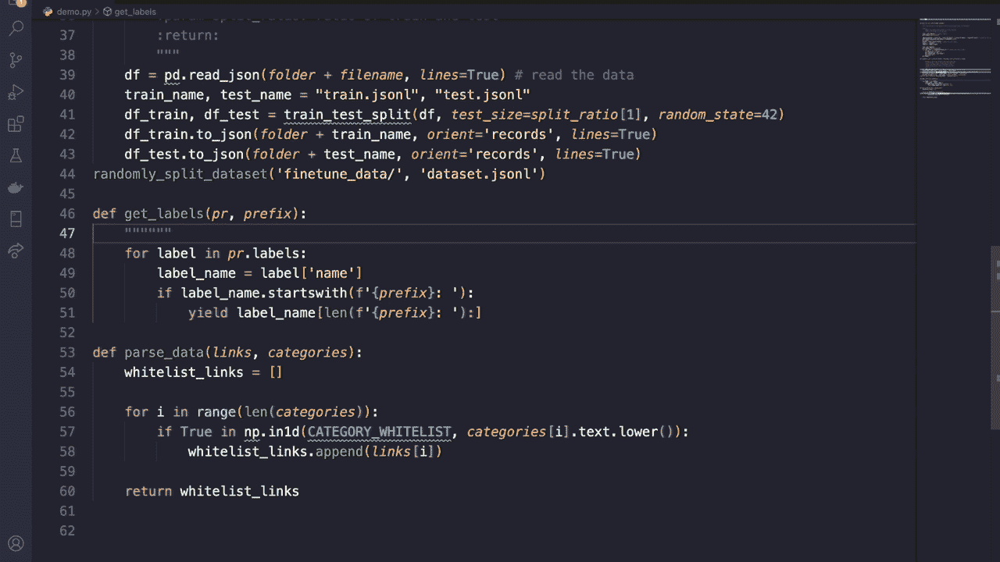
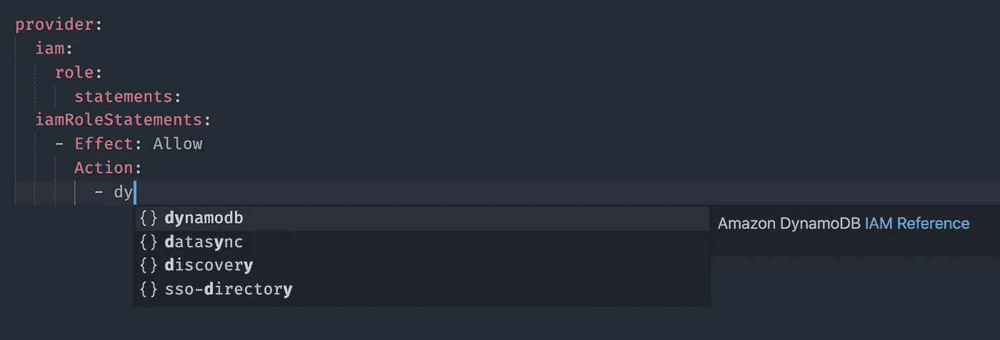
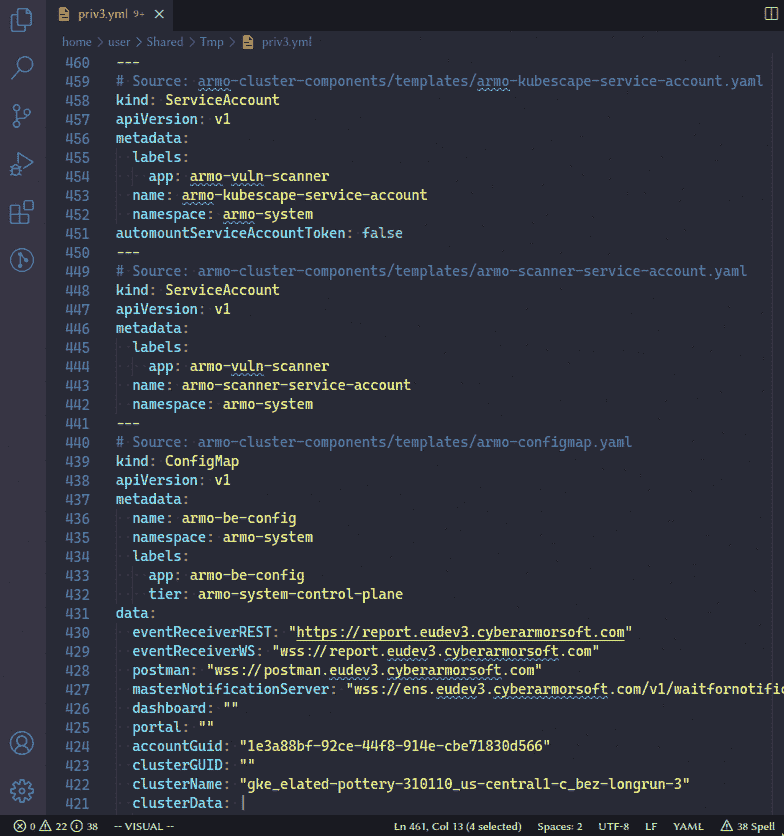

# 2022 年 1 月发布的 7 个激动人心的 VS 代码扩展

> 原文：<https://betterprogramming.pub/7-exciting-vs-code-extensions-released-in-january-2022-dccf1ec77629>

## 从代码助手到实用工具——还有更多

坦纳·阿尔达尔在 [Unsplash](https://unsplash.com?utm_source=medium&utm_medium=referral) 上拍摄的照片

Visual Studio Code 的 marketplace 是一个分享您自己的扩展以及试用其他创建者发布的扩展的好地方。

下面，我编译了几个在 2022 年 1 月发布的 VS 代码扩展——排名不分先后。让我们开始吧。

# 1.动态文件实用程序

你可能会开始一个新项目。或者维护一个大的代码库。在这两种情况下，文件实用程序与代码扩展总会派上用场。

受[文件实用程序 VS 代码扩展](https://github.com/sleistner/vscode-fileutils)的启发， [Dyno 文件实用程序 VS 代码](https://marketplace.visualstudio.com/items?itemName=dyno-nguyen.vscode-dynofileutils&ssr=false#overview)扩展提供了文件定制操作——比如创建、删除、移动和保留一个或多个文件和文件夹。

需要更多吗？该扩展还允许您排除某些文件或文件夹，从字符串生成新的文件夹结构，以及创建项目模板，如下所示:

[来源](https://marketplace.visualstudio.com/items?itemName=dyno-nguyen.vscode-dynofileutils&ssr=false#overview)

# 2.x 状态

XState 是一个用于创建状态机的流行 JavaScript 库。他们用[全新的 VS 代码扩展](https://marketplace.visualstudio.com/items?itemName=statelyai.stately-vscode)增强了开发者的体验。

从自动完成转换目标和初始状态，到突出显示状态机中的问题，到用交互式图表可视化 XState 机器，再到跨越目标、动作和条件，它们可以简化您的工作流程。

下面先睹为快 VS 代码中的 XState 可视化图:

[来源](https://marketplace.visualstudio.com/items?itemName=statelyai.stately-vscode)

# 3.Lightcode iOS 调试

iOS 项目可以用 VS 代码。或许，如果你想试试 GitHub Copilot 在 Swift 上的表现。或者只是为了调试你的 Flutter 应用程序。

无论如何， [Lightcode iOS 调试扩展](https://marketplace.visualstudio.com/items?itemName=Kenny.lightcodeios&ssr=false#qna)增加了对更容易调试 iOS 应用程序的支持——通过让我们在手机上运行应用程序，还可以使用断点，检查局部变量等。

下面看一下使用`po`语句的 VS 代码:

[信号源](https://github.com/khitcher/lightcode-doc)

# 4.Preview.js

说到测试前端预览，这里是另一个 VS 代码扩展。 [Preview.js](https://marketplace.visualstudio.com/items?itemName=zenclabs.previewjs) 是一个成熟的扩展，可以让你在 Vue 上执行几乎是热的重新加载，并在你的 IDE 中即时反应组件预览。

此外，Preview.js 编辑器显示错误的速度非常快(如果有的话),还允许您定制几乎立即反映出来的属性。

最精彩的部分？它支持多种预览，包装组件，以及故事书。

[来源](https://marketplace.visualstudio.com/items?itemName=zenclabs.previewjs)

# 5.可读—人工智能生成的注释

当你试图理解一个同事的代码库时，你有没有想过要抓狂？只有当没有注释来描述一个函数或模块时，这样做的机会才会增加。

不要担心！[Readable-Ai Generated Comments 扩展](https://marketplace.visualstudio.com/items?itemName=pcsoftware.readable)使用 Open AI 的 GPT 3 来自动生成行内注释和文档字符串。目前，它可以跨 Typescript、Javascript、Python、C#、C++、Java 和 PHP 工作。

从最初的外观来看，该扩展与 GitHub Copilot 相反。为了开始评论建议，只需输入`//`(或者如果你使用 Python，输入`*#*`)。

[来源](https://marketplace.visualstudio.com/items?itemName=pcsoftware.readable)

# 6.IAM 传奇

厌倦了阅读 AWS IAM 文档？在这种情况下，这是您需要的理想扩展。

[IAM Legend](https://marketplace.visualstudio.com/items?itemName=SebastianBille.iam-legend&ssr=false#overview) 让您无需离开 VS 代码编辑器，就可以自动完成代码、浏览文档和对通配符操作使用解析。

它也支持无服务器框架和平台。告别上下文切换！

[来源](https://marketplace.visualstudio.com/items?itemName=SebastianBille.iam-legend&ssr=false#overview)

# 7.Kubescape

[Kubescape](https://github.com/armosec/kubescape) 是一款新兴的开源工具，用于对 CI/CD 管道中的 Kubernetes 集群进行安全性分析。

我们现在有一个 Visual Studio 代码扩展，可以让您在保存代码后立即扫描 YAML 文件中的安全问题和错误配置，从而让您快速找到访问控制漏洞和其他漏洞，所有这些都在您的编辑器中完成。

下面让我们来看看[的 Kubescape 扩展](https://marketplace.visualstudio.com/items?itemName=kubescape.kubescape)是如何工作的:

[来源](https://marketplace.visualstudio.com/items?itemName=kubescape.kubescape)

# 还有更多

虽然只有这七个，但还有更多引起了我的兴趣。以下是他们的名单:

*   [SAP HANA Database Explorer](https://marketplace.visualstudio.com/items?itemName=SAPSE.hana-database-explorer)—SAP HANA 是一款数据库工具，在企业社区中占有一席之地(主要是因为它的速度)。
*   [PhoneView](https://marketplace.visualstudio.com/items?itemName=npsulav.phoneview) —如果你想检查你的网站在手机屏幕上是否能正确预览，这个工具很方便。
*   [合同查看器](https://marketplace.visualstudio.com/items?itemName=Metaplasia.contract-viewer) —允许您从区块链查看智能合同并将其下载到编辑器中。
*   Luvia 主题——一个紫色主题，黑暗模式爱好者会非常喜欢。
*   [材料代码](https://marketplace.visualstudio.com/items?itemName=rakib13332.material-code&ssr=false#qna)——万一你想在你的 VS 代码编辑器中使用谷歌的设计。

仅此而已。感谢阅读。